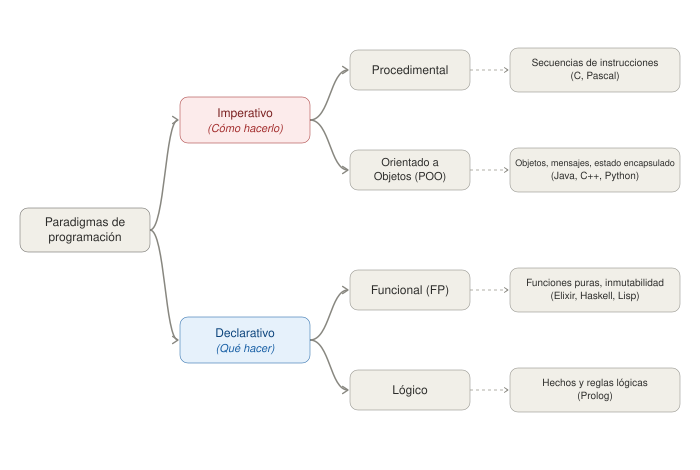

```
Universidad del Quindío
Programa de Ingeniería de Sistemas y Computación
Programación III - Paradigmas de programación
Docente: Carlos Andrés Florez V.
```
# Paradigmas de programación

Un **paradigma de programación** es una forma de plantear y organizar la solución de un problema mediante un conjunto de conceptos y principios que orientan cómo se representan los datos y cómo se expresan las operaciones de un programa.

Un mismo problema puede resolverse de diferentes maneras según el paradigma utilizado. Por ejemplo, para sumar los números pares de una lista, una solución puede indicar paso a paso cómo recorrerla, identificar los números pares y acumular su suma. Otra puede centrarse en expresar qué elementos se deben seleccionar y qué operación se debe realizar sobre ellos, sin describir explícitamente cada paso del recorrido.

Estas diferencias permiten introducir los **paradigmas imperativo y funcional**, que se compararán en esta guía mediante ejemplos en Java y Elixir.

Un mismo lenguaje puede **admitir varios paradigmas**. Java, por ejemplo, permite utilizar un enfoque imperativo y también incorpora características de programación funcional. Por tanto, el paradigma no depende exclusivamente del lenguaje, sino también de la forma en que se plantea y expresa la solución.


## Principales Paradigmas de Programación

El siguiente diagrama resume los principales paradigmas de programación y sus características:



Existen otros paradigmas además de los que se presentan aquí (por ejemplo, el **lógico**, representado por Prolog, o el **reactivo**). Esta guía se concentra en la división entre el enfoque **imperativo** y el **declarativo/funcional**, que es la más relevante para entender Elixir.

---

## El Enfoque Imperativo: Dando Órdenes

La programación imperativa se centra en describir **cómo** debe realizarse una tarea. El código es una secuencia de instrucciones explícitas que modifican el estado del programa paso a paso. Es como dar una receta detallada a un cocinero: "primero, corta las cebollas; segundo, calienta el aceite; tercero, añade las cebollas a la sartén".

### Programación Orientada a Objetos (POO)

La **Programación Orientada a Objetos (POO)** organiza el programa alrededor de **objetos**, que agrupan datos, representados mediante atributos, y comportamientos, representados mediante métodos. Los objetos interactúan entre sí mediante estos métodos para realizar las operaciones del programa.

En esta guía se presenta junto al enfoque imperativo porque gran parte del código orientado a objetos utiliza instrucciones secuenciales y, en muchos casos, estado mutable. Sin embargo, la POO no es necesariamente un paradigma exclusivamente imperativo: puede combinarse con ideas y técnicas de otros paradigmas.

**Principios clave de la POO:**

* **Encapsulamiento**: consiste en agrupar los datos y las operaciones que trabajan sobre ellos y controlar cómo se puede acceder al estado interno de un objeto. Esto permite proteger los datos y evitar modificaciones no deseadas.

* **Herencia**: permite que una clase reutilice y extienda los atributos y comportamientos definidos en otra clase.

* **Polimorfismo**: permite que objetos de diferentes clases respondan a una misma operación de acuerdo con el tipo de objeto. Por ejemplo, distintas clases pueden implementar un método con el mismo nombre, pero proporcionar comportamientos diferentes.

#### Ejemplo en Java (estilo imperativo)

Veamos cómo sumar los números pares de una lista. Aunque está escrito en Java (un lenguaje orientado a objetos), el estilo del código es puramente **imperativo**, porque describe cada paso y modifica una variable `sumaPares` en cada iteración, sin apoyarse en encapsulamiento, herencia ni polimorfismo.

```java
import java.util.List;

public class SumadorImperativo {
    public static void main(String[] args) {
        List<Integer> numeros = List.of(1, 2, 3, 4, 5, 6);
        int sumaPares = 0; // 1. Se inicializa una variable de estado

        for (int numero : numeros) { // 2. Se itera sobre la colección
            if (numero % 2 == 0) {
                sumaPares += numero; // 3. Se modifica el estado en cada paso
            }
        }
        // El resultado final depende de todas las mutaciones anteriores
        System.out.println("La suma de los pares es: " + sumaPares); // Salida: 12
    }
}
```

---

## El Enfoque Declarativo: Describiendo el Resultado

La programación declarativa se centra en describir **qué** se quiere lograr, sin detallar los pasos para conseguirlo. La lógica del "cómo" se abstrae. Siguiendo la analogía, sería como pedirle a un chef "un plato de pasta con salsa de tomate", sin especificarle cómo cortar los tomates o hervir la pasta.

### Programación Funcional (FP)

La Programación Funcional es el principal paradigma declarativo que estudiaremos. Trata la computación como la evaluación de funciones matemáticas, y evita las variables que cambian de valor durante la ejecución. Se apoya en principios como la **inmutabilidad** (los datos no se modifican una vez creados) y las **funciones puras** (el resultado depende solo de los argumentos).

#### Ejemplo en Java (Funcional)

Lenguajes como Java, aunque principalmente orientados a objetos, han incorporado características funcionales. Veamos cómo se resolvería el mismo problema de sumar los pares utilizando la API de Streams de Java, que permite un estilo más declarativo.

```java
import java.util.List;

public class SumadorFuncional {
    public static void main(String[] args) {
        List<Integer> numeros = List.of(1, 2, 3, 4, 5, 6);

        int sumaPares = numeros.stream()  // 1. Convierte la lista en un stream de datos
                               .filter(n -> n % 2 == 0) // 2. Describe que queremos solo los pares
                               .mapToInt(Integer::intValue) // 3. Convierte a un stream de enteros primitivos
                               .sum(); // 4. Describe que queremos la suma

        System.out.println("La suma de los pares es: " + sumaPares); // Salida: 12
    }
}
```
Este código es declarativo, porque no decimos "crea un acumulador, itera, comprueba, suma..." sino que declaramos una secuencia de transformaciones sobre los datos, primero `filtrar` y luego `sumar`. El recorrido de la lista y la variable que acumula la suma quedan dentro de la API de Streams, y el programador no los escribe.

## Comparación de Enfoques

La siguiente tabla resume las diferencias entre la Programación Imperativa/POO y la Programación Funcional:

| Característica                     | Programación Imperativa / POO                                                      | Programación Funcional                                                                        |
| ---------------------------------- | ---------------------------------------------------------------------------------- | --------------------------------------------------------------------------------------------- |
| **Enfoque principal**              | Describe **cómo** hacer las cosas.                                                 | Describe **qué** se quiere lograr.                                                            |
| **Estado**                         | El estado puede ser mutable y compartido.                                          | Se favorece la inmutabilidad y la creación de nuevos datos.                                   |
| **Flujo de datos**                 | El control de flujo es explícito mediante bucles, condicionales y asignaciones.    | El procesamiento de datos se expresa mediante funciones y su composición.                     |
| **Conceptos clave**                | Objetos, métodos, herencia, encapsulamiento y estado mutable.                      | Funciones puras, inmutabilidad, composición y recursividad.                                   |
| **Forma de abordar los problemas** | Se descompone el problema en una secuencia de operaciones que modifican el estado. | Se descompone el problema en transformaciones que reciben datos y producen nuevos resultados. |


## Lenguajes Multi-Paradigma

Aunque muchos lenguajes modernos son **multi-paradigma** (permiten escribir código en distintos estilos), suelen tener un paradigma dominante que influye en su diseño y ecosistema. Java y C# tienen su raíz en la POO, mientras que lenguajes como Elixir y Haskell se diseñaron desde el principio como lenguajes funcionales.

---

## Para la próxima clase

### Actividad de cierre (sin escribir código)

Tome el siguiente problema: *dada una lista de notas de un curso, obtener el promedio únicamente de las notas aprobatorias (mayores o iguales a 3.0)*.

Complete la siguiente tabla comparando cómo abordaría el problema desde cada enfoque. Puede apoyarse en los dos ejemplos en Java de esta guía.

| Aspecto                                                                     | Enfoque imperativo | Enfoque declarativo/funcional |
| :-------------------------------------------------------------------------- | :----------------- | :---------------------------- |
| ¿Qué se describe: el **cómo** o el **qué**?                                 |                    |                               |
| ¿Qué variables cambian de valor durante la ejecución?                       |                    |                               |
| ¿Quién controla la iteración: usted o el lenguaje?                          |                    |                               |
| ¿Qué pasos podrían ejecutarse en paralelo sin romper el resultado?          |                    |                               |
| Si el resultado sale mal, ¿qué tendría que revisar para encontrar el error? |                    |                               |

Por último, si dos personas ejecutaran su solución al mismo tiempo sobre la misma lista, ¿cuál de los dos enfoques daría problemas y por qué?

### Preparación

- Investigue sobre el lenguaje **Elixir** y su paradigma funcional. Puede consultar la documentación oficial en [https://elixir-lang.org/](https://elixir-lang.org/).
- Qué se necesita para empezar a programar en Elixir (instalación, herramientas, etc.).
- Investigue sobre el lenguaje **Erlang** y su relación con Elixir. Puede consultar la documentación oficial en [https://www.erlang.org/](https://www.erlang.org/).
