```
Universidad del Quindío
Programa de Ingeniería de Sistemas y Computación
Programación III - Colecciones en Elixir
Docente: Carlos Andrés Florez V.
```

# Colecciones en Elixir

Una colección es un conjunto de elementos que se agrupan bajo una misma estructura. En las guías anteriores ya se usaron **tuplas** para devolver resultados (`{:ok, valor}` / `{:error, motivo}`) y se aplicó **coincidencia de patrones** sobre ellas. En esta guía se generaliza ese trabajo a las demás colecciones del lenguaje y a los módulos que permiten transformarlas.

Los temas que se abordarán son:

- Las cuatro colecciones principales: listas, tuplas, mapas y keyword lists.
- Coincidencia de patrones aplicada a cada una de ellas.
- El módulo `Enum` para manipular colecciones.
- Las funciones `map/2`, `filter/2` y `reduce/3`, pilares de la programación funcional.
- Generación de reportes a partir de una colección de datos.

## Características fundamentales

Todas las colecciones en Elixir comparten estas propiedades:

1. **Inmutabilidad**: Una vez creadas, no se pueden modificar. Cualquier operación que parezca "modificar" una colección en realidad **crea una nueva versión** con los cambios aplicados y deja intacta la original.
2. **Persistencia**: Las versiones anteriores siguen disponibles (*structural sharing*). Esto significa que las colecciones comparten partes no modificadas para optimizar el uso de memoria.
3. **Tipos de datos mixtos**: Pueden contener cualquier tipo de dato.
4. **Pattern matching**: Se pueden desestructurar para extraer valores.
5. **Funciones puras**: Las transformaciones no tienen efectos secundarios.

---

## Colecciones principales

En este apartado se exploran las cuatro colecciones principales de Elixir: listas, tuplas, mapas y keyword lists. De cada una interesa **cómo se define** y **cómo se desestructura con Pattern Matching**; para transformarlas se usará el módulo `Enum`, que se presenta más adelante.

### Listas

Una **lista** es una colección ordenada de elementos, que puede contener cualquier tipo de dato, incluyendo otras listas. Sirve para representar un conjunto cuya cantidad de elementos no se conoce de antemano y que se recorre completo, como las notas de un curso o las líneas de un archivo. Es la colección que más se usa en Elixir.

Las listas se definen utilizando corchetes `[]` y los elementos se separan por comas:

```elixir
mi_lista = [1, 2, 3, 4, 5]
```

Internamente una lista guarda su primer elemento, la **cabeza**, y el resto de la lista, la **cola**. De ahí sale la forma más eficiente de crecer una lista, que es agregar un elemento al inicio con `[nuevo | lista]`: gracias al *structural sharing*, la lista nueva reutiliza la anterior como cola en lugar de copiarla.

```elixir
lista = [1, 2, 3]

length(lista)  # 3       -- cantidad de elementos
hd(lista)      # 1       -- la cabeza
tl(lista)      # [2, 3]  -- la cola

nueva = [0 | lista]  # [0, 1, 2, 3]
lista                # [1, 2, 3] -- la original no cambió
```

También se pueden concatenar y restar listas completas, con operadores que igualmente devuelven una lista nueva:

```elixir
lista = [1, 2, 3]

otra  = lista ++ [4, 5]  # [1, 2, 3, 4, 5] -- concatenar dos listas
menos = lista -- [2]     # [1, 3]          -- quitar elementos
```

Las dos formas de crecer una lista no cuestan lo mismo. Agregar al inicio con `[0 | lista]` es inmediato, porque la lista nueva reutiliza la anterior como cola, mientras que `lista ++ [4, 5]` obliga a recorrer toda la lista de la izquierda para copiarla. Con listas grandes conviene agregar por el inicio.

### Tuplas

Una **tupla** es similar a una lista, pero a diferencia de las listas, las tuplas son de tamaño fijo. Sirve para agrupar unos pocos datos que viajan juntos y cuya cantidad se conoce de antemano, de modo que cada posición siempre significa lo mismo.

Las tuplas se definen utilizando llaves `{}`. Por ejemplo:

```elixir
mi_tupla = {1, "hola", :atom}
```

Las tuplas se usan comúnmente para **devolver múltiples valores** de una función (como `{:ok, valor}` o `{:error, motivo}`, según se vio en la guía anterior) o para agrupar datos relacionados de manera estructurada. El **Pattern Matching** es extremadamente útil con ellas para desestructurar sus valores y asignarlos a variables:

```elixir
persona = {"Carlos", 25, "México"}

# Desestructurar la tupla usando Pattern Matching
{nombre, edad, pais} = persona
IO.puts("#{nombre}, #{edad} años, #{pais}") # Carlos, 25 años, México

# Podemos usar el operador _ para ignorar los valores que no nos interesan
{_, edad, _} = persona
IO.puts("Solo la edad: #{edad}") # Solo la edad: 25

# Si el Pattern Matching falla, se produce un error
# {:ok, valor} = {:error, "Fallo"} # ** (MatchError) no match of right hand side value: {:error, "Fallo"}
```

También es posible consultar el tamaño de una tupla y acceder a una posición concreta, aunque en la práctica se prefiere la coincidencia de patrones porque deja explícito el significado de cada elemento:

```elixir
persona = {"Carlos", 25, "México"}

tuple_size(persona)  # 3
elem(persona, 0)     # "Carlos"
```

### Mapas

Un **mapa** es una colección de **pares clave-valor**, donde cada clave es única. Sirve para guardar datos con nombre, de manera que cada valor se recupera por su clave y no por su posición, como los campos de una persona o de un producto.

Los mapas se definen utilizando `%{}` y los pares se separan por comas:

```elixir
mi_mapa = %{"nombre" => "Juan", "edad" => 30, "ciudad" => "Armenia"}
```

Cuando las claves son átomos existe una forma más concisa de escribirlos, que es la que se usará en el resto de la guía:

```elixir
mi_mapa = %{nombre: "Juan", edad: 30, ciudad: "Armenia"}
```

Cada valor puede ser de cualquier tipo de dato, incluyendo listas, tuplas y otros mapas. A sus valores se accede por clave, y toda "modificación" **devuelve un mapa nuevo**:

```elixir
usuario = %{nombre: "Carlos", edad: 30}

usuario.nombre  # "Carlos"

# Actualizar una clave que ya existe
mayor = %{usuario | edad: 31}                     # %{nombre: "Carlos", edad: 31}

# Map.put/3 también sirve para agregar una clave nueva
con_ciudad = Map.put(usuario, :ciudad, "Armenia") # %{nombre: "Carlos", edad: 30, ciudad: "Armenia"}

usuario # %{nombre: "Carlos", edad: 30} -- el original no cambió
```

La diferencia es importante: `%{mapa | clave: valor}` **falla si la clave no existe**, mientras que `Map.put/3` la agrega. Construir un mapa clave por clave con `Map.put/3` es la forma habitual de armar un índice a partir de una lista.

El **Pattern Matching** también funciona sobre mapas y permite extraer varios valores a la vez:

```elixir
usuario = %{nombre: "Carlos", edad: 30, ciudad: "Armenia"}

# Acceder a los valores usando pattern matching (desestructuración)
%{nombre: nombre_usuario, edad: edad_usuario} = usuario
IO.puts("#{nombre_usuario} tiene #{edad_usuario} años") # Carlos tiene 30 años

# No es necesario nombrar todas las claves, ni respetar su orden
%{ciudad: ciudad} = usuario
IO.puts("Vive en #{ciudad}") # Vive en Armenia
```

La clave no tiene que ser un átomo. Puede ser cualquier valor, lo que permite usar un identificador descriptivo como la cédula de una persona o el ID de un producto:

```elixir
# Mapa con información de personas usando la cédula como clave
personas = %{
  "123456789" => %{nombre: "Ana", edad: 28},
  "987654321" => %{nombre: "Luis", edad: 35}
}

personas["123456789"].nombre # "Ana"
```

Buscar por cédula en ese mapa es inmediato, sin importar cuántas personas contenga. Si esa misma información estuviera en una lista habría que recorrerla elemento por elemento hasta encontrar a la persona buscada. Esa es la razón principal para elegir un mapa en lugar de una lista.

> ⚠️ **Nota:** el orden en que se muestran las claves de un mapa **no está garantizado** y puede no coincidir con el de escritura. Si necesita conservar el orden, use una lista.

### Keyword Lists

Una **keyword list** (lista de palabras clave) es un caso especial de lista: una lista de tuplas de dos elementos donde el primer elemento es siempre un **átomo** (la clave). Sirve para pasarle opciones a una función sin tener que recordar en qué orden van.

Elixir ofrece una sintaxis abreviada para escribirlas:

```elixir
# Forma abreviada
opciones = [orden: :asc, limite: 10]

# Es equivalente a esta lista de tuplas
opciones = [{:orden, :asc}, {:limite, 10}]
```

A diferencia de los mapas, las keyword lists **mantienen el orden** de inserción, **permiten claves repetidas** y **solo admiten átomos como claves**.

Se usan principalmente para **pasar opciones a funciones**. De hecho, ya las hemos usado sin notarlo: cuando escribimos `IO.inspect(lista, label: "Cola")`, ese `label: "Cola"` es una keyword list. Por convención, cuando la keyword list es el **último argumento** de una función, se pueden omitir los corchetes:

```elixir
# Estas dos llamadas son equivalentes:
IO.inspect(lista, [label: "Cola"])  # con corchetes
IO.inspect(lista, label: "Cola")    # sin corchetes (forma habitual)
```

### ¿Cuándo usar cada colección?

Las cuatro pueden guardar los mismos datos, así que la elección depende de cómo se vayan a usar:

- **Listas**: para colecciones de tamaño variable donde el orden importa y se recorren con frecuencia. Es la colección más común.
- **Tuplas**: para agrupar un número fijo y pequeño de elementos, sobre todo al devolver varios valores desde una función.
- **Mapas**: para datos estructurados en pares clave-valor, cuando se necesita acceso rápido por una clave descriptiva.
- **Keyword lists**: para pasar opciones a funciones.

---

## Enum: map, filter y reduce

Elixir ofrece módulos específicos para cada colección (`List`, `Map`, `Keyword`), pero el que más se usa en la práctica es `Enum`, porque funciona con **cualquier colección enumerable**. Sus funciones son, en su gran mayoría, **funciones puras** en el sentido que estudiamos en la guía de programación funcional.

De todo el módulo, tres funciones concentran la mayor parte del trabajo: `map/2`, `filter/2` y `reduce/3`. Con ellas se puede transformar, filtrar y acumular prácticamente cualquier colección.

### Map

La función `Enum.map/2` la podemos explicar con el siguiente diagrama:



Al aplicar la función `f(x) = x * x` a cada elemento de la lista original, obtenemos una nueva lista con los resultados de la función aplicada a cada elemento.

### Filter

La función `Enum.filter/2` la podemos explicar con el siguiente diagrama:



Al aplicar el filtro `x > 10`, obtenemos una nueva lista que solo contiene los elementos que cumplen con esta condición.

### Reduce

La función `Enum.reduce/3` la podemos explicar con el siguiente diagrama:



En este ejemplo, comenzamos con un acumulador inicial de `0` y vamos sumando cada elemento de la lista al acumulador. Al final, obtenemos el resultado total de la suma de todos los elementos. A diferencia de `map` y `filter`, que devuelven una nueva colección, `reduce` devuelve un solo valor acumulado.

El `acc` puede ser de cualquier tipo de dato, no solo numérico. Por ejemplo, podríamos usar `reduce` para construir un mapa a partir de una lista, que es justamente lo que se hará en el **Ejemplo 2**.

`Enum` tiene muchas más funciones (`sort_by/3`, `group_by/3`, `any?/2`, `find/2`, etc.). Las que hagan falta se irán introduciendo en los ejemplos; **no es necesario memorizarlas**, basta con saber que existen y buscarlas en la [documentación oficial de Enum](https://hexdocs.pm/elixir/Enum.html).

---

## Ejemplo 1: Reporte de notas de un curso

Un profesor tiene una lista con las notas finales de sus estudiantes. Cada nota está entre 0 y 5. El profesor necesita un programa que le permita calcular ciertas cosas:

- La nota promedio de la clase.
- Contar cuántos estudiantes están por encima y por debajo de la nota promedio. Retorne una tupla con ambos valores.
- Encontrar la nota más alta y la nota más baja.
- Contar cuántos estudiantes aprobaron (`nota >= 3`) y cuántos reprobaron.

> ⚠️ **Importante:** los ejemplos de esta guía utilizan el módulo `Util` construido en clases anteriores. Asegúrese de tener el archivo `util.exs` compilado con `elixirc` en la misma carpeta donde ejecute los scripts. Si prefiere no usarlo, reemplace las llamadas a `Util.imprimir_mensaje/1` por `IO.puts/1`.

### Versión 1: Trabajar solo con las notas

Se empieza por lo más simple: una lista de números con las notas del curso. Cada requerimiento se resuelve en su propia función y las que devuelven dos valores lo hacen mediante una **tupla**.

```elixir
defmodule Estudiantes do
  def main do
    # Se define una lista con las notas de los estudiantes (para probar las funciones)
    lista = [3, 4, 4.6, 1.6, 2.3, 4.5, 1]

    promedio = calcular_promedio(lista)
    Util.imprimir_mensaje("El promedio es #{promedio}")

    {menores, mayores} = contar_segun_promedio(lista, promedio)
    Util.imprimir_mensaje("Hay #{menores} por debajo del promedio y #{mayores} por encima")

    {menor, mayor} = obtener_estudiantes_min_max(lista)
    Util.imprimir_mensaje("La nota más baja es #{menor} y la más alta #{mayor}")

    {aprobados, reprobados} = contar_aprobados_reprobados(lista)
    Util.imprimir_mensaje("Aprobaron #{aprobados} estudiantes y reprobaron #{reprobados}")
  end

  defp calcular_promedio([]), do: 0
  defp calcular_promedio(lista), do: Enum.sum(lista) / length(lista)

  defp obtener_estudiantes_min_max(lista), do: Enum.min_max(lista)

  defp contar_segun_promedio(lista, promedio) do
    # Se usa una función lambda que compara cada elemento con el promedio en ambas llamadas a Enum.count
    menores = Enum.count(lista, &(&1 < promedio))
    mayores = Enum.count(lista, &(&1 > promedio))
    {menores, mayores}
  end

  defp contar_aprobados_reprobados(lista) do
    total = length(lista)
    aprobados = Enum.count(lista, &(&1 >= 3)) # Se usa una función lambda que verifica si cada nota es mayor o igual a 3
    reprobados = total - aprobados
    {aprobados, reprobados}
  end
end

Estudiantes.main()
```

Al ejecutar `elixir estudiantes.exs` debería ver:

```
El promedio es 3.0
Hay 3 por debajo del promedio y 3 por encima
La nota más baja es 1 y la más alta 4.6
Aprobaron 4 estudiantes y reprobaron 3
```

Nótese el uso de `Enum` para procesar la colección de notas y de tuplas para devolver múltiples valores desde una función. La primera cláusula de `calcular_promedio/1` usa **pattern matching** sobre la lista vacía para evitar una división por cero.

Cabe destacar que las funciones lambda también se pueden escribir usando `fn` y `->`, como se ha mencionado previamente. Por ejemplo, en el caso de la función `contar_aprobados_reprobados/1` podemos hacer lo siguiente:

```elixir
aprobados = Enum.count(lista, fn nota -> nota >= 3 end)
```

### Versión 2: Agregar el nombre del estudiante

**Nuevo requerimiento:** el reporte debe decir *quién* obtuvo la nota más alta y la más baja, no solo cuál fue. Una lista de números ya no alcanza: cada elemento debe agrupar dos datos relacionados, así que se convierte en una **lista de mapas**.

Este cambio obliga a ajustar todas las funciones, porque ahora cada elemento no es un número sino un mapa del que hay que **extraer** la nota:

```elixir
defmodule Estudiantes do
  def main do
    # Ahora tenemos una lista de mapas
    lista = [
      %{nombre: "pepe", nota: 3},
      %{nombre: "maria", nota: 4},
      %{nombre: "juan", nota: 4.6},
      %{nombre: "luisa", nota: 1.6},
      %{nombre: "carlos", nota: 2.3},
      %{nombre: "ana", nota: 4.5},
      %{nombre: "marcos", nota: 1},
    ]

    promedio = calcular_promedio(lista)
    Util.imprimir_mensaje("El promedio es #{promedio}")

    {menores, mayores} = contar_segun_promedio(lista, promedio)
    Util.imprimir_mensaje("Hay #{menores} por debajo del promedio y #{mayores} por encima")

    {menor, mayor} = obtener_estudiantes_min_max(lista)
    Util.imprimir_mensaje("La nota más baja es de #{menor.nombre} (#{menor.nota}) y la más alta es de #{mayor.nombre} (#{mayor.nota})")

    {aprobados, reprobados} = contar_aprobados_reprobados(lista)
    Util.imprimir_mensaje("Aprobaron #{aprobados} estudiantes y reprobaron #{reprobados}")

  end

  defp calcular_promedio([]), do: 0
  
  defp calcular_promedio(lista) do
    Enum.map(lista, &(&1.nota)) # Es necesario extraer la nota de cada estudiante
    |> Enum.sum()
    |> then( &(&1/length(lista)) ) # then() permite encadenar operaciones
  end

  defp obtener_estudiantes_min_max(lista) do
    peor = Enum.min_by(lista, &(&1.nota)) # Enum.min_by permite asociar una función para acceder a la nota
    mejor = Enum.max_by(lista, &(&1.nota))
    {peor, mejor}
  end

  defp contar_segun_promedio(lista, promedio) do
    menores = Enum.count(lista, &(&1.nota < promedio))
    mayores = Enum.count(lista, &(&1.nota > promedio))
    {menores, mayores}
  end

  defp contar_aprobados_reprobados(lista) do
    total = length(lista)
    aprobados = Enum.count(lista, &(&1.nota >= 3))
    {aprobados, total - aprobados}
  end
end

Estudiantes.main()
```

Al ejecutarlo, la salida es:

```
El promedio es 3.0
Hay 3 por debajo del promedio y 3 por encima
La nota más baja es de marcos (1) y la más alta es de juan (4.6)
Aprobaron 4 estudiantes y reprobaron 3
```

Dos cambios merecen atención:

- **`Enum.min_max/1` fue reemplazada por `Enum.min_by/2` y `Enum.max_by/2`.** Las funciones terminadas en `_by` reciben una función que indica **según qué criterio** comparar, y devuelven el **elemento completo** (el mapa del estudiante), no solo el valor comparado. Por eso ahora se puede imprimir `menor.nombre` además de `menor.nota`.
- **`then/2` en `calcular_promedio/1`.** El operador `|>` pasa el valor como *primer* argumento de la siguiente función, pero aquí se necesita dividirlo entre `length(lista)`. `then/2` recibe el valor acumulado y permite usarlo dentro de una expresión cualquiera.

### Versión 3: Clasificar a cada estudiante

**Nuevo requerimiento:** se necesita una función que devuelva la lista de estudiantes como tuplas con el nombre y su estado (`:aprobado` o `:reprobado`). Las siguientes funciones son fragmentos que se deben agregar al módulo `Estudiantes` de las versiones anteriores.

```elixir
defp agregar_estado(lista) do
  Enum.map(lista, fn estudiante ->

    estado = cond do
      estudiante.nota >= 3 -> :aprobado
      true -> :reprobado # Cuando no se cumple la condición anterior
    end

    {estudiante.nombre, estado }
  end)
end
```

También podemos usar **pattern matching** para desestructurar el mapa del estudiante en el propio parámetro de la función lambda, así:

```elixir
defp agregar_estado(lista) do
  Enum.map(lista, fn %{nombre: nombre, nota: nota} ->

    estado = cond do
      nota >= 3 -> :aprobado
      true -> :reprobado
    end

    {nombre, estado}
  end)
end
```
O también así (usando `&`):

```elixir
defp agregar_estado(lista) do
  Enum.map(lista, &( {&1.nombre, if(&1.nota >= 3, do: :aprobado, else: :reprobado)} ))
end
```

Las tres versiones hacen lo mismo, se recomienda usar la que le resulte más legible.

Para ver el resultado, agregue la llamada al final de `main`:

```elixir
    agregar_estado(lista)
    |> IO.inspect(label: "Estado de los estudiantes")
```

La salida será:

```
Estado de los estudiantes: [
  {"pepe", :aprobado},
  {"maria", :aprobado},
  {"juan", :aprobado},
  {"luisa", :reprobado},
  {"carlos", :reprobado},
  {"ana", :aprobado},
  {"marcos", :reprobado}
]
```

Aquí se usa `IO.inspect/2` y no `IO.puts/1` por la razón vista en la guía de programación funcional: la lista de tuplas no se puede convertir a texto.

### Versión 4: Ordenar el listado por nota

**Nuevo requerimiento:** el reporte debe presentar a los estudiantes ordenados por su nota de manera descendente, de modo que quien obtuvo la nota más alta aparezca primero. En la salida se debe mostrar el nombre del estudiante junto con su nota.

```elixir
defp ordenar_por_nota(lista) do
  Enum.sort_by(lista, fn estudiante -> estudiante.nota end, :desc)
end
```

O también así (usando `&`):

```elixir
defp ordenar_por_nota(lista) do
  Enum.sort_by(lista, &(&1.nota), :desc)
end
```

La función `Enum.sort_by/3` permite especificar una función para acceder al valor por el cual se desea ordenar (en este caso, la nota) y el orden (`:asc` para ascendente o `:desc` para descendente).

Igual que en la versión anterior, agregue la llamada al final de `main` para ver el resultado:

```elixir
    ordenar_por_nota(lista)
    |> Enum.each(fn estudiante ->
      Util.imprimir_mensaje("#{estudiante.nombre}: #{estudiante.nota}")
    end)
```

La salida será:

```
juan: 4.6
ana: 4.5
maria: 4
pepe: 3
carlos: 2.3
luisa: 1.6
marcos: 1
```

Note el uso de `Enum.each/2`: a diferencia de `Enum.map/2`, no construye una colección nueva sino que ejecuta una acción por cada elemento. Es la función indicada cuando lo único que interesa es el efecto secundario, en este caso imprimir.

### Versión 5 (opcional): La lista de aprobados

**Nuevo requerimiento:** obtener la lista con los nombres de los estudiantes que aprobaron.

Con lo visto hasta ahora son dos pasos encadenados, quedarse con los aprobados y luego extraer el nombre de cada uno. Es el primer uso de `Enum.filter/2`, la segunda de las tres funciones del diagrama:

```elixir
defp nombres_aprobados(lista) do
  lista
  |> Enum.filter(&(&1.nota >= 3))
  |> Enum.map(&(&1.nombre))
end
```

#### Comprehensions (`for`)

Filtrar una colección y transformar lo que queda es una combinación tan frecuente que Elixir trae una construcción dedicada a ella, la **comprehension**. Permite recorrer una colección, descartar los elementos que no interesan y construir el resultado en una sola expresión, sin encadenar funciones ni recorrer la colección dos veces. Se escribe con la palabra clave `for`.

Con ella, los dos pasos anteriores se reducen a una sola línea:

```elixir
defp nombres_aprobados(lista) do
  for %{nombre: nombre, nota: nota} <- lista, nota >= 3, do: nombre
end
```

Agregue la llamada al final de `main`:

```elixir
    nombres_aprobados(lista)
    |> IO.inspect(label: "Aprobados")
```

La salida será:

```
Aprobados: ["pepe", "maria", "juan", "ana"]
```

La comprehension tiene tres partes:

- El **generador**, `%{nombre: nombre, nota: nota} <- lista`, que toma cada elemento de la colección. Admite coincidencia de patrones, así que desestructura el mapa en el mismo lugar.
- Los **filtros**, `nota >= 3`, que son condiciones separadas por comas. Solo pasan los elementos que las cumplen todas.
- El cuerpo, después de `do:`, que construye cada elemento del resultado.

Ninguna de las dos formas es mejor que la otra. La comprehension gana en concisión cuando hay filtros y transformaciones sencillas, mientras que el `pipe` con `Enum` resulta más claro cuando la cadena de operaciones es larga o incluye funciones como `sort_by/3` o `reduce/3`, que no tienen equivalente en `for`.

### Versión 6 (final)

Reuniendo todo lo anterior, el módulo completo queda así:

```elixir
defmodule Estudiantes do
  def main do
    lista = [
      %{nombre: "pepe", nota: 3},
      %{nombre: "maria", nota: 4},
      %{nombre: "juan", nota: 4.6},
      %{nombre: "luisa", nota: 1.6},
      %{nombre: "carlos", nota: 2.3},
      %{nombre: "ana", nota: 4.5},
      %{nombre: "marcos", nota: 1}
    ]

    promedio = calcular_promedio(lista)
    Util.imprimir_mensaje("El promedio es #{promedio}")

    {menores, mayores} = contar_segun_promedio(lista, promedio)
    Util.imprimir_mensaje("Hay #{menores} por debajo del promedio y #{mayores} por encima")

    {menor, mayor} = obtener_estudiantes_min_max(lista)
    Util.imprimir_mensaje("La nota más baja es de #{menor.nombre} (#{menor.nota}) y la más alta es de #{mayor.nombre} (#{mayor.nota})")

    {aprobados, reprobados} = contar_aprobados_reprobados(lista)
    Util.imprimir_mensaje("Aprobaron #{aprobados} estudiantes y reprobaron #{reprobados}")

    agregar_estado(lista)
    |> IO.inspect(label: "Estado de los estudiantes")

    nombres_aprobados(lista)
    |> IO.inspect(label: "Aprobados")

    Util.imprimir_mensaje("\nEstudiantes ordenados por nota:")

    ordenar_por_nota(lista)
    |> Enum.each(fn estudiante ->
      Util.imprimir_mensaje("#{estudiante.nombre}: #{estudiante.nota}")
    end)
  end

  defp calcular_promedio([]), do: 0

  defp calcular_promedio(lista) do
    Enum.map(lista, &(&1.nota))
    |> Enum.sum()
    |> then(&(&1 / length(lista)))
  end

  defp obtener_estudiantes_min_max(lista) do
    peor = Enum.min_by(lista, &(&1.nota))
    mejor = Enum.max_by(lista, &(&1.nota))
    {peor, mejor}
  end

  defp contar_segun_promedio(lista, promedio) do
    menores = Enum.count(lista, &(&1.nota < promedio))
    mayores = Enum.count(lista, &(&1.nota > promedio))
    {menores, mayores}
  end

  defp contar_aprobados_reprobados(lista) do
    total = length(lista)
    aprobados = Enum.count(lista, &(&1.nota >= 3))
    {aprobados, total - aprobados}
  end

  defp agregar_estado(lista) do
    Enum.map(lista, &({&1.nombre, if(&1.nota >= 3, do: :aprobado, else: :reprobado)}))
  end

  defp ordenar_por_nota(lista) do
    Enum.sort_by(lista, &(&1.nota), :desc)
  end

  defp nombres_aprobados(lista) do
    for %{nombre: nombre, nota: nota} <- lista, nota >= 3, do: nombre
  end
end

Estudiantes.main()
```

Cada función hace **una sola cosa** y recibe la colección como argumento en lugar de depender de un estado compartido. Esa es la forma habitual de organizar un programa que procesa colecciones en Elixir.

### Versión 7 (actividad)

**Mejore el código.** La función `contar_segun_promedio/2` recorre la lista **dos veces**, una por cada llamada a `Enum.count/2`. Modifíquela para que halle la cantidad de estudiantes por encima y por debajo del promedio en una sola pasada.

*Pista:* use `Enum.reduce/3` con una tupla `{menores, mayores}` como acumulador.

---

## Ejemplo 2: Reportes de ventas de una tienda

Una tienda registra las ventas del día en una lista de mapas. Cada venta indica el producto, su categoría y la cantidad vendida. Se necesitan varios reportes que requieren funciones de `Enum` **distintas a las del ejemplo anterior**.

### Versión 1: Agrupar y contar

Los primeros tres reportes son: las categorías que se vendieron hoy (sin repetir), qué productos se vendieron en cada categoría y cuántas ventas hubo en cada una.

```elixir
defmodule Ventas do
  def main do
    ventas = ventas_del_dia()

    categorias = obtener_categorias_unicas(ventas)
    productos_por_categoria = agrupar_productos_por_categoria(ventas)
    ventas_por_categoria = contar_ventas_por_categoria(ventas)

    IO.inspect(categorias, label: "Categorías")
    IO.inspect(productos_por_categoria, label: "Productos por categoría")
    IO.inspect(ventas_por_categoria, label: "Ventas por categoría")
  end

  # Se separan los datos de la lógica: main no necesita saber de dónde salen las ventas
  defp ventas_del_dia do
    [
      %{producto: "Café", categoria: "Bebidas", cantidad: 3},
      %{producto: "Té", categoria: "Bebidas", cantidad: 1},
      %{producto: "Jugo", categoria: "Bebidas", cantidad: 6},
      %{producto: "Pan", categoria: "Panadería", cantidad: 5},
      %{producto: "Croissant", categoria: "Panadería", cantidad: 2},
      %{producto: "Torta", categoria: "Panadería", cantidad: 1},
      %{producto: "Galleta", categoria: "Panadería", cantidad: 3}
    ]
  end

  # Categorías sin repetir (Enum.uniq elimina los repetidos conservando el orden)
  defp obtener_categorias_unicas(ventas) do
    ventas
    |> Enum.map(fn venta -> venta.categoria end)
    |> Enum.uniq()
  end

  # Agrupa los nombres de productos por categoría (Enum.group_by)
  # El tercer argumento indica qué guardar en cada grupo (el producto, no el mapa completo)
  defp agrupar_productos_por_categoria(ventas) do
    Enum.group_by(ventas, fn venta -> venta.categoria end, fn venta -> venta.producto end)
  end

  # Cuántas ventas hubo en cada categoría (Enum.frequencies_by)
  defp contar_ventas_por_categoria(ventas) do
    Enum.frequencies_by(ventas, fn venta -> venta.categoria end)
  end
end

Ventas.main()
```

Al ejecutar `elixir ventas.exs` debería ver:

```
Categorías: ["Bebidas", "Panadería"]
Productos por categoría: %{
  "Bebidas" => ["Café", "Té", "Jugo"],
  "Panadería" => ["Pan", "Croissant", "Torta", "Galleta"]
}
Ventas por categoría: %{"Bebidas" => 3, "Panadería" => 4}
```

Note la diferencia entre las tres funciones: `Enum.uniq/1` devuelve una **lista**, mientras que `Enum.group_by/3` y `Enum.frequencies_by/2` devuelven un **mapa** cuyas claves son el resultado de la función que se les pasa. `group_by` guarda en cada clave la lista de elementos que le corresponden; `frequencies_by` guarda únicamente cuántos son.

### Versión 2: Acumular las unidades vendidas

**Nuevo requerimiento:** los reportes anteriores cuentan *ventas*, pero el administrador necesita saber cuántas **unidades** se vendieron por categoría, que es un dato distinto (una sola venta puede llevar seis unidades).

Ninguna función de `Enum` hace esto directamente, porque no se trata de contar elementos sino de **sumar un campo agrupando por otro**. Para eso se usa `Enum.reduce/3` construyendo un mapa como acumulador. Se agrega la siguiente función al módulo, junto con su llamada en `main`:

```elixir
  # Total de unidades vendidas por categoría.
  # Enum.reduce junto con Map.update/4 es el patrón habitual para acumular dentro de un mapa
  defp sumar_unidades_por_categoria(ventas) do
    Enum.reduce(ventas, %{}, fn venta, acumulador ->
      Map.update(acumulador, venta.categoria, venta.cantidad, fn total -> total + venta.cantidad end)
    end)
  end
```

```elixir
    unidades_por_categoria = sumar_unidades_por_categoria(ventas)
    IO.inspect(unidades_por_categoria, label: "Unidades por categoría")
```

La salida de la nueva línea es:

```
Unidades por categoría: %{"Bebidas" => 10, "Panadería" => 11}
```

Vale la pena detenerse en cómo funciona esto, porque es el uso más frecuente de `reduce`:

- El acumulador inicial es un **mapa vacío** `%{}`. Recuerde que el acumulador puede ser de cualquier tipo, no solo un número.
- En cada elemento, `Map.update/4` recibe cuatro argumentos: el mapa, la clave, el valor a usar **si la clave todavía no existe** (la primera venta de esa categoría) y una función que calcula el nuevo valor **a partir del anterior** si la clave ya existe.
- Como el mapa es inmutable, `Map.update/4` no lo modifica: devuelve un mapa nuevo, que pasa a ser el acumulador de la siguiente vuelta.

### Versión 3 (final): Preguntas sobre las ventas

**Nuevo requerimiento:** además de los reportes, se necesita responder preguntas puntuales: ¿hubo alguna venta grande?, ¿todos los registros son válidos?, ¿cuál fue la primera venta de una categoría dada? Estas tres preguntas se resuelven con `Enum.any?/2`, `Enum.all?/2` y `Enum.find/2`. El módulo completo queda así:

```elixir
defmodule Ventas do
  def main do
    ventas = ventas_del_dia()

    categorias = obtener_categorias_unicas(ventas)
    productos_por_categoria = agrupar_productos_por_categoria(ventas)
    ventas_por_categoria = contar_ventas_por_categoria(ventas)
    unidades_por_categoria = sumar_unidades_por_categoria(ventas)

    venta_alta = hay_venta_alta?(ventas)
    son_validas = ventas_validas?(ventas)

    primera_bebida = buscar_primera_venta_categoria(ventas, "Bebidas")
    primer_lacteo = buscar_primera_venta_categoria(ventas, "Lácteos")

    IO.inspect(categorias, label: "Categorías")
    IO.inspect(productos_por_categoria, label: "Productos por categoría")
    IO.inspect(ventas_por_categoria, label: "Ventas por categoría")
    IO.inspect(unidades_por_categoria, label: "Unidades por categoría")

    Util.imprimir_mensaje("¿Alguna venta de más de 4 unidades? #{venta_alta}")
    Util.imprimir_mensaje("¿Todas las ventas son válidas? #{son_validas}")

    IO.inspect(primera_bebida, label: "Primera venta de Bebidas")
    IO.inspect(primer_lacteo, label: "Primera venta de Lácteos")
  end

  defp ventas_del_dia do
    [
      %{producto: "Café", categoria: "Bebidas", cantidad: 3},
      %{producto: "Té", categoria: "Bebidas", cantidad: 1},
      %{producto: "Jugo", categoria: "Bebidas", cantidad: 6},
      %{producto: "Pan", categoria: "Panadería", cantidad: 5},
      %{producto: "Croissant", categoria: "Panadería", cantidad: 2},
      %{producto: "Torta", categoria: "Panadería", cantidad: 1},
      %{producto: "Galleta", categoria: "Panadería", cantidad: 3}
    ]
  end

  defp obtener_categorias_unicas(ventas) do
    ventas
    |> Enum.map(fn venta -> venta.categoria end)
    |> Enum.uniq()
  end

  defp agrupar_productos_por_categoria(ventas) do
    Enum.group_by(ventas, fn venta -> venta.categoria end, fn venta -> venta.producto end)
  end

  defp contar_ventas_por_categoria(ventas) do
    Enum.frequencies_by(ventas, fn venta -> venta.categoria end)
  end

  defp sumar_unidades_por_categoria(ventas) do
    Enum.reduce(ventas, %{}, fn venta, acumulador ->
      Map.update(acumulador, venta.categoria, venta.cantidad, fn total -> total + venta.cantidad end)
    end)
  end

  # ¿Se vendió algún producto con más de 4 unidades? (Enum.any?)
  defp hay_venta_alta?(ventas) do
    Enum.any?(ventas, fn venta -> venta.cantidad > 4 end)
  end

  # ¿Todas las ventas tienen cantidad positiva? (Enum.all?)
  defp ventas_validas?(ventas) do
    Enum.all?(ventas, fn venta -> venta.cantidad > 0 end)
  end

  # Primera venta de una categoría dada (Enum.find devuelve nil si ninguna coincide)
  defp buscar_primera_venta_categoria(ventas, categoria) do
    Enum.find(ventas, fn venta -> venta.categoria == categoria end)
  end
end

Ventas.main()
```

La salida completa del programa es:

```
Categorías: ["Bebidas", "Panadería"]
Productos por categoría: %{
  "Bebidas" => ["Café", "Té", "Jugo"],
  "Panadería" => ["Pan", "Croissant", "Torta", "Galleta"]
}
Ventas por categoría: %{"Bebidas" => 3, "Panadería" => 4}
Unidades por categoría: %{"Bebidas" => 10, "Panadería" => 11}
¿Alguna venta de más de 4 unidades? true
¿Todas las ventas son válidas? true
Primera venta de Bebidas: %{producto: "Café", categoria: "Bebidas", cantidad: 3}
Primera venta de Lácteos: nil
```

Preste atención a la última línea: **`Enum.find/2` devuelve `nil` cuando ningún elemento cumple la condición**. Esto obliga a quien llama la función a considerar ese caso; una alternativa más segura, siguiendo lo visto en la guía de guards y manejo de resultados, sería envolver el resultado en una tupla `{:ok, venta}` o `{:error, :no_encontrada}`.

Las tres tienen algo en común: **dejan de recorrer la colección apenas tienen la respuesta**. `Enum.any?/2` se detiene en el primer elemento que cumple, `Enum.all?/2` en el primero que no cumple y `Enum.find/2` al encontrar la coincidencia. Escribir estas mismas preguntas con `Enum.filter/2` obligaría a recorrer toda la lista y a construir una colección intermedia que se descartaría enseguida.

> ⚠️ **Nota:** las funciones cuyo nombre termina en `?` (`hay_venta_alta?/1`, `ventas_validas?/1`) devuelven siempre un booleano. Es una convención de Elixir que conviene respetar, porque hace el código autodocumentado.

---

## Referencias rápidas a funciones de colecciones

Cuando la operación es específica de una estructura, conviene buscarla en su módulo antes que en `Enum`. De `List` son útiles `first/1` y `last/1`, junto con las que trabajan por posición, `delete_at/2`, `insert_at/3` y `replace_at/3`, además de `delete/2`, que elimina la primera ocurrencia de un elemento.

De `Map` se usan sobre todo `get/2`, `put/3` y `update/4` para consultar y modificar claves, `delete/2` para quitarlas, `keys/1` y `values/1` para obtener las claves o los valores como lista, y `merge/2` para combinar dos mapas.

Para los ejercicios harán falta algunas funciones de `Enum` que no aparecieron en los ejemplos. Entre las más útiles están `take/2` y `drop/2`, para quedarse con los primeros elementos o descartarlos, `with_index/1` para numerar una colección, `split_with/2` para partirla en dos según una condición, `chunk_every/2` para agruparla en bloques de tamaño fijo, `zip/2` para combinar dos colecciones y `join/2` para unir sus elementos en una sola cadena.

## Documentación oficial

Los ejemplos de esta guía usan solo una parte de las funciones disponibles. Para consultar el resto durante los ejercicios, y para profundizar en cada tema, use la documentación oficial de Elixir:

- [Documentación de listas y tuplas](https://hexdocs.pm/elixir/lists-and-tuples.html)
- [Documentación de List](https://hexdocs.pm/elixir/List.html)
- [Documentación de Map](https://hexdocs.pm/elixir/Map.html)
- [Documentación de Keyword](https://hexdocs.pm/elixir/Keyword.html)
- [Documentación de Enum](https://hexdocs.pm/elixir/Enum.html)
- [Documentación de comprehensions (`for`)](https://hexdocs.pm/elixir/comprehensions.html)

---

## Ejercicios propuestos

Resuelva los siguientes ejercicios utilizando las colecciones vistas en esta guía. Se recomienda usar el módulo `Enum` para procesar las colecciones de manera eficiente y crear un módulo separado para cada ejercicio.

### Ejercicio 1: Inventario de una tienda en línea

Una tienda en línea guarda la información de sus productos en una lista de mapas, donde cada mapa tiene el formato `%{id: entero, nombre: cadena, precio: número, stock: entero, categoria: cadena}`. Use el siguiente catálogo de prueba:

```elixir
productos = [
  %{id: 1, nombre: "Teclado mecánico", precio: 180000, stock: 12, categoria: "Periféricos"},
  %{id: 2, nombre: "Mouse inalámbrico", precio: 75000, stock: 0, categoria: "Periféricos"},
  %{id: 3, nombre: "Monitor 24\"", precio: 620000, stock: 5, categoria: "Pantallas"},
  %{id: 4, nombre: "Cable HDMI", precio: 25000, stock: 40, categoria: "Accesorios"},
  %{id: 5, nombre: "Base para portátil", precio: 90000, stock: 0, categoria: "Accesorios"},
  %{id: 6, nombre: "Audífonos", precio: 150000, stock: 8, categoria: "Accesorios"},
  %{id: 7, nombre: "Monitor 27\"", precio: 950000, stock: 3, categoria: "Pantallas"}
]
```

Se necesita un programa que haga lo siguiente:

- Calcular el valor total del inventario de la tienda (precio * stock de cada producto).
- Generar una lista solo con los nombres de los productos sin stock (stock == 0).
- Filtrar los productos de la categoría "Accesorios" y mostrarlos ordenados por precio ascendente.
- Encontrar el producto más caro y el más barato, devolviendo ambos como tuplas del tipo: `{:mas_caro, nombre, precio}` y `{:mas_barato, nombre, precio}`.
- Agrupar los productos por categoría (usar `Enum.group_by`).
- Contar cuántos productos hay en cada categoría.
- Calcular el promedio de precios por categoría.

### Ejercicio 2: Catálogo de una biblioteca digital

Una biblioteca digital guarda su catálogo en una lista de mapas como la siguiente:

```elixir
libros = [
  %{titulo: "El Quijote", autor: "Cervantes", categoria: "novela", disponible: true},
  %{titulo: "Cien años de soledad", autor: "García Márquez", categoria: "novela", disponible: false},
  %{titulo: "El Principito", autor: "Saint-Exupéry", categoria: "infantil", disponible: true},
  %{titulo: "Clean Code", autor: "Robert C. Martin", categoria: "tecnología", disponible: true},
  %{titulo: "El alquimista", autor: "Paulo Coelho", categoria: "novela", disponible: false},
  %{titulo: "El coronel no tiene quien le escriba", autor: "García Márquez", categoria: "novela", disponible: false},
]
```

Se necesita un programa que permita:
- Filtrar los libros que están disponibles para préstamo.
- Generar una lista de títulos de todos los libros en una categoría dada (por ejemplo "novela").
- Listar los autores únicos que hay en el catálogo.
- Ordenar la lista de libros alfabéticamente por título.
- Crear un mapa de disponibilidad donde la clave sea el título y el valor un booleano (true/false).
- Contar cuantos libros hay por categoría.

### Ejercicio 3: Reportes de una plaza de mercado

Una plaza de mercado maneja el siguiente listado de productos:

```elixir
productos = [
  %{nombre: "Manzana", categoria: "Fruta", precio: 3000},
  %{nombre: "Pera", categoria: "Fruta", precio: 2500},
  %{nombre: "Zanahoria", categoria: "Verdura", precio: 1800},
  %{nombre: "Lechuga", categoria: "Verdura", precio: 2000},
  %{nombre: "Pollo", categoria: "Carne", precio: 8000},
  %{nombre: "Res", categoria: "Carne", precio: 10000}
]
```

Este ejercicio se enfoca en funciones de `Enum` **distintas** a las de los ejercicios anteriores. Se requieren las siguientes operaciones:

- **Separar frutas y no frutas:** Dividir la lista en dos en una sola pasada. *Pista:* investigue `Enum.split_with/2`.
- **Verificar si todos los productos tienen precio mayor que 1000:** Devolver `true` o `false` con `Enum.all?/2`.
- **Verificar si existe algún producto de más de 9000:** Devolver `true` o `false` con `Enum.any?/2`.
- **Convertir nombres a mayúsculas y ordenarlos:** Generar una lista de nombres en mayúscula, ordenada alfabéticamente.
- **Los tres productos más caros:** Obtener solo los tres primeros tras ordenar por precio. *Pista:* `Enum.take/2`.
- **Suma total de precios:** Calcular cuánto cuestan todos los productos juntos usando `Enum.reduce/3` (no `Enum.sum/1`).
- **Mapear categorías con la cantidad de letras en sus productos:** Crear un mapa donde la clave sea la categoría y el valor sea la suma de la longitud de los nombres de los productos de esa categoría.
- **Numerar el catálogo:** Generar una lista de cadenas con la forma `"1. Manzana"`, `"2. Pera"`, etc. *Pista:* investigue `Enum.with_index/1`.

---

## Para la próxima clase

- Investigar qué es la **recursividad** y cuáles son sus dos componentes esenciales: el *caso base* y el *caso recursivo*.
- Investigar por qué los lenguajes funcionales usan recursión en lugar de bucles como `for` o `while`. *Pista:* piense en lo que se necesitaría para escribir un `for` con contador en un lenguaje donde los datos son inmutables.
- Investigar qué es un *stack overflow* y por qué una función recursiva puede provocarlo.
- Investigar cómo se descompone una lista en su **cabeza** y su **cola** con `[head | tail]`, ya que será la base para procesar listas recursivamente.
