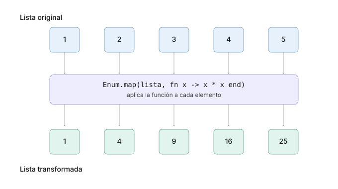
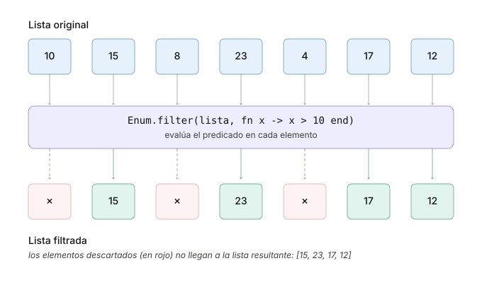
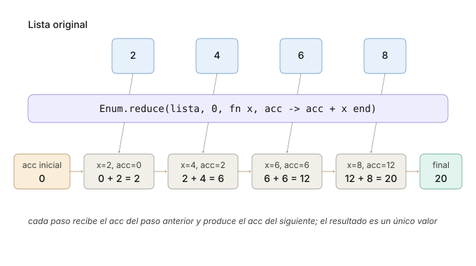

```
Universidad del Quindío
Programa de Ingeniería de Sistemas y Computación
Programación III - Colecciones en Elixir
Docente: Carlos Andrés Florez V.
```

# Colecciones en Elixir

Una colección es una estructura que agrupa varios valores, como las notas de un curso o los datos de una persona. En las guías anteriores ya se usaron **tuplas** para devolver resultados (`{:ok, valor}` / `{:error, motivo}`) y se aplicó **coincidencia de patrones** (*pattern matching*) sobre ellas. En esta guía se estudian las demás colecciones del lenguaje y el módulo `Enum`, que permite recorrerlas y transformarlas.

Los temas que se abordarán son:

- Las cuatro colecciones principales: listas, tuplas, mapas y keyword lists.
- Coincidencia de patrones aplicada a cada una de ellas.
- El módulo `Enum` para manipular colecciones.
- Las funciones `map/2`, `filter/2` y `reduce/3`, pilares de la programación funcional.
- Generación de reportes a partir de una colección de datos.

## Colecciones principales

Elixir cuenta con cuatro colecciones principales: **listas, tuplas, mapas y keyword lists**. Todas son **inmutables**, por lo que cualquier operación que parezca modificar una colección en realidad produce una nueva colección, mientras que la original permanece intacta. Además, pueden contener datos de diferentes tipos y pueden desestructurarse mediante **coincidencia de patrones**.

### Listas

Una **lista** es una colección ordenada de elementos, que puede contener cualquier tipo de dato, incluyendo otras listas. Sirve para representar un conjunto cuya cantidad de elementos no se conoce de antemano y que se recorre completo, como las notas de un curso o las líneas de un archivo. Es la colección que más se usa en Elixir.

Las listas se definen utilizando corchetes `[]` y los elementos se separan por comas. La función `length/1` devuelve cuántos elementos tiene una lista:

```elixir
notas = [3, 4, 4.6, 1.6]

length(notas)  # 4
```

Para agregar elementos hay dos formas, y ambas devuelven una lista nueva:

```elixir
lista = [1, 2, 3]

[0 | lista]      # [0, 1, 2, 3]    -- agregar al inicio
lista ++ [4, 5]  # [1, 2, 3, 4, 5] -- concatenar al final
```

No cuestan lo mismo. Agregar al inicio es inmediato, porque la lista nueva reutiliza la anterior sin copiarla, mientras que `++` debe recorrer y copiar toda la lista de la izquierda. Con listas grandes conviene agregar por el inicio.

### Tuplas

Una **tupla** es una estructura que agrupa varios valores y, a diferencia de una lista, tiene un tamaño fijo. Es útil para representar un conjunto pequeño de datos relacionados, cuya cantidad y posición se conocen de antemano. Las tuplas se definen utilizando llaves `{}`. Por ejemplo:

```elixir
mi_tupla = {1, "hola", :atom}
```

Las tuplas se utilizan con frecuencia para **devolver varios valores** desde una función, como `{:ok, valor}` o `{:error, motivo}`. La **coincidencia de patrones** permite extraer los valores de una tupla y enlazarlos con variables:

```elixir
persona = {"Carlos", 25, "México"}

# Extraer los valores mediante coincidencia de patrones
{nombre, edad, pais} = persona

IO.puts("#{nombre}, #{edad} años, #{pais}") # Carlos, 25 años, México

# Podemos usar el operador _ para ignorar los valores que no nos interesan
{_, edad, _} = persona

IO.puts("Solo la edad: #{edad}") # Solo la edad: 25

# Si la coincidencia de patrones falla, se produce un error
# {:ok, valor} = {:error, "Fallo"}
# ** (MatchError) no match of right hand side value: {:error, "Fallo"}
```

### Mapas

Un **mapa** es una colección de **pares clave-valor**, donde cada clave es única. Sirve para asociar datos con una clave, de manera que los valores se pueden recuperar utilizando esa clave en lugar de una posición. Por ejemplo, puede utilizarse para representar los datos de una persona o de un producto.

Los mapas se definen utilizando `%{}` y los pares se separan por comas:

```elixir
mi_mapa = %{"nombre" => "Juan", "edad" => 30, "ciudad" => "Armenia"}
```

Cuando las claves son átomos, existe una forma más concisa de escribir el mapa, que es muy común en Elixir:

```elixir
mi_mapa = %{nombre: "Juan", edad: 30, ciudad: "Armenia"}
```

Los valores de un mapa pueden ser de cualquier tipo de dato, incluyendo listas, tuplas y otros mapas.

Las claves no tienen que ser átomos. Pueden ser valores de distintos tipos, lo que permite, por ejemplo, utilizar la cédula como clave:

```elixir
# Mapa con información de personas usando la cédula como clave

personas = %{
  "123456789" => %{nombre: "Ana", edad: 28},
  "987654321" => %{nombre: "Luis", edad: 35}
}

personas["123456789"] # %{nombre: "Ana", edad: 28}
```

Una de las ventajas de utilizar un mapa es que permite **acceder a un valor a partir de su clave** sin tener que recorrer explícitamente todos los elementos. Si la misma información estuviera almacenada en una lista, sería necesario recorrer sus elementos hasta encontrar a la persona buscada. Por esta razón, los mapas son apropiados cuando los datos deben asociarse con claves que permitan identificarlos.

La **coincidencia de patrones** también funciona sobre mapas y permite extraer los valores que interesan:

```elixir
usuario = %{nombre: "Carlos", edad: 30, ciudad: "Armenia"}

# Extraer valores mediante coincidencia de patrones
%{nombre: nombre_usuario, edad: edad_usuario} = usuario

IO.puts("#{nombre_usuario} tiene #{edad_usuario} años")
# Carlos tiene 30 años

# No es necesario indicar todas las claves ni respetar su orden
%{ciudad: ciudad} = usuario

IO.puts("Vive en #{ciudad}")
# Vive en Armenia
```

> ⚠️ **Nota:** el orden en que se muestran las claves de un mapa **no está garantizado** y puede no coincidir con el de escritura. Si necesita conservar el orden, use una lista.

### Keyword Lists

Una **keyword list** (lista de palabras clave) es una lista de tuplas de dos elementos donde el primero es siempre un **átomo**, que hace de clave. Elixir ofrece una forma abreviada para escribirlas:

```elixir
# Forma abreviada
opciones = [orden: :asc, limite: 10]

# Es equivalente a esta lista de tuplas
opciones = [{:orden, :asc}, {:limite, 10}]
```

A diferencia de los mapas, las keyword lists **conservan el orden** en que se escriben y **permiten claves repetidas**.

Se usan principalmente para **pasar opciones a funciones**. En `IO.inspect(lista, label: "Cola")`, por ejemplo, el `label: "Cola"` es una keyword list. Cuando es el último argumento de una función se pueden omitir los corchetes, por eso se escribe así y no `IO.inspect(lista, [label: "Cola"])`.

### ¿Cuándo usar cada colección?

Las cuatro pueden guardar los mismos datos, así que la elección depende de cómo se vayan a usar:

- **Listas**: para colecciones de tamaño variable donde el orden importa y se recorren con frecuencia. Es la colección más común.
- **Tuplas**: para agrupar un número fijo y pequeño de elementos, sobre todo al devolver varios valores desde una función.
- **Mapas**: para datos estructurados en pares clave-valor, cuando se necesita acceso rápido por una clave descriptiva.
- **Keyword lists**: para pasar opciones a funciones.

---

## Enum: map, filter y reduce

Elixir ofrece módulos específicos para cada colección (`List`, `Map`, `Keyword`), pero el más utilizado es `Enum`, porque sus funciones operan sobre cualquier colección **enumerable**, es decir, cualquier colección que pueda recorrerse elemento por elemento, como las listas, los mapas o los rangos. Sus funciones son, en su gran mayoría, **funciones puras**, porque no modifican la colección que reciben sino que retornan una nueva.

Entre las funciones del módulo, tres son fundamentales: `map/2`, que transforma cada elemento, `filter/2`, que selecciona algunos elementos, y `reduce/3`, que los combina en un único resultado. Las tres reciben la colección como primer argumento y una función anónima que indica qué hacer con cada elemento.

### Map

`Enum.map/2` aplica la función a cada elemento y devuelve una nueva lista, del mismo tamaño, con los resultados:



En el diagrama, la función `fn x -> x * x end` eleva al cuadrado cada número, por lo que `[1, 2, 3, 4, 5]` se transforma en `[1, 4, 9, 16, 25]`.

### Filter

`Enum.filter/2` recibe una función que devuelve `true` o `false` y conserva únicamente los elementos para los que la función devolvió `true`:



Con `fn x -> x > 10 end`, se descartan los elementos 10, 8 y 4. La lista resultante conserva el orden original de los elementos seleccionados.

### Reduce

`Enum.reduce/3` recorre la colección y combina sus elementos en un único valor, denominado **acumulador**. Recibe tres argumentos: la colección, el valor inicial del acumulador y una función con dos parámetros, el elemento actual (`x`) y el valor acumulado hasta ese momento (`acc`).



En el diagrama, el acumulador inicia en `0`. En cada paso, la función devuelve `acc + x`, y ese valor se convierte en el acumulador para el siguiente elemento. Al procesar el último elemento, el acumulador vale `20`, que es el resultado de `reduce`. A diferencia de `map` y `filter`, que devuelven una nueva colección, `reduce` devuelve un único valor.

El acumulador puede ser de cualquier tipo de dato, no solo numérico. Por ejemplo, puede ser una lista, una tupla o un mapa, según el resultado que se quiera construir.

`Enum` tiene muchas más funciones (`count/1`, `sort_by/3`, `group_by/3`, `any?/2`, `find/2`, etc.). Las que hagan falta se irán introduciendo en los ejemplos; **no es necesario memorizarlas**, basta con saber que existen y buscarlas en la [documentación oficial de Enum](https://hexdocs.pm/elixir/Enum.html).

---

## Ejemplo 1: Reporte de notas de un curso

Un profesor tiene una lista con las notas finales de sus estudiantes. Cada nota está entre 0 y 5. El profesor necesita un programa que calcule lo siguiente:

- La nota promedio de la clase.
- Contar cuántos estudiantes están por encima y por debajo de la nota promedio. Retorne una tupla con ambos valores.
- Encontrar la nota más alta y la nota más baja.
- Contar cuántos estudiantes aprobaron (`nota >= 3`) y cuántos reprobaron.

> ⚠️ **Importante:** los ejemplos de esta guía utilizan el módulo `Util` construido en clases anteriores. Asegúrese de tener el archivo `util.exs` compilado con `elixirc` en la misma carpeta donde ejecute los scripts. Si prefiere no usarlo, reemplace las llamadas a `Util.imprimir_mensaje/1` por `IO.puts/1`.

### Versión 1: Trabajar solo con las notas

Se empieza por lo más simple: una lista de números con las notas del curso. Cada requerimiento se resuelve en su propia función y las que devuelven dos valores lo hacen mediante una **tupla**.

```elixir
defmodule Estudiantes do
  def main do
    # Se define una lista con las notas de los estudiantes (para probar las funciones)
    lista = [3, 4, 4.6, 1.6, 2.3, 4.5, 1]

    promedio = calcular_promedio(lista)
    Util.imprimir_mensaje("El promedio es #{promedio}")

    {menores, mayores} = contar_segun_promedio(lista, promedio)
    Util.imprimir_mensaje("Hay #{menores} por debajo del promedio y #{mayores} por encima")

    {menor, mayor} = obtener_estudiantes_min_max(lista)
    Util.imprimir_mensaje("La nota más baja es #{menor} y la más alta #{mayor}")

    {aprobados, reprobados} = contar_aprobados_reprobados(lista)
    Util.imprimir_mensaje("Aprobaron #{aprobados} estudiantes y reprobaron #{reprobados}")
  end

  def calcular_promedio([]), do: 0
  def calcular_promedio(lista), do: Enum.sum(lista) / length(lista)

  defp obtener_estudiantes_min_max(lista), do: Enum.min_max(lista)

  defp contar_segun_promedio(lista, promedio) do
    # Se usa una función anónima (lambda) que compara cada elemento con el promedio en ambas llamadas a Enum.count
    menores = Enum.count(lista, fn nota -> nota < promedio end)
    mayores = Enum.count(lista, fn nota -> nota > promedio end)
    {menores, mayores}
  end

  defp contar_aprobados_reprobados(lista) do
    total = length(lista)
    aprobados = Enum.count(lista, fn nota -> nota >= 3 end) # Se usa una función anónima que verifica si cada nota es mayor o igual a 3
    reprobados = total - aprobados
    {aprobados, reprobados}
  end
end

Estudiantes.main()
```

Al ejecutar `elixir estudiantes.exs` debería ver:

```
El promedio es 3.0
Hay 3 por debajo del promedio y 3 por encima
La nota más baja es 1 y la más alta 4.6
Aprobaron 4 estudiantes y reprobaron 3
```

La primera cláusula de `calcular_promedio/1` usa **coincidencia de patrones** sobre la lista vacía para evitar una división por cero.

Las funciones anónimas escritas con `fn` y `->` también se pueden escribir de forma abreviada con `&`, donde `&1` representa el primer argumento. Por ejemplo, en la función `contar_aprobados_reprobados/1` se puede hacer lo siguiente:

```elixir
aprobados = Enum.count(lista, &(&1 >= 3))
```

### Versión 2: Agregar el nombre del estudiante

**Nuevo requerimiento:** el reporte debe decir *quién* obtuvo la nota más alta y la más baja, no solo cuál fue. Una lista de números ya no alcanza, cada elemento debe agrupar dos datos relacionados, así que se convierte en una **lista de mapas**.

Este cambio obliga a ajustar todas las funciones, porque ahora cada elemento no es un número sino un mapa del que hay que **extraer** la nota. Cuando las claves son átomos, el valor se obtiene con un punto seguido del nombre de la clave. Si `estudiante` es `%{nombre: "pepe", nota: 3}`, entonces `estudiante.nota` devuelve `3` y `estudiante.nombre` devuelve `"pepe"`:

```elixir
defmodule Estudiantes do
  def main do
    lista = estudiantes_del_curso()

    promedio = calcular_promedio(lista)
    Util.imprimir_mensaje("El promedio es #{promedio}")

    {menores, mayores} = contar_segun_promedio(lista, promedio)
    Util.imprimir_mensaje("Hay #{menores} por debajo del promedio y #{mayores} por encima")

    {menor, mayor} = obtener_estudiantes_min_max(lista)
    Util.imprimir_mensaje("La nota más baja es de #{menor.nombre} (#{menor.nota}) y la más alta es de #{mayor.nombre} (#{mayor.nota})")

    {aprobados, reprobados} = contar_aprobados_reprobados(lista)
    Util.imprimir_mensaje("Aprobaron #{aprobados} estudiantes y reprobaron #{reprobados}")
  end

  # Ahora tenemos una lista de mapas
  defp estudiantes_del_curso do
    [
      %{nombre: "pepe", nota: 3},
      %{nombre: "maria", nota: 4},
      %{nombre: "juan", nota: 4.6},
      %{nombre: "luisa", nota: 1.6},
      %{nombre: "carlos", nota: 2.3},
      %{nombre: "ana", nota: 4.5},
      %{nombre: "marcos", nota: 1}
    ]
  end

  def calcular_promedio([]), do: 0
  
  def calcular_promedio(lista) do
    Enum.map(lista, fn estudiante -> estudiante.nota end) # Es necesario extraer la nota de cada estudiante
    |> Enum.sum()
    |> then(fn suma -> suma / length(lista) end) # then() permite encadenar operaciones
  end

  # Enum.min_max_by permite asociar una función para acceder a la nota
  defp obtener_estudiantes_min_max(lista), do: Enum.min_max_by(lista, fn estudiante -> estudiante.nota end)

  defp contar_segun_promedio(lista, promedio) do
    menores = Enum.count(lista, fn estudiante -> estudiante.nota < promedio end)
    mayores = Enum.count(lista, fn estudiante -> estudiante.nota > promedio end)
    {menores, mayores}
  end

  defp contar_aprobados_reprobados(lista) do
    total = length(lista)
    aprobados = Enum.count(lista, fn estudiante -> estudiante.nota >= 3 end)
    {aprobados, total - aprobados}
  end
end

Estudiantes.main()
```

Al ejecutarlo, la salida es:

```
El promedio es 3.0
Hay 3 por debajo del promedio y 3 por encima
La nota más baja es de marcos (1) y la más alta es de juan (4.6)
Aprobaron 4 estudiantes y reprobaron 3
```

Los cambios frente a la Versión 1 son tres:

- **La lista sale de `main`.** Con mapas, la lista ya ocupa varias líneas, así que se pasa a su propia función, `estudiantes_del_curso/0`, y `main` queda solo con los cálculos.
- **`Enum.min_max/1` fue reemplazada por `Enum.min_max_by/2`.** Las funciones terminadas en `_by` reciben una función que indica **según qué criterio** comparar, y devuelven el **elemento completo** (el mapa del estudiante), no solo el valor comparado. Por eso ahora se puede imprimir `menor.nombre` además de `menor.nota`. Si solo se necesita uno de los dos, existen `Enum.min_by/2` y `Enum.max_by/2`.
- **`then/2` en `calcular_promedio/1`.** El operador `|>` pasa el valor como *primer* argumento de la siguiente función, pero aquí se necesita dividirlo entre `length(lista)`. `then/2` recibe el valor acumulado y permite usarlo dentro de una expresión cualquiera.

### Versión 3: Clasificar a cada estudiante

**Nuevo requerimiento:** se necesita una función que devuelva la lista de estudiantes como tuplas con el nombre y su estado (`:aprobado` o `:reprobado`). Las siguientes funciones son fragmentos que se deben agregar al módulo `Estudiantes` de las versiones anteriores.

```elixir
defp agregar_estado(lista) do
  Enum.map(lista, fn estudiante ->
    estado = if estudiante.nota >= 3, do: :aprobado, else: :reprobado
    {estudiante.nombre, estado}
  end)
end
```

También podemos usar **coincidencia de patrones** para desestructurar el mapa del estudiante en el propio parámetro de la función anónima, así:

```elixir
defp agregar_estado(lista) do
  Enum.map(lista, fn %{nombre: nombre, nota: nota} ->
    estado = if nota >= 3, do: :aprobado, else: :reprobado
    {nombre, estado}
  end)
end
```
O también así, con la forma abreviada de `&`:

```elixir
defp agregar_estado(lista) do
  Enum.map(lista, &( {&1.nombre, if(&1.nota >= 3, do: :aprobado, else: :reprobado)} ))
end
```

Las tres formas hacen lo mismo. Use la que le resulte más legible.

Para ver el resultado, agregue la llamada al final de `main`:

```elixir
agregar_estado(lista)
|> IO.inspect(label: "Estado de los estudiantes")
```

La salida será:

```
Estado de los estudiantes: [
  {"pepe", :aprobado},
  {"maria", :aprobado},
  {"juan", :aprobado},
  {"luisa", :reprobado},
  {"carlos", :reprobado},
  {"ana", :aprobado},
  {"marcos", :reprobado}
]
```

Aquí se usa `IO.inspect/2` y no `IO.puts/1`, porque `IO.puts/1` no puede convertir una lista de tuplas a texto y el programa fallaría con un `ArgumentError`.

### Versión 4: Ordenar el listado por nota

**Nuevo requerimiento:** el reporte debe presentar a los estudiantes ordenados por su nota de manera descendente, de modo que quien obtuvo la nota más alta aparezca primero. En la salida se debe mostrar el nombre del estudiante junto con su nota.

```elixir
defp ordenar_por_nota(lista) do
  Enum.sort_by(lista, fn estudiante -> estudiante.nota end, :desc)
end
```

O también así, con la forma abreviada de `&`:

```elixir
defp ordenar_por_nota(lista) do
  Enum.sort_by(lista, &(&1.nota), :desc)
end
```

La función `Enum.sort_by/3` permite especificar una función para acceder al valor por el cual se desea ordenar (en este caso, la nota) y el orden (`:asc` para ascendente o `:desc` para descendente).

Igual que en la versión anterior, agregue la llamada al final de `main` para ver el resultado:

```elixir
ordenar_por_nota(lista)
|> Enum.each(fn estudiante ->
  Util.imprimir_mensaje("#{estudiante.nombre}: #{estudiante.nota}")
end)
```

La salida será:

```
juan: 4.6
ana: 4.5
maria: 4
pepe: 3
carlos: 2.3
luisa: 1.6
marcos: 1
```

`Enum.each/2`, a diferencia de `Enum.map/2`, no construye una colección nueva sino que ejecuta una acción por cada elemento. Es la función indicada cuando lo único que interesa es el efecto secundario, en este caso imprimir.

### Versión 5: La distribución de las notas

**Nuevo requerimiento:** el profesor quiere ver cómo se reparten las notas del curso. Para cada parte entera de la nota (0, 1, 2, 3, 4 y 5) necesita saber cuántos estudiantes la obtuvieron. Por ejemplo, un 4.6 y un 4.5 cuentan en el 4.

Esta vez no se recorre la lista de estudiantes sino los valores posibles de la nota. Para cada valor se cuentan los estudiantes cuya nota, sin decimales, coincide con él. `trunc/1` devuelve la parte entera de un número:

```elixir
defp distribucion_notas(lista) do
  Enum.map([0, 1, 2, 3, 4, 5], fn n ->
    {n, Enum.count(lista, fn estudiante -> trunc(estudiante.nota) == n end)}
  end)
end
```

Escribir los seis valores a mano funciona, pero si la escala cambiara a notas de 0 a 10 habría que escribir once. Para una secuencia de enteros consecutivos Elixir tiene una forma más corta, el **rango**. `0..5` representa los enteros del 0 al 5, ambos incluidos, y ya se ha usado en los *guards* para preguntar si un valor está dentro de un intervalo (`when operacion in 1..4`). Un rango también es una colección enumerable, así que `Enum.map/2` lo recorre igual que a una lista:

```elixir
defp distribucion_notas(lista) do
  Enum.map(0..5, fn n ->
    {n, Enum.count(lista, fn estudiante -> trunc(estudiante.nota) == n end)}
  end)
end
```

Pruébela desde `main` imprimiendo el resultado con `IO.inspect/2`. La salida será:

```
Distribución de notas: [{0, 0}, {1, 2}, {2, 1}, {3, 1}, {4, 3}, {5, 0}]
```

El 0 y el 5 aparecen aunque ningún estudiante tenga esas notas, porque la función recorre los valores posibles y no los estudiantes. Si se recorriera la lista de estudiantes, solo aparecerían las notas que alguien obtuvo.

### Versión 6 (opcional): La lista de aprobados

**Nuevo requerimiento:** obtener la lista con los nombres de los estudiantes que aprobaron.

Con lo visto hasta ahora son dos pasos encadenados, quedarse con los aprobados y luego extraer el nombre de cada uno. Es el primer uso de `Enum.filter/2`, la segunda de las tres funciones del diagrama:

```elixir
defp nombres_aprobados(lista) do
  lista
  |> Enum.filter(fn estudiante -> estudiante.nota >= 3 end)
  |> Enum.map(fn estudiante -> estudiante.nombre end)
end
```

#### Comprehensions (`for`)

Filtrar una colección y transformar lo que queda es una combinación tan frecuente que Elixir trae una construcción dedicada a ella, la **comprehension**. Permite recorrer una colección, descartar los elementos que no interesan y construir el resultado en una sola expresión, sin encadenar funciones ni recorrer la colección dos veces. Se escribe con la palabra clave `for`.

Con ella, los dos pasos anteriores se reducen a una sola línea:

```elixir
defp nombres_aprobados(lista) do
  for %{nombre: nombre, nota: nota} <- lista, nota >= 3, do: nombre
end
```

Pruébela desde `main` imprimiendo el resultado con `IO.inspect/2`. La salida será:

```
Aprobados: ["pepe", "maria", "juan", "ana"]
```

La comprehension tiene tres partes:

- El **generador**, `%{nombre: nombre, nota: nota} <- lista`, que toma cada elemento de la colección. Admite coincidencia de patrones, así que desestructura el mapa en el mismo lugar.
- Los **filtros**, `nota >= 3`, que son condiciones separadas por comas. Solo pasan los elementos que las cumplen todas.
- El cuerpo, después de `do:`, que construye cada elemento del resultado.

Ninguna de las dos formas es mejor que la otra. La comprehension gana en concisión cuando hay filtros y transformaciones sencillas, mientras que el `pipe` con `Enum` resulta más claro cuando la cadena de operaciones es larga o incluye funciones como `sort_by/3`, que no tiene equivalente en `for`.

Después de todas las versiones, `main` debe quedar así:

```elixir
def main do
  lista = estudiantes_del_curso()

  promedio = calcular_promedio(lista)
  Util.imprimir_mensaje("El promedio es #{promedio}")

  {menores, mayores} = contar_segun_promedio(lista, promedio)
  Util.imprimir_mensaje("Hay #{menores} por debajo del promedio y #{mayores} por encima")

  {menor, mayor} = obtener_estudiantes_min_max(lista)
  Util.imprimir_mensaje("La nota más baja es de #{menor.nombre} (#{menor.nota}) y la más alta es de #{mayor.nombre} (#{mayor.nota})")

  {aprobados, reprobados} = contar_aprobados_reprobados(lista)
  Util.imprimir_mensaje("Aprobaron #{aprobados} estudiantes y reprobaron #{reprobados}")

  agregar_estado(lista)
  |> IO.inspect(label: "Estado de los estudiantes")

  distribucion_notas(lista)
  |> IO.inspect(label: "Distribución de notas")

  nombres_aprobados(lista)
  |> IO.inspect(label: "Aprobados")

  Util.imprimir_mensaje("\nEstudiantes ordenados por nota:")

  ordenar_por_nota(lista)
  |> Enum.each(fn estudiante ->
    Util.imprimir_mensaje("#{estudiante.nombre}: #{estudiante.nota}")
  end)
end
```

Las demás funciones son las de cada versión, una debajo de otra en el mismo módulo.

### Versión 7 (actividad)

**Mejore el código.** La función `contar_segun_promedio/2` recorre la lista **dos veces**, una por cada llamada a `Enum.count/2`. Modifíquela para que halle la cantidad de estudiantes por encima y por debajo del promedio en una sola pasada.

*Pista:* use `Enum.reduce/3` con una tupla `{menores, mayores}` como acumulador.

---

## Ejemplo 2: Reportes de ventas de una tienda

Una tienda registra las ventas del día en una lista de mapas. Cada venta indica el producto, su categoría y la cantidad vendida. Se necesitan varios reportes que requieren funciones de `Enum` **distintas a las del ejemplo anterior**.

### Versión 1: Agrupar y contar

Los primeros tres reportes son: las categorías que se vendieron hoy (sin repetir), qué productos se vendieron en cada categoría y cuántas ventas hubo en cada una.

```elixir
defmodule Ventas do
  def main do
    ventas = ventas_del_dia()

    obtener_categorias_unicas(ventas)
    |> IO.inspect(label: "Categorías")

    agrupar_productos_por_categoria(ventas)
    |> IO.inspect(label: "Productos por categoría")

    contar_ventas_por_categoria(ventas)
    |> IO.inspect(label: "Ventas por categoría")
  end

  # Se separan los datos de la lógica: main no necesita saber de dónde salen las ventas
  defp ventas_del_dia do
    [
      %{producto: "Café", categoria: "Bebidas", cantidad: 3},
      %{producto: "Té", categoria: "Bebidas", cantidad: 1},
      %{producto: "Jugo", categoria: "Bebidas", cantidad: 6},
      %{producto: "Pan", categoria: "Panadería", cantidad: 5},
      %{producto: "Croissant", categoria: "Panadería", cantidad: 2},
      %{producto: "Torta", categoria: "Panadería", cantidad: 1},
      %{producto: "Galleta", categoria: "Panadería", cantidad: 3}
    ]
  end

  # Categorías sin repetir (Enum.uniq elimina los repetidos conservando el orden)
  defp obtener_categorias_unicas(ventas) do
    ventas
    |> Enum.map(fn venta -> venta.categoria end)
    |> Enum.uniq()
  end

  # Agrupa los nombres de productos por categoría (Enum.group_by)
  # El tercer argumento indica qué guardar en cada grupo (el producto, no el mapa completo)
  defp agrupar_productos_por_categoria(ventas) do
    Enum.group_by(ventas, fn venta -> venta.categoria end, fn venta -> venta.producto end)
  end

  # Cuántas ventas hubo en cada categoría (Enum.frequencies_by)
  defp contar_ventas_por_categoria(ventas) do
    Enum.frequencies_by(ventas, fn venta -> venta.categoria end)
  end
end

Ventas.main()
```

Al ejecutar `elixir ventas.exs` debería ver:

```
Categorías: ["Bebidas", "Panadería"]
Productos por categoría: %{
  "Bebidas" => ["Café", "Té", "Jugo"],
  "Panadería" => ["Pan", "Croissant", "Torta", "Galleta"]
}
Ventas por categoría: %{"Bebidas" => 3, "Panadería" => 4}
```

Las tres funciones se diferencian en lo que devuelven. `Enum.uniq/1` devuelve una **lista**, mientras que `Enum.group_by/3` y `Enum.frequencies_by/2` devuelven un **mapa** cuyas claves son el resultado de la función que se les pasa. `group_by` guarda en cada clave la lista de elementos que le corresponden; `frequencies_by` guarda únicamente cuántos son.

### Versión 2: Acumular las unidades vendidas

**Nuevo requerimiento:** los reportes anteriores cuentan *ventas*, pero el administrador necesita saber cuántas **unidades** se vendieron por categoría, que es un dato distinto (una sola venta puede llevar seis unidades).

Ninguna función de `Enum` hace esto directamente, porque no se trata de contar elementos sino de **sumar un campo agrupando por otro**. Para eso se usa `Enum.reduce/3` construyendo un mapa como acumulador. Se agrega la siguiente función al módulo:

```elixir
# Total de unidades vendidas por categoría.
# Enum.reduce junto con Map.update/4 es el patrón habitual para acumular dentro de un mapa
defp sumar_unidades_por_categoria(ventas) do
  Enum.reduce(ventas, %{}, fn venta, acumulador ->
    Map.update(acumulador, venta.categoria, venta.cantidad, fn total -> total + venta.cantidad end)
  end)
end
```

Pruébela desde `main` imprimiendo el resultado con `IO.inspect/2`. La salida es:

```
Unidades por categoría: %{"Bebidas" => 10, "Panadería" => 11}
```

Funciona así:

- El acumulador inicial es un **mapa vacío** `%{}`. Recuerde que el acumulador puede ser de cualquier tipo, no solo un número.
- En cada elemento, `Map.update/4` recibe cuatro argumentos: el mapa, la clave, el valor a usar **si la clave todavía no existe** (la primera venta de esa categoría) y una función que calcula el nuevo valor **a partir del anterior** si la clave ya existe.
- Como el mapa es inmutable, `Map.update/4` no lo modifica, sino que devuelve un mapa nuevo, que pasa a ser el acumulador de la siguiente vuelta.

### Versión 3 (final): Preguntas sobre las ventas

**Nuevo requerimiento:** además de los reportes, se necesita responder preguntas puntuales: ¿hubo alguna venta grande?, ¿todos los registros son válidos?, ¿cuál fue la primera venta de una categoría dada? Estas tres preguntas se resuelven con `Enum.any?/2`, `Enum.all?/2` y `Enum.find/2`. Agregue estas funciones al módulo:

```elixir
# ¿Se vendió algún producto con más de 4 unidades? (Enum.any?)
defp hay_venta_alta?(ventas) do
  Enum.any?(ventas, fn venta -> venta.cantidad > 4 end)
end

# ¿Todas las ventas tienen cantidad positiva? (Enum.all?)
defp ventas_validas?(ventas) do
  Enum.all?(ventas, fn venta -> venta.cantidad > 0 end)
end

# Primera venta de una categoría dada (Enum.find devuelve nil si ninguna coincide)
defp buscar_primera_venta_categoria(ventas, categoria) do
  Enum.find(ventas, fn venta -> venta.categoria == categoria end)
end
```

Y estas llamadas al final de `main`:

```elixir
Util.imprimir_mensaje("¿Alguna venta de más de 4 unidades? #{hay_venta_alta?(ventas)}")
Util.imprimir_mensaje("¿Todas las ventas son válidas? #{ventas_validas?(ventas)}")

buscar_primera_venta_categoria(ventas, "Bebidas")
|> IO.inspect(label: "Primera venta de Bebidas")

buscar_primera_venta_categoria(ventas, "Lácteos")
|> IO.inspect(label: "Primera venta de Lácteos")
```

La salida completa del programa es:

```
Categorías: ["Bebidas", "Panadería"]
Productos por categoría: %{
  "Bebidas" => ["Café", "Té", "Jugo"],
  "Panadería" => ["Pan", "Croissant", "Torta", "Galleta"]
}
Ventas por categoría: %{"Bebidas" => 3, "Panadería" => 4}
Unidades por categoría: %{"Bebidas" => 10, "Panadería" => 11}
¿Alguna venta de más de 4 unidades? true
¿Todas las ventas son válidas? true
Primera venta de Bebidas: %{producto: "Café", categoria: "Bebidas", cantidad: 3}
Primera venta de Lácteos: nil
```

Preste atención a la última línea: **`Enum.find/2` devuelve `nil` cuando ningún elemento cumple la condición**. Esto obliga a quien llama la función a considerar ese caso. Una alternativa más segura sería envolver el resultado en una tupla `{:ok, venta}` o `{:error, :no_encontrada}`.

Las tres tienen algo en común: **dejan de recorrer la colección apenas tienen la respuesta**. `Enum.any?/2` se detiene en el primer elemento que cumple, `Enum.all?/2` en el primero que no cumple y `Enum.find/2` al encontrar la coincidencia. Escribir estas mismas preguntas con `Enum.filter/2` obligaría a recorrer toda la lista y a construir una colección intermedia que se descartaría enseguida.

---

## Referencias rápidas a funciones de colecciones

Cuando la operación es específica de una estructura, conviene buscarla en su módulo antes que en `Enum`. Estas funciones no aparecieron en los ejemplos, pero serán útiles en los ejercicios:

| Módulo | Funciones | Para qué sirven |
| --- | --- | --- |
| `List` | `first/1`, `last/1` | Primer y último elemento |
| `List` | `insert_at/3`, `replace_at/3`, `delete_at/2`, `delete/2` | Trabajar por posición o quitar un elemento |
| `Map` | `get/2`, `put/3`, `delete/2` | Consultar, agregar o quitar una clave |
| `Map` | `keys/1`, `values/1`, `merge/2` | Obtener las claves o los valores, combinar dos mapas |
| `Enum` | `take/2`, `drop/2` | Quedarse con los primeros elementos o descartarlos |
| `Enum` | `with_index/1`, `zip/2` | Numerar una colección o combinar dos |
| `Enum` | `split_with/2`, `chunk_every/2` | Partir en dos según una condición o en bloques de tamaño fijo |
| `Enum` | `join/2` | Unir los elementos en una sola cadena |

## Documentación oficial

Los ejemplos de esta guía usan solo una parte de las funciones disponibles. Para consultar el resto durante los ejercicios, y para profundizar en cada tema, use la documentación oficial de Elixir:

- [Documentación de listas y tuplas](https://hexdocs.pm/elixir/lists-and-tuples.html)
- [Documentación de List](https://hexdocs.pm/elixir/List.html)
- [Documentación de Map](https://hexdocs.pm/elixir/Map.html)
- [Documentación de Keyword](https://hexdocs.pm/elixir/Keyword.html)
- [Documentación de Enum](https://hexdocs.pm/elixir/Enum.html)
- [Documentación de comprehensions (`for`)](https://hexdocs.pm/elixir/comprehensions.html)

---

## Ejercicios propuestos

Resuelva los siguientes ejercicios utilizando las colecciones vistas en esta guía. Use el módulo `Enum` y cree un módulo separado para cada ejercicio.

### Ejercicio 1: Inventario de una tienda en línea

Una tienda en línea guarda la información de sus productos en una lista de mapas, donde cada mapa tiene el formato `%{id: entero, nombre: cadena, precio: número, stock: entero, categoria: cadena}`. Use el siguiente catálogo de prueba:

```elixir
productos = [
  %{id: 1, nombre: "Teclado mecánico", precio: 180000, stock: 12, categoria: "Periféricos"},
  %{id: 2, nombre: "Mouse inalámbrico", precio: 75000, stock: 0, categoria: "Periféricos"},
  %{id: 3, nombre: "Monitor 24\"", precio: 620000, stock: 5, categoria: "Pantallas"},
  %{id: 4, nombre: "Cable HDMI", precio: 25000, stock: 40, categoria: "Accesorios"},
  %{id: 5, nombre: "Base para portátil", precio: 90000, stock: 0, categoria: "Accesorios"},
  %{id: 6, nombre: "Audífonos", precio: 150000, stock: 8, categoria: "Accesorios"},
  %{id: 7, nombre: "Monitor 27\"", precio: 950000, stock: 3, categoria: "Pantallas"}
]
```

Se necesita un programa que haga lo siguiente:

- Calcular el valor total del inventario de la tienda (precio * stock de cada producto).
- Generar una lista solo con los nombres de los productos sin stock (stock == 0).
- Filtrar los productos de la categoría "Accesorios" y mostrarlos ordenados por precio ascendente.
- Encontrar el producto más caro y el más barato, devolviendo ambos como tuplas del tipo: `{:mas_caro, nombre, precio}` y `{:mas_barato, nombre, precio}`.
- Agrupar los productos por categoría (usar `Enum.group_by`).
- Contar cuántos productos hay en cada categoría.
- Calcular el promedio de precios por categoría.

### Ejercicio 2: Catálogo de una biblioteca digital

Una biblioteca digital guarda su catálogo en una lista de mapas como la siguiente:

```elixir
libros = [
  %{titulo: "El Quijote", autor: "Cervantes", categoria: "novela", disponible: true},
  %{titulo: "Cien años de soledad", autor: "García Márquez", categoria: "novela", disponible: false},
  %{titulo: "El Principito", autor: "Saint-Exupéry", categoria: "infantil", disponible: true},
  %{titulo: "Clean Code", autor: "Robert C. Martin", categoria: "tecnología", disponible: true},
  %{titulo: "El alquimista", autor: "Paulo Coelho", categoria: "novela", disponible: false},
  %{titulo: "El coronel no tiene quien le escriba", autor: "García Márquez", categoria: "novela", disponible: false},
]
```

Se necesita un programa que permita:
- Filtrar los libros que están disponibles para préstamo.
- Generar una lista de títulos de todos los libros en una categoría dada (por ejemplo "novela").
- Listar los autores únicos que hay en el catálogo.
- Ordenar la lista de libros alfabéticamente por título.
- Crear un mapa de disponibilidad donde la clave sea el título y el valor un booleano (true/false).
- Contar cuantos libros hay por categoría.

### Ejercicio 3: Reportes de una plaza de mercado

Una plaza de mercado maneja el siguiente listado de productos:

```elixir
productos = [
  %{nombre: "Manzana", categoria: "Fruta", precio: 3000},
  %{nombre: "Pera", categoria: "Fruta", precio: 2500},
  %{nombre: "Zanahoria", categoria: "Verdura", precio: 1800},
  %{nombre: "Lechuga", categoria: "Verdura", precio: 2000},
  %{nombre: "Pollo", categoria: "Carne", precio: 8000},
  %{nombre: "Res", categoria: "Carne", precio: 10000}
]
```

Este ejercicio se enfoca en funciones de `Enum` **distintas** a las de los ejercicios anteriores. Se requieren las siguientes operaciones:

- **Separar frutas y no frutas:** Dividir la lista en dos en una sola pasada. *Pista:* investigue `Enum.split_with/2`.
- **Verificar si todos los productos tienen precio mayor que 1000:** Devolver `true` o `false` con `Enum.all?/2`.
- **Verificar si existe algún producto de más de 9000:** Devolver `true` o `false` con `Enum.any?/2`.
- **Convertir nombres a mayúsculas y ordenarlos:** Generar una lista de nombres en mayúscula, ordenada alfabéticamente.
- **Los tres productos más caros:** Obtener solo los tres primeros tras ordenar por precio. *Pista:* `Enum.take/2`.
- **Suma total de precios:** Calcular cuánto cuestan todos los productos juntos usando `Enum.reduce/3` (no `Enum.sum/1`).
- **Mapear categorías con la cantidad de letras en sus productos:** Crear un mapa donde la clave sea la categoría y el valor sea la suma de la longitud de los nombres de los productos de esa categoría.
- **Numerar el catálogo:** Generar una lista de cadenas con la forma `"1. Manzana"`, `"2. Pera"`, etc. *Pista:* investigue `Enum.with_index/1`.

---

## Para la próxima clase

- Investigar qué es la **recursividad** y cuáles son sus dos componentes esenciales: el *caso base* y el *caso recursivo*.
- Investigar por qué los lenguajes funcionales usan recursión en lugar de bucles como `for` o `while`. *Pista:* piense en lo que se necesitaría para escribir un `for` con contador en un lenguaje donde los datos son inmutables.
- Investigar qué es un *stack overflow* y por qué una función recursiva puede provocarlo.
- Investigar cómo se descompone una lista en su **cabeza** y su **cola** con `[head | tail]`, ya que será la base para procesar listas recursivamente.
