```
Universidad del Quindío
Programa de Ingeniería de Sistemas y Computación
Programación III - Structs
Docente: Carlos Andrés Florez V.
```

# Structs

Los **structs** en Elixir son una forma de crear **estructuras de datos tipadas** con un conjunto fijo de campos. A diferencia de los mapas genéricos, los structs:

1. **Tienen un esquema definido**: Especifican exactamente qué campos pueden contener
2. **Están asociados a un módulo**: Cada struct pertenece a un módulo específico
3. **Proporcionan valores por defecto**: Se pueden definir valores iniciales para los campos
4. **Son mapas especializados**: Internamente son mapas con metadatos adicionales
5. **Mejoran la legibilidad**: Hacen el código más autodocumentado y mantenible

Los structs son ideales para representar **entidades del dominio** como usuarios, productos, pedidos, etc.

## Diferencias entre Structs y Mapas

Aunque internamente **un struct es un mapa** (un mapa con una clave especial `__struct__` que guarda el nombre de su módulo), existen diferencias clave entre ambos:

| Característica | Struct | Mapa |
| --- | --- | --- |
| **Claves** | Conjunto fijo, definido con `defstruct` | Dinámicas: admite cualquier clave |
| **Asociación a módulo** | Sí, pertenece a un módulo | No |
| **Validación de claves** | Sí: error al usar una clave no definida | No: admite cualquier clave |
| **Valores por defecto** | Sí, se definen en el módulo | No |
| **Enumerable** | No (convertir con `Map.from_struct/1`) | Sí (`Enum.map/2`, `Enum.each/2`, etc.) |

La ventaja de los structs no está en el rendimiento (al ser mapas, su costo en memoria y velocidad es prácticamente el mismo), sino en la **seguridad y la predecibilidad**: garantizan que cada instancia tenga la forma esperada y detectan errores de escritura en las claves de forma temprana.

### Comparación práctica

En el siguiente ejemplo se muestra cómo los mapas permiten agregar cualquier clave, mientras que los structs no. Más adelante veremos en detalle cómo se define un struct con `defstruct`:

```elixir
defmodule Usuario do
  defstruct [:nombre, :edad]
end

# Mapa: flexible pero sin garantías
mapa = %{nombre: "Juan", edad: 30}
mapa = Map.put(mapa, :telefono, "123")  # Permite agregar cualquier clave

# Struct: rígido pero predecible
struct = %Usuario{nombre: "Juan", edad: 30}
struct = %{struct | telefono: "123"}  # Error: clave no definida
```

---

## Ejemplo 1: Reproductor de música

Una aplicación de música necesita representar las canciones de una lista de reproducción. De cada canción interesa su título, su artista y su duración en segundos. Además, la aplicación debe llevar la cuenta de cuántas veces se ha reproducido cada canción y permitir marcarla como favorita.

Iremos construyendo la solución por versiones, agregando una capacidad nueva en cada paso.

### Versión 1: Definir el struct

La primera decisión es qué campos tendrá la canción. Para definir un struct se usa `defstruct` dentro de un módulo. La forma más simple es dar una **lista de átomos** con los nombres de los campos:

```elixir
defmodule Cancion do
  defstruct [:titulo, :artista, :duracion, :reproducciones, :favorita]
end

defmodule Reproductor do
  def main do
    cancion = %Cancion{titulo: "Bohemian Rhapsody", artista: "Queen", duracion: 355}
    IO.inspect(cancion)
  end
end

Reproductor.main()
# => %Cancion{titulo: "Bohemian Rhapsody", artista: "Queen", duracion: 355,
#             reproducciones: nil, favorita: nil}
```

> ⚠️ **Importante:** el struct se construye **dentro de la función `main`**, no en el nivel superior del archivo. Si lo escribe suelto, justo después del `defmodule`, el programa no compilará.

El problema de esta versión es que `reproducciones` queda en `nil`. Una canción recién creada no se ha reproducido **cero** veces, no un valor indefinido, y tampoco es favorita. Con `nil` no podríamos ni siquiera sumarle 1 al contador.

### Versión 2: Valores por defecto

`defstruct` permite asignar un **valor inicial** a cada campo usando la sintaxis `campo: valor`:

```elixir
defmodule Cancion do
  defstruct titulo: "", artista: "", duracion: 0, reproducciones: 0, favorita: false
end
```

Sin embargo, aquí conviene distinguir dos tipos de campos: los que **siempre deben venir de afuera** (título, artista, duración) y los que **tienen un valor inicial natural** (reproducciones y favorita). Para eso existe la **forma mixta**, que combina la lista de átomos con los valores por defecto. Los campos sin valor por defecto se escriben primero:

```elixir
defmodule Cancion do
  defstruct [:titulo, :artista, :duracion, reproducciones: 0, favorita: false]
end

defmodule Reproductor do
  def main do
    cancion = %Cancion{titulo: "Bohemian Rhapsody", artista: "Queen", duracion: 355}
    IO.inspect(cancion)
  end
end

Reproductor.main()
# => %Cancion{titulo: "Bohemian Rhapsody", artista: "Queen", duracion: 355,
#             reproducciones: 0, favorita: false}
```

Ahora una canción nueva ya nace con el contador en cero y sin marcar como favorita, sin que quien la crea tenga que indicarlo.

> ⚠️ **Importante:** en la forma mixta, los campos **sin** valor por defecto deben ir **antes** que los que sí lo tienen. Escribir `defstruct [reproducciones: 0, :titulo]` produce un error de sintaxis.

### Versión 3: Acceder a los campos

Para mostrar la información de la canción necesitamos leer sus campos. Hay dos maneras de hacerlo:

```elixir
defmodule Reproductor do
  def main do
    cancion = %Cancion{titulo: "Bohemian Rhapsody", artista: "Queen", duracion: 355}

    # 1. Acceso con punto
    IO.puts("Título: #{cancion.titulo}")     # => Título: Bohemian Rhapsody
    IO.puts("Artista: #{cancion.artista}")   # => Artista: Queen

    # 2. Pattern matching: extrae varios campos a la vez
    %Cancion{titulo: titulo, duracion: duracion} = cancion
    IO.puts("#{titulo} dura #{div(duracion, 60)} minutos y #{rem(duracion, 60)} segundos")
    # => Bohemian Rhapsody dura 5 minutos y 55 segundos
  end
end
```

El **pattern matching** es especialmente útil cuando se necesitan varios campos, ya que evita repetir el nombre de la variable una y otra vez. Además, funciona en los parámetros de una función, como veremos en la Versión 6.

> ⚠️ **Importante:** a diferencia de los mapas, los structs **no admiten el acceso con corchetes**. Escribir `cancion[:titulo]` produce un `UndefinedFunctionError`, porque los structs no implementan el comportamiento `Access`. Use siempre el punto o el pattern matching.

### Versión 4: Actualizar campos (inmutabilidad)

Cada vez que suena una canción hay que incrementar su contador. Como los structs son **inmutables**, no se modifica la canción existente: se crea una nueva a partir de ella con la sintaxis de actualización `%{struct | campo: valor}`.

```elixir
defmodule Reproductor do
  def main do
    cancion = %Cancion{titulo: "Bohemian Rhapsody", artista: "Queen", duracion: 355}

    # Cada actualización produce un struct NUEVO
    sonando = %{cancion | reproducciones: cancion.reproducciones + 1}
    sonando = %{sonando | reproducciones: sonando.reproducciones + 1, favorita: true}

    IO.puts("Original:   #{cancion.reproducciones} reproducciones")  # => Original:   0
    IO.puts("Actualizada: #{sonando.reproducciones} reproducciones") # => Actualizada: 2
  end
end
```

La canción original **nunca cambia**: `cancion` sigue con cero reproducciones. Esto es lo mismo que vimos con los mapas y las listas, y es la razón por la que cada función que "modifica" un struct debe **retornar** la nueva versión.

> ⚠️ **Importante:** la sintaxis `%{struct | campo: valor}` solo permite actualizar campos **que ya existen** en el struct. Si intenta `%{cancion | album: "A Night at the Opera"}`, obtendrá un error, porque `album` no está definido en `defstruct`. Con un mapa corriente, en cambio, la clave se agregaría sin protestar. Esta es justamente la garantía que aportan los structs.

### Versión 5: Campos obligatorios con `@enforce_keys`

Hay un hueco en el diseño actual: nada impide crear una canción vacía.

```elixir
cancion = %Cancion{}
# => %Cancion{titulo: nil, artista: nil, duracion: nil, reproducciones: 0, favorita: false}
```

Una canción sin título ni duración no tiene sentido en el dominio del problema. La directiva `@enforce_keys` declara qué campos son **obligatorios** al construir el struct:

```elixir
defmodule Cancion do
  @enforce_keys [:titulo, :artista, :duracion]
  defstruct [:titulo, :artista, :duracion, reproducciones: 0, favorita: false]
end
```

A partir de ahora, omitir cualquiera de esos tres campos impide que el programa compile:

```elixir
%Cancion{titulo: "Imagine"}
# ** (ArgumentError) the following keys must also be given when building
#    struct Cancion: [:artista, :duracion]
```

Note que `@enforce_keys` **solo exige que el campo se proporcione**; no valida su contenido. Nada impide escribir `%Cancion{titulo: "", artista: "", duracion: -50}`. Para eso hace falta lógica de validación, que es lo que agregaremos en la siguiente versión.

### Versión 6 (final): Funciones en el módulo del struct

Hasta ahora, toda la lógica está en `Reproductor`: el módulo que usa la canción es el que sabe cómo incrementar el contador y cómo calcular los minutos. Es mejor que **cada struct sea responsable de su propia lógica**, de modo que quien lo use no tenga que conocer sus detalles internos.

```elixir
defmodule Cancion do
  @enforce_keys [:titulo, :artista, :duracion]
  defstruct [:titulo, :artista, :duracion, reproducciones: 0, favorita: false]

  # Constructor con validación: retorna {:ok, ...} o {:error, ...}
  def nueva(titulo, artista, duracion) when duracion > 0 do
    {:ok, %__MODULE__{titulo: titulo, artista: artista, duracion: duracion}}
  end

  def nueva(_titulo, _artista, _duracion), do: {:error, :duracion_invalida}

  # ---------------- Funciones de utilidad relacionadas con el struct ----------------

  def reproducir(%__MODULE__{reproducciones: n} = cancion) do
    %{cancion | reproducciones: n + 1}
  end

  def marcar_favorita(%__MODULE__{} = cancion), do: %{cancion | favorita: true}

  def duracion_formateada(%__MODULE__{duracion: segundos}) do
    minutos = div(segundos, 60)
    resto = rem(segundos, 60)
    "#{minutos}:#{String.pad_leading(Integer.to_string(resto), 2, "0")}"
  end

  def popular?(%__MODULE__{reproducciones: n}), do: n >= 3
end

defmodule Reproductor do
  def main do
    case Cancion.nueva("Bohemian Rhapsody", "Queen", 355) do
      {:ok, cancion} ->
        cancion =
          cancion
          |> Cancion.reproducir()
          |> Cancion.reproducir()
          |> Cancion.reproducir()
          |> Cancion.marcar_favorita()

        IO.puts("#{cancion.titulo} - #{cancion.artista} (#{Cancion.duracion_formateada(cancion)})")
        IO.puts("Reproducciones: #{cancion.reproducciones}")
        IO.puts("¿Es popular? #{Cancion.popular?(cancion)}")

      {:error, razon} ->
        IO.puts("No se pudo crear la canción: #{razon}")
    end

    IO.inspect(Cancion.nueva("Error", "Nadie", 0), label: "Duración inválida")
  end
end

Reproductor.main()
```

La salida es:

```
Bohemian Rhapsody - Queen (5:55)
Reproducciones: 3
¿Es popular? true
Duración inválida: {:error, :duracion_invalida}
```

Observe tres cosas de esta versión final:

1. **`%__MODULE__{}` se refiere al struct definido en el módulo actual.** Evita repetir el nombre y hace que el código siga funcionando si el módulo se renombra. También es válido escribir `%Cancion{}` de forma explícita.
2. **Las funciones reciben el struct por pattern matching** (`%__MODULE__{reproducciones: n} = cancion`). Esto cumple dos propósitos a la vez: extrae el campo que se necesita y **garantiza que el argumento sea realmente una canción**. Si alguien pasara un mapa cualquiera, la función fallaría de inmediato.
3. **`reproducir/1` se puede encadenar con el operador pipe**, porque recibe una canción y retorna una canción. Este es el patrón habitual en Elixir para trabajar con datos inmutables: una cadena de transformaciones donde cada paso produce una nueva versión.

---

## Ejemplo 2: Sistema de Gimnasio

Un gimnasio quiere llevar el control de sus socios y las clases a las que asisten. Cada socio tiene una cédula, un nombre, una edad y una lista de clases a las que está inscrito.

Se requiere implementar las siguientes funcionalidades:
- Crear un nuevo socio y agregarlo a una colección
- Actualizar la información de un socio
- Eliminar un socio
- Inscribir a un socio en una clase
- Desinscribir a un socio de una clase
- Buscar un socio por su cédula
- Listar todos los socios

### 1. Crear el struct `Socio`

Definir el struct Socio con los campos nombre, edad y clases.

```elixir
defmodule Socio do
  @enforce_keys [:nombre, :edad] # Campos obligatorios
  defstruct [:nombre, :edad, clases: []]
end
```

### 2. Agregar funcionalidades al módulo `Socio`

Para manejar las operaciones relacionadas con los socios, se pueden agregar funciones al módulo `Socio`.

```elixir
defmodule Socio do
  @enforce_keys [:nombre, :edad]
  defstruct [:nombre, :edad, clases: []]

  # Constructor con validación
  def nuevo(nombre, edad) when edad > 0 and edad < 100 do
    {:ok, %__MODULE__{nombre: nombre, edad: edad}}
  end

  def nuevo(_nombre, _edad), do: {:error, :edad_invalida}

  # --------------------- Funciones de utilidad relacionadas con el struct ---------------------
  
  def inscribir_clase(%__MODULE__{clases: clases} = socio, clase) do
    if tiene_clase?(socio, clase) do
      {:error, :ya_inscrito}
    else
      {:ok, %{socio | clases: [clase | clases]}}
    end
  end

  def desinscribir_clase(%__MODULE__{clases: clases} = socio, clase) do
    {:ok, %{socio | clases: List.delete(clases, clase)}}
  end

  def tiene_clase?(%__MODULE__{clases: clases}, clase), do: Enum.member?(clases, clase)

end
```

> **⚠️ Importante:** Las funciones dentro de la estructura deben manejar la lógica relacionada con el struct para mantener el código organizado y modular.

### 3. Crear el módulo `Gimnasio`

El módulo `Gimnasio` va a tener la lógica para manejar los socios. En este caso, se usará un mapa para almacenarlos, ya que permite un acceso rápido a los datos mediante una clave única (la cédula del socio).

Se inicializa un mapa vacío para almacenar los socios.

```elixir
defmodule Gimnasio do
  def main do
    socios = %{}
  end
end
```

### 4. Implementar las funcionalidades

Dentro del módulo `Gimnasio`, implementar las funciones para manejar los socios y sus inscripciones en clases.

Se debe considerar que como el **mapa es inmutable**, cada función que modifica el mapa debe retornar una nueva versión del mapa con los cambios aplicados.

La siguiente imagen ilustra esta característica de inmutabilidad:



#### Agregar un nuevo socio

Una versión simple de la función para agregar un socio sería:

```elixir
def agregar_socio(socios, cedula, nombre, edad) do
  nuevo_socio = %Socio{nombre: nombre, edad: edad, clases: []}
  # Retorna un nuevo mapa con el socio agregado
  Map.put(socios, cedula, nuevo_socio) 
end
```

Pero, vamos a usar la función `Socio.nuevo/2` para crear el struct y validar los datos. Luego, se verifica si la cédula ya existe en el mapa antes de agregarlo. Si pasa las validaciones, se agrega al mapa y se retorna la nueva versión.

```elixir
def agregar_socio(socios, cedula, nombre, edad) do
  case Socio.nuevo(nombre, edad) do
    {:ok, nuevo_socio} ->
      if Map.has_key?(socios, cedula) do
        # Si la cédula ya existe, no se agrega y se retorna un error
        {:error, :cedula_duplicada}
      else
        # Retorna un nuevo mapa con el socio agregado
        {:ok, Map.put(socios, cedula, nuevo_socio)}
      end
    {:error, razon} ->
      {:error, razon}
  end
end
```

Observe que cada función retorna una tupla `{:ok, nuevo_mapa}` o `{:error, razon}` para manejar errores de manera clara.

#### Obtener socio por cédula

El acceso a un socio se hace mediante su cédula, que es la clave en el mapa. Esta operación es muy eficiente (mucho más que buscar en una lista).

```elixir
def obtener_socio(socios, cedula) do
  case Map.get(socios, cedula) do
    nil -> {:error, :no_encontrado}
    socio -> {:ok, socio}
  end
end
```

#### Actualizar la información de un socio

Se busca el socio por su cédula, si existe, se actualizan los campos necesarios y se vuelve a insertar en el mapa.

```elixir
def actualizar_socio(socios, cedula, nombre, edad) do
  case Map.get(socios, cedula) do
    nil ->
      {:error, :no_encontrado}
    socio ->
      actualizado = %{socio | nombre: nombre, edad: edad}
      # Retorna un nuevo mapa con el socio actualizado
      {:ok, Map.put(socios, cedula, actualizado)}
  end
end
```

La función `Map.put/3` reemplaza el valor existente si la clave ya está en el mapa, por lo que no es necesario eliminar el socio antes de actualizarlo.

#### Eliminar un socio

Se hace uso de `Map.delete/2` para eliminar el socio del mapa. Si la cédula no existe, el mapa permanece sin cambios. Se retorna el nuevo mapa sin el socio eliminado.

```elixir
def eliminar_socio(socios, cedula) do
  if Map.has_key?(socios, cedula) do
    # Retorna un nuevo mapa sin el socio eliminado
    {:ok, Map.delete(socios, cedula)}
  else
    {:error, :no_encontrado}
  end
end
```

#### Inscribir a un socio en una clase

Se busca el socio por su cédula, si existe, se agrega la clase a la lista de clases del socio haciendo uso de la función `Socio.inscribir_clase/2`. Se retorna el nuevo mapa con el socio actualizado.

```elixir
def inscribir_clase(socios, cedula, clase) do
  case Map.get(socios, cedula) do
    nil ->
      {:error, :no_encontrado}
    socio ->
      case Socio.inscribir_clase(socio, clase) do
        {:ok, actualizado} ->
          # Retorna un nuevo mapa con el socio actualizado
          {:ok, Map.put(socios, cedula, actualizado)}
        {:error, razon} ->
          {:error, razon}
      end
  end
end
```

#### Desinscribir a un socio de una clase

Al igual que en la inscripción, se busca el socio y se elimina la clase de su lista usando `Socio.desinscribir_clase/2`. Luego se retorna el mapa actualizado.

```elixir
def desinscribir_clase(socios, cedula, clase) do
  case Map.get(socios, cedula) do
    nil ->
      {:error, :no_encontrado}
    socio ->
      # Socio.desinscribir_clase/2 siempre retorna {:ok, ...}, así que en lugar de un
      # `case` de una sola rama se usa pattern matching directo sobre el resultado
      {:ok, actualizado} = Socio.desinscribir_clase(socio, clase)
      # Retorna un nuevo mapa con el socio actualizado
      {:ok, Map.put(socios, cedula, actualizado)}
  end
end
```

El uso de `=` aquí no es solo más corto: al ser una coincidencia de patrones, si algún día `Socio.desinscribir_clase/2` empezara a retornar un error, el programa fallaría de inmediato con un `MatchError` señalando la línea exacta, en lugar de continuar con un valor inesperado.

#### Listar todos los socios

Accedemos a todos los valores del mapa, que son los structs de tipo `Socio`.

```elixir
def listar_socios(socios), do: Map.values(socios)
```

#### Otras funcionalidades adicionales (opcional)

Adicionalmente, se pueden implementar funciones para obtener estadísticas o filtrar socios por clase.

```elixir
# Devuelve la lista de socios que pertenece a una clase específica
def socios_en_clase(socios, clase) do
  socios
  |> Map.values()
  |> Enum.filter(&Socio.tiene_clase?(&1, clase))
end

# Devuelve estadísticas básicas del gimnasio
def obtener_estadisticas(socios) do
  %{
    total: map_size(socios),
    edad_promedio: calcular_edad_promedio(socios)
  }
end

defp calcular_edad_promedio(socios) when map_size(socios) == 0, do: 0
defp calcular_edad_promedio(socios) do
  edades = socios |> Map.values() |> Enum.map(& &1.edad)
  Enum.sum(edades) / length(edades)
end
```

### 5. Probar las funcionalidades

Para probar las funcionalidades, se invocan las funciones dentro de la función `main` del módulo `Gimnasio`. Se prueba con datos de ejemplo y se imprime el resultado en la consola.

```elixir
defmodule Gimnasio do
  def main do
    # Inicializar
    socios = %{}

    # Agregar socios
    {:ok, socios} = agregar_socio(socios, "123", "Juan Pérez", 30)
    {:ok, socios} = agregar_socio(socios, "456", "María García", 25)
    {:ok, socios} = agregar_socio(socios, "789", "Carlos López", 35)

    # Intentar agregar duplicado
    case agregar_socio(socios, "123", "Otro Juan", 28) do
      {:error, :cedula_duplicada} ->
        IO.puts("No se puede agregar: cédula duplicada")
      {:ok, _} ->
        IO.puts("Socio agregado")
    end

    # Inscribir en clases
    {:ok, socios} = inscribir_clase(socios, "123", "Yoga")
    {:ok, socios} = inscribir_clase(socios, "123", "Pilates")
    {:ok, socios} = inscribir_clase(socios, "456", "Spinning")

    # Intentar inscribir duplicado
    case inscribir_clase(socios, "123", "Yoga") do
      {:error, :ya_inscrito} ->
        IO.puts("Ya está inscrito en esa clase")
      {:ok, _} ->
        IO.puts("Inscrito en clase")
    end

    # Mostrar información
    case obtener_socio(socios, "123") do
      {:ok, socio} ->
        IO.puts("\n=== Socio 123 ===")
        IO.inspect(socio)
      {:error, _} ->
        IO.puts("Socio no encontrado")
    end

    # Estadísticas
    stats = obtener_estadisticas(socios)
    IO.puts("\n=== Estadísticas ===")
    IO.inspect(stats)

    # Listar socios en una clase
    IO.puts("\n=== Socios en Yoga ===")
    socios_yoga = socios_en_clase(socios, "Yoga")
    Enum.each(socios_yoga, &IO.puts(&1.nombre))

    # Actualizar socio
    {:ok, socios} = actualizar_socio(socios, "123", "Juan Pérez Gómez", 31)

    # Eliminar socio
    {:ok, socios} = eliminar_socio(socios, "789")

    # Mostrar todos
    IO.inspect(listar_socios(socios))
  end
end
```

Dado que cada función retorna un nuevo mapa con los cambios aplicados, es importante reasignar el resultado a la variable `socios` en cada paso. Como estamos usando el mismo nombre de variable, cada vez que se reasigna, el valor previo se pierde, pero en este caso es lo que queremos, ya que cada función retorna el mapa actualizado.

### 6. Ejecutar el programa

Por último, se ejecuta el programa para ver los resultados de las operaciones realizadas. Recuerde llamar a la función `main` del módulo `Gimnasio` al final del archivo.

```elixir
Gimnasio.main()
```

> **⚠️ Importante:** Aunque el ejemplo no lo hace, sería ideal que la interacción con el usuario se realice a través de la terminal para facilitar el uso del sistema y evitar escribir los valores directamente en el código.

---

## Ejercicios propuestos

Realice los siguientes ejercicios para practicar el uso de structs y la gestión de datos en Elixir. Cada ejercicio requiere la implementación de structs y funciones relacionadas para manejar la lógica del problema.

### Ejercicio 1: Sistema de Inventario de Productos

Implementar un struct `Producto` con los campos `codigo`, `nombre`, `precio` y `cantidad`. Luego, crear un módulo `Inventario` que permita agregar, actualizar, eliminar y listar productos en un inventario. Utilizar un mapa para almacenar los productos, donde la clave sea el código del producto. 

Tenga en cuenta los siguientes requisitos:
- Validar que no se pueda agregar un producto con código repetido.
- Validar que el precio y la cantidad no sean negativos.
- Validar que el código del producto tenga una longitud máxima de 5 caracteres.
- Validar que la cantidad del producto sea un número entero.

Además, se requiere calcular los siguientes reportes:
- Listado de productos cuyo nombre contenga al menos dos vocales. Devolver una tupla con su código y nombre por cada producto que cumpla con esta condición.
- Listado de productos cuyo nombre comience y termine con la misma letra.
- Listado de productos por debajo de un precio dado.
- Retornar los tres productos más caros del inventario.
- Retornar una cadena de caracteres con el nombre y precio de cada producto, separados por comas de aquellos productos cuyo precio esté entre dos valores dados.
- Crear un reporte de productos agrupados por rango de precio, ej.: Menores de \$50000, Entre \$50000 y \$100000, Mayores de \$100000.

### Ejercicio 2: Sistema de Biblioteca

Diseñe e implemente un sistema de biblioteca con los siguientes structs:

#### Requisitos

1. **Struct `Libro`**:
   - Campos: ISBN, título, autor, año, género, disponible
   - ISBN debe ser obligatorio y único
   - Funciones: prestar, devolver, es_clasico? (más de 50 años)

2. **Struct `Usuario`**:
   - Campos: id, nombre, email, libros_prestados
   - Email debe ser obligatorio
   - Funciones: puede_prestar? (máximo 3 libros), agregar_prestamo, quitar_prestamo

3. **Struct `Prestamo`**:
   - Campos: id, libro_isbn, usuario_id, fecha_prestamo, fecha_devolucion
   - Calcular días de retraso

4. **Módulo `Biblioteca`**:
   - Gestionar catálogo de libros
   - Gestionar usuarios
   - Registrar préstamos
   - Generar reportes:
     * Libros más prestados
     * Usuarios con préstamos vencidos
     * Libros por género
     * Disponibilidad de libros

#### Estructura sugerida

```elixir
defmodule Libro do
  @enforce_keys [:isbn, :titulo, :autor]
  defstruct [:isbn, :titulo, :autor, :anio, :genero, disponible: true]
  
  # Implementar funciones...
end

defmodule Usuario do
  @enforce_keys [:id, :nombre, :email]
  defstruct [:id, :nombre, :email, libros_prestados: []]
  
  # Implementar funciones...
end

defmodule Prestamo do
  @enforce_keys [:id, :libro_isbn, :usuario_id, :fecha_prestamo]
  defstruct [:id, :libro_isbn, :usuario_id, :fecha_prestamo, fecha_devolucion: nil]
  
  # Implementar funciones...
end

defmodule Biblioteca do
  # Estado: %{libros: %{}, usuarios: %{}, prestamos: %{}}
  
  # Implementar funciones...
end
```

#### Datos de prueba

Use el siguiente catálogo para probar su implementación. Recuerde construir los structs **dentro de una función**, como se hizo en el Ejemplo 1:

```elixir
defmodule Principal do
  def main do
    libros = [
      %Libro{isbn: "978-1", titulo: "Cien años de soledad", autor: "García Márquez",
             anio: 1967, genero: "novela"},
      %Libro{isbn: "978-2", titulo: "El Quijote", autor: "Cervantes",
             anio: 1605, genero: "novela"},
      %Libro{isbn: "978-3", titulo: "Clean Code", autor: "Robert C. Martin",
             anio: 2008, genero: "tecnología"},
      %Libro{isbn: "978-4", titulo: "El Principito", autor: "Saint-Exupéry",
             anio: 1943, genero: "infantil"}
    ]

    usuarios = [
      %Usuario{id: 1, nombre: "Ana", email: "ana@uniquindio.edu.co"},
      %Usuario{id: 2, nombre: "Luis", email: "luis@uniquindio.edu.co"}
    ]

    # Continúe aquí con las pruebas de su implementación
    IO.inspect(libros)
    IO.inspect(usuarios)
  end
end

Principal.main()
```

Note que con estos datos hay libros de distintas épocas, lo que permite probar `es_clasico?/1` (más de 50 años): en 2026, los tres primeros lo son —*El Quijote* (1605), *Cien años de soledad* (1967) y *El Principito* (1943)— mientras que *Clean Code* (2008) no. Para calcular la antigüedad puede usar `Date.utc_today().year`, en lugar de escribir el año actual directamente en el código.

### Ejercicio 3: Sistema Bancario

Un banco necesita un sistema sencillo para administrar las cuentas de sus clientes. Cada cuenta tiene un número de cuenta, el nombre del titular y un saldo.

#### Requisitos

1. **Struct `Cuenta`**:
   - Campos: `numero`, `titular`, `saldo` (con valor por defecto `0`).
   - `numero` y `titular` deben ser obligatorios (use `@enforce_keys`).
   - Funciones dentro del módulo `Cuenta`:
     * `nueva/2`: crea una cuenta a partir del número y el titular, validando que el titular no esté vacío. Debe retornar `{:ok, cuenta}` o `{:error, razon}`.
     * `depositar/2`: aumenta el saldo. No se permiten montos negativos o cero.
     * `retirar/2`: disminuye el saldo, pero solo si hay fondos suficientes. Si no, debe retornar `{:error, :fondos_insuficientes}`.

2. **Módulo `Banco`**:
   - Almacena las cuentas en un **mapa**, usando el número de cuenta como clave.
   - Recuerde que el mapa es **inmutable**: cada operación que modifica una cuenta debe retornar una nueva versión del mapa.
   - Funciones requeridas:
     * `abrir_cuenta/3`: crea una cuenta y la agrega al banco. Valide que el número de cuenta no esté repetido.
     * `consultar_saldo/2`: retorna el saldo de una cuenta dada o `{:error, :no_encontrada}`.
     * `depositar/3` y `retirar/3`: realizan la operación sobre la cuenta indicada y devuelven el mapa actualizado.
     * `transferir/4`: transfiere un monto de una cuenta origen a una cuenta destino. La operación solo debe completarse si **ambas** cuentas existen y la cuenta origen tiene fondos suficientes.

#### Reportes

Además, implemente las siguientes consultas usando el módulo `Enum`:

- Obtener el saldo total que administra el banco (suma de todos los saldos).
- Encontrar la cuenta con mayor saldo (devuelva titular y saldo).
- Listar los titulares de las cuentas cuyo saldo sea mayor a un valor dado.

> **⚠️ Sugerencia:** Igual que en el ejemplo del gimnasio, haga que cada función retorne tuplas `{:ok, ...}` o `{:error, razon}` para manejar los errores de forma clara, y delegue en las funciones del módulo `Cuenta` la lógica propia de cada cuenta.

---

## Para la próxima clase

- Investigar qué es un protocolo en Elixir y cómo se relaciona con los structs.
- Investigar qué es la evaluación perezosa (*lazy evaluation*) y por qué es útil.
- Lea acerca del módulo `Stream` en la documentación oficial de Elixir.

