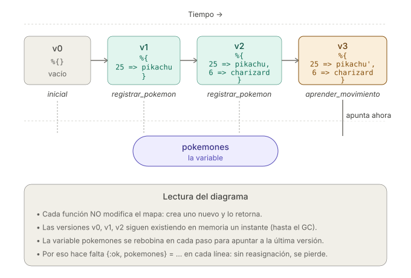

```
Universidad del Quindío
Programa de Ingeniería de Sistemas y Computación
Programación III - Structs
Docente: Carlos Andrés Florez V.
```

# Structs

Los **structs** en Elixir son mapas con un conjunto fijo de campos, asociados a un módulo. A diferencia de un mapa genérico, un struct declara por anticipado los campos que puede contener, lo que permite conocer su estructura a partir de su definición y detectar de inmediato el uso de un campo inexistente.

Se utilizan para representar entidades con una estructura definida, como usuarios, productos o pedidos.

## Diferencias entre Structs y Mapas

Internamente **un struct es un mapa**, así que ocupa la misma memoria y es igual de rápido. La diferencia está en que sus claves son fijas y pertenecen a un módulo, de modo que cada struct tiene siempre la forma esperada y un error al escribir una clave se detecta de inmediato.

### Comparación práctica

A continuación se muestra un ejemplo que intenta crear un struct con una clave no definida:

```elixir
defmodule Usuario do
  defstruct [:nombre, :edad]
end

defmodule Comparacion do
  def main do
    # Mapa: admite cualquier clave
    mapa = %{nombre: "Juan", edad: 30, telefono: "123"}
    IO.inspect(mapa)

    # Struct: solo admite las claves definidas
    usuario = %Usuario{nombre: "Juan", edad: 30, telefono: "123"}
    IO.inspect(usuario)
  end
end

Comparacion.main()
```

Al ejecutarlo, el programa no alcanza a mostrar nada y se detiene con el error `** (KeyError) key :telefono not found`, porque `telefono` no está definido en `Usuario`. Quite el teléfono del struct y vuelva a ejecutarlo para ver ambos valores.

---

## Ejemplo 1: Reproductor de música

Una aplicación de música necesita representar las canciones de una lista de reproducción. De cada canción interesa su título, su artista y su duración en segundos. Además, la aplicación debe llevar la cuenta de cuántas veces se ha reproducido cada canción y permitir marcarla como favorita.

Iremos construyendo la solución por versiones, agregando una capacidad nueva en cada paso.

### Versión 1: Definir el struct

La primera decisión es qué campos tendrá la canción. Para definir un struct se usa `defstruct` dentro de un módulo. La forma más simple es dar una **lista de átomos** con los nombres de los campos:

```elixir
defmodule Cancion do
  defstruct [:titulo, :artista, :duracion, :reproducciones, :favorita]
end

defmodule Reproductor do
  def main do
    cancion = %Cancion{titulo: "Bohemian Rhapsody", artista: "Queen", duracion: 355}
    IO.inspect(cancion)
  end
end

Reproductor.main()
# => %Cancion{titulo: "Bohemian Rhapsody", artista: "Queen", duracion: 355,
#             reproducciones: nil, favorita: nil}
```

> ⚠️ ****Importante:**** el struct debe crearse ****dentro de una función****. Si se crea por fuera de una función, se muestra el error `cannot access struct Cancion, the struct was not yet defined`.

El problema de esta versión es que `reproducciones` queda en `nil`. Una canción recién creada no se ha reproducido **cero** veces, no un valor indefinido, y tampoco es favorita. Con `nil` no podríamos ni siquiera sumarle 1 al contador.

### Versión 2: Valores por defecto

`defstruct` permite asignar un **valor inicial** a cada campo usando la sintaxis `campo: valor`:

```elixir
defmodule Cancion do
  defstruct titulo: "", artista: "", duracion: 0, reproducciones: 0, favorita: false
end
```

Sin embargo, aquí conviene distinguir dos tipos de campos: los que **siempre deben venir de afuera** (título, artista, duración) y los que **tienen un valor inicial natural** (reproducciones y favorita). Para eso existe la **forma mixta**, que combina la lista de átomos con los valores por defecto. Los campos sin valor por defecto se escriben primero:

```elixir
defmodule Cancion do
  defstruct [:titulo, :artista, :duracion, reproducciones: 0, favorita: false]
end
```

Con el mismo `Reproductor` de la Versión 1, que no cambia, la salida ya es otra:

```
%Cancion{
  titulo: "Bohemian Rhapsody",
  artista: "Queen",
  duracion: 355,
  reproducciones: 0,
  favorita: false
}
```

Ahora una canción nueva ya nace con el contador en cero y sin marcar como favorita, sin que quien la crea tenga que indicarlo.

> ⚠️ **Importante:** en la forma mixta, los campos **sin** valor por defecto deben ir **antes** que los que sí lo tienen. Escribir `defstruct [reproducciones: 0, :titulo]` produce un error de sintaxis.

### Versión 3: Acceder a los campos

Para mostrar la información de la canción necesitamos leer sus campos. Hay dos maneras de hacerlo:

```elixir
defmodule Reproductor do
  def main do
    cancion = %Cancion{titulo: "Bohemian Rhapsody", artista: "Queen", duracion: 355}

    # 1. Acceso con punto
    IO.puts("Título: #{cancion.titulo}")     # => Título: Bohemian Rhapsody
    IO.puts("Artista: #{cancion.artista}")   # => Artista: Queen

    # 2. Pattern matching: extrae varios campos a la vez
    %Cancion{titulo: titulo, duracion: duracion} = cancion
    IO.puts("#{titulo} dura #{div(duracion, 60)} minutos y #{rem(duracion, 60)} segundos")
    # => Bohemian Rhapsody dura 5 minutos y 55 segundos
  end
end
```

El **pattern matching** es especialmente útil cuando se necesitan varios campos, ya que evita repetir el nombre de la variable una y otra vez. Además, funciona en los parámetros de una función.

> ⚠️ **Importante:** a diferencia de los mapas, los structs **no admiten el acceso con corchetes**. Escribir `cancion[:titulo]` produce un `UndefinedFunctionError`. Use siempre el punto o el pattern matching.

### Versión 4: Actualizar campos (inmutabilidad)

Cada vez que suena una canción hay que incrementar su contador. Como los structs son **inmutables**, no se modifica la canción existente: se crea una nueva a partir de ella con la sintaxis de actualización `%{struct | campo: valor}`.

```elixir
defmodule Reproductor do
  def main do
    cancion = %Cancion{titulo: "Bohemian Rhapsody", artista: "Queen", duracion: 355}

    # Cada actualización produce un struct NUEVO
    sonando = %{cancion | reproducciones: cancion.reproducciones + 1}
    sonando = %{sonando | reproducciones: sonando.reproducciones + 1, favorita: true}

    IO.puts("Original:   #{cancion.reproducciones} reproducciones")  # => Original:   0
    IO.puts("Actualizada: #{sonando.reproducciones} reproducciones") # => Actualizada: 2
  end
end
```

La canción original **nunca cambia**: `cancion` sigue con cero reproducciones. Esto es lo mismo que vimos con los mapas y las listas, y es la razón por la que cada función que "modifica" un struct debe **retornar** la nueva versión.

La sintaxis `%{struct | campo: valor}` solo permite actualizar campos **que ya existen** en el struct. Si intenta `%{cancion | album: "A Night at the Opera"}`, obtendrá un error, porque `album` no está definido en `defstruct`.

Como un struct es un mapa, esta misma sintaxis sirve para actualizar un mapa, y también falla si la clave no existe en él.

### Versión 5: Campos obligatorios con `@enforce_keys`

Hay un hueco en el diseño actual: nada impide crear una canción vacía.

```elixir
cancion = %Cancion{}
# => %Cancion{titulo: nil, artista: nil, duracion: nil, reproducciones: 0, favorita: false}
```

En una aplicación de música, una canción sin título ni duración no es un dato válido. La directiva `@enforce_keys` declara qué campos son **obligatorios** al construir el struct:

```elixir
defmodule Cancion do
  @enforce_keys [:titulo, :artista, :duracion]
  defstruct [:titulo, :artista, :duracion, reproducciones: 0, favorita: false]
end
```

A partir de ahora, omitir cualquiera de esos tres campos impide que el programa compile:

```elixir
%Cancion{titulo: "Imagine"}
# ** (ArgumentError) the following keys must also be given when building
#    struct Cancion: [:artista, :duracion]
```

`@enforce_keys` **solo exige que el campo se proporcione**, pero no valida su contenido. Nada impide escribir `%Cancion{titulo: "", artista: "", duracion: -50}`. Para eso hace falta lógica de validación, que es lo que agregaremos en la siguiente versión.

### Versión 6 (final): Funciones en el módulo del struct

Hasta ahora, toda la lógica está en `Reproductor`, que además de utilizar la canción, implementa las operaciones necesarias para incrementar el contador y calcular los minutos. Si otro módulo necesitara trabajar con una canción, tendría que repetir esa lógica.

Es preferible que las funciones que operan sobre una canción se definan en el módulo `Cancion`, de modo que otros módulos solo necesiten invocar `Cancion.reproducir/1`, sin conocer cómo se modifican internamente sus datos. Esta versión incorpora además la validación que había quedado pendiente en la versión anterior.

```elixir
defmodule Cancion do
  @enforce_keys [:titulo, :artista, :duracion]
  defstruct [:titulo, :artista, :duracion, reproducciones: 0, favorita: false]

  # Constructor con validación: retorna {:ok, ...} o {:error, ...}
  def nueva(titulo, artista, duracion) when duracion > 0 do
    {:ok, %__MODULE__{titulo: titulo, artista: artista, duracion: duracion}}
  end

  def nueva(_titulo, _artista, _duracion), do: {:error, :duracion_invalida}

  # ---------------- Funciones de utilidad relacionadas con el struct ----------------

  def reproducir(%__MODULE__{reproducciones: n} = cancion) do
    %{cancion | reproducciones: n + 1}
  end

  def marcar_favorita(%__MODULE__{} = cancion), do: %{cancion | favorita: true}

  def duracion_formateada(%__MODULE__{duracion: segundos}) do
    minutos = div(segundos, 60)
    resto = rem(segundos, 60)
    "#{minutos}:#{String.pad_leading(Integer.to_string(resto), 2, "0")}"
  end

  def popular?(%__MODULE__{reproducciones: n}), do: n >= 3
end

defmodule Reproductor do
  def main do
    case Cancion.nueva("Bohemian Rhapsody", "Queen", 355) do
      {:ok, cancion} ->
        cancion =
          cancion
          |> Cancion.reproducir()
          |> Cancion.reproducir()
          |> Cancion.reproducir()
          |> Cancion.marcar_favorita()

        IO.puts("#{cancion.titulo} - #{cancion.artista} (#{Cancion.duracion_formateada(cancion)})")
        IO.puts("Reproducciones: #{cancion.reproducciones}")
        IO.puts("¿Es popular? #{Cancion.popular?(cancion)}")

      {:error, razon} ->
        IO.puts("No se pudo crear la canción: #{razon}")
    end

    IO.inspect(Cancion.nueva("Error", "Nadie", 0), label: "Duración inválida")
  end
end

Reproductor.main()
```

La salida es:

```
Bohemian Rhapsody - Queen (5:55)
Reproducciones: 3
¿Es popular? true
Duración inválida: {:error, :duracion_invalida}
```

`nueva/3` es un **constructor**, es decir, la función que se utiliza para crear canciones en lugar de construir `%Cancion{...}` directamente. Antes de crear el struct, verifica que la duración sea positiva; por esta razón no devuelve únicamente la canción, sino `{:ok, cancion}` o `{:error, :duracion_invalida}`. Quien la invoca distingue los dos casos con un `case`, como se hace en `main`.

Las demás funciones presentan tres aspectos adicionales:

1. `%__MODULE__{}` se refiere al **struct definido en el módulo actual.** Evita repetir el nombre y hace que el código siga funcionando si el módulo se renombra. También es válido escribir `%Cancion{}` de forma explícita.
2. Las funciones reciben el struct por pattern matching (`%__MODULE__{reproducciones: n} = cancion`). De esta forma se extrae el campo necesario y, al mismo tiempo, se **garantiza que el argumento sea una canción**. Si se pasara un mapa cualquiera, la función fallaría de inmediato.
3. `reproducir/1` se puede encadenar con el operador pipe, porque **recibe una canción y retorna una canción**. Es la forma habitual de trabajar con datos inmutables en Elixir, mediante una secuencia de transformaciones en la que cada paso produce una nueva versión del dato.

---

## Ejemplo 2: Pokédex de un entrenador

Un entrenador Pokémon quiere llevar el control de los Pokémon que ha capturado y de los movimientos que cada uno conoce. Cada Pokémon tiene un número de Pokédex, un nombre, un nivel y una lista de movimientos aprendidos. Un Pokémon solo puede conocer hasta **cuatro movimientos** al mismo tiempo.

Se requiere implementar las siguientes funcionalidades:
- Registrar un nuevo Pokémon y agregarlo a una colección
- Actualizar la información de un Pokémon
- Liberar un Pokémon
- Enseñarle un movimiento a un Pokémon
- Hacer que un Pokémon olvide un movimiento
- Buscar un Pokémon por su número de Pokédex
- Listar todos los Pokémon

### 1. Crear el struct `Pokemon`

El módulo `Pokemon` sigue el mismo esquema que la versión final de `Cancion`. Tiene campos obligatorios, un constructor con validación y funciones que reciben el struct por pattern matching.

```elixir
defmodule Pokemon do
  @enforce_keys [:nombre, :nivel]
  defstruct [:nombre, :nivel, movimientos: []]

  # El límite de movimientos es una regla del dominio, no un número suelto en el código
  @max_movimientos 4

  # Constructor con validación
  def nuevo(nombre, nivel) when nivel > 0 and nivel <= 100 do
    {:ok, %__MODULE__{nombre: nombre, nivel: nivel}}
  end

  def nuevo(_nombre, _nivel), do: {:error, :nivel_invalido}

  # --------------------- Funciones de utilidad relacionadas con el struct ---------------------

  def aprender_movimiento(%__MODULE__{movimientos: movimientos} = pokemon, movimiento) do
    cond do
      conoce_movimiento?(pokemon, movimiento) -> {:error, :ya_lo_conoce}
      length(movimientos) >= @max_movimientos -> {:error, :movimientos_llenos}
      true -> {:ok, %{pokemon | movimientos: [movimiento | movimientos]}}
    end
  end

  def olvidar_movimiento(%__MODULE__{movimientos: movimientos} = pokemon, movimiento) do
    {:ok, %{pokemon | movimientos: List.delete(movimientos, movimiento)}}
  end

  def conoce_movimiento?(%__MODULE__{movimientos: movimientos}, movimiento), do: Enum.member?(movimientos, movimiento)

end
```

En `Cancion`, `reproducir/1` siempre podía sumar una reproducción, así que retornaba la canción directamente. Aprender un movimiento, en cambio, puede fallar, por eso `aprender_movimiento/2` retorna `{:ok, pokemon}` o `{:error, razon}`. Además tiene **dos motivos distintos de falla**, y por eso se usa `cond` en lugar de `if`. Cada rama devuelve un error diferente y quien llama a la función puede distinguirlos.

### 2. Crear el módulo `Pokedex`

El módulo `Pokedex` va a tener la lógica para manejar los Pokémon capturados. Se usará un mapa para almacenarlos, porque da acceso rápido a los datos mediante una clave única, el número de Pokédex. El mapa empieza vacío, `%{}`.

### 3. Implementar las funcionalidades

Las siguientes funciones van dentro del módulo `Pokedex` y manejan los Pokémon y los movimientos que aprenden.

Ya vimos que las funciones de `Pokemon` no modifican el struct que reciben, sino que retornan uno nuevo. Con el mapa `pokemones` pasa lo mismo. Como el **mapa es inmutable**, cada función del `Pokedex` que lo modifica debe retornar una nueva versión del mapa con los cambios aplicados.

#### Registrar un nuevo Pokémon

Registrar un Pokémon es agregar una clave nueva al mapa `pokemones`. Aquí no sirve la sintaxis `%{pokemones | numero => pokemon}`, porque falla cuando la clave no existe, y un Pokémon nuevo todavía no está en el mapa. Para agregar claves se usa `Map.put/3`, que recibe el mapa, la clave y el valor, y devuelve un mapa nuevo con la clave agregada.

Una versión simple de la función para registrar un Pokémon sería:

```elixir
def registrar_pokemon(pokemones, numero, nombre, nivel) do
  nuevo_pokemon = %Pokemon{nombre: nombre, nivel: nivel, movimientos: []}
  # Retorna un nuevo mapa con el Pokémon agregado
  Map.put(pokemones, numero, nuevo_pokemon)
end
```

Pero vamos a usar la función `Pokemon.nuevo/2` para crear el struct y validar los datos. Luego, se verifica si el número ya existe en el mapa antes de agregarlo. Si pasa las validaciones, se agrega al mapa y se retorna la nueva versión.

```elixir
def registrar_pokemon(pokemones, numero, nombre, nivel) do
  case Pokemon.nuevo(nombre, nivel) do
    {:ok, nuevo_pokemon} ->
      if Map.has_key?(pokemones, numero) do
        # Si el número ya existe, no se agrega y se retorna un error
        {:error, :numero_duplicado}
      else
        # Retorna un nuevo mapa con el Pokémon agregado
        {:ok, Map.put(pokemones, numero, nuevo_pokemon)}
      end
    {:error, razon} ->
      {:error, razon}
  end
end
```

Cada función retorna una tupla `{:ok, nuevo_mapa}` o `{:error, razon}`, de modo que el error viaja explícito hacia quien la llamó.

#### Obtener un Pokémon por su número

El acceso a un Pokémon se hace mediante su número de Pokédex, que es la clave en el mapa.

```elixir
def obtener_pokemon(pokemones, numero) do
  case Map.get(pokemones, numero) do
    nil -> {:error, :no_encontrado}
    pokemon -> {:ok, pokemon}
  end
end
```

#### Actualizar la información de un Pokémon

Se busca el Pokémon por su número. Si existe, se actualizan los campos necesarios y se vuelve a insertar en el mapa. Este es el caso típico cuando un Pokémon sube de nivel o se le cambia el apodo.

```elixir
def actualizar_pokemon(pokemones, numero, nombre, nivel) do
  case Map.get(pokemones, numero) do
    nil ->
      {:error, :no_encontrado}
    pokemon ->
      actualizado = %{pokemon | nombre: nombre, nivel: nivel}
      # Retorna un nuevo mapa con el Pokémon actualizado
      {:ok, Map.put(pokemones, numero, actualizado)}
  end
end
```

La función `Map.put/3` reemplaza el valor existente si la clave ya está en el mapa, por lo que no es necesario eliminar el Pokémon antes de actualizarlo.

#### Liberar un Pokémon

Se usa `Map.delete/2` para eliminar el Pokémon del mapa, y se retorna el nuevo mapa sin él. Si el número no existe, se retorna `{:error, :no_encontrado}`.

```elixir
def liberar_pokemon(pokemones, numero) do
  if Map.has_key?(pokemones, numero) do
    # Retorna un nuevo mapa sin el Pokémon liberado
    {:ok, Map.delete(pokemones, numero)}
  else
    {:error, :no_encontrado}
  end
end
```

#### Enseñarle un movimiento a un Pokémon

Se busca el Pokémon por su número. Si existe, se agrega el movimiento a su lista haciendo uso de la función `Pokemon.aprender_movimiento/2`. Se retorna el nuevo mapa con el Pokémon actualizado.

```elixir
def aprender_movimiento(pokemones, numero, movimiento) do
  case Map.get(pokemones, numero) do
    nil ->
      {:error, :no_encontrado}
    pokemon ->
      case Pokemon.aprender_movimiento(pokemon, movimiento) do
        {:ok, actualizado} ->
          # Retorna un nuevo mapa con el Pokémon actualizado
          {:ok, Map.put(pokemones, numero, actualizado)}
        {:error, razon} ->
          {:error, razon}
      end
  end
end
```

El `Pokedex` no sabe **por qué** falló el aprendizaje. El módulo `Pokemon` es el dueño de esa regla y devuelve `:ya_lo_conoce` o `:movimientos_llenos`; el `Pokedex` simplemente deja pasar la razón hacia arriba.

#### Hacer que un Pokémon olvide un movimiento

Al igual que al aprender, se busca el Pokémon y se elimina el movimiento de su lista usando `Pokemon.olvidar_movimiento/2`. Luego se retorna el mapa actualizado.

```elixir
def olvidar_movimiento(pokemones, numero, movimiento) do
  case Map.get(pokemones, numero) do
    nil ->
      {:error, :no_encontrado}
    pokemon ->
      # Pokemon.olvidar_movimiento/2 siempre retorna {:ok, ...}, así que en lugar de un
      # `case` de una sola rama se usa pattern matching directo sobre el resultado
      {:ok, actualizado} = Pokemon.olvidar_movimiento(pokemon, movimiento)
      # Retorna un nuevo mapa con el Pokémon actualizado
      {:ok, Map.put(pokemones, numero, actualizado)}
  end
end
```

El uso de `=` aquí no solo es más corto. Al ser una coincidencia de patrones, si algún día `Pokemon.olvidar_movimiento/2` empezara a retornar un error, el programa fallaría de inmediato con un `MatchError` señalando la línea exacta, en lugar de continuar con un valor inesperado.

#### Listar todos los Pokémon

Accedemos a todos los valores del mapa, que son los structs de tipo `Pokemon`.

```elixir
def listar_pokemones(pokemones), do: Map.values(pokemones)
```

#### Otras funcionalidades (opcional)

También se pueden implementar funciones para obtener estadísticas o filtrar los Pokémon que conocen un movimiento determinado.

```elixir
# Devuelve la lista de Pokémon que conoce un movimiento específico
def pokemones_con_movimiento(pokemones, movimiento) do
  pokemones
  |> Map.values()
  |> Enum.filter(&Pokemon.conoce_movimiento?(&1, movimiento))
end

# Devuelve estadísticas básicas de la Pokédex
def obtener_estadisticas(pokemones) do
  %{
    total: map_size(pokemones),
    nivel_promedio: calcular_nivel_promedio(pokemones)
  }
end

defp calcular_nivel_promedio(pokemones) when map_size(pokemones) == 0, do: 0
defp calcular_nivel_promedio(pokemones) do
  niveles = pokemones |> Map.values() |> Enum.map(& &1.nivel)
  Enum.sum(niveles) / length(niveles)
end
```

### 4. Probar las funcionalidades

Para probar las funcionalidades, se invocan las funciones dentro de la función `main` del módulo `Pokedex`, con datos de ejemplo, y al final del archivo se llama a `Pokedex.main()`.

```elixir
defmodule Pokedex do
  def main do
    # Inicializar
    pokemones = %{}

    # Registrar Pokémon
    {:ok, pokemones} = registrar_pokemon(pokemones, 25, "Pikachu", 12)
    {:ok, pokemones} = registrar_pokemon(pokemones, 6, "Charizard", 36)
    {:ok, pokemones} = registrar_pokemon(pokemones, 9, "Blastoise", 34)

    # Intentar registrar duplicado
    case registrar_pokemon(pokemones, 25, "Otro Pikachu", 5) do
      {:error, :numero_duplicado} ->
        IO.puts("No se puede registrar: numero de Pokedex duplicado")
      {:ok, _} ->
        IO.puts("Pokemon registrado")
    end

    # Enseñar movimientos
    {:ok, pokemones} = aprender_movimiento(pokemones, 25, "Impactrueno")
    {:ok, pokemones} = aprender_movimiento(pokemones, 25, "Ataque Rapido")
    {:ok, pokemones} = aprender_movimiento(pokemones, 6, "Lanzallamas")

    # Intentar enseñar un movimiento que ya conoce
    case aprender_movimiento(pokemones, 25, "Impactrueno") do
      {:error, :ya_lo_conoce} ->
        IO.puts("Ese Pokemon ya conoce el movimiento")
      {:ok, _} ->
        IO.puts("Movimiento aprendido")
    end

    # Intentar enseñar un quinto movimiento
    {:ok, pokemones} = aprender_movimiento(pokemones, 25, "Cola Ferrea")
    {:ok, pokemones} = aprender_movimiento(pokemones, 25, "Rayo")

    case aprender_movimiento(pokemones, 25, "Placaje") do
      {:error, :movimientos_llenos} ->
        IO.puts("El Pokemon ya conoce cuatro movimientos, debe olvidar uno primero")
      {:ok, _} ->
        IO.puts("Movimiento aprendido")
    end

    # Mostrar información
    case obtener_pokemon(pokemones, 25) do
      {:ok, pokemon} ->
        IO.puts("\n=== Pokemon 25 ===")
        IO.inspect(pokemon)
      {:error, _} ->
        IO.puts("Pokemon no encontrado")
    end

    # Estadísticas
    stats = obtener_estadisticas(pokemones)
    IO.puts("\n=== Estadisticas ===")
    IO.inspect(stats)

    # Listar los Pokémon que conocen un movimiento
    IO.puts("\n=== Pokemon que conocen Impactrueno ===")
    electricos = pokemones_con_movimiento(pokemones, "Impactrueno")
    Enum.each(electricos, &IO.puts(&1.nombre))

    # Actualizar Pokémon
    {:ok, pokemones} = actualizar_pokemon(pokemones, 25, "Pikachu", 13)

    # Liberar Pokémon
    {:ok, pokemones} = liberar_pokemon(pokemones, 9)

    # Mostrar todos
    IO.inspect(listar_pokemones(pokemones))
  end

  # Todas las funciones de Pokedex implementadas aquí...

end

Pokedex.main()
```

En `main`, cada línea de la forma `{:ok, pokemones} = ...` recibe un mapa nuevo y lo asocia a la variable `pokemones`, que en la línea siguiente se pasa a la próxima operación. El mapa anterior no se modifica. El siguiente diagrama muestra, de forma simplificada, las primeras versiones del mapa al registrar a Pikachu y a Charizard y al enseñarle un movimiento a Pikachu:



Cada operación produce un mapa nuevo, y la variable `pokemones` pasa a referirse a la última versión. En la versión `v3`, `pikachu'` es además un struct nuevo con el movimiento ya aprendido.

---

## Ejercicios propuestos

Realice los siguientes ejercicios para practicar el uso de structs y la gestión de datos en Elixir.

### Ejercicio 1: Sistema de Inventario de Productos

Implementar un struct `Producto` con los campos `codigo`, `nombre`, `precio` y `cantidad`. Luego, crear un módulo `Inventario` que permita agregar, actualizar, eliminar y listar productos en un inventario. Utilizar un mapa para almacenar los productos, donde la clave sea el código del producto. 

Tenga en cuenta los siguientes requisitos:
- Validar que no se pueda agregar un producto con código repetido.
- Validar que el precio y la cantidad no sean negativos.
- Validar que el código del producto tenga una longitud máxima de 5 caracteres.
- Validar que la cantidad del producto sea un número entero.

Además, se requiere calcular los siguientes reportes:
- Listado de productos cuyo nombre contenga al menos dos vocales. Devolver una tupla con su código y nombre por cada producto que cumpla con esta condición.
- Listado de productos cuyo nombre comience y termine con la misma letra.
- Listado de productos por debajo de un precio dado.
- Retornar los tres productos más caros del inventario.
- Retornar una cadena de caracteres con el nombre y precio de cada producto, separados por comas de aquellos productos cuyo precio esté entre dos valores dados.
- Crear un reporte de productos agrupados por rango de precio, ej.: Menores de \$50000, Entre \$50000 y \$100000, Mayores de \$100000.

### Ejercicio 2: Sistema de Biblioteca

Diseñe e implemente un sistema de biblioteca con los siguientes structs:

#### Requisitos

1. **Struct `Libro`**:
   - Campos: ISBN, título, autor, año, género, disponible
   - ISBN debe ser obligatorio y único
   - Funciones: prestar, devolver, es_clasico? (más de 50 años)

2. **Struct `Usuario`**:
   - Campos: id, nombre, email, libros_prestados
   - Email debe ser obligatorio
   - Funciones: puede_prestar? (máximo 3 libros), agregar_prestamo, quitar_prestamo

3. **Struct `Prestamo`**:
   - Campos: id, libro_isbn, usuario_id, fecha_prestamo, fecha_devolucion
   - Calcular días de retraso

4. **Módulo `Biblioteca`**:
   - Gestionar catálogo de libros
   - Gestionar usuarios
   - Registrar préstamos
   - Generar reportes:
     * Libros más prestados
     * Usuarios con préstamos vencidos
     * Libros por género
     * Disponibilidad de libros

#### Estructura sugerida

```elixir
defmodule Libro do
  @enforce_keys [:isbn, :titulo, :autor]
  defstruct [:isbn, :titulo, :autor, :anio, :genero, disponible: true]
  
  # Implementar funciones...
end

defmodule Usuario do
  @enforce_keys [:id, :nombre, :email]
  defstruct [:id, :nombre, :email, libros_prestados: []]
  
  # Implementar funciones...
end

defmodule Prestamo do
  @enforce_keys [:id, :libro_isbn, :usuario_id, :fecha_prestamo]
  defstruct [:id, :libro_isbn, :usuario_id, :fecha_prestamo, fecha_devolucion: nil]
  
  # Implementar funciones...
end

defmodule Biblioteca do
  # Estado: %{libros: %{}, usuarios: %{}, prestamos: %{}}
  
  # Implementar funciones...
end
```

#### Datos de prueba

Use el siguiente catálogo para probar su implementación. Recuerde construir los structs **dentro de una función**, como se hizo en el Ejemplo 1:

```elixir
defmodule Principal do
  def main do
    libros = [
      %Libro{isbn: "978-1", titulo: "Cien años de soledad", autor: "García Márquez",
             anio: 1967, genero: "novela"},
      %Libro{isbn: "978-2", titulo: "El Quijote", autor: "Cervantes",
             anio: 1605, genero: "novela"},
      %Libro{isbn: "978-3", titulo: "Clean Code", autor: "Robert C. Martin",
             anio: 2008, genero: "tecnología"},
      %Libro{isbn: "978-4", titulo: "El Principito", autor: "Saint-Exupéry",
             anio: 1943, genero: "infantil"}
    ]

    usuarios = [
      %Usuario{id: 1, nombre: "Ana", email: "ana@uniquindio.edu.co"},
      %Usuario{id: 2, nombre: "Luis", email: "luis@uniquindio.edu.co"}
    ]

    # Continúe aquí con las pruebas de su implementación
    IO.inspect(libros)
    IO.inspect(usuarios)
  end
end

Principal.main()
```

Con estos datos hay libros de distintas épocas, suficientes para probar `es_clasico?/1` (más de 50 años). En 2026 lo son los tres primeros (*El Quijote* de 1605, *Cien años de soledad* de 1967 y *El Principito* de 1943), mientras que *Clean Code* de 2008 no. Para calcular la antigüedad puede usar `Date.utc_today().year`, en lugar de escribir el año actual directamente en el código.

### Ejercicio 3: Sistema Bancario

Un banco necesita un sistema sencillo para administrar las cuentas de sus clientes. Cada cuenta tiene un número de cuenta, el nombre del titular y un saldo.

#### Requisitos

1. **Struct `Cuenta`**:
   - Campos: `numero`, `titular`, `saldo` (con valor por defecto `0`).
   - `numero` y `titular` deben ser obligatorios (use `@enforce_keys`).
   - Funciones dentro del módulo `Cuenta`:
     * `nueva/2`: crea una cuenta a partir del número y el titular, validando que el titular no esté vacío. Debe retornar `{:ok, cuenta}` o `{:error, razon}`.
     * `depositar/2`: aumenta el saldo. No se permiten montos negativos o cero.
     * `retirar/2`: disminuye el saldo, pero solo si hay fondos suficientes. Si no, debe retornar `{:error, :fondos_insuficientes}`.

2. **Módulo `Banco`**:
   - Almacena las cuentas en un **mapa**, usando el número de cuenta como clave.
   - Recuerde que el mapa es **inmutable**: cada operación que modifica una cuenta debe retornar una nueva versión del mapa.
   - Funciones requeridas:
     * `abrir_cuenta/3`: crea una cuenta y la agrega al banco. Valide que el número de cuenta no esté repetido.
     * `consultar_saldo/2`: retorna el saldo de una cuenta dada o `{:error, :no_encontrada}`.
     * `depositar/3` y `retirar/3`: realizan la operación sobre la cuenta indicada y devuelven el mapa actualizado.
     * `transferir/4`: transfiere un monto de una cuenta origen a una cuenta destino. La operación solo debe completarse si **ambas** cuentas existen y la cuenta origen tiene fondos suficientes.

#### Reportes

Además, implemente las siguientes consultas usando el módulo `Enum`:

- Obtener el saldo total que administra el banco (suma de todos los saldos).
- Encontrar la cuenta con mayor saldo (devuelva titular y saldo).
- Listar los titulares de las cuentas cuyo saldo sea mayor a un valor dado.

> **⚠️ Sugerencia:** Igual que en el ejemplo de la Pokédex, haga que cada función retorne tuplas `{:ok, ...}` o `{:error, razon}` para dejar los errores explícitos, y delegue en las funciones del módulo `Cuenta` la lógica propia de cada cuenta.

---

## Para la próxima clase

- Investigar qué es un protocolo en Elixir y cómo se relaciona con los structs.
- Investigar qué es la evaluación perezosa (*lazy evaluation*) y por qué es útil.
- Lea acerca del módulo `Stream` en la documentación oficial de Elixir.

