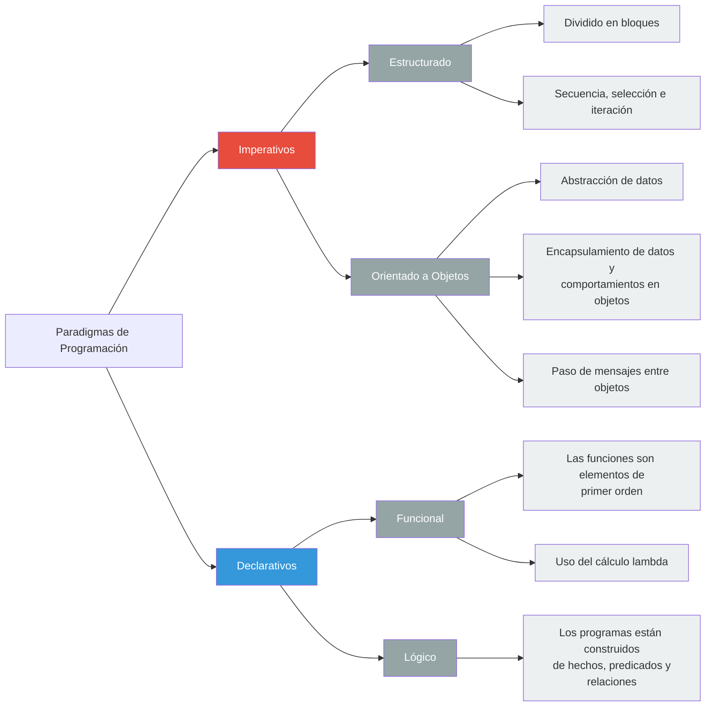

```
Universidad del Quindío
Programa de Ingeniería de Sistemas y Computación
Programación III - Paradigmas de programación
Docente: Carlos Andrés Florez V.
```
# Paradigmas de programación

Un **paradigma de programación** es un enfoque o estilo de pensar y estructurar el código para resolver problemas con un lenguaje de programación. Hay varios paradigmas, cada uno con sus propias características y enfoques:




Breve descripción de cada paradigma:

- **Programación imperativa:** Se centra en cómo se debe realizar una tarea, utilizando instrucciones secuenciales y cambios de estado. Ejemplos: C, Java.
- **Programación declarativa:** Se centra en qué se quiere lograr, sin especificar cómo. Ejemplos: SQL, HTML.
- **Programación funcional:** Se basa en el uso de funciones puras y evita el estado mutable. La programación funcional es un tipo de **programación declarativa**. Ejemplos: Haskell, Elixir.
- **Programación orientada a objetos:** Organiza el código en torno a "objetos" que combinan datos y comportamiento. La programación orientada a objetos es un tipo de **programación imperativa**. Ejemplos: Java, C++, C#.

## Ejemplo 

A continuación se presentan ejemplos de cada paradigma utilizando el mismo problema: sumar los números pares de una lista.

### Imperativo

En el siguiente ejemplo en Java, se utiliza un enfoque imperativo para sumar los números pares de una lista, se define un conjunto de instrucciones que modifican el estado de una variable para obtener el resultado:

```java
import java.util.List;

public class Imperativo {
    public static void main(String[] args) {
        List<Integer> numeros = List.of(1, 2, 3, 4, 5);
        int sumaPares = 0;
        for (int n : numeros) {
            if (n % 2 == 0) {
                sumaPares += n;
            }
        }
        System.out.println(sumaPares); // 6
    }
}
```

### Orientada a objetos

En el siguiente ejemplo en Java, se utiliza un enfoque orientado a objetos para sumar los números pares de una lista, encapsulando los datos y el comportamiento en una clase:

```java
import java.util.List;

class Calculadora {
    private List<Integer> numeros;

    public Calculadora(List<Integer> numeros) {
        this.numeros = numeros;
    }

    public int sumarPares() {
        int suma = 0;
        for (int n : numeros) {
            if (n % 2 == 0) {
                suma += n;
            }
        }
        return suma;
    }
}

public class Programa {
    public static void main(String[] args) {
        Calculadora calc = new Calculadora(List.of(1, 2, 3, 4, 5));
        System.out.println(calc.sumarPares()); // 6
    }
}

```

### Funcional

En el siguiente ejemplo en Java, se utiliza un enfoque funcional para sumar los números pares de una lista, utilizando funciones de orden superior y expresiones lambda para lograr el resultado sin modificar el estado:

```java
import java.util.List;

public class Funcional {
    public static void main(String[] args) {
        List<Integer> numeros = List.of(1, 2, 3, 4, 5);
        int sumaPares = numeros.stream()
                               .filter(n -> n % 2 == 0)
                               .mapToInt(n -> n)
                               .sum();
        System.out.println(sumaPares); // 6
    }
}
```

Java es **multi-paradigma**: permite mezclar programación imperativa, orientada a objetos y funcional, **pero su ADN es orientado a objetos e imperativo**. Lo funcional es un “extra” para mejorar expresividad y concisión, no la filosofía central del lenguaje, por lo que su uso es menos común y a menudo se limita a casos específicos donde se busca una mayor claridad o concisión en el código.

A diferencia de Java, Elixir es un lenguaje **funcional puro**. Todo en Elixir se basa en funciones, y no hay conceptos de estado mutable o clases como en la programación orientada a objetos. Esto significa que los desarrolladores de Elixir deben adoptar un enfoque diferente al resolver problemas. 

---

## Para la próxima clase

Para la próxima clase, se sugiere investigar qué lenguajes son más adecuados para la programación funcional, imperativa, orientada a objetos y declarativa. También se puede explorar cómo estos lenguajes implementan sus respectivos paradigmas y qué características los hacen destacar en cada enfoque.
