```
Universidad del Quindío
Programa de Ingeniería de Sistemas y Computación
Programación III - Manejo de archivos
Docente: Carlos Andrés Florez V.
```

# Manejo de archivos

El manejo de archivos en Elixir se realiza principalmente a través de tres módulos: `File`, `IO` y `Path`. Con ellos es posible leer, escribir y manipular tanto archivos como directorios siguiendo un enfoque funcional y seguro. A lo largo de esta guía exploraremos sus funciones más comunes mediante ejemplos prácticos.

Este enfoque es coherente con los principios funcionales que hemos visto a lo largo del curso. Los datos que se leen son **inmutables**, igual que cualquier otro valor del lenguaje. La mayoría de las operaciones devuelven una **tupla de resultado** (`{:ok, resultado}` o `{:error, razón}`), lo que permite manejar tanto el éxito como el error de forma explícita mediante **pattern matching**, sin recurrir a excepciones. Para los casos en que se prefiere que un fallo detenga el programa, existen variantes terminadas en `!` que **lanzan una excepción** en lugar de devolver una tupla. Por último, cuando se trabaja con archivos grandes, los **streams** permiten procesarlos de forma perezosa, leyéndolos por partes sin cargarlos completos en memoria.

# Módulo `File`

El módulo `File` agrupa las funciones para interactuar con el sistema de archivos. A continuación, una referencia rápida de las más usadas; las principales las veremos en detalle, con ejemplos, en las siguientes secciones.

- `File.read/1`: lee todo el contenido de un archivo (`{:ok, binario}` o `{:error, razón}`).
- `File.write/2`: escribe contenido en un archivo (lo sobrescribe).
- `File.stream!/1`: crea un stream para leer un archivo línea por línea (ideal para archivos grandes).
- `File.open/2` y `File.close/1`: abren y cierran un archivo para una lectura/escritura más controlada.
- `File.exists?/1`, `File.ls/1`, `File.dir?/1`: consultan si un archivo existe, el contenido de un directorio y si una ruta es una carpeta.

> ⚠️ **Nota:** Casi toda función tiene una variante con `!` (`File.read!/1`, `File.write!/2`, …) que lanza una excepción en lugar de devolver una tupla. Para el resto de operaciones (copiar, mover, borrar, permisos, crear directorios, etc.) consulte la [documentación oficial de File](https://hexdocs.pm/elixir/File.html).

---

# Leer archivos

La forma más sencilla de leer un archivo es usando `File.read/1`. Esta función, como muchas otras en Elixir, sigue la convención de devolver una tupla para indicar el éxito o el fracaso de la operación.

- Si la lectura es **exitosa**, devuelve `{:ok, contenido}`, donde `contenido` es un binario con los datos del archivo.
- Si ocurre un **error** (por ejemplo, el archivo no existe), devuelve `{:error, razón}`, donde `razón` es un átomo que describe el error.

## Códigos de error comunes

La función `File.read/1` puede devolver varios códigos de error dependiendo de la situación. Algunos de los más comunes son:

- `:enoent`: El archivo no existe (No such file or directory)
- `:eacces`: Permiso denegado
- `:eisdir`: Es un directorio, no un archivo
- `:enotdir`: Se esperaba un directorio, pero no lo es
- `:enomem`: Memoria insuficiente

## Ejemplo básico

A continuación, un ejemplo de cómo usar `File.read/1` con pattern matching para manejar los resultados de manera elegante:

```elixir
defmodule Lector do
  def leer_archivo(ruta) do
    # Se intenta leer el archivo y se maneja el resultado con pattern matching
    case File.read(ruta) do
      {:ok, contenido} ->
        IO.puts("Contenido del archivo:")
        IO.puts(contenido)
      {:error, :enoent} ->
        IO.puts("Error: El archivo no existe")
      {:error, :eacces} ->
        IO.puts("Error: Sin permisos para leer el archivo")
      {:error, razon} ->
        IO.puts("Error al leer el archivo: #{razon}")
    end
  end
end

Lector.leer_archivo("mi_archivo.txt")
```

# Escribir archivos

Para escribir en un archivo, se puede usar `File.write/2` o `File.write/3`. 

## Escritura simple (sobrescribe)

La forma más sencilla de escribir en un archivo es usando `File.write/2`, que sobrescribe el contenido existente:

```elixir
defmodule Escritor do
  def escribir_archivo(ruta, contenido) do
    case File.write(ruta, contenido) do
      :ok ->
        IO.puts("Archivo escrito exitosamente")
      {:error, razon} ->
        IO.puts("Error al escribir el archivo: #{razon}")
    end
  end
end

Escritor.escribir_archivo("nuevo_archivo.txt", "Este es el contenido.")
```

## Escritura con opciones (append, permisos)

Puede especificar opciones adicionales al escribir, como `:append` para agregar al final del archivo en lugar de sobrescribirlo, o `:utf8` para asegurarse de que el contenido se escriba como texto UTF-8 (codificación que soporta caracteres especiales).

```elixir
# Agregar al final sin sobrescribir
File.write("log.txt", "Nueva entrada\n", [:append])

# Múltiples opciones
File.write("config.txt", "datos", [:append, :utf8])

# Crear directorio si no existe antes de escribir
def escribir_seguro(ruta, contenido) do
  directorio = Path.dirname(ruta)
  File.mkdir_p(directorio)
  File.write(ruta, contenido)
end
```

---

# Módulo `IO` para archivos abiertos

Hasta ahora hemos usado `File.read/1` y `File.write/2`, que leen o escriben **todo el archivo de una sola vez**. El módulo `IO`, en cambio, permite trabajar con un archivo **previamente abierto**, leyendo o escribiendo **poco a poco** (por ejemplo, línea por línea) mientras se mantiene abierto entre operaciones.

Este es el mismo módulo que ya usamos para interactuar con la consola (`IO.puts/1`, `IO.gets/1`): en realidad `IO` opera sobre **dispositivos**, y tanto la consola como un archivo abierto son dispositivos válidos.

Para usarlo, primero se abre el archivo con `File.open/2`, indicando el **modo** de apertura:

- `:read`: abrir solo para lectura.
- `:write`: abrir para escritura (crea el archivo o lo sobrescribe).
- `:append`: abrir para escritura agregando al final.

`File.open/2` devuelve `{:ok, dispositivo}` (donde `dispositivo` es una referencia al archivo abierto) o `{:error, razón}`. Una vez terminadas las operaciones, **es importante cerrar el archivo** con `File.close/1` para liberar el recurso.

A continuación, un ejemplo que abre un archivo, escribe dos líneas, lo cierra y luego lo vuelve a abrir para leerlas:

```elixir
# Abrir en modo escritura, escribir dos líneas y cerrar
{:ok, archivo} = File.open("datos.txt", [:write])
IO.puts(archivo, "Línea 1") # El primer argumento indica DÓNDE escribir (el archivo)
IO.puts(archivo, "Línea 2")
File.close(archivo)         # Siempre cerrar después de usar

# Abrir en modo lectura y leer línea por línea
{:ok, archivo} = File.open("datos.txt", [:read])
linea1 = IO.read(archivo, :line) # Lee la primera línea
linea2 = IO.read(archivo, :line) # Lee la segunda línea
File.close(archivo)

# Imprimir en consola las líneas leídas
IO.puts("Primera línea: #{linea1}")
IO.puts("Segunda línea: #{linea2}")
```

Observe que las funciones de `IO` reciben el **dispositivo como primer argumento**: `IO.puts(archivo, "...")` escribe en el archivo, mientras que `IO.puts("...")` (sin dispositivo) escribe en la consola.

## ¿Cuándo usar `IO` en lugar de `File`?

Use `File.read/1` o `File.write/2` cuando quiera leer o escribir el contenido **completo** de una sola vez: es lo más simple y lo más habitual. Use `File.open/2` junto con el módulo `IO` cuando necesite **control fino**: leer o escribir por partes, realizar varias operaciones sobre el mismo archivo sin reabrirlo, o avanzar línea por línea de forma manual. Para recorrer archivos muy grandes de principio a fin, sin embargo, lo más idiomático es usar **streams** (`File.stream!/1`), que veremos en la siguiente sección.

---

# Procesar archivos grandes con Streams

Cuando se trabaja con archivos muy grandes, no es eficiente cargarlos completamente en memoria. En su lugar, se puede usar `File.stream!/1` para crear un **stream**. Un stream es una **colección "perezosa" (lazy)**, lo que significa que el archivo se lee pieza por pieza (generalmente línea por línea) solo cuando se necesita.

## ¿Cómo funciona un Stream?

Un stream es como una “receta” para generar una secuencia de datos, no los datos en sí. Cuando se pasa un stream a una función del módulo `Enum` (como `Enum.count`, `Enum.map`, etc.), ocurre lo siguiente:

1. `Enum` pide el **primer elemento** al stream (la primera línea del archivo).
2. Stream lee **solo esa línea** del archivo y se la entrega a `Enum`.
3. `Enum` procesa ese elemento aplicando alguna función (por ejemplo `Enum.count/1`, `Enum.map/2`, `Enum.to_list/1`, etc.).
4. `Enum` pide el **segundo elemento** al stream.
5. Stream lee la **segunda línea** y la entrega a `Enum`.
6. Se repite hasta que el stream se agota (llega al final del archivo).

De esta manera, en ningún momento se carga el archivo completo en memoria. `Enum` "tira" de los datos del stream uno por uno, haciéndolo increíblemente eficiente para archivos de cualquier tamaño.

### Comparación entre `File.read/1` y `File.stream!/1`

En el siguiente diagrama se muestra la diferencia y el impacto en la memoria al usar `File.read/1` vs `File.stream!/1`:



## Ejemplos de uso de Streams

A continuación, algunos ejemplos prácticos de cómo usar streams para procesar archivos grandes.

### Contar líneas

En este ejemplo, contamos el número de líneas en un archivo grande sin cargar todo el archivo en memoria:

```elixir
defmodule ContadorLineas do
  def contar(ruta) do
    ruta
    |> File.stream!()
    |> Enum.count()
  end
end

numero_lineas = ContadorLineas.contar("archivo_grande.txt")
IO.puts("El archivo tiene #{numero_lineas} líneas")
```

### Procesar y transformar líneas

En este ejemplo, se procesa un archivo por medio de un stream, y se aplica alguna función de transformación, filtrado o mapeo:

```elixir
defmodule ProcesadorArchivo do
  def mayusculas(ruta_entrada, ruta_salida) do
    File.stream!(ruta_entrada)
    |> Stream.map(&String.upcase/1) # Convierte cada línea a mayúsculas
    |> Enum.into(File.stream!(ruta_salida, [:write])) # Escribe en nuevo archivo cada línea transformada
  end

  def filtrar_lineas_largas(ruta, min_longitud) do
    File.stream!(ruta)
    |> Stream.filter(fn linea -> String.length(linea) > min_longitud end) # Filtra líneas largas
    |> Enum.to_list() # Convierte a lista (o puede procesar de otra forma)
  end

  def primeras_n_lineas(ruta, n) do
    File.stream!(ruta)
    |> Enum.take(n) # Toma las primeras n líneas
  end
end
```

### Procesamiento por lotes (chunks)

Es posible procesar archivos en bloques o "chunks" para operaciones más complejas:

```elixir
# Procesar archivo en grupos de 100 líneas
def procesar_en_lotes(ruta) do
  File.stream!(ruta)
  |> Stream.chunk_every(100) # Agrupa líneas en lotes de 100
  |> Enum.each(fn lote ->
    # Procesar cada lote de líneas
    IO.puts("Procesando lote de #{length(lote)} líneas")
  end)
end
```

---

# Módulo `Path`

El módulo `Path` ofrece utilidades para construir y descomponer rutas de archivos de forma **independiente del sistema operativo**. Las más útiles son:

- `Path.join/1` o `Path.join/2`: une partes de una ruta usando el separador correcto del sistema operativo.
- `Path.expand/1` o `Path.expand/2`: convierte una ruta relativa en absoluta.
- `Path.dirname/1`, `Path.basename/1` y `Path.extname/1`: extraen el directorio, el nombre del archivo y la extensión, respectivamente.

## Ejemplos

```elixir
# Unir rutas de forma segura (usa / o \ según el SO)
Path.join(["carpeta", "subcarpeta", "archivo.txt"])
# => "carpeta/subcarpeta/archivo.txt" (en Unix)
# => "carpeta\\subcarpeta\\archivo.txt" (en Windows)

# Expandir ruta relativa
Path.expand("../datos/archivo.csv")
# => "/home/usuario/proyecto/datos/archivo.csv"

# Extraer componentes
ruta = "/home/usuario/documentos/reporte.pdf"
Path.dirname(ruta)   # => "/home/usuario/documentos"
Path.basename(ruta)  # => "reporte.pdf"
Path.extname(ruta)   # => ".pdf"
Path.rootname(ruta)  # => "/home/usuario/documentos/reporte"

# Dividir ruta
Path.split("/home/usuario/archivo.txt")
# => ["/", "home", "usuario", "archivo.txt"]
```

## Manejo de rutas de forma segura

Cuando se trabaja con archivos, es crucial manejar las rutas de manera segura y flexible para evitar problemas al mover el proyecto entre diferentes entornos o sistemas operativos.

### Problema: rutas hardcodeadas

```elixir
# Malo: hardcoded, solo funciona en un directorio específico
File.read("/home/usuario/proyecto/datos.txt")

# Malo: asume directorio actual
File.read("datos.txt")
```

### Solución: rutas relativas al script

```elixir
# Bueno: relativo al archivo actual
defmodule MiModulo do
  @datos_dir Path.join([__DIR__, "datos"])
  
  def leer_configuracion do
    ruta = Path.join(@datos_dir, "config.txt")
    File.read(ruta)
  end
end
```

### Variables especiales

- `__DIR__`: Directorio del archivo actual
- `__ENV__.file`: Ruta completa del archivo actual

```elixir
IO.puts("Este archivo está en: #{__DIR__}")
IO.puts("Ruta completa: #{__ENV__.file}")
```

## Documentación oficial

Para profundizar en los módulos vistos en esta guía, consulte la documentación oficial de Elixir:

- [Documentación de File](https://hexdocs.pm/elixir/File.html)
- [Documentación de IO](https://hexdocs.pm/elixir/IO.html)
- [Documentación de Path](https://hexdocs.pm/elixir/Path.html)

---

# Ejercicios propuestos

Realice los siguientes ejercicios para practicar el manejo de archivos en Elixir. Se recomienda crear módulos separados para cada ejercicio y seguir las buenas prácticas de manejo de errores y organización del código.

## Ejercicio 1: Frecuencia de palabras

Cree un programa que:
1. Lea un archivo de texto
2. Cuente la frecuencia de cada palabra (ignorando mayúsculas y signos de puntuación)
3. Guarde los resultados en `frecuencia.txt` ordenados de mayor a menor frecuencia
4. El formato debe ser: `palabra: frecuencia`

**Ejemplo de entrada (`texto.txt`):**
```
Hola mundo. Hola Elixir!
Elixir es genial. Mundo, hola.
```

**Ejemplo de salida (`frecuencia.txt`):**
```
hola: 3
elixir: 2
mundo: 2
es: 1
genial: 1
```

**Pistas:**
- Use `String.downcase/1` para normalizar todas las palabras a minúsculas
- Use `String.replace/3` para eliminar signos de puntuación (investigue expresiones regulares) 
- Use `String.split/1` para separar palabras, por defecto separa por espacios
- Use `Enum.frequencies/1` para contar la frecuencia de cada palabra

## Ejercicio 2: Procesamiento de datos de un CSV

Dado el archivo `productos.csv`:

```csv
nombre,precio,cantidad
Laptop,1200,10
Mouse,25,50
Teclado,75,30
Monitor,300,15
```

Cree un módulo que:
1. Lea el archivo `productos.csv`
2. Convierta cada línea en un mapa: `%{nombre: "Laptop", precio: 1200, cantidad: 10}`
3. Calcule el valor total del inventario (suma de `precio * cantidad`)
4. Encuentre el producto más caro y el más barato
5. Genere un reporte en `reporte.txt` con:
   - Valor total del inventario
   - Producto más caro
   - Producto más barato
   - Lista de productos ordenados por valor en inventario

**Pistas:**
- Use `File.stream!/1` y `Stream.drop(1)` para saltar el encabezado
- Use `String.split/2` y `String.to_integer/1`
- Use `Enum.reduce/3` para calcular totales
- Use `Enum.max_by/2` y `Enum.min_by/2`

## Ejercicio 3: Informe de directorio

Desarrolle un script que:
1. Reciba una ruta a un directorio
2. Liste todos los archivos y subdirectorios
3. Genere `informe.txt` con:
   - Nombre del archivo/directorio
   - Tamaño en bytes (solo para archivos)
   - Tipo (archivo/directorio)

**Formato esperado:**
```
=== Informe del Directorio ./datos ===
Generado: 2025-01-15 10:30:45

[DIR]  subcarpeta/           
[FILE] config.txt      (245 bytes)  
[FILE] datos.csv      (1024 bytes)  

Total: 2 archivos, 1 directorio
Tamaño total: 1269 bytes
```

**Pistas:**
- Use `File.ls!/1` para listar todos los elementos en el directorio
- Use `File.stat!/1` para obtener información de cada elemento (tamaño, tipo)
- Use `File.dir?/1` para distinguir carpetas de archivos

## Ejercicio 4: Proyecto del Gimnasio con persistencia

Extienda el proyecto del gimnasio que hemos desarrollado en capítulos anteriores para que haga lo siguiente:

1. Guardar todos los socios en `socios.csv` con el formato CSV
2. Formato: `cedula,nombre,edad,clase1;clase2;clase3`
3. Cargar datos al iniciar el programa
4. Guardar automáticamente después de cada operación que modifique los datos (agregar, eliminar, actualizar socios o clases)

**Ejemplo de `socios.csv`:**
```
cedula,nombre,edad,clases
123,Juan Pérez,30,Yoga;Pilates;Spinning
456,Ana García,25,CrossFit;Yoga
789,Carlos López,35,Spinning;Natación;Yoga
```

**Funciones requeridas:**

Se recomienda crear un módulo `Archivo` con funciones como:

- `Archivo.guardar_socios/1`: Guarda la lista de socios en `socios.csv`
- `Archivo.cargar_socios/0`: Carga la lista de socios desde `socios.csv`
- Modificar el módulo principal del gimnasio para llamar a estas funciones en los momentos adecuados (al iniciar y después de cada cambio).

---

# Para la próxima clase

Se proponen los siguientes temas para investigación:

- Qué es un proceso y un hilo (thread) en el contexto de la programación concurrente.
- A qué se refiere el modelo de actor en Elixir y Erlang.
- Cómo Elixir maneja la concurrencia utilizando procesos ligeros.