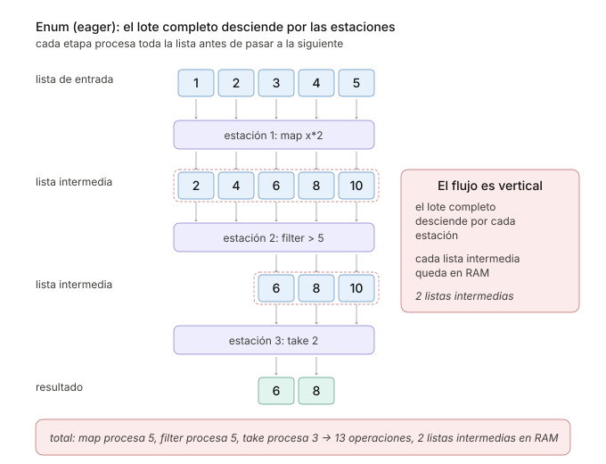
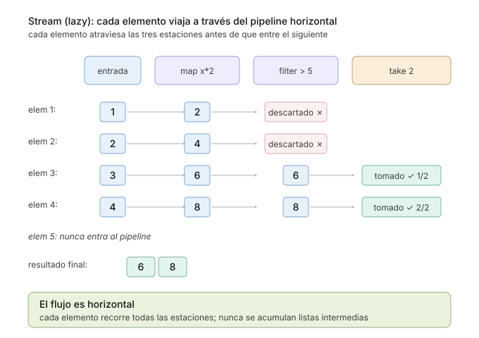

```
Universidad del Quindío
Programa de Ingeniería de Sistemas y Computación
Programación III - Streams
Docente: Carlos Andrés Florez V.
```

# Streams y evaluación perezosa

Hasta ahora, cada función de `Enum` recorre la colección completa y entrega una lista nueva antes de que empiece la siguiente función del pipeline. Esa forma de trabajar se llama **evaluación estricta**, y es la que Elixir usa por defecto.

La **evaluación perezosa** consiste en aplazar un cálculo hasta que su resultado de verdad se necesite. En Elixir no es la forma normal de trabajar, sino una herramienta que se usa cuando conviene, y esa herramienta es el módulo `Stream`. En esta guía se verá qué cambia al usar `Stream` en lugar de `Enum`, por qué un stream no hace nada hasta que alguien pide sus elementos y cómo eso permite trabajar con secuencias infinitas.

## Enum y Stream paso a paso

El siguiente programa hace la misma operación de dos maneras, una con `Enum` y otra con `Stream`. Duplica cada número de la lista, se queda con los mayores que 5 y toma los dos primeros. Las funciones `duplicar/1` y `mayor_que_5?/1` imprimen un mensaje cada vez que se ejecutan, para poder ver en qué orden ocurre cada paso.

```elixir
defmodule Comparacion do
  def main do
    IO.puts("=== Con Enum ===")
    IO.inspect(con_enum(), label: "Resultado")

    IO.puts("\n=== Con Stream ===")
    IO.inspect(con_stream(), label: "Resultado")
  end

  defp con_enum do
    [1, 2, 3, 4, 5]
    |> Enum.map(&duplicar/1)
    |> Enum.filter(&mayor_que_5?/1)
    |> Enum.take(2)
  end

  defp con_stream do
    [1, 2, 3, 4, 5]
    |> Stream.map(&duplicar/1)
    |> Stream.filter(&mayor_que_5?/1)
    |> Enum.take(2)
  end

  defp duplicar(x) do
    IO.puts("map #{x} -> #{x * 2}")
    x * 2
  end

  defp mayor_que_5?(x) do
    IO.puts("filter #{x}")
    x > 5
  end
end

Comparacion.main()
```

La salida es:

```
=== Con Enum ===
map 1 -> 2
map 2 -> 4
map 3 -> 6
map 4 -> 8
map 5 -> 10
filter 2
filter 4
filter 6
filter 8
filter 10
Resultado: [6, 8]

=== Con Stream ===
map 1 -> 2
filter 2
map 2 -> 4
filter 4
map 3 -> 6
filter 6
map 4 -> 8
filter 8
Resultado: [6, 8]
```

Las dos versiones dan `[6, 8]`, pero trabajan de forma muy distinta.

Con `Enum`, `map` duplica los cinco números y arma una lista nueva, `[2, 4, 6, 8, 10]`. Solo entonces `filter` recorre esa lista completa y arma otra, `[6, 8, 10]`, de la cual `take` toma los dos primeros. Se hicieron diez operaciones y se crearon dos listas intermedias en memoria.



Con `Stream`, cada número pasa por **todos los pasos** antes de que entre el siguiente. El 1 se duplica y se descarta, el 2 también, el 3 y el 4 se duplican y se toman. Como `take` ya tiene sus dos elementos, el recorrido se detiene y **el 5 nunca se procesa**. Tampoco se crea ninguna lista intermedia.



### Un stream no hace nada hasta que se consume

En `con_stream/0`, cambie la última línea `Enum.take(2)` por `Stream.take(2)` y vuelva a ejecutar. La parte del stream ya no imprime ningún `map` ni ningún `filter`, y el resultado es algo como esto:

```
Resultado: #Stream<[
  enum: [1, 2, 3, 4, 5],
  funs: [#Function<49.48511117/1 in Stream.map/2>,
   #Function<39.48511117/1 in Stream.filter/2>,
   #Function<57.48511117/1 in Stream.take_after_guards/2>]
]>
```

No es un error. `Stream.map/2`, `Stream.filter/2` y `Stream.take/2` no calculan nada, solo **agregan un paso** a la lista de pasos pendientes, y eso es lo que muestra `IO.inspect`. Los pasos se ejecutan cuando una función de `Enum` pide los elementos, como `Enum.take/2` o `Enum.to_list/1`.

Por eso un pipeline de `Stream` siempre debe **terminar en una función de `Enum`**. Si el resultado sale como `#Stream<...>`, falta esa última función.

Esto es un **stream**. Describe los pasos que se aplicarán a una colección, pero no los ejecuta hasta que una función de `Enum` pide los elementos, y cada elemento recorre todos los pasos antes de que entre el siguiente.

---

## Ejemplo: Generar números primos

Se necesita un módulo `Primos` con una función `primeros/1`, que reciba un entero `n` y retorne una lista con los primeros `n` números primos. Más adelante también se pedirán los primos que están entre 100 y 200.

Para saber si un número es primo basta con buscar divisores desde 2 hasta su raíz cuadrada. Si un número `n` tuviera un divisor mayor que su raíz, también tendría uno menor, que ya se habría encontrado. La función `sin_divisores?/2` hace esa búsqueda con recursión, y se detiene cuando `divisor * divisor` pasa de `n`, es decir, cuando el divisor pasa de la raíz. Esta verificación no cambia en ninguna de las versiones.

### Versión 1: Con `Enum` y un rango

Con lo que se conoce hasta ahora, la idea más directa es revisar un rango de números, quedarse con los primos y tomar los primeros `n`:

```elixir
defmodule Primos do
  def main do
    IO.inspect(primeros(10), label: "Primeros 10 primos")
    IO.inspect(primeros(20), label: "Primeros 20 primos")
  end

  def primeros(n) do
    2..30
    |> Enum.filter(&es_primo?/1)
    |> Enum.take(n)
  end

  defp es_primo?(n) when n < 2, do: false
  defp es_primo?(n), do: sin_divisores?(n, 2)

  # Busca divisores desde `divisor` hasta la raíz cuadrada de n
  defp sin_divisores?(n, divisor) when divisor * divisor > n, do: true
  defp sin_divisores?(n, divisor) when rem(n, divisor) == 0, do: false
  defp sin_divisores?(n, divisor), do: sin_divisores?(n, divisor + 1)
end

Primos.main()
```

La salida es:

```
Primeros 10 primos: [2, 3, 5, 7, 11, 13, 17, 19, 23, 29]
Primeros 20 primos: [2, 3, 5, 7, 11, 13, 17, 19, 23, 29]
```

Los primeros 10 salen bien, pero al pedir 20 el programa devuelve los mismos 10 y no avisa de nada. Entre 2 y 30 solo hay diez primos, así que `Enum.take(20)` entrega los que hay.

El problema es el `30`. Para pedir `n` primos habría que saber de antemano hasta qué número buscar, y eso no se sabe. Se podría cambiar el rango por `2..1_000_000`, pero entonces `Enum.filter/2` revisaría el millón de números, y armaría una lista con todos los primos que encuentre, solo para quedarse con los primeros 20.

Lo que se necesita es una secuencia de números **sin final**, de la que se revisen solo los necesarios.

### Versión 2: Una secuencia infinita con `Stream.iterate/2`

`Stream.iterate/2` recibe un valor inicial y una función, y genera un stream infinito. El primer elemento es el valor inicial, y cada elemento siguiente se obtiene aplicándole la función al anterior. `Stream.iterate(2, fn x -> x + 1 end)` genera 2, 3, 4, 5 y así sin final.

Con `Enum` una secuencia infinita sería imposible, porque `Enum.filter/2` intentaría recorrerla completa y nunca terminaría. Con `Stream` sí se puede, porque cada número pasa por el filtro solo cuando `Enum.take/2` pide otro primo, y en cuanto tiene `n` el recorrido se detiene.

Se agrega la función `stream/0`, que retorna el stream de primos, y `primeros/1` pasa a usarla:

```elixir
defmodule Primos do
  def main do
    IO.inspect(primeros(10), label: "Primeros 10 primos")
    IO.inspect(primeros(20), label: "Primeros 20 primos")
  end

  def primeros(n) do
    Enum.take(stream(), n)
  end

  # Stream infinito de números primos: 2, 3, 5, 7, 11, ...
  def stream do
    Stream.iterate(2, fn x -> x + 1 end)
    |> Stream.filter(&es_primo?/1)
  end

  defp es_primo?(n) when n < 2, do: false
  defp es_primo?(n), do: sin_divisores?(n, 2)

  defp sin_divisores?(n, divisor) when divisor * divisor > n, do: true
  defp sin_divisores?(n, divisor) when rem(n, divisor) == 0, do: false
  defp sin_divisores?(n, divisor), do: sin_divisores?(n, divisor + 1)
end

Primos.main()
```

La salida es:

```
Primeros 10 primos: [2, 3, 5, 7, 11, 13, 17, 19, 23, 29]
Primeros 20 primos: [2, 3, 5, 7, 11, 13, 17, 19, 23, 29, 31, 37, 41, 43, 47, 53, 59, 61, 67, 71]
```

Ya no hay que adivinar ningún límite. Para los primeros 20 primos se revisan los números del 2 al 71, ni uno más.

### Versión 3: Los primos entre 100 y 200

**Nuevo requerimiento:** también se necesitan los primos que están entre 100 y 200.

Como ya existe `stream/0`, la idea natural es filtrar los que estén en ese intervalo. Agregue esta función al módulo y llámela desde `main`:

```elixir
def entre(minimo, maximo) do
  stream()
  |> Stream.filter(fn x -> x >= minimo and x <= maximo end)
  |> Enum.to_list()
end
```

Al ejecutarlo, el programa **nunca termina** (se detiene presionando `Ctrl+C` dos veces). El filtro no sabe que los primos van en orden. Después del 199 sigue revisando el 211, el 223 y todos los demás, por si alguno vuelve a estar entre 100 y 200, y el stream es infinito.

Hacen falta dos funciones que sí aprovechan el orden:

- `Stream.drop_while/2` descarta elementos **mientras** se cumpla la condición. En cuanto un elemento no la cumple, deja pasar ese y todos los siguientes.
- `Stream.take_while/2` toma elementos **mientras** se cumpla la condición. En cuanto un elemento no la cumple, **termina el stream**.

```elixir
defmodule Primos do
  def main do
    IO.inspect(primeros(10), label: "Primeros 10 primos")
    IO.inspect(entre(100, 200), label: "Primos entre 100 y 200")
  end

  def primeros(n) do
    Enum.take(stream(), n)
  end

  def entre(minimo, maximo) do
    stream()
    |> Stream.drop_while(fn x -> x < minimo end)   # Descarta los menores que el mínimo
    |> Stream.take_while(fn x -> x <= maximo end)  # Se detiene al pasar del máximo
    |> Enum.to_list()
  end

  # Stream infinito de números primos: 2, 3, 5, 7, 11, ...
  def stream do
    Stream.iterate(2, fn x -> x + 1 end)
    |> Stream.filter(&es_primo?/1)
  end

  defp es_primo?(n) when n < 2, do: false
  defp es_primo?(n), do: sin_divisores?(n, 2)

  defp sin_divisores?(n, divisor) when divisor * divisor > n, do: true
  defp sin_divisores?(n, divisor) when rem(n, divisor) == 0, do: false
  defp sin_divisores?(n, divisor), do: sin_divisores?(n, divisor + 1)
end

Primos.main()
```

La salida es:

```
Primeros 10 primos: [2, 3, 5, 7, 11, 13, 17, 19, 23, 29]
Primos entre 100 y 200: [101, 103, 107, 109, 113, 127, 131, 137, 139, 149, 151, 157, 163, 167, 173, 179,
 181, 191, 193, 197, 199]
```

Cuando llega el 211, `take_while` ve que pasa de 200 y termina el stream. `Enum.to_list/1` recibe la señal de que no hay más elementos y entrega la lista.

---

## Referencia rápida

Estas son las funciones de `Stream` más comunes. Todas retornan un stream, así que el pipeline debe terminar en una función de `Enum`.

| Función | Qué hace |
| --- | --- |
| `Stream.map/2` | Aplica una función a cada elemento |
| `Stream.filter/2` | Deja pasar los elementos que cumplen la condición |
| `Stream.reject/2` | Descarta los elementos que cumplen la condición |
| `Stream.take/2` | Toma los primeros N elementos |
| `Stream.drop/2` | Descarta los primeros N elementos |
| `Stream.take_while/2` | Toma elementos mientras se cumpla la condición y luego termina |
| `Stream.drop_while/2` | Descarta elementos mientras se cumpla la condición |
| `Stream.iterate/2` | Genera un stream infinito a partir de un valor inicial y una función |
| `Stream.chunk_every/2` | Agrupa los elementos en grupos de tamaño fijo |

Para conocer las demás, puede consultar la [documentación oficial del módulo `Stream`](https://hexdocs.pm/elixir/Stream.html).

## ¿Cuándo usar Streams?

Los streams convienen cuando:

* **Solo se necesita una parte del resultado**, como los primeros `n` primos, porque el recorrido se detiene en cuanto se tiene lo necesario.
* **La secuencia es infinita** o no se sabe de antemano cuántos elementos habrá que revisar.
* **Los datos son muchos y pasan por varias transformaciones**, porque no se crean listas intermedias en memoria.
* **Se lee un archivo grande**, línea por línea, sin cargarlo completo en memoria.

En cambio, `Enum` es la mejor opción cuando la colección es pequeña y se necesita el resultado completo. En ese caso los streams no ahorran nada, y `Enum` suele ser más rápido y más fácil de leer.

---

## Ejercicios propuestos

Realice los siguientes ejercicios para practicar el uso de `Streams` en Elixir:

### Ejercicio 1

Cree un módulo `Cuadrados` que genere un stream infinito con los cuadrados de los números naturales (1, 4, 9, 16, ...).

Tenga en cuenta que `Stream.iterate/2` produce cada elemento aplicando una función al elemento anterior, por lo que **no genera los cuadrados directamente**. La estrategia es combinar dos pasos, como en el ejemplo de los primos. Primero se generan los números naturales con `Stream.iterate/2`, y luego, en lugar de filtrarlos con `Stream.filter/2`, se transforman con `Stream.map/2`.

Implemente una función `primeros/1` que retorne los primeros `n` cuadrados, y otra que retorne los cuadrados comprendidos entre dos valores dados, usando `Stream.drop_while/2` y `Stream.take_while/2`.

### Ejercicio 2

Implemente la secuencia de Fibonacci como un `Stream` infinito (investigue `Stream.unfold/2`). Luego obtenga los primeros 15 números de Fibonacci y, por separado, los números de Fibonacci menores a 1000.

### Ejercicio 3

Dada una lista grande de números, construya un pipeline con `Stream` que descarte los negativos, multiplique cada número por 3 y tome solo los primeros 5 resultados. Haga la misma operación con `Enum`.

Para saber cuántos elementos procesa realmente cada versión, use funciones que impriman un mensaje cada vez que se ejecutan, como `duplicar/1` y `mayor_que_5?/1` en la comparación del inicio de la guía. ¿Cuántos mensajes imprime cada versión y por qué?

---

## Para la próxima clase

- Investigar más sobre el módulo `Stream` y sus funciones.
- Leer sobre el manejo de archivos en Elixir.
