```
Universidad del Quindío
Programa de Ingeniería de Sistemas y Computación
Programación III - Manejo de archivos
Docente: Carlos Andrés Florez V.
```

# Manejo de archivos

El manejo de archivos en Elixir se realiza principalmente a través de tres módulos: `File`, `IO` y `Path`. Con ellos es posible leer, escribir y manipular tanto archivos como directorios siguiendo un enfoque funcional y seguro. A lo largo de esta guía exploraremos sus funciones más comunes mediante ejemplos prácticos.

Este enfoque es coherente con los principios funcionales que hemos visto a lo largo del curso. Los datos que se leen son **inmutables**, igual que cualquier otro valor del lenguaje. La mayoría de las operaciones devuelven una **tupla de resultado** (`{:ok, resultado}` o `{:error, razón}`), lo que permite manejar tanto el éxito como el error de forma explícita mediante **pattern matching**, sin recurrir a excepciones. Para los casos en que se prefiere que un fallo detenga el programa, existen variantes terminadas en `!` que **lanzan una excepción** en lugar de devolver una tupla. Por último, cuando se trabaja con archivos grandes, los **streams** permiten procesarlos de forma perezosa, leyéndolos por partes sin cargarlos completos en memoria.

---

## Ejemplo 1: Analizador de registros del servidor

Un **servidor** es un computador que permanece encendido prestando un servicio a otros equipos, como el que aloja la página web de la universidad. Nadie está sentado frente a él, así que anota todo lo que hace en un archivo de texto llamado **log** (registro): cada vez que ocurre algo relevante **agrega una línea al final** con la fecha, la hora, un **nivel de severidad** y una descripción. Si el sistema se cae de madrugada, la causa está ahí.

Los tres niveles más comunes son `INFO` (algo normal ocurrió), `WARN` (una advertencia) y `ERROR` (algo falló). Como el servidor no para, estos archivos **crecen sin límite** y pueden pesar varios gigabytes, así que revisarlos a mano es inviable.

El equipo de soporte de una empresa necesita una herramienta para analizar ese log, pero **no la pide toda de una vez**: como en un proyecto real, cada versión traerá un requerimiento nuevo que obligará a mejorar la solución.

**Primer requerimiento:** saber cuántas líneas tiene el log y cuántas de ellas corresponden a errores, mostrando el resultado en pantalla.

Cree un archivo `servidor.log` con el siguiente contenido para trabajar. Note el formato de cada línea: *fecha, hora, nivel y descripción*.

```
2026-08-01 10:15:02 INFO Usuario ana inicio sesion
2026-08-01 10:15:47 ERROR Fallo de conexion con la base de datos
2026-08-01 10:16:03 INFO Usuario luis inicio sesion
2026-08-01 10:18:22 WARN Memoria al 85 por ciento
2026-08-01 10:19:10 ERROR Timeout al consultar el servicio de pagos
2026-08-01 10:21:35 INFO Usuario ana cerro sesion
2026-08-01 10:22:01 ERROR Fallo de conexion con la base de datos
```

Junto a ese archivo, cree otro llamado `reporte.exs`, donde iremos escribiendo el programa. **Después de cada versión, ejecútelo** desde la terminal para comprobar el resultado:

```bash
elixir reporte.exs
```

### Versión 1: Leer el archivo completo

Lo primero es leer el log y contar cuántas líneas tiene y cuántos errores contiene. `File.read/1` devuelve una tupla, así que manejamos ambos casos con `case`:

```elixir
defmodule Reporte do
  def main do
    analizar("servidor.log")
    analizar("no_existe.log")   # Para comprobar el manejo de errores
  end

  defp analizar(ruta) do
    case File.read(ruta) do
      {:ok, contenido} ->
        lineas = String.split(contenido, "\n", trim: true)
        errores = Enum.count(lineas, &String.contains?(&1, "ERROR"))

        IO.puts("Líneas totales: #{length(lineas)}")
        IO.puts("Errores encontrados: #{errores}")

      {:error, :enoent} ->
        IO.puts("Error: el archivo no existe")

      {:error, razon} ->
        IO.puts("Error al leer el archivo: #{razon}")
    end
  end
end

Reporte.main()
```

Al ejecutar `elixir reporte.exs` debería ver:

```
Líneas totales: 7
Errores encontrados: 3
Error: el archivo no existe
```

La opción `trim: true` de `String.split/3` descarta las cadenas vacías. Sin ella, el salto de línea final del archivo produciría una última línea vacía.

La segunda llamada, con un archivo inexistente, **no revienta el programa**: informa el error y continúa. Esa es la ventaja de que `File.read/1` devuelva una tupla en vez de lanzar una excepción.

**Códigos de error comunes.** El átomo que acompaña a `{:error, razón}` indica qué salió mal. Los más frecuentes son:

- `:enoent`: El archivo no existe (No such file or directory)
- `:eacces`: Permiso denegado
- `:eisdir`: Es un directorio, no un archivo
- `:enotdir`: Se esperaba un directorio, pero no lo es
- `:enomem`: Memoria insuficiente

> ⚠️ **Nota:** casi toda función de `File` tiene una variante con `!` (`File.read!/1`, `File.write!/2`, …) que **lanza una excepción** en lugar de devolver una tupla. Úsela cuando prefiera que el programa falle de inmediato ante un error, en vez de manejarlo.

### Versión 2: Guardar el reporte en un archivo

**Nuevo requerimiento:** el resultado no puede quedarse en la pantalla. Debe guardarse en un archivo `reporte.txt`, para poder adjuntarlo al informe semanal del área.

Reemplazamos las impresiones por un texto que se escribe con `File.write/2`, y **separamos responsabilidades**: una función construye el reporte y otra lo guarda.

```elixir
defmodule Reporte do
  def main do
    analizar("servidor.log", "reporte.txt")
  end

  defp analizar(ruta_log, ruta_reporte) do
    case File.read(ruta_log) do
      {:ok, contenido} ->
        contenido
        |> generar_texto()
        |> guardar(ruta_reporte)

      {:error, razon} ->
        IO.puts("Error al leer el archivo: #{razon}")
    end
  end

  # Función pura: recibe el contenido y devuelve el texto del reporte
  defp generar_texto(contenido) do
    lineas = String.split(contenido, "\n", trim: true)
    errores = Enum.count(lineas, &String.contains?(&1, "ERROR"))

    """
    === Reporte del log ===
    Líneas totales: #{length(lineas)}
    Errores encontrados: #{errores}
    """
  end

  # Efecto secundario aislado: escribir en disco
  defp guardar(texto, ruta) do
    case File.write(ruta, texto) do
      :ok -> IO.puts("Reporte generado en #{ruta}")
      {:error, razon} -> IO.puts("No se pudo escribir el reporte: #{razon}")
    end
  end
end

Reporte.main()
```

`generar_texto/1` es una **función pura**: recibe texto y devuelve texto, sin tocar el disco, así que se puede probar con una cadena cualquiera. Los efectos secundarios quedaron confinados a `analizar/2` y `guardar/2`, siguiendo el principio de **minimizar y aislar** visto en la guía de programación funcional.

Ejecute el programa. En la consola solo verá `Reporte generado en reporte.txt`, pero **junto a su script aparecerá un archivo nuevo**, `reporte.txt`, con este contenido:

```
=== Reporte del log ===
Líneas totales: 7
Errores encontrados: 3
```

Note el uso de `"""` (*heredoc*) para escribir un texto de varias líneas sin tener que concatenar `\n` a mano.

**Opciones de escritura.** `File.write/2` **sobrescribe** el archivo. Si en lugar de eso quisiéramos ir acumulando reportes, se usa la opción `:append`:

```elixir
# Agregar al final sin sobrescribir
File.write("historico.txt", "Nueva entrada\n", [:append])

# Múltiples opciones (:utf8 asegura el manejo correcto de tildes y eñes)
File.write("historico.txt", "datos", [:append, :utf8])
```

**Una alternativa con `with`.** Observe que el programa encadena **dos operaciones que pueden fallar**: leer el log y escribir el reporte. Es exactamente el caso que resuelve la estructura `with`, vista en la guía de guards y manejo de resultados. Así, `analizar/2` y `guardar/2` se funden en una sola función sin anidamientos:

```elixir
defp analizar(ruta_log, ruta_reporte) do
  with {:ok, contenido} <- File.read(ruta_log),
       :ok <- File.write(ruta_reporte, generar_texto(contenido)) do
    IO.puts("Reporte generado en #{ruta_reporte}")
  else
    {:error, razon} -> IO.puts("Error: #{razon}")
  end
end
```

El `with` solo ejecuta su cuerpo si **ambas** operaciones tienen éxito; si cualquiera devuelve `{:error, razón}`, se detiene y pasa al `else`. Ambas versiones son válidas: use la que le resulte más legible.

### Versión 3: Rutas que no dependan de dónde se ejecute

**Nuevo requerimiento:** el análisis se ejecutará de forma automática cada noche mediante una tarea programada del sistema, que invoca el script desde otra carpeta. El programa debe funcionar sin importar desde dónde se ejecute.

Aquí aparece un problema: el programa anterior funciona **solo si se ejecuta desde la carpeta donde está el log**. Si se ejecuta `elixir carpeta/reporte.exs` desde otro directorio, `File.read("servidor.log")` falla con `:enoent`, porque la ruta es relativa al directorio actual de la terminal, no al del script.

La solución es construir las rutas a partir de `__DIR__`, que siempre apunta a la carpeta del archivo `.exs`, y unirlas con `Path.join/2` para que funcionen en cualquier sistema operativo:

```elixir
defmodule Reporte do
  @log Path.join(__DIR__, "servidor.log")
  @salida Path.join(__DIR__, "reporte.txt")

  def main do
    case File.read(@log) do
      {:ok, contenido} ->
        contenido
        |> generar_texto()
        |> guardar(@salida)

      {:error, razon} ->
        IO.puts("Error al leer el archivo: #{razon}")
    end
  end

  defp generar_texto(contenido) do
    lineas = String.split(contenido, "\n", trim: true)
    errores = Enum.count(lineas, &String.contains?(&1, "ERROR"))

    """
    === Reporte del log ===
    Líneas totales: #{length(lineas)}
    Errores encontrados: #{errores}
    """
  end

  defp guardar(texto, ruta) do
    case File.write(ruta, texto) do
      :ok -> IO.puts("Reporte generado en #{ruta}")
      {:error, razon} -> IO.puts("No se pudo escribir el reporte: #{razon}")
    end
  end
end

Reporte.main()
```

Compare esta versión con la anterior: `generar_texto/1` y `guardar/2` quedaron **idénticas**. Lo único que cambió fue de dónde salen las rutas. Ese es el beneficio de haber separado responsabilidades: un cambio en el manejo de archivos no obliga a tocar la lógica del reporte.

Ahora el programa se puede ejecutar desde cualquier carpeta. **Compruébelo:** sitúese en otro directorio y ejecute el script indicando su ruta completa. Antes fallaba con `:enoent`; ahora funciona igual.

```bash
cd ..
elixir carpeta_del_proyecto/reporte.exs
```

`Path.join/2` es preferible a concatenar la ruta con `<>` porque usa el separador correcto de cada sistema operativo: `/` en Linux y macOS, `\` en Windows.

### Versión 4: Cuando el log es demasiado grande

**Nuevo requerimiento:** el reporte se queda corto. Ahora quieren saber **cuántos eventos hay de cada tipo** (`INFO`, `WARN`, `ERROR`), no solo cuántos errores. Y hay una complicación: el programa va a correr sobre el log real de producción, que pesa **varios gigabytes**.

Ese último punto rompe la solución actual. `File.read/1` carga **todo el archivo en memoria**: con un log de prueba de 7 líneas no hay problema, pero con uno de varios gigabytes el programa se quedaría sin memoria antes de empezar a contar.

Aquí entra `File.stream!/1`, que crea un **stream**: una colección perezosa que lee el archivo pieza por pieza, solo cuando se necesita.

**¿Cómo funciona un stream?** Un stream es como una “receta” para generar una secuencia de datos, no los datos en sí. Cuando se pasa un stream a una función del módulo `Enum` (como `Enum.count`, `Enum.map`, etc.), ocurre lo siguiente:

1. `Enum` pide el **primer elemento** al stream (la primera línea del archivo).
2. Stream lee **solo esa línea** del archivo y se la entrega a `Enum`.
3. `Enum` procesa ese elemento aplicando alguna función (por ejemplo `Enum.count/1`, `Enum.map/2`, `Enum.to_list/1`, etc.).
4. `Enum` pide el **segundo elemento** al stream.
5. Stream lee la **segunda línea** y la entrega a `Enum`.
6. Se repite hasta que el stream se agota (llega al final del archivo).

De esta manera, en ningún momento se carga el archivo completo en memoria. `Enum` "tira" de los datos del stream uno por uno, haciéndolo increíblemente eficiente para archivos de cualquier tamaño.

**Comparación entre `File.read/1` y `File.stream!/1`**

En el siguiente diagrama se muestra la diferencia y el impacto en la memoria al usar `File.read/1` vs `File.stream!/1`:



Aplicado a nuestro problema, `File.stream!/1` procesa el archivo línea por línea. Aprovechamos el cambio para mejorar el reporte: en lugar de contar solo los errores, contamos **cuántos eventos hay de cada nivel**.

> ⚠️ **Importante:** `File.stream!/1` entrega cada línea **con su salto de línea al final**. Es decir, la primera línea del log llega como `"2026-08-01 10:15:02 INFO Usuario ana inicio sesion\n"`. Por eso casi siempre el primer paso es limpiarla con `String.trim/1`; de lo contrario, `String.length/1` contaría un carácter de más y `String.to_integer/1` fallaría al convertir un número.

```elixir
defmodule Reporte do
  @log Path.join(__DIR__, "servidor.log")
  @salida Path.join(__DIR__, "reporte.txt")

  def main do
    contar_por_nivel()
    |> generar_texto()
    |> guardar(@salida)
  end

  defp contar_por_nivel do
    @log
    |> File.stream!()
    |> Stream.map(&String.trim/1)      # Elimina el salto de línea de cada línea
    |> Stream.reject(&(&1 == ""))      # Descarta líneas vacías
    |> Enum.frequencies_by(&nivel/1)   # Cuenta cuántas hay de cada nivel
  end

  # Determina el nivel de severidad de una línea
  defp nivel(linea) do
    cond do
      String.contains?(linea, "ERROR") -> "ERROR"
      String.contains?(linea, "WARN") -> "WARN"
      true -> "INFO"
    end
  end

  defp generar_texto(conteo) do
    lineas = Enum.map(conteo, fn {nivel, cantidad} -> "#{nivel}: #{cantidad}" end)
    Enum.join(["=== Eventos por nivel ===" | lineas], "\n") <> "\n"
  end

  defp guardar(texto, ruta) do
    case File.write(ruta, texto) do
      :ok -> IO.puts("Reporte generado en #{ruta}")
      {:error, razon} -> IO.puts("No se pudo escribir el reporte: #{razon}")
    end
  end
end

Reporte.main()
```

El contenido de `reporte.txt` queda así:

```
=== Eventos por nivel ===
ERROR: 3
INFO: 3
WARN: 1
```

El programa sigue guardando el reporte en un archivo, como se pidió en la Versión 2, pero ahora **el contenido es el conteo por nivel** y la lectura ya no carga el log completo en memoria.

> ⚠️ **Importante:** Este programa funcionaría igual con un log de 10 GB, porque nunca hay más de una línea en memoria a la vez.

### Versión 5 (opcional): Escribir mientras se procesa

**Último requerimiento:** el reporte único ya no sirve. Ahora se piden **dos archivos separados**, porque los consume gente distinta:

- `errores.txt`, con **el detalle de cada línea de error**, para que el equipo técnico las revise sin abrir el log completo.
- `resumen.txt`, con **el conteo de eventos por nivel**, que es lo único que necesita la coordinación para su informe.

Esta separación revela algo interesante: los dos archivos tienen **naturalezas opuestas**. El de errores puede tener millones de líneas, tantas como errores haya en el log. El resumen, en cambio, tendrá a lo sumo cuatro líneas (el encabezado y una por cada nivel presente), sin importar si el log pesa un kilobyte o diez gigabytes.

Eso implica que **conviene escribirlos de forma distinta**. Para el resumen basta `File.write/2` al final, como veníamos haciendo. Pero acumular en memoria todas las líneas de error para escribirlas de una vez nos devolvería al problema que acabamos de resolver.

La solución para el archivo de errores es abrirlo con `File.open/2` y escribir cada línea **a medida que se encuentra**, usando el módulo `IO`.

`File.open/2` recibe la ruta y el **modo** de apertura, y devuelve `{:ok, dispositivo}` o `{:error, razón}`:

- `:read`: abrir solo para lectura.
- `:write`: abrir para escritura (crea el archivo o lo sobrescribe).
- `:append`: abrir para escritura agregando al final.

Es el mismo módulo `IO` que usamos para la consola (`IO.puts/1`, `IO.gets/1`): `IO` opera sobre **dispositivos**, y tanto la consola como un archivo abierto lo son. Así la lectura nunca carga el log completo, y las líneas de error se escriben una a una:

```elixir
defmodule Reporte do
  @log Path.join(__DIR__, "servidor.log")
  @errores Path.join(__DIR__, "errores.txt")
  @resumen Path.join(__DIR__, "resumen.txt")

  def main do
    escribir_errores()
    escribir_resumen()

    IO.puts("Errores detallados en #{@errores}")
    IO.puts("Resumen generado en #{@resumen}")
  end

  # Archivo grande: se abre y se escribe poco a poco, a medida que se encuentran
  defp escribir_errores do
    {:ok, salida} = File.open(@errores, [:write, :utf8])
    IO.puts(salida, "=== Detalle de errores ===")

    lineas()
    |> Stream.filter(fn linea -> nivel(linea) == "ERROR" end)
    |> Enum.each(fn linea -> IO.puts(salida, linea) end)   # Escribe en el archivo

    File.close(salida)             # Siempre cerrar el archivo
  end

  # Archivo pequeño: se construye el texto completo y se escribe de una sola vez
  defp escribir_resumen do
    texto =
      lineas()
      |> Enum.frequencies_by(&nivel/1)
      |> Enum.map(fn {nivel, cantidad} -> "#{nivel}: #{cantidad}" end)
      |> Enum.join("\n")

    File.write(@resumen, "=== Eventos por nivel ===\n" <> texto <> "\n")
  end

  # Prepara el stream de líneas limpias, reutilizado por las dos funciones
  defp lineas do
    @log
    |> File.stream!()
    |> Stream.map(&String.trim/1)
    |> Stream.reject(&(&1 == ""))
  end

  defp nivel(linea) do
    cond do
      String.contains?(linea, "ERROR") -> "ERROR"
      String.contains?(linea, "WARN") -> "WARN"
      true -> "INFO"
    end
  end
end

Reporte.main()
```

Observe que `IO.puts(salida, linea)` recibe el **dispositivo como primer argumento**: escribe en el archivo abierto. Sin ese primer argumento, `IO.puts(linea)` escribiría en la consola. También existe `IO.read(dispositivo, :line)` para leer una línea de un archivo abierto. Y es **importante cerrar el archivo** con `File.close/1` al terminar, para liberar el recurso.

Ejecute el script una vez más. Ahora se generan **dos archivos**. El primero, `errores.txt`:

```
=== Detalle de errores ===
2026-08-01 10:15:47 ERROR Fallo de conexion con la base de datos
2026-08-01 10:19:10 ERROR Timeout al consultar el servicio de pagos
2026-08-01 10:22:01 ERROR Fallo de conexion con la base de datos
```

Y el segundo, `resumen.txt`:

```
=== Eventos por nivel ===
ERROR: 3
INFO: 3
WARN: 1
```

**Lo más importante de esta versión es que usa las dos formas de escribir, cada una donde corresponde:**

| Archivo       | Cómo se escribe                              | Por qué                                                                   |
| ------------- | -------------------------------------------- | ------------------------------------------------------------------------- |
| `errores.txt` | `File.open/2` + `IO.puts/2`, línea por línea | Puede tener millones de líneas; acumularlas en memoria agotaría el equipo |
| `resumen.txt` | `File.write/2`, de una sola vez              | Tiene a lo sumo cuatro líneas, sin importar el tamaño del log             |

Este es el criterio general: **escriba de una sola vez lo que sepa que es pequeño; escriba poco a poco lo que pueda crecer sin límite.**

> ⚠️ **Un detalle de eficiencia.** Esta solución recorre el log **dos veces**, una por cada archivo de salida. No consume más memoria, porque sigue procesando línea por línea, pero tarda el doble en leer. Si eso llegara a importar, ambas tareas podrían resolverse en una sola pasada usando `Enum.reduce/3` con un mapa como acumulador, a costa de un código bastante más denso. Es el intercambio habitual entre **legibilidad** y **rendimiento**; con dos pasadas sobre un archivo, casi siempre gana la legibilidad.

---

## Ejemplo 2: Anonimizar los registros antes de compartirlos

En el Ejemplo 1 el programa analizaba un archivo y producía un resumen distinto. Este lo **transforma**: la salida es una copia del original con las líneas modificadas. Además, no procesa un archivo conocido de antemano, sino **todos los que encuentre** en la carpeta.

El equipo de soporte necesita enviarle los logs a un proveedor externo para que analice las fallas, pero por política de privacidad **no puede revelar los nombres de los usuarios**. Se requiere un programa que procese todos los archivos `.log` de la carpeta, reemplace los nombres por `***` y deje las copias en una subcarpeta `publicos/`, conservando el nombre original de cada archivo.

Para probarlo, cree un segundo log llamado `respaldo.log` junto al que ya tiene:

```
2026-08-02 09:00:00 INFO Usuario marta inicio sesion
2026-08-02 09:05:10 WARN Disco al 90 por ciento
```

```elixir
defmodule Anonimizador do
  @carpeta __DIR__
  @salida Path.join(__DIR__, "publicos")

  def main do
    File.mkdir_p!(@salida)   # Crea la carpeta destino si no existe

    @carpeta
    |> File.ls!()
    |> Enum.filter(&(Path.extname(&1) == ".log"))   # Solo los archivos .log
    |> Enum.sort()
    |> Enum.each(&anonimizar_archivo/1)
  end

  defp anonimizar_archivo(nombre) do
    entrada = Path.join(@carpeta, nombre)
    salida = Path.join(@salida, nombre)

    entrada
    |> File.stream!()                                  # Lee línea por línea
    |> Stream.map(&ocultar_usuarios/1)                 # Transforma cada línea
    |> Enum.into(File.stream!(salida, [:write]))       # Escribe línea por línea

    IO.puts("Anonimizado: #{nombre} -> publicos/#{nombre}")
  end

  defp ocultar_usuarios(linea) do
    String.replace(linea, ~r/Usuario \w+/, "Usuario ***")
  end
end

Anonimizador.main()
```

Al ejecutarlo:

```
Anonimizado: respaldo.log -> publicos/respaldo.log
Anonimizado: servidor.log -> publicos/servidor.log
```

Y el contenido de `publicos/servidor.log` queda así:

```
2026-08-01 10:15:02 INFO Usuario *** inicio sesion
2026-08-01 10:15:47 ERROR Fallo de conexion con la base de datos
2026-08-01 10:16:03 INFO Usuario *** inicio sesion
2026-08-01 10:18:22 WARN Memoria al 85 por ciento
2026-08-01 10:19:10 ERROR Timeout al consultar el servicio de pagos
2026-08-01 10:21:35 INFO Usuario *** cerro sesion
2026-08-01 10:22:01 ERROR Fallo de conexion con la base de datos
```

El archivo conserva **todas** sus líneas: solo cambian los nombres de usuario. Las líneas de error y advertencia pasan intactas, porque son justamente las que el proveedor necesita para diagnosticar.

Este ejemplo introduce cuatro cosas nuevas:

**1. `File.ls!/1` devuelve el contenido de una carpeta**, como una lista con los nombres de los archivos y subcarpetas que hay dentro. Es lo que permite trabajar sobre archivos que no se conocen de antemano.

**2. `Path.extname/1` devuelve la extensión** de un archivo (`".log"`, `".txt"`), y con ella se filtra la lista para quedarse solo con los que interesan. Listar una carpeta y filtrar por extensión es un patrón muy frecuente.

**3. `File.mkdir_p!/1` crea la carpeta destino**, incluidos todos los directorios intermedios que hagan falta. Sin esa línea, la primera escritura fallaría porque `publicos/` no existe.

**4. Un stream también puede ser el destino de la escritura.** Hasta ahora usábamos `File.stream!/1` para leer. Al pasarlo a `Enum.into/2` con el modo `[:write]`, se convierte en el destino: cada línea transformada se escribe de inmediato, sin acumular nada. Este es el modismo habitual para **convertir un archivo en otro**, y funcionaría igual con un archivo de varios gigabytes, porque ni la entrada ni la salida se cargan completas en memoria.

> ⚠️ **Importante:** `~r/Usuario \w+/` es una **expresión regular**: busca la palabra `Usuario` seguida de un espacio y una o más letras o dígitos (`\w+`). `String.replace/3` acepta tanto un texto literal como una expresión regular para decidir qué reemplazar.

---

## Documentación oficial

Para profundizar en los módulos vistos en esta guía, consulte la documentación oficial de Elixir:

- [Documentación de File](https://hexdocs.pm/elixir/File.html)
- [Documentación de IO](https://hexdocs.pm/elixir/IO.html)
- [Documentación de Path](https://hexdocs.pm/elixir/Path.html)
- [Documentación de Stream](https://hexdocs.pm/elixir/Stream.html)

---

## Ejercicios propuestos

Realice los siguientes ejercicios para practicar el manejo de archivos en Elixir. Se recomienda crear módulos separados para cada ejercicio y seguir las buenas prácticas de manejo de errores y organización del código.

### Ejercicio 1: Frecuencia de palabras

Cree un programa que:
1. Lea un archivo de texto
2. Cuente la frecuencia de cada palabra (ignorando mayúsculas y signos de puntuación)
3. Guarde los resultados en `frecuencia.txt` ordenados de mayor a menor frecuencia
4. El formato debe ser: `palabra: frecuencia`

**Ejemplo de entrada (`texto.txt`):**
```
Hola mundo. Hola Elixir!
Elixir es genial. Mundo, hola.
```

**Ejemplo de salida (`frecuencia.txt`):**
```
hola: 3
elixir: 2
mundo: 2
es: 1
genial: 1
```

Además, como paso intermedio, genere un archivo `texto_normalizado.txt` con el mismo texto de entrada pero **en minúsculas y sin signos de puntuación**, una línea por cada línea original. Constrúyalo con el modismo de streams del Ejemplo 2:

```elixir
File.stream!(entrada)
|> Stream.map(&normalizar/1)
|> Enum.into(File.stream!(salida, [:write]))
```

**Pistas:**
- Use `String.downcase/1` para normalizar todas las palabras a minúsculas
- Use `String.replace/3` para eliminar signos de puntuación (investigue expresiones regulares) 
- Use `String.split/1` para separar palabras, por defecto separa por espacios
- Use `Enum.frequencies/1` para contar la frecuencia de cada palabra
- Al escribir con `Enum.into/2`, recuerde que cada línea debe terminar en `\n`; si le aplicó `String.trim/1`, tendrá que volver a agregarlo

### Ejercicio 2: Procesamiento de datos de un CSV

Dado el archivo `productos.csv`:

```csv
nombre,precio,cantidad
Laptop,1200,10
Mouse,25,50
Teclado,75,30
Monitor,300,15
```

Cree un módulo que:
1. Lea el archivo `productos.csv`
2. Convierta cada línea en un mapa: `%{nombre: "Laptop", precio: 1200, cantidad: 10}`
3. Calcule el valor total del inventario (suma de `precio * cantidad`)
4. Encuentre el producto más caro y el más barato
5. Genere un reporte en `inventario.txt` con:
   - Valor total del inventario
   - Producto más caro
   - Producto más barato
   - Lista de productos ordenados por valor en inventario

**Pistas:**
- Use `File.stream!/1` y `Stream.drop(1)` para saltar el encabezado
- **Aplique `String.trim/1` a cada línea antes de separarla.** Si no lo hace, el último campo llegará como `"10\n"` y `String.to_integer/1` fallará con un `ArgumentError`
- Use `String.split/2` y `String.to_integer/1`
- Use `Enum.reduce/3` para calcular totales
- Use `Enum.max_by/2` y `Enum.min_by/2`

### Ejercicio 3: Procesamiento por lotes

Cuando un archivo tiene millones de líneas, a veces conviene procesarlo **en bloques** en lugar de línea por línea: por ejemplo, para enviar los registros a un servicio externo de cien en cien, o para mostrar el avance al usuario cada cierto número de líneas.

Escriba un módulo `ProcesadorLotes` que:

1. Genere un archivo de prueba `ventas.txt` con **1000 líneas**, cada una con el formato `venta_N;valor`, donde `valor` es un número aleatorio entre 1000 y 50000. *Pista:* use un rango con `Enum.map/2` y el modismo `Enum.into(File.stream!(...))` del Ejercicio 1.
2. Lea ese archivo con `File.stream!/1` y lo agrupe en lotes de **100 líneas** usando `Stream.chunk_every/2`.
3. Por cada lote, imprima el número de lote, cuántas líneas trae y la **suma de los valores** de ese lote.
4. Al final, imprima el total general y verifique que coincide con la suma de los subtotales.

**Formato esperado de la salida:**
```
Lote 1: 100 líneas, subtotal 2.543.120
Lote 2: 100 líneas, subtotal 2.611.874
...
Lote 10: 100 líneas, subtotal 2.498.003
Total general: 25.430.118
```

**Pistas:**
- Use `:rand.uniform/1` para generar los valores aleatorios (módulo de Erlang visto en la guía de guards)
- Recuerde aplicar `String.trim/1` antes de separar cada línea con `String.split/2`
- Use `Enum.with_index/2` para numerar los lotes
- `Stream.chunk_every/2` funciona igual que `Enum.chunk_every/2`, pero de forma perezosa: nunca hay más de un lote en memoria

Responda además: ¿qué ventaja tiene procesar por lotes frente a procesar línea por línea? ¿Y frente a cargar el archivo completo?

### Ejercicio 4: Proyecto del Gimnasio con persistencia

Extienda el proyecto del gimnasio que hemos desarrollado en capítulos anteriores para que haga lo siguiente:

1. Guardar todos los socios en `socios.csv` con el formato CSV
2. Formato: `cedula,nombre,edad,clase1;clase2;clase3`
3. Cargar datos al iniciar el programa
4. Guardar automáticamente después de cada operación que modifique los datos (agregar, eliminar, actualizar socios o clases)

**Ejemplo de `socios.csv`:**
```
cedula,nombre,edad,clases
123,Juan Pérez,30,Yoga;Pilates;Spinning
456,Ana García,25,CrossFit;Yoga
789,Carlos López,35,Spinning;Natación;Yoga
```

**Funciones requeridas:**

Se recomienda crear un módulo `Archivo` con funciones como:

- `Archivo.guardar_socios/1`: Guarda la lista de socios en `socios.csv`
- `Archivo.cargar_socios/0`: Carga la lista de socios desde `socios.csv`
- Modificar el módulo principal del gimnasio para llamar a estas funciones en los momentos adecuados (al iniciar y después de cada cambio).

---

## Para la próxima clase

Se proponen los siguientes temas para investigación:

- Qué es un proceso y un hilo (thread) en el contexto de la programación concurrente.
- A qué se refiere el modelo de actor en Elixir y Erlang.
- Cómo Elixir maneja la concurrencia utilizando procesos ligeros.
