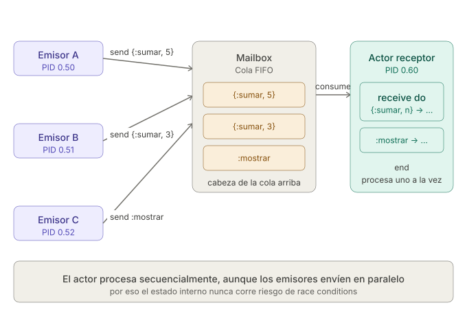
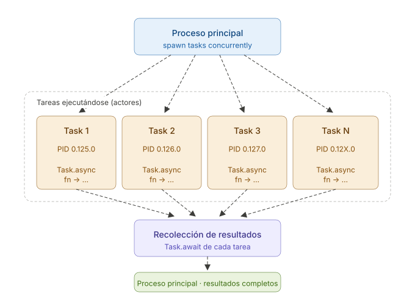

```
Universidad del Quindío
Programa de Ingeniería de Sistemas y Computación
Programación III - Procesos
Docente: Carlos Andrés Florez V.
```

# Procesos

Hasta ahora, todos los programas que hemos hecho se han ejecutado de forma secuencial. Cada instrucción espera a que termine la anterior, y eso funciona bien mientras cada paso tome poco tiempo. Sin embargo, muchos programas pasan buena parte de su tiempo esperando, por ejemplo la respuesta de un servidor, de una base de datos o de otro computador en la red, y mientras esperan no hacen nada más.

Elixir resuelve este problema con **procesos**, que son unidades de ejecución ligeras que avanzan al mismo tiempo, no comparten memoria y se comunican enviándose mensajes. Los procesos son la base de lo que se verá en el resto del curso, desde las aplicaciones distribuidas hasta los supervisores.

## Un problema para empezar

Suponga que se quiere construir un comparador de precios. El programa consulta el precio de un producto en cinco tiendas en línea y al final muestra cuál lo vende más barato. Cada tienda tarda un tiempo distinto en responder, entre uno y cinco segundos, así que la consulta se simula con `:timer.sleep/1`.

### Versión 1: Una tienda tras otra

```elixir
defmodule Comparador do
  def main do
    tiendas = [{"Tienda A", 1}, {"Tienda B", 2}, {"Tienda C", 3}, {"Tienda D", 4}, {"Tienda E", 5}]

    consultar_precios(tiendas)
    |> mostrar_mas_barata()
  end

  defp consultar_precios(tiendas) do
    Enum.map(tiendas, fn {tienda, segundos} -> consultar_precio(tienda, segundos) end)
  end

  # Simula la consulta del precio en una tienda que tarda `segundos` en responder
  defp consultar_precio(tienda, segundos) do
    IO.puts("Consultando #{tienda}...")
    :timer.sleep(segundos * 1000)
    precio = :rand.uniform(100) * 1000
    IO.puts("#{tienda} respondió: $#{precio}")
    {tienda, precio}
  end

  defp mostrar_mas_barata(precios) do
    {tienda, precio} = Enum.min_by(precios, fn {_tienda, precio} -> precio end)
    IO.puts("La más barata es #{tienda} con $#{precio}")
  end
end

Comparador.main()
```

Ejecute el código y cuente cuánto tarda en mostrar el resultado.

El programa tarda unos **15 segundos**, la suma de lo que tarda cada tienda (1 + 2 + 3 + 4 + 5). Cada consulta espera a que termine la anterior, aunque ninguna necesita el resultado de otra. Además, durante casi todo ese tiempo el programa no hace nada, solo espera a que cada tienda responda.

Entonces, ¿por qué la consulta a la Tienda B tiene que esperar a que responda la Tienda A? Si las cinco consultas avanzaran al mismo tiempo, el programa tardaría lo que tarda la tienda más lenta, es decir, cinco segundos. Para lograrlo se necesita **concurrencia**.

---

## Concurrencia y paralelismo

### ¿Qué es concurrencia?

La concurrencia es la **capacidad de un sistema para gestionar múltiples tareas al mismo tiempo**, compartiendo los recursos disponibles. El sistema alterna la ejecución de las distintas tareas, de modo que todas puedan avanzar sin necesidad de que una termine completamente antes de que otra comience.

Es lo que hace un sistema operativo cuando mantiene abiertos un reproductor de música, un navegador y un editor de texto. Aunque haya un solo procesador, los programas parecen ejecutarse *simultáneamente*, porque el sistema reparte el tiempo de CPU entre ellos. En el comparador, la concurrencia permitiría que las cinco consultas estén en curso a la vez, en lugar de esperar una tras otra.

### ¿Qué es paralelismo?

Por su parte, el **paralelismo** se refiere a la **ejecución real y simultánea de múltiples tareas**, aprovechando la existencia de **varios procesadores o núcleos**. Cada tarea se ejecuta literalmente al mismo tiempo en unidades de procesamiento distintas. Por ejemplo, en un computador con varios núcleos, uno puede procesar datos mientras otro renderiza gráficos.

Este diagrama muestra cómo, en un solo CPU, las tareas se intercalan en el tiempo (concurrencia), mientras que con varios núcleos pueden ejecutarse literalmente al mismo tiempo (paralelismo).



### Procesos en Elixir

En los sistemas operativos, un **proceso** es un programa en ejecución que tiene su propia memoria y es independiente de los demás. Elixir toma esa misma idea, pero sus procesos no son del sistema operativo, sino **procesos ligeros gestionados por la máquina virtual BEAM**. Cada uno ocupa apenas unos kilobytes, así que un programa puede crear miles de ellos sin problema.

En Elixir, la concurrencia se consigue creando procesos.

---

## Creación de procesos en Elixir

Al ejecutar un programa en Elixir, se crea automáticamente un **proceso principal**, encargado de iniciar la ejecución del código. Todo el programa corre inicialmente dentro de ese proceso. Sin embargo, Elixir permite **crear procesos adicionales** que ejecutan tareas de forma **concurrente** y **aislada**, sin interferir ni bloquear al proceso principal.

### Ejemplo básico de creación de procesos

Los procesos se crean con las funciones `spawn/1` y `spawn/3`. Para verlas en acción se usará una tienda en línea que, después de registrar una compra, envía un correo de confirmación al cliente. El cliente no necesita esperar a que el correo salga para ver el resumen de su compra, así que el envío puede hacerse en otro proceso.

**Ejemplo con `spawn/1`:**

`spawn/1` recibe una función anónima y la ejecuta en un proceso nuevo, llamado proceso hijo:

```elixir
defmodule Notificador do
  def main do
    IO.puts("Compra registrada")
    spawn(fn -> enviar_confirmacion("carlos@correo.com") end) # Se crea un proceso hijo
    IO.puts("Mostrando el resumen de la compra")
  end

  def enviar_confirmacion(correo) do
    IO.puts("Correo de confirmación enviado a #{correo}")
  end
end

Notificador.main()
```

Ejecute este código y verá que el mensaje del proceso hijo se imprime en la consola, incluso después del resumen. El proceso principal continúa su ejecución sin esperar a que el proceso hijo termine.

**Ejemplo con `spawn/3`:**

Otra forma de crear procesos es utilizar `spawn/3`, que recibe el módulo, el nombre de la función como átomo y la lista de argumentos. En el módulo `Notificador` solo cambia la línea del `spawn` dentro de `main`:

```elixir
spawn(Notificador, :enviar_confirmacion, ["carlos@correo.com"]) # Se crea un proceso hijo
```

Hace lo mismo que el ejemplo anterior, solo cambia la forma de llamar a la función.

### Proceso principal y procesos hijos

Como se mencionó anteriormente, existe un **proceso principal**, encargado de iniciar la ejecución del programa y de generar los demás procesos. Cuando este proceso principal finaliza, **todos los procesos hijos también terminan**, ya que dependen de él para mantenerse en ejecución.

En los ejemplos anteriores el correo se envía de inmediato, así que el proceso hijo alcanza a terminar antes que el principal. En la realidad, enviar un correo toma tiempo, porque hay que esperar al servidor de correo. Suponga que ahora se registran dos compras y cada envío tarda dos segundos:

```elixir
defmodule Notificador do
  def main do
    IO.puts("Compras registradas")
    spawn(fn -> enviar_confirmacion("carlos@correo.com") end)
    spawn(fn -> enviar_confirmacion("maria@correo.com") end)
    IO.puts("Programa finalizado")
  end

  def enviar_confirmacion(correo) do
    :timer.sleep(2000)  # Simula el tiempo que tarda el servidor de correo
    IO.puts("Correo de confirmación enviado a #{correo}")
  end
end

Notificador.main()
```

Ejecute este código y observe el comportamiento.

Ningún correo se envía, porque el **proceso principal termina antes de que los hijos completen su tarea**. Los dos clientes se quedan sin su confirmación. Lo que ocurre es esto:



Para evitar esto, **se puede agregar una pausa en el proceso principal** para darle tiempo a los procesos hijos de completarse. Modifique el código anterior agregando `:timer.sleep(3000)` justo antes de imprimir "Programa finalizado" y vuelva a ejecutarlo para ver la diferencia.

### Versión 2: El comparador con `spawn`

Con lo visto hasta aquí ya se puede lanzar cada consulta del comparador en su propio proceso. La función `consultar_precio` no cambia. La nueva función `lanzar_consultas` crea un proceso por cada tienda, y `main` espera un tiempo antes de terminar. Se usa `Enum.each` en lugar de `Enum.map` porque `spawn` no devuelve el resultado de la función.

```elixir
defmodule Comparador do
  def main do
    tiendas = [{"Tienda A", 1}, {"Tienda B", 2}, {"Tienda C", 3}, {"Tienda D", 4}, {"Tienda E", 5}]
    lanzar_consultas(tiendas)
    :timer.sleep(3500)  # Espera a que las consultas terminen
    IO.puts("Consultas terminadas")
  end

  defp lanzar_consultas(tiendas) do
    Enum.each(tiendas, fn {tienda, segundos} ->
      spawn(fn -> consultar_precio(tienda, segundos) end)
    end)
  end

  defp consultar_precio(tienda, segundos) do
    IO.puts("Consultando #{tienda}...")
    :timer.sleep(segundos * 1000)
    precio = :rand.uniform(100) * 1000
    IO.puts("#{tienda} respondió: $#{precio}")
    {tienda, precio}
  end
end

Comparador.main()
```

Ejecute el código y compárelo con la Versión 1. Las cinco consultas empiezan al mismo tiempo y en 3,5 segundos ya respondieron las tiendas A, B y C, algo que en la Versión 1 tomaba 6 segundos. Sin embargo, esta versión tiene dos problemas:

* Las tiendas D y E nunca responden, porque tardan más que la pausa y el proceso principal termina antes. El `:timer.sleep(3500)` es una suposición, y si se cambia por `:timer.sleep(6000)` funciona hasta que alguna tienda tarde más.
* El proceso principal no recibe los precios, así que no puede decir cuál tienda es la más barata. Cada precio se queda en el proceso que lo consultó.

Para resolver ambos problemas, los procesos necesitan comunicarse, que es el tema de las siguientes secciones.

### ¿Y si una tienda falla?

Los procesos traen otra ventaja además de la velocidad. Suponga que la Tienda C está caída y su consulta lanza un error. En la Versión 2, reemplace las funciones `main` y `lanzar_consultas` por estas:

```elixir
def main do
  tiendas = [{"Tienda A", 1}, {"Tienda B", 2}, {"Tienda C", 3}, {"Tienda D", 4}, {"Tienda E", 5}]
  lanzar_consultas(tiendas)
  :timer.sleep(5500)
  IO.puts("Consultas terminadas")
end

defp lanzar_consultas(tiendas) do
  Enum.each(tiendas, fn {tienda, segundos} ->
    spawn(fn ->
      if tienda == "Tienda C", do: raise("La #{tienda} no responde")
      consultar_precio(tienda, segundos)
    end)
  end)
end
```

Ejecute el código. Aparece el error de la Tienda C, pero las otras cuatro tiendas responden y el programa llega hasta el final. Haga el mismo cambio en la Versión 1 y compare. Allí el error detiene todo el programa y las tiendas D y E nunca se consultan. Como cada proceso está **aislado**, el fallo de uno no afecta a los demás.

---

## Identificadores de procesos (PIDs)

Para que un proceso le hable a otro, primero tiene que poder nombrarlo. Cada proceso tiene un **identificador único llamado PID** (*Process Identifier*), que se utiliza para referenciar y comunicarse con ese proceso. La función `spawn` devuelve el PID del proceso creado, así que se puede guardar en una variable para interactuar con él más adelante:

```elixir
defmodule Notificador do
  def main do
    lanzar_envio("carlos@correo.com")
    lanzar_envio("maria@correo.com")
  end

  defp lanzar_envio(correo) do
    pid = spawn(Notificador, :enviar_confirmacion, [correo])
    IO.puts("El PID del proceso es: #{inspect(pid)}")
  end

  def enviar_confirmacion(correo) do
    IO.puts("Correo de confirmación enviado a #{correo}")
  end
end

Notificador.main()
```

Asimismo, un proceso puede obtener su propio PID mediante la función `self/0`:

```elixir
defmodule Notificador do
  def main do
    # Se muestra el PID del proceso principal
    IO.inspect(self(), label: "Proceso principal")

    # Se crean dos procesos hijos concurrentes
    spawn(fn -> enviar_confirmacion("carlos@correo.com") end)
    spawn(fn -> enviar_confirmacion("maria@correo.com") end)

    IO.puts("Programa finalizado")
  end

  def enviar_confirmacion(correo) do
    IO.inspect(self(), label: "Correo a #{correo} enviado por el proceso") # Muestra el PID del proceso actual
  end
end

Notificador.main()
```

Ejecute este código y observe cómo **cada proceso tiene un PID diferente**, incluido el principal, lo que indica que son procesos **independientes** que se ejecutan de manera **concurrente**. Pruebe enviando más correos y observe sus PID únicos.

---

## Comunicación entre procesos

Los procesos en Elixir no comparten variables, así que se comunican enviándose **mensajes**. Cada proceso tiene una **cola de mensajes** (*mailbox*) donde se guardan los mensajes que le llegan de otros procesos.

* Para enviar un mensaje se usa `send/2`, que recibe el PID del proceso receptor y el mensaje.
* Para recibirlo se usa `receive`, que toma el primer mensaje del mailbox que coincida con alguno de sus patrones. Si no hay ninguno, el proceso se queda esperando hasta que llegue.

La comunicación es **asíncrona**, lo que significa que `send` deja el mensaje en el mailbox y el emisor sigue de inmediato, sin esperar a que el receptor lo lea.

Para verlo se construirá una caja registradora, un proceso que recibe las ventas de la tienda y lleva el total vendido.

### Ejemplo básico de comunicación entre procesos

Se empieza por lo más simple. La caja es un proceso que espera un mensaje `{:sumar, valor}` y lo imprime:

```elixir
defmodule Caja do
  def main do
    IO.puts("Iniciando caja registradora")
    caja = abrir()

    # El proceso principal le envía una venta a la caja
    send(caja, {:sumar, 5000})
    # Este segundo mensaje llega al mailbox, pero la caja ya no lo atiende
    send(caja, {:sumar, 3000})

    IO.puts("Ventas enviadas a la caja")

    # Da tiempo a la caja de atender el mensaje antes de que el programa termine
    :timer.sleep(100)
    IO.puts("Fin de la jornada")
  end

  # Crea el proceso receptor, que espera un mensaje en su mailbox
  defp abrir do
    spawn(fn ->
      receive do
        {:sumar, valor} -> # Si el mensaje coincide con el patrón, lo atiende
          IO.puts("Venta registrada por $#{valor}")
      end
    end)
  end
end

Caja.main()
```

Ejecute este código y observe cómo el proceso principal (emisor) envía una venta a la caja (receptor), que la recibe e imprime en la consola. La caja atiende un solo mensaje y luego termina, así que la segunda venta se pierde.

### Ejemplo de proceso receptor que recibe múltiples mensajes

Una caja que solo atiende una venta no sirve de mucho. Para que un proceso reciba múltiples mensajes se utiliza un **bucle recursivo**, que vuelve a esperar después de atender cada mensaje. Ese mismo bucle permite que la caja lleve el total vendido, porque el total viaja como argumento de una llamada a la siguiente:

```elixir
defmodule Caja do
  def main do
    IO.puts("Iniciando caja registradora")
    caja = abrir()
    enviar_mensajes(caja)

    # Da tiempo a la caja de atender los mensajes antes de que el programa termine
    :timer.sleep(100)
    IO.puts("Fin de la jornada")
  end

  # Crea el proceso con un total inicial de 0
  defp abrir do
    spawn(fn -> loop(0) end)
  end

  defp enviar_mensajes(caja) do
    send(caja, {:sumar, 5000})
    send(caja, {:sumar, 3000})
    send(caja, :mostrar)
    send(caja, :cerrar)
  end

  defp loop(total) do
    receive do
      {:sumar, valor} ->
        IO.puts("Venta registrada por $#{valor}")
        loop(total + valor) # Vuelve a esperar otro mensaje, ahora con el total actualizado
      :mostrar ->
        IO.puts("Total vendido: $#{total}")
        loop(total)
      :cerrar ->
        IO.puts("Caja cerrada")
        :ok # No vuelve a llamar a loop, así que el proceso termina
    end
  end
end

Caja.main()
```

Ejecute este código y observe cómo la caja recibe los cuatro mensajes y los atiende uno tras otro, en el orden en que llegaron a su mailbox.

El diagrama muestra lo que ocurre. Los mensajes se acumulan en orden en el mailbox y la caja los atiende uno a uno con pattern matching, aunque vengan de varios procesos distintos:



### Pedirle una respuesta a la caja

Los dos ejemplos anteriores todavía terminan con un `:timer.sleep(100)`, porque el proceso principal no tiene forma de saber cuándo la caja terminó. Además, el total solo se puede ver en pantalla, y el proceso principal no lo puede usar.

La solución es que la caja **responda con otro mensaje**. Para eso, quien pregunta envía su propio PID dentro del mensaje, de modo que la caja sepa a quién contestar:

```elixir
defmodule Caja do
  def main do
    IO.puts("Iniciando caja registradora")
    caja = abrir()
    registrar_ventas(caja)

    total = consultar_total(caja)
    IO.puts("La caja respondió que el total vendido es $#{total}")
  end

  defp abrir do
    spawn(fn -> loop(0) end)
  end

  defp registrar_ventas(caja) do
    send(caja, {:sumar, 5000})
    send(caja, {:sumar, 3000})
  end

  defp consultar_total(caja) do
    # Le pide el total a la caja, indicándole a quién debe responder
    send(caja, {:total, self()})

    # Espera la respuesta en el mailbox del proceso principal
    receive do
      {:total, total} -> total
    end
  end

  defp loop(total) do
    receive do
      {:sumar, valor} ->
        IO.puts("Venta registrada por $#{valor}")
        loop(total + valor)
      {:total, remitente} ->
        send(remitente, {:total, total}) # Le responde al proceso que preguntó
        loop(total)
    end
  end
end

Caja.main()
```

Ejecute el código. Ya no hace falta la pausa, porque el `receive` del proceso principal espera exactamente hasta que llegue la respuesta. Como la caja atiende los mensajes en orden, cuando responde ya sumó las dos ventas.

### El Modelo de Actores

La caja que se acaba de construir tiene nombre. Es un **actor**, la unidad central del **Modelo de Actores**, un modelo de computación concurrente propuesto por Carl Hewitt en 1973 sobre el cual están construidos Elixir y Erlang. Un actor cumple estas características, y la caja las cumple todas:

1. **Tiene estado privado.** El total vive dentro del proceso de la caja y ningún otro proceso puede leerlo ni cambiarlo directamente.
2. **Se comunica solo mediante mensajes.** Para sumar una venta o conocer el total hay que enviarle un mensaje.
3. **Procesa un mensaje a la vez.** La caja atiende su mailbox en orden, uno por uno.
4. **Puede crear nuevos actores.** Cualquier proceso puede usar `spawn`.
5. **Está aislado.** Si un actor falla, no afecta a los demás, como se vio con la tienda caída.

En otros lenguajes, la concurrencia suele implementarse mediante **hilos**, que comparten la misma memoria. Si dos hilos modifican el mismo dato al mismo tiempo, el resultado puede quedar mal (lo que se conoce como *race condition*), así que el programador debe proteger ese dato con bloqueos (*locks*). Con actores ese problema no aparece, porque cada actor es el único que toca su estado y atiende un mensaje a la vez.

| Característica              | Hilos tradicionales                           | Modelo de Actores                                     |
| --------------------------- | --------------------------------------------- | ----------------------------------------------------- |
| **Memoria**                 | Compartida entre hilos                        | Cada actor tiene la suya                              |
| **Comunicación**            | Leyendo y escribiendo variables compartidas   | Enviando mensajes                                     |
| **Protección de los datos** | Bloqueos (*locks*) puestos por el programador | No hace falta, cada actor atiende un mensaje a la vez |
| **Peso**                    | Pesados (megabytes de memoria)                | Ligeros (kilobytes de memoria)                        |

Esa combinación, actores aislados que ocupan unos pocos kilobytes, es la que permite que un programa en Elixir tenga **miles o incluso millones** de procesos, y la que lo hace adecuado para construir servidores web, aplicaciones de mensajería o sistemas que requieren alta disponibilidad.

### Versión 3: El comparador con mensajes

Con mensajes ya se pueden resolver los dos problemas de la Versión 2. Cada consulta le envía su precio al proceso principal, y el proceso principal espera un mensaje por cada tienda:

```elixir
defmodule Comparador do
  def main do
    tiendas = [{"Tienda A", 1}, {"Tienda B", 2}, {"Tienda C", 3}, {"Tienda D", 4}, {"Tienda E", 5}]
    principal = self()  # PID del proceso principal, para que las consultas sepan a quién responder

    lanzar_consultas(tiendas, principal)

    tiendas
    |> recibir_precios()
    |> mostrar_mas_barata()
  end

  defp lanzar_consultas(tiendas, principal) do
    Enum.each(tiendas, fn {tienda, segundos} ->
      spawn(fn ->
        resultado = consultar_precio(tienda, segundos)
        send(principal, {:precio, resultado}) # Le envía el precio al proceso principal
      end)
    end)
  end

  # Espera un mensaje por cada tienda
  defp recibir_precios(tiendas) do
    Enum.map(tiendas, fn _tienda ->
      receive do
        {:precio, resultado} -> resultado
      end
    end)
  end

  defp consultar_precio(tienda, segundos) do
    IO.puts("Consultando #{tienda}...")
    :timer.sleep(segundos * 1000)
    precio = :rand.uniform(100) * 1000
    IO.puts("#{tienda} respondió: $#{precio}")
    {tienda, precio}
  end

  defp mostrar_mas_barata(precios) do
    {tienda, precio} = Enum.min_by(precios, fn {_tienda, precio} -> precio end)
    IO.puts("La más barata es #{tienda} con $#{precio}")
  end
end

Comparador.main()
```

Ejecute el código. Responden las cinco tiendas, el programa muestra la más barata y tarda unos **5 segundos**, lo que tarda la tienda más lenta. Ya no hay que adivinar cuánto esperar, porque cada `receive` espera hasta que llegue un precio.

> ⚠️ **Importante:** el PID del proceso principal se guarda en `principal` **antes** de llamar a `spawn`. Si se escribiera `send(self(), ...)` dentro de la función del `spawn`, `self()` devolvería el PID del proceso hijo, así que cada consulta se enviaría el precio a sí misma y el proceso principal se quedaría esperando para siempre. Pruébelo.

Funciona, pero hay que encargarse de varios detalles a mano. Hay que guardar el PID del principal, enviar el resultado con `send`, escribir un `receive` por cada tienda y decidir qué hacer si una tienda nunca responde. Elixir trae un módulo que se encarga de todo eso.

---

## Módulo Task

El módulo `Task` permite ejecutar una función en otro proceso y recoger su resultado cuando esté listo, sin escribir `send` ni `receive`. Sus funciones más comunes son:

- `Task.async/1`: crea un proceso que ejecuta la función y devuelve un struct `Task` que lo identifica.
- `Task.await/2`: espera a que ese proceso termine y devuelve el valor que retornó la función. El segundo argumento es el tiempo máximo de espera en milisegundos, y si se omite es de 5 segundos.

Suponga que la página de un producto debe mostrar su precio en una tienda, que tarda dos segundos en responder. Mientras llega el precio, la página puede ir cargando las fotos y la descripción. Con `Task` y la función `consultar_precio` del comparador, la consulta se lanza en otro proceso y su resultado se recoge al final:

```elixir
defmodule Comparador do
  def main do
    IO.puts("Mostrando la página del producto...")

    # Lanza la consulta en un proceso aparte
    tarea = Task.async(fn -> consultar_precio("Tienda B", 2) end)

    # El proceso principal sigue trabajando mientras llega el precio
    IO.puts("Cargando las fotos y la descripción del producto...")

    # Espera el resultado. Esto bloquea el proceso principal hasta que la tarea termine.
    tarea
    |> Task.await()
    |> mostrar_precio()
  end

  defp consultar_precio(tienda, segundos) do
    IO.puts("Consultando #{tienda}...")
    :timer.sleep(segundos * 1000)
    precio = :rand.uniform(100) * 1000
    IO.puts("#{tienda} respondió: $#{precio}")
    {tienda, precio}
  end

  defp mostrar_precio({tienda, precio}) do
    IO.puts("Precio en #{tienda}: $#{precio}")
  end
end

Comparador.main()
```

Ejecute este código y observe cómo el proceso principal sigue cargando la página mientras la consulta está en progreso, y luego espera el precio antes de mostrarlo.

Si no se llama a `Task.await`, el proceso principal puede terminar antes de que la tarea haya completado su ejecución, lo que podría resultar en que el resultado de la tarea nunca se obtenga. Por lo tanto, es **importante asegurarse de esperar** el resultado de la tarea si se necesita.

### Versión 4: El comparador con `Task`

Con `Task`, la Versión 3 se reduce a lanzar cada consulta con `Task.async` y recoger su precio con `Task.await`:

```elixir
defmodule Comparador do
  def main do
    tiendas = [{"Tienda A", 1}, {"Tienda B", 2}, {"Tienda C", 3}, {"Tienda D", 4}, {"Tienda E", 5}]

    lanzar_consultas(tiendas)
    |> esperar_precios()
    |> mostrar_mas_barata()
  end

  # Lanza las cinco consultas al mismo tiempo
  defp lanzar_consultas(tiendas) do
    Enum.map(tiendas, fn {tienda, segundos} ->
      Task.async(fn -> consultar_precio(tienda, segundos) end)
    end)
  end

  # Espera el precio de cada consulta
  defp esperar_precios(tareas) do
    Enum.map(tareas, fn tarea -> Task.await(tarea) end)
  end

  defp consultar_precio(tienda, segundos) do
    IO.puts("Consultando #{tienda}...")
    :timer.sleep(segundos * 1000)
    precio = :rand.uniform(100) * 1000
    IO.puts("#{tienda} respondió: $#{precio}")
    {tienda, precio}
  end

  defp mostrar_mas_barata(precios) do
    {tienda, precio} = Enum.min_by(precios, fn {_tienda, precio} -> precio end)
    IO.puts("La más barata es #{tienda} con $#{precio}")
  end
end

Comparador.main()
```

Ejecute el código y compárelo con la Versión 3. Tarda lo mismo, unos **5 segundos**, pero ya no aparecen `self()`, `send` ni `receive`. Por dentro, `Task` hace lo mismo que se hizo a mano, porque el proceso de la tarea le envía su resultado a quien la creó, y `Task.await` lo recibe.

El siguiente diagrama muestra esa estructura. El proceso principal lanza una tarea por tienda con `Task.async`, cada una en su propio proceso con su PID, y luego recoge sus resultados con `Task.await`.



Este otro diagrama compara los tiempos de la Versión 1 y la Versión 4. Cada barra es la consulta a una tienda, de la A a la E:



En la ejecución secuencial el tiempo total es la **suma** de lo que tarda cada tienda. En la concurrente es el tiempo de la **tienda más lenta**, porque todas avanzan al mismo tiempo.

> ⚠️ **Importante:** si agrega una tienda que tarde más de 5 segundos, recuerde el límite de `Task.await`. Si la tarea no termina a tiempo, el programa se detiene con el error `** (exit) exited in: Task.await(..., 5000)`. Para esperar más, indique el tiempo, por ejemplo `Task.await(tarea, 10_000)`.

### ¿Y si una tienda falla con `Task`?

Repita el experimento de la tienda caída, pero ahora en la Versión 4. Reemplace la función `lanzar_consultas` por esta:

```elixir
defp lanzar_consultas(tiendas) do
  Enum.map(tiendas, fn {tienda, segundos} ->
    Task.async(fn ->
      if tienda == "Tienda C", do: raise("La #{tienda} no responde")
      consultar_precio(tienda, segundos)
    end)
  end)
end
```

Ejecute el código y compárelo con la Versión 2. Esta vez el programa completo se detiene y ninguna tienda alcanza a responder. `Task.async` **enlaza** la tarea con el proceso que la creó, porque supone que ese resultado se necesita. Si la tarea falla, el creador falla también, en lugar de quedarse esperando un resultado que nunca llegará.

Por eso `spawn` y `Task` no son intercambiables. `spawn` sirve para procesos independientes, cuyo fallo no debe afectar a nadie. `Task` sirve para tareas cuyo resultado se necesita.

---

## Comparativa spawn vs Task

| Característica           | `spawn`                                                           | `Task`                                                                        |
| ------------------------ | ----------------------------------------------------------------- | ----------------------------------------------------------------------------- |
| **Cómo se crea**         | `spawn(fn -> ... end)`                                            | `Task.async(fn -> ... end)`                                                   |
| **Obtener el resultado** | A mano, con `send` y `receive`                                    | Con `Task.await`                                                              |
| **Si el proceso falla**  | Solo muere ese proceso                                            | El error llega al proceso que lo creó                                         |
| **Uso recomendado**      | Procesos que viven mucho tiempo y atienden mensajes, como la caja | Tareas que calculan un resultado y terminan, como las consultas a las tiendas |

Para profundizar un poco más en este tema puede revisar [esta página de Elixir School](https://elixirschool.com/en/lessons/intermediate/concurrency).

## ¿Cuándo no conviene usar procesos?

Los procesos ayudan cuando hay tareas que no dependen entre sí y que pasan buena parte del tiempo esperando, como las consultas a las tiendas. No ayudan en estos casos:

* **Cuando una tarea necesita el resultado de otra.** Si para consultar la Tienda B se necesitara la respuesta de la Tienda A, la consulta B tendría que esperar de todas formas.
* **Cuando las tareas son muy cortas.** Crear un proceso cuesta poco, pero no es gratis. Duplicar 100.000 números con `Enum.map` tarda alrededor de 1 milisegundo, mientras que lanzar un `Task.async` por cada número tarda cientos de milisegundos, porque se gasta más tiempo creando procesos que haciendo el trabajo.

---

## Módulo Process

El módulo `Process` no crea procesos, sino que permite **registrarlos con un nombre e inspeccionarlos**. El siguiente ejemplo retoma la caja registradora. `Process.register/2` le asigna el nombre `:caja`, y con él cualquier parte del programa puede enviarle mensajes sin conocer su PID. Luego, `Process.info/2` consulta cuántos mensajes tiene pendientes en su mailbox y `Process.alive?/1` verifica si el proceso sigue activo:

```elixir
defmodule Caja do
  def main do
    IO.puts("Iniciando caja registradora")
    pid = abrir()
    IO.puts("Caja registrada como :caja con PID #{inspect(pid)}")

    enviar_mensajes()
    inspeccionar(pid)
  end

  # Crea el proceso y lo registra con el nombre :caja
  defp abrir do
    pid = spawn(fn -> loop(0) end)
    Process.register(pid, :caja)
    pid
  end

  # Con el nombre registrado ya no hace falta el PID para enviarle mensajes
  defp enviar_mensajes do
    send(:caja, {:sumar, 5000})
    send(:caja, {:sumar, 3000})
    send(:caja, :mostrar)
  end

  # Se inspecciona el estado del proceso con el módulo Process
  defp inspeccionar(pid) do
    IO.inspect(Process.info(pid, :message_queue_len), label: "Mensajes pendientes")
    IO.puts("¿La caja sigue abierta?: #{Process.alive?(pid)}")
  end

  defp loop(total) do
    receive do
      {:sumar, valor} ->
        loop(total + valor)
      :mostrar ->
        IO.puts("Total vendido: $#{total}")
        loop(total)
    end
  end
end

Caja.main()
```

> ⚠️ **Ejecute este código varias veces y observe la salida.** El valor de `Mensajes pendientes` **cambia entre ejecuciones**, y unas veces será `3` y otras `0`. No es un error, es concurrencia real. El proceso principal envía los tres mensajes y consulta la cola de inmediato, sin esperar. Según cómo la BEAM reparta el tiempo de CPU, la caja alcanzará o no a procesarlos antes de la consulta.
>
> Esta es justamente la razón por la que **no se debe depender del orden de ejecución entre procesos**. Si un proceso necesita saber que otro ya terminó, debe enterarse **por un mensaje**, como en el ejemplo de la caja que responde, no por suposiciones de tiempo.

Para conocer las demás funciones del módulo, puede consultar la documentación oficial en: [https://hexdocs.pm/elixir/Process.html](https://hexdocs.pm/elixir/Process.html).

---

## Ejercicios propuestos

### Ejercicio 1: Información de una ruta

Una aplicación de mapas debe mostrarle al usuario el estado del tráfico y el clima de su ruta. Ambas consultas son costosas e independientes entre sí, y se simulan con estas funciones:

```elixir
defmodule Ruta do
  # Simula la consulta del tráfico, que es la más lenta
  def consultar_trafico(via) do
    IO.puts("[Tráfico] Consultando #{via}...")
    :timer.sleep(3000)
    "[Tráfico] Congestión moderada en #{via}"
  end

  # Simula la consulta del clima
  def consultar_clima(ciudad) do
    IO.puts("[Clima] Consultando #{ciudad}...")
    :timer.sleep(1000)
    "[Clima] Lluvia ligera en #{ciudad}"
  end
end
```

1. Escriba una función `mostrar_informacion/0` que haga ambas consultas de forma secuencial e imprima sus resultados.
2. Escriba otra versión que haga las dos consultas de forma concurrente con `Task`, y que mientras tanto imprima un mensaje indicando que el mapa sigue respondiendo.
3. Antes de ejecutarlas, estime cuánto tardará cada versión. Luego compruebe su estimación con `:timer.tc/1`.

### Ejercicio 2: Contador con estado

Cree un script que implemente un actor contador utilizando procesos en Elixir. El actor debe mantener un estado interno que represente el valor del contador y debe responder a los siguientes mensajes:

- `{:incrementar, n}`: Incrementa el contador en `n`.
- `{:decrementar, n}`: Decrementa el contador en `n`.
- `{:obtener, pid}`: Envía el valor actual del contador al proceso con PID `pid`.
- `:reiniciar`: Reinicia el contador a 0.
- `:detener`: Detiene el actor, es decir, el proceso termina sin volver a esperar mensajes.

Asegúrese de que su implementación cumpla con las características del Modelo de Actores.

### Ejercicio 3: Pedidos a la cocina

En un restaurante, los meseros le envían los pedidos a la cocina y esperan a que el plato esté listo para llevarlo a la mesa. La cocina es un proceso que recibe mensajes `{:pedido, plato, mesero}`, prepara el plato y le responde al mesero con `{:listo, plato}`. Cada plato tarda un tiempo distinto en prepararse, y si el plato no está en el menú, la cocina no responde nada:

```elixir
defmodule Cocina do
  @tiempos %{"Arepa" => 1, "Bandeja paisa" => 2, "Sancocho" => 4}

  def abrir do
    spawn(fn -> loop() end)
  end

  defp loop do
    receive do
      {:pedido, plato, mesero} ->
        preparar(plato, mesero)
        loop()
    end
  end

  defp preparar(plato, mesero) do
    case @tiempos[plato] do
      nil ->
        IO.puts("[Cocina] No hay #{plato}") # No le responde al mesero
      segundos ->
        :timer.sleep(segundos * 1000)
        send(mesero, {:listo, plato})
    end
  end
end
```

Resuelva el ejercicio con `send` y `receive`, sin usar `Task`.

1. Escriba un módulo `Mesero` cuya función `main` abra la cocina, le pida una "Arepa", espere la respuesta e imprima `[Mesero] Llevando Arepa a la mesa`. Luego haga lo mismo con una "Bandeja paisa".
2. Agregue un pedido de "Lasaña", que no está en el menú, y ejecute el programa. ¿Qué ocurre? ¿Por qué el programa no termina?
3. Investigue cómo funciona el bloque `after` dentro de `receive` y úselo para que el mesero espere como máximo 3 segundos por cada plato. Si la cocina no responde a tiempo, el mesero debe imprimir `[Mesero] La cocina no respondió por Lasaña` y seguir con el siguiente pedido.
4. Pida un "Sancocho", que tarda 4 segundos, y justo después una "Arepa". ¿Qué imprime el mesero en cada pedido? ¿Qué pasó con la respuesta del sancocho, que llegó tarde? Investigue el operador pin (`^`) y úselo en el patrón del `receive` para que el mesero solo acepte la respuesta del plato que pidió.
5. La cocina espera pedidos sin límite de tiempo, porque su `receive` no tiene `after`. ¿Por qué en su caso eso sí tiene sentido?

#### After en el problema del comparador

En la Versión 3 del comparador, ¿qué pasaría si una tienda nunca respondiera? Modifíquela para que el comparador muestre la más barata entre las tiendas que sí respondieron a tiempo.

### Ejercicio 4: Pago con un banco

Una tienda en línea procesa los pagos a través de un banco. Mientras el banco valida la transacción, la tienda le muestra al cliente el mensaje "Procesando pago...", y cuando llega la respuesta le confirma si el pago fue aprobado o rechazado. El banco se simula con este módulo:

```elixir
defmodule Banco do
  # Valida la transacción y responde con el resultado
  def procesar_pago(monto) do
    IO.puts("[Banco] Procesando pago por $#{monto}...")
    :timer.sleep(500)

    if monto <= 500_000 do
      {:aprobado, monto}
    else
      {:rechazado, "fondos insuficientes"}
    end
  end
end
```

1. Escriba un módulo `Tienda` que procese el pago en otro proceso usando `spawn`, `send` y `receive`. Pruébelo con un pago de \$120.000 y otro de \$800.000.
2. Escriba otra versión usando `Task.async` y `Task.await`.
3. Compare las dos versiones. ¿Qué tuvo que hacer a mano en la primera que `Task` resuelve por usted?


---

## Para la próxima clase

- Investigar sobre aplicaciones distribuidas en Elixir y cómo los procesos pueden comunicarse a través de nodos. Puede leer sobre el módulo `Node` en la documentación oficial de Elixir: [https://hexdocs.pm/elixir/Node.html](https://hexdocs.pm/elixir/Node.html).
- Leer sobre redes locales, direcciones IP y comunicación entre máquinas para entender mejor los sistemas distribuidos.