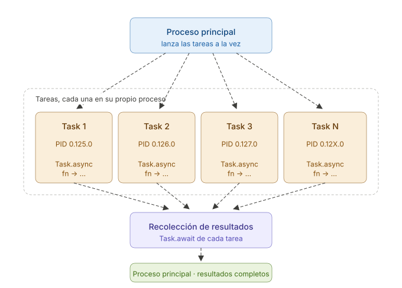
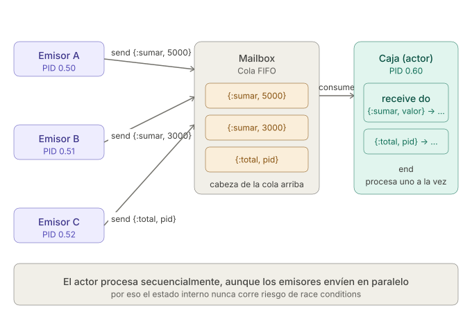

```
Universidad del Quindío
Programa de Ingeniería de Sistemas y Computación
Programación III - Procesos
Docente: Carlos Andrés Florez V.
```

# Procesos

Hasta ahora, todos los programas que hemos hecho se han ejecutado de forma secuencial. Cada instrucción espera a que termine la anterior, y eso funciona bien mientras cada paso tome poco tiempo. Sin embargo, muchos programas pasan buena parte de su tiempo esperando, por ejemplo la respuesta de un servidor, de una base de datos o de otro computador en la red, y mientras esperan no hacen nada más.

Elixir resuelve este problema con **procesos**, que son unidades de ejecución ligeras que avanzan al mismo tiempo, no comparten memoria y se comunican enviándose mensajes. Los procesos son la base de lo que se verá en el resto del curso, desde las aplicaciones distribuidas hasta los supervisores.

---

## Ejemplo 1: Un comparador de precios

Suponga que se quiere construir un comparador de precios. El programa consulta el precio de un producto en cinco tiendas en línea y al final muestra cuál lo vende más barato. Cada tienda tarda un tiempo distinto en responder, entre uno y cinco segundos, así que la consulta se simula con `:timer.sleep/1`.

### Versión 1: Una tienda tras otra

```elixir
defmodule Comparador do
  def main do
    tiendas = [{"Tienda A", 1}, {"Tienda B", 2}, {"Tienda C", 3}, {"Tienda D", 4}, {"Tienda E", 5}]

    consultar_precios(tiendas)
    |> mostrar_mas_barata()
  end

  defp consultar_precios(tiendas) do
    Enum.map(tiendas, fn {tienda, segundos} -> consultar_precio(tienda, segundos) end)
  end

  # Simula la consulta del precio en una tienda que tarda `segundos` en responder
  defp consultar_precio(tienda, segundos) do
    IO.puts("Consultando #{tienda}...")
    :timer.sleep(segundos * 1000)
    precio = :rand.uniform(100) * 1000
    IO.puts("#{tienda} respondió: $#{precio}")
    {tienda, precio}
  end

  defp mostrar_mas_barata(precios) do
    {tienda, precio} = Enum.min_by(precios, fn {_tienda, precio} -> precio end)
    IO.puts("La más barata es #{tienda} con $#{precio}")
  end
end

Comparador.main()
```

Ejecute el código y cuente cuánto tarda en mostrar el resultado.

El programa tarda unos **15 segundos**, la suma de lo que tarda cada tienda (1 + 2 + 3 + 4 + 5). Cada consulta espera a que termine la anterior, aunque ninguna necesita el resultado de otra. Además, durante casi todo ese tiempo el programa no hace nada, solo espera a que cada tienda responda.

Entonces, ¿por qué la consulta a la Tienda B tiene que esperar a que responda la Tienda A? Si las cinco consultas avanzaran al mismo tiempo, el programa tardaría lo que tarda la tienda más lenta, es decir, cinco segundos. Para lograrlo se necesita **concurrencia**.

### Concurrencia, paralelismo y procesos

La **concurrencia** es la capacidad de un sistema para gestionar múltiples tareas al mismo tiempo, compartiendo los recursos disponibles. El sistema alterna la ejecución de las distintas tareas, de modo que todas puedan avanzar sin necesidad de que una termine completamente antes de que otra comience.

Es lo que hace un sistema operativo cuando mantiene abiertos un reproductor de música, un navegador y un editor de texto. Aunque haya un solo procesador, los programas parecen ejecutarse *simultáneamente*, porque el sistema reparte el tiempo de CPU entre ellos. En el comparador, la concurrencia permitiría que las cinco consultas estén en curso a la vez, en lugar de esperar una tras otra.

El **paralelismo**, en cambio, es la ejecución realmente simultánea de varias tareas, aprovechando **varios procesadores o núcleos**. Cada tarea avanza al mismo tiempo en una unidad de procesamiento distinta.

El siguiente diagrama compara los dos casos:



En los sistemas operativos, un **proceso** es un programa en ejecución que tiene su propia memoria y es independiente de los demás. Elixir toma esa misma idea, pero sus procesos no son del sistema operativo, sino **procesos ligeros gestionados por la máquina virtual BEAM**. Cada uno ocupa apenas unos kilobytes, así que un programa puede crear miles de ellos sin problema. En Elixir, la concurrencia se consigue creando procesos.

### Versión 2: Un proceso por tienda

Al ejecutar un programa se crea automáticamente un **proceso principal**, y todo el código corre dentro de él. La función `spawn/1` recibe una función anónima y la ejecuta en un **proceso nuevo**, llamado proceso hijo. El proceso principal no espera a que el hijo termine, sino que sigue de inmediato con la siguiente instrucción.

`spawn/1` devuelve el **PID** (*Process Identifier*) del proceso creado, un identificador único que sirve para referirse a él. Un proceso también puede conocer su propio PID con `self/0`.

En esta versión, `lanzar_consultas/1` crea un proceso por cada tienda e imprime su PID. Se usa `Enum.each` en lugar de `Enum.map` porque `spawn` no devuelve el resultado de la función, sino el PID:

```elixir
defmodule Comparador do
  def main do
    tiendas = [{"Tienda A", 1}, {"Tienda B", 2}, {"Tienda C", 3}, {"Tienda D", 4}, {"Tienda E", 5}]
    IO.inspect(self(), label: "Proceso principal")

    lanzar_consultas(tiendas)
    IO.puts("Programa finalizado")
  end

  # Crea un proceso por cada tienda
  defp lanzar_consultas(tiendas) do
    Enum.each(tiendas, fn {tienda, segundos} ->
      pid = spawn(fn -> consultar_precio(tienda, segundos) end)
      IO.puts("#{tienda} se consulta en el proceso #{inspect(pid)}")
    end)
  end

  defp consultar_precio(tienda, segundos) do
    IO.puts("Consultando #{tienda}...")
    :timer.sleep(segundos * 1000)
    precio = :rand.uniform(100) * 1000
    IO.puts("#{tienda} respondió: $#{precio}")
    {tienda, precio}
  end
end

Comparador.main()
```

Un PID no se puede interpolar directamente en una cadena, por eso se usa `inspect/1`, que lo convierte en un texto como `#PID<0.101.0>`.

Al ejecutarlo, la salida es parecida a esta:

```
Proceso principal: #PID<0.94.0>
Tienda A se consulta en el proceso #PID<0.101.0>
Consultando Tienda A...
Tienda B se consulta en el proceso #PID<0.102.0>
Consultando Tienda B...
Tienda C se consulta en el proceso #PID<0.103.0>
Consultando Tienda C...
Tienda D se consulta en el proceso #PID<0.104.0>
Consultando Tienda D...
Tienda E se consulta en el proceso #PID<0.105.0>
Consultando Tienda E...
Programa finalizado
```

Cada consulta corre en un proceso distinto, con su propio PID, y las cinco empiezan casi al mismo tiempo. Pero **ninguna tienda responde**, y el programa termina al instante.

Un proceso hijo no depende de quien lo creó, y sigue su camino por su cuenta. Sin embargo, cuando se ejecuta un script con `elixir`, la máquina virtual se detiene en cuanto el proceso principal termina, y con ella se detienen **todos los procesos**, hayan terminado su tarea o no. Aquí el principal crea los cinco procesos, imprime `Programa finalizado` y termina, mucho antes de que pase el primer segundo.



El Caso B del diagrama es lo que acaba de ocurrir. Para llegar al Caso A, hay que darles tiempo a los hijos. Agregue una pausa en `main`, antes de `IO.puts("Programa finalizado")`:

```elixir
:timer.sleep(3500) # Espera a que las consultas terminen
```

Ahora, a los 3,5 segundos ya respondieron las tiendas A, B y C, algo que en la Versión 1 tomaba 6 segundos. Sin embargo, esta versión tiene dos problemas:

* Las tiendas D y E nunca responden, porque tardan más que la pausa. El `:timer.sleep(3500)` es una suposición, y si se cambia por `:timer.sleep(6000)` funciona hasta que alguna tienda tarde más.
* El proceso principal no recibe los precios, así que no puede decir cuál tienda es la más barata. Cada precio se queda en el proceso que lo consultó.

> ⚠️ **Nota:** también existe `spawn/3`, que recibe el módulo, el nombre de la función como átomo y la lista de argumentos, por ejemplo `spawn(Comparador, :consultar_precio, ["Tienda A", 1])`. Hace lo mismo que `spawn/1`, pero la función debe ser pública (`def`).

### ¿Y si una tienda falla?

Los procesos traen otra ventaja además de la velocidad. Suponga que la Tienda C está caída y su consulta lanza un error. En la Versión 2, reemplace `lanzar_consultas/1` por esta versión y cambie la pausa de `main` por `:timer.sleep(5500)`, para que alcancen a responder todas las demás:

```elixir
# Crea un proceso por cada tienda
defp lanzar_consultas(tiendas) do
  Enum.each(tiendas, fn {tienda, segundos} ->
    pid =
      spawn(fn ->
        if tienda == "Tienda C", do: raise("La #{tienda} no responde")
        consultar_precio(tienda, segundos)
      end)
    IO.puts("#{tienda} se consulta en el proceso #{inspect(pid)}")
  end)
end
```

Al ejecutarlo, aparece el error de la Tienda C, con el PID de su proceso, pero las otras cuatro tiendas responden y el programa llega hasta el final. Estas son las últimas líneas de la salida:

```
[error] Process #PID<0.103.0> raised an exception
** (RuntimeError) La Tienda C no responde
Tienda A respondió: $16000
Tienda B respondió: $55000
Tienda D respondió: $8000
Tienda E respondió: $71000
Programa finalizado
```

Ahora compare con la Versión 1. Reemplace su función `consultar_precios/1` por esta, que provoca el mismo error:

```elixir
defp consultar_precios(tiendas) do
  Enum.map(tiendas, fn {tienda, segundos} ->
    if tienda == "Tienda C", do: raise("La #{tienda} no responde")
    consultar_precio(tienda, segundos)
  end)
end
```

Allí el error detiene todo el programa y las tiendas D y E nunca se consultan. En la Versión 2, como cada proceso está **aislado**, el fallo de uno no afecta a los demás.

### Versión 3: Los precios vuelven al principal

Los procesos en Elixir no comparten variables, así que se comunican enviándose **mensajes**. Cada proceso tiene una **cola de mensajes** (*mailbox*) donde se guardan los mensajes que le llegan de otros procesos.

* Para enviar un mensaje se usa `send/2`, que recibe el PID del proceso receptor y el mensaje.
* Para recibirlo se usa `receive`, que toma el primer mensaje de la cola que coincida con alguno de sus patrones. Si no hay ninguno, el proceso se queda esperando hasta que llegue.

La comunicación es **asíncrona**, lo que significa que `send` deja el mensaje en la cola del receptor y el emisor sigue de inmediato, sin esperar a que el receptor lo lea.

Con mensajes se resuelven los dos problemas de la Versión 2. Cada consulta le envía su precio al proceso principal, y el proceso principal espera un mensaje por cada tienda:

```elixir
defmodule Comparador do
  def main do
    tiendas = [{"Tienda A", 1}, {"Tienda B", 2}, {"Tienda C", 3}, {"Tienda D", 4}, {"Tienda E", 5}]
    principal = self()  # PID del proceso principal, para que las consultas sepan a quién responder

    lanzar_consultas(tiendas, principal)

    tiendas
    |> recibir_precios()
    |> mostrar_mas_barata()
  end

  defp lanzar_consultas(tiendas, principal) do
    Enum.each(tiendas, fn {tienda, segundos} ->
      spawn(fn ->
        resultado = consultar_precio(tienda, segundos)
        send(principal, {:precio, resultado}) # Le envía el precio al proceso principal
      end)
    end)
  end

  # Espera un mensaje por cada tienda
  defp recibir_precios(tiendas) do
    Enum.map(tiendas, fn _tienda ->
      receive do
        {:precio, resultado} -> resultado
      end
    end)
  end

  defp consultar_precio(tienda, segundos) do
    IO.puts("Consultando #{tienda}...")
    :timer.sleep(segundos * 1000)
    precio = :rand.uniform(100) * 1000
    IO.puts("#{tienda} respondió: $#{precio}")
    {tienda, precio}
  end

  defp mostrar_mas_barata(precios) do
    {tienda, precio} = Enum.min_by(precios, fn {_tienda, precio} -> precio end)
    IO.puts("La más barata es #{tienda} con $#{precio}")
  end
end

Comparador.main()
```

Ejecute el código. Responden las cinco tiendas, el programa muestra la más barata y tarda unos **5 segundos**, lo que tarda la tienda más lenta. Ya no hay que adivinar cuánto esperar, porque cada `receive` espera hasta que llegue un precio.

> ⚠️ **Importante:** el PID del proceso principal se guarda en `principal` **antes** de llamar a `spawn`. Si se escribiera `send(self(), ...)` dentro de la función del `spawn`, `self()` devolvería el PID del proceso hijo, así que cada consulta se enviaría el precio a sí misma y el proceso principal se quedaría esperando para siempre. Pruébelo.

Funciona, pero hay que encargarse de varios detalles a mano. Hay que guardar el PID del principal, enviar el resultado con `send` y escribir un `receive` por cada tienda. Además, si una tienda nunca respondiera, su `receive` esperaría para siempre y el programa no terminaría. En el Ejercicio 4 investigará cómo ponerle un límite de tiempo a esa espera.

### Versión 4: El comparador con `Task`

El módulo `Task` permite ejecutar una función en otro proceso y recoger su resultado cuando esté listo, sin escribir `send` ni `receive`. Sus funciones más comunes son:

- `Task.async/1`: crea un proceso que ejecuta la función y devuelve un struct `Task` que lo identifica.
- `Task.await/2`: espera a que ese proceso termine y devuelve el valor que retornó la función. El segundo argumento es el tiempo máximo de espera en milisegundos, y si se omite es de 5 segundos.

Con `Task`, la Versión 3 se reduce a lanzar cada consulta con `Task.async` y recoger su precio con `Task.await`:

```elixir
defmodule Comparador do
  def main do
    tiendas = [{"Tienda A", 1}, {"Tienda B", 2}, {"Tienda C", 3}, {"Tienda D", 4}, {"Tienda E", 5}]

    lanzar_consultas(tiendas)
    |> esperar_precios()
    |> mostrar_mas_barata()
  end

  # Lanza las cinco consultas al mismo tiempo
  defp lanzar_consultas(tiendas) do
    Enum.map(tiendas, fn {tienda, segundos} ->
      Task.async(fn -> consultar_precio(tienda, segundos) end)
    end)
  end

  # Espera el precio de cada consulta
  defp esperar_precios(tareas) do
    Enum.map(tareas, fn tarea -> Task.await(tarea) end)
  end

  defp consultar_precio(tienda, segundos) do
    IO.puts("Consultando #{tienda}...")
    :timer.sleep(segundos * 1000)
    precio = :rand.uniform(100) * 1000
    IO.puts("#{tienda} respondió: $#{precio}")
    {tienda, precio}
  end

  defp mostrar_mas_barata(precios) do
    {tienda, precio} = Enum.min_by(precios, fn {_tienda, precio} -> precio end)
    IO.puts("La más barata es #{tienda} con $#{precio}")
  end
end

Comparador.main()
```

Ejecute el código y compárelo con la Versión 3. Tarda lo mismo, unos **5 segundos**, pero ya no aparecen `self()`, `send` ni `receive`. Por dentro, `Task` hace lo mismo que se hizo a mano, porque el proceso de la tarea le envía su resultado a quien la creó, y `Task.await` lo recibe.

El siguiente diagrama muestra esa estructura. El proceso principal lanza una tarea por tienda con `Task.async`, cada una en su propio proceso con su PID, y luego recoge sus resultados con `Task.await`.



Este otro diagrama compara los tiempos de la Versión 1 y la Versión 4. Cada barra es la consulta a una tienda, de la A a la E:



> ⚠️ **Importante:** si agrega una tienda que tarde más de 5 segundos, recuerde el límite de `Task.await`. Si la tarea no termina a tiempo, el programa se detiene con el error `** (exit) exited in: Task.await(..., 5000)`. Para esperar más, indique el tiempo, por ejemplo `Task.await(tarea, 10_000)`.

### ¿Y si una tienda falla con `Task`?

Repita el experimento de la tienda caída, pero ahora en la Versión 4. Reemplace la función `lanzar_consultas` por esta:

```elixir
defp lanzar_consultas(tiendas) do
  Enum.map(tiendas, fn {tienda, segundos} ->
    Task.async(fn ->
      if tienda == "Tienda C", do: raise("La #{tienda} no responde")
      consultar_precio(tienda, segundos)
    end)
  end)
end
```

Ejecute el código y compárelo con la Versión 2. Esta vez el programa completo se detiene y ninguna tienda alcanza a responder. `Task.async` **enlaza** la tarea con el proceso que la creó, porque supone que ese resultado se necesita. Si la tarea falla, el creador falla también, en lugar de quedarse esperando un resultado que nunca llegará.

Por eso `spawn` y `Task` no son intercambiables. `spawn` sirve para procesos independientes, cuyo fallo no debe afectar a nadie. `Task` sirve para tareas cuyo resultado se necesita.

---

## Ejemplo 2: Una caja registradora

Las consultas del comparador son tareas. Cada una calcula un precio, lo entrega y termina. Otros procesos, en cambio, **viven todo el tiempo** que dure el programa, atendiendo los mensajes que les llegan y guardando información entre un mensaje y otro.

Es el caso de una caja registradora. Recibe las ventas de la tienda, las va sumando y, cuando alguien lo pide, informa el total vendido.

### Versión 1: Una caja que atiende una venta

Se empieza por lo más simple. La caja es un proceso que espera un mensaje `{:sumar, valor}` y lo imprime:

```elixir
defmodule Caja do
  def main do
    IO.puts("Iniciando caja registradora")
    caja = abrir()

    # El proceso principal le envía una venta a la caja
    send(caja, {:sumar, 5000})
    # Este segundo mensaje llega al mailbox, pero la caja ya no lo atiende
    send(caja, {:sumar, 3000})

    IO.puts("Ventas enviadas a la caja")

    # Da tiempo a la caja de atender el mensaje antes de que el programa termine
    :timer.sleep(100)
    IO.puts("Fin de la jornada")
  end

  # Crea el proceso receptor, que espera un mensaje en su mailbox
  defp abrir do
    spawn(fn ->
      receive do
        {:sumar, valor} -> # Si el mensaje coincide con el patrón, lo atiende
          IO.puts("Venta registrada por $#{valor}")
      end
    end)
  end
end

Caja.main()
```

Al ejecutarlo, la salida es:

```
Iniciando caja registradora
Ventas enviadas a la caja
Venta registrada por $5000
Fin de la jornada
```

La venta de $3000 no aparece, porque la caja termina después de atender el primer mensaje.

### Versión 2: Atender muchas ventas y llevar el total

Una caja que solo atiende una venta no sirve de mucho. Para que un proceso reciba múltiples mensajes se utiliza un **bucle recursivo**, que vuelve a esperar después de atender cada mensaje. Ese mismo bucle permite que la caja lleve el total vendido, porque el total viaja como argumento de una llamada a la siguiente:

```elixir
defmodule Caja do
  def main do
    IO.puts("Iniciando caja registradora")
    caja = abrir()
    enviar_mensajes(caja)

    # Da tiempo a la caja de atender los mensajes antes de que el programa termine
    :timer.sleep(100)
    IO.puts("Fin de la jornada")
  end

  # Crea el proceso con un total inicial de 0
  defp abrir do
    spawn(fn -> loop(0) end)
  end

  defp enviar_mensajes(caja) do
    send(caja, {:sumar, 5000})
    send(caja, {:sumar, 3000})
    send(caja, :mostrar)
    send(caja, :cerrar)
  end

  defp loop(total) do
    receive do
      {:sumar, valor} ->
        IO.puts("Venta registrada por $#{valor}")
        loop(total + valor) # Vuelve a esperar otro mensaje, ahora con el total actualizado
      :mostrar ->
        IO.puts("Total vendido: $#{total}")
        loop(total)
      :cerrar ->
        IO.puts("Caja cerrada")
        :ok # No vuelve a llamar a loop, así que el proceso termina
    end
  end
end

Caja.main()
```

Esta vez la caja recibe los cuatro mensajes y los atiende uno tras otro, en el orden en que llegaron a su cola. Cada mensaje se compara con los patrones del `receive`, y se ejecuta la rama del primero que coincida.

### Versión 3: Preguntarle el total a la caja

Las dos versiones anteriores todavía terminan con un `:timer.sleep(100)`, porque el proceso principal no tiene forma de saber cuándo la caja terminó. Además, el total solo se puede ver en pantalla, y el proceso principal no lo puede usar.

La solución es que la caja **responda con otro mensaje**. Para eso, quien pregunta envía su propio PID dentro del mensaje, igual que las consultas del comparador enviaban su precio al principal:

```elixir
defmodule Caja do
  def main do
    IO.puts("Iniciando caja registradora")
    caja = abrir()
    registrar_ventas(caja)

    total = consultar_total(caja)
    IO.puts("La caja respondió que el total vendido es $#{total}")
  end

  defp abrir do
    spawn(fn -> loop(0) end)
  end

  defp registrar_ventas(caja) do
    send(caja, {:sumar, 5000})
    send(caja, {:sumar, 3000})
  end

  defp consultar_total(caja) do
    # Le pide el total a la caja, indicándole a quién debe responder
    send(caja, {:total, self()})

    # Espera la respuesta en el mailbox del proceso principal
    receive do
      {:total, total} -> total
    end
  end

  defp loop(total) do
    receive do
      {:sumar, valor} ->
        loop(total + valor)
      {:total, remitente} ->
        send(remitente, {:total, total}) # Le responde al proceso que preguntó
        loop(total)
    end
  end
end

Caja.main()
```

Ejecute el código. Ya no hace falta la pausa, porque el `receive` del proceso principal espera exactamente hasta que llegue la respuesta. Como la caja atiende los mensajes en orden, cuando responde ya sumó las dos ventas.

### Versión 4: Un nombre para la caja

Para hablarle a la caja, cada función necesita su PID, así que hay que pasarlo de una función a otra (`registrar_ventas(caja)`, `consultar_total(caja)`). En un programa más grande, cualquier parte que quiera registrar una venta tendría que recibir ese PID.

El módulo `Process` permite **registrar un proceso con un nombre**. `Process.register/2` le asigna el nombre `:caja`, y desde ese momento `send(:caja, mensaje)` funciona igual que con el PID. El módulo también trae funciones para inspeccionar un proceso. `Process.whereis/1` devuelve el PID registrado con un nombre, `Process.info/2` consulta información como cuántos mensajes tiene pendientes, y `Process.alive?/1` indica si el proceso sigue activo.

El módulo completo queda así. La función `loop/1` es la misma de la Versión 3:

```elixir
defmodule Caja do
  def main do
    IO.puts("Iniciando caja registradora")
    abrir()
    registrar_ventas()
    inspeccionar()

    total = consultar_total()
    IO.puts("La caja respondió que el total vendido es $#{total}")
  end

  # Crea el proceso de la caja y lo registra con el nombre :caja
  defp abrir do
    pid = spawn(fn -> loop(0) end)
    Process.register(pid, :caja)
  end

  # Con el nombre registrado, ya no hace falta pasar el PID de una función a otra
  defp registrar_ventas do
    send(:caja, {:sumar, 5000})
    send(:caja, {:sumar, 3000})
    send(:caja, {:sumar, 2000})
  end

  # Se inspecciona el proceso con funciones del módulo Process
  defp inspeccionar do
    pid = Process.whereis(:caja)
    IO.inspect(Process.info(pid, :message_queue_len), label: "Mensajes pendientes")
    IO.puts("¿La caja sigue abierta? #{Process.alive?(pid)}")
  end

  defp consultar_total do
    send(:caja, {:total, self()})

    receive do
      {:total, total} -> total
    end
  end

  defp loop(total) do
    receive do
      {:sumar, valor} ->
        loop(total + valor)
      {:total, remitente} ->
        send(remitente, {:total, total}) # Le responde al proceso que preguntó
        loop(total)
    end
  end
end

Caja.main()
```

La salida es:

```
Iniciando caja registradora
Mensajes pendientes: {:message_queue_len, 3}
¿La caja sigue abierta? true
La caja respondió que el total vendido es $10000
```

> ⚠️ **Importante:** lo más probable es que `Mensajes pendientes` muestre `{:message_queue_len, 3}`. El proceso principal envía las tres ventas y consulta la cola de inmediato, y casi siempre lo hace antes de que la caja alcance a atenderlas. Pero **nada lo garantiza**. Según cómo la BEAM reparta el tiempo de CPU, la caja podría atender algunas antes de la consulta y el valor sería menor.
>
> Esta es la razón por la que **no se debe depender del orden de ejecución entre procesos**. Si un proceso necesita saber que otro ya terminó, debe enterarse **por un mensaje**, como hace `consultar_total/0`, no por suposiciones de tiempo.

Para conocer las demás funciones del módulo, puede consultar la [documentación oficial de Process](https://hexdocs.pm/elixir/Process.html).

### El Modelo de Actores

La caja es un **actor**, la unidad central del **Modelo de Actores**, un modelo de computación concurrente propuesto por Carl Hewitt en 1973 sobre el cual están construidos Elixir y Erlang. Un actor cumple estas características, y la caja las cumple todas:

1. **Tiene estado privado.** El total vive dentro del proceso de la caja y ningún otro proceso puede leerlo ni cambiarlo directamente.
2. **Se comunica solo mediante mensajes.** Para sumar una venta o conocer el total hay que enviarle un mensaje.
3. **Procesa un mensaje a la vez.** La caja atiende su cola en orden, uno por uno.
4. **Puede crear nuevos actores.** El proceso principal creó la caja y las consultas del comparador con `spawn`.
5. **Está aislado.** Si un actor falla, no afecta a los demás, como se vio con la tienda caída del comparador.

En Elixir, **todo proceso es un actor**, así que las consultas del comparador también lo son. Tienen su propia cola, están aisladas y se comunican con mensajes. La caja muestra el modelo completo, porque además tiene un estado privado.

En muchos otros lenguajes, la concurrencia se implementa con **hilos** que comparten la misma memoria. Si dos hilos modifican el mismo dato al mismo tiempo, el resultado puede quedar mal (lo que se conoce como *race condition*). Con actores ese problema no aparece.

El siguiente diagrama lo muestra con la caja. Aunque tres procesos le envíen mensajes al mismo tiempo, los mensajes se acumulan en orden en su cola, y la caja los atiende uno a uno con coincidencia de patrones. Nunca hay dos ventas sumándose a la vez sobre el mismo total.



La siguiente tabla resume las diferencias entre los dos enfoques:

| Característica              | Hilos tradicionales                           | Modelo de Actores                                     |
| --------------------------- | --------------------------------------------- | ----------------------------------------------------- |
| **Memoria**                 | Compartida entre hilos                        | Cada actor tiene la suya                              |
| **Comunicación**            | Leyendo y escribiendo variables compartidas   | Enviando mensajes                                     |
| **Protección de los datos** | Bloqueos (*locks*) puestos por el programador | No hace falta, cada actor atiende un mensaje a la vez |
| **Peso**                    | Pesados (megabytes de memoria)                | Ligeros (kilobytes de memoria)                        |

Por eso Elixir es adecuado para servidores web, aplicaciones de mensajería o sistemas que requieren alta disponibilidad.

---

## Tareas y procesos que viven: ¿cuándo usar cada uno?

Los dos problemas de la guía representan las dos formas típicas de usar procesos:

| Característica           | Proceso que vive (`spawn` con un bucle)                    | Tarea (`Task`)                                                    |
| ------------------------ | ---------------------------------------------------------- | ----------------------------------------------------------------- |
| **Ejemplo en la guía**   | La caja registradora                                       | Las consultas a las tiendas                                       |
| **Cómo se crea**         | `spawn(fn -> loop(estado) end)`                            | `Task.async(fn -> ... end)`                                       |
| **Cuánto dura**          | Todo el programa, atendiendo mensajes                      | Lo que tarde en calcular su resultado                             |
| **Obtener información**  | Enviándole un mensaje con el PID de quien pregunta         | Con `Task.await`                                                  |
| **Si el proceso falla**  | Solo muere ese proceso                                     | El error llega al proceso que lo creó                             |

Para profundizar un poco más en este tema puede revisar [esta página de Elixir School](https://elixirschool.com/en/lessons/intermediate/concurrency).

## ¿Cuándo no conviene usar procesos?

Los procesos ayudan cuando hay tareas que no dependen entre sí y que pasan buena parte del tiempo esperando, como las consultas a las tiendas. No ayudan en estos casos:

* **Cuando una tarea necesita el resultado de otra.** Si para consultar la Tienda B se necesitara la respuesta de la Tienda A, la consulta B tendría que esperar de todas formas.
* **Cuando las tareas son muy cortas.** Crear un proceso cuesta poco, pero no es gratis. Duplicar 100.000 números con `Enum.map` es muy rápido, mientras que lanzar un `Task.async` por cada número tarda cientos de milisegundos, porque se gasta más tiempo creando procesos que haciendo el trabajo.

---

## Ejercicios propuestos

### Ejercicio 1: Información de una ruta

Una aplicación de mapas debe mostrarle al usuario el estado del tráfico y el clima de su ruta. Ambas consultas son costosas e independientes entre sí, y se simulan con estas funciones:

```elixir
defmodule Ruta do
  # Simula la consulta del tráfico, que es la más lenta
  def consultar_trafico(via) do
    IO.puts("[Tráfico] Consultando #{via}...")
    :timer.sleep(3000)
    "[Tráfico] Congestión moderada en #{via}"
  end

  # Simula la consulta del clima
  def consultar_clima(ciudad) do
    IO.puts("[Clima] Consultando #{ciudad}...")
    :timer.sleep(1000)
    "[Clima] Lluvia ligera en #{ciudad}"
  end
end
```

1. Escriba una función `mostrar_informacion/0` que haga ambas consultas de forma secuencial e imprima sus resultados.
2. Escriba otra versión que haga las dos consultas de forma concurrente con `Task`, y que mientras tanto imprima un mensaje indicando que el mapa sigue respondiendo.
3. Antes de ejecutarlas, estime cuánto tardará cada versión. Luego compruebe su estimación con `:timer.tc/1`, que recibe una función, la ejecuta y devuelve una tupla `{microsegundos, resultado}`.

### Ejercicio 2: Contador con historial

Cree un script que implemente un actor contador. El actor debe mantener como estado el valor del contador y la lista de operaciones que ha recibido, y debe responder a los siguientes mensajes:

- `{:incrementar, n}`: Incrementa el contador en `n`.
- `{:decrementar, n}`: Decrementa el contador en `n`.
- `{:obtener, pid}`: Envía el valor actual del contador al proceso con PID `pid`.
- `{:historial, pid}`: Envía la lista de operaciones recibidas, en el orden en que llegaron, por ejemplo `[{:incrementar, 5}, {:decrementar, 2}]`.
- `:reiniciar`: Reinicia el contador a 0 y borra el historial.
- `:detener`: Detiene el actor, es decir, el proceso termina sin volver a esperar mensajes.

Registre el actor con un nombre y asegúrese de que su implementación cumpla con las características del Modelo de Actores.

### Ejercicio 3: Pedidos a la cocina

En un restaurante, los meseros le envían los pedidos a la cocina y esperan a que el plato esté listo para llevarlo a la mesa. La cocina es un proceso que recibe mensajes `{:pedido, plato, mesero}`, prepara el plato y le responde al mesero con `{:listo, plato}`. Cada plato tarda un tiempo distinto en prepararse, y si el plato no está en el menú, la cocina no responde nada:

```elixir
defmodule Cocina do
  @tiempos %{"Arepa" => 1, "Bandeja paisa" => 2, "Sancocho" => 4}

  def abrir do
    spawn(fn -> loop() end)
  end

  defp loop do
    receive do
      {:pedido, plato, mesero} ->
        preparar(plato, mesero)
        loop()
    end
  end

  defp preparar(plato, mesero) do
    case @tiempos[plato] do
      nil ->
        IO.puts("[Cocina] No hay #{plato}") # No le responde al mesero
      segundos ->
        :timer.sleep(segundos * 1000)
        send(mesero, {:listo, plato})
    end
  end
end
```

Resuelva el ejercicio con `send` y `receive`, sin usar `Task`.

1. Escriba un módulo `Mesero` cuya función `main` abra la cocina, le pida una "Arepa", espere la respuesta e imprima `[Mesero] Llevando Arepa a la mesa`. Luego haga lo mismo con una "Bandeja paisa".
2. Agregue un pedido de "Lasaña", que no está en el menú, y ejecute el programa. ¿Qué ocurre? ¿Por qué el programa no termina?
3. Investigue cómo funciona el bloque `after` dentro de `receive` y úselo para que el mesero espere como máximo 3 segundos por cada plato. Si la cocina no responde a tiempo, el mesero debe imprimir `[Mesero] La cocina no respondió por Lasaña` y seguir con el siguiente pedido.
4. Pida un "Sancocho", que tarda 4 segundos, y justo después una "Arepa". ¿Qué imprime el mesero en cada pedido? ¿Qué pasó con la respuesta del sancocho, que llegó tarde? Investigue el operador pin (`^`) y úselo en el patrón del `receive` para que el mesero solo acepte la respuesta del plato que pidió.
5. La cocina espera pedidos sin límite de tiempo, porque su `receive` no tiene `after`. ¿Por qué en su caso eso sí tiene sentido?

### Ejercicio 4: Un comparador que no espera para siempre

En la Versión 3 del comparador, ¿qué pasaría si una tienda nunca respondiera? Use lo que aprendió sobre `after` en el Ejercicio 3 para que el comparador espere cada precio como máximo 6 segundos y muestre la más barata entre las tiendas que sí respondieron a tiempo. Para probarlo, haga que una de las tiendas tarde 10 segundos.

### Ejercicio 5: Pago con un banco

Una tienda en línea procesa los pagos a través de un banco. Mientras el banco valida la transacción, la tienda le muestra al cliente el mensaje "Procesando pago...", y cuando llega la respuesta le confirma si el pago fue aprobado o rechazado. El banco se simula con este módulo:

```elixir
defmodule Banco do
  # Valida la transacción y responde con el resultado
  def procesar_pago(monto) do
    IO.puts("[Banco] Procesando pago por $#{monto}...")
    :timer.sleep(500)

    if monto <= 500_000 do
      {:aprobado, monto}
    else
      {:rechazado, "fondos insuficientes"}
    end
  end
end
```

1. Escriba un módulo `Tienda` que procese el pago en otro proceso usando `spawn`, `send` y `receive`. Pruébelo con un pago de \$120.000 y otro de \$800.000.
2. Escriba otra versión usando `Task.async` y `Task.await`.
3. Compare las dos versiones. ¿Qué tuvo que hacer a mano en la primera que `Task` resuelve por usted?

---

## Para la próxima clase

- Investigar sobre aplicaciones distribuidas en Elixir y cómo los procesos pueden comunicarse a través de nodos. Puede leer sobre el módulo `Node` en la documentación oficial de Elixir: [https://hexdocs.pm/elixir/Node.html](https://hexdocs.pm/elixir/Node.html).
- Leer sobre redes locales, direcciones IP y comunicación entre máquinas para entender mejor los sistemas distribuidos.
