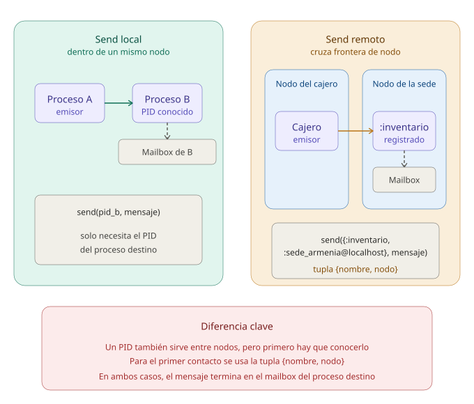
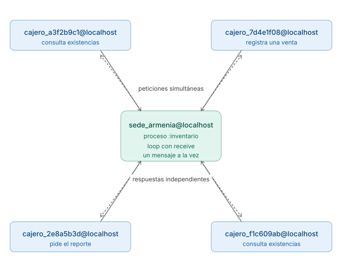
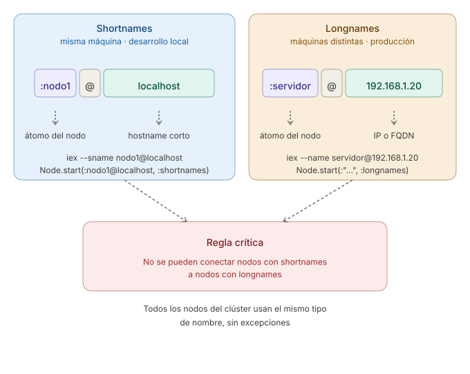

```
Universidad del Quindío
Programa de Ingeniería de Sistemas y Computación
Programación III - Aplicaciones Distribuidas y Concurrentes
Docente: Carlos Andrés Florez V.
```

# Aplicaciones distribuidas (Parte 1)

En los ejemplos vistos hasta ahora, **todos los procesos se ejecutaban en un mismo nodo**. Un **nodo** es una instancia de la máquina virtual BEAM en ejecución. Cada vez que se abre `iex` o se ejecuta `elixir archivo.exs`, se inicia un nodo nuevo, con sus propios procesos.

Elixir permite que los procesos de **nodos diferentes** se comuniquen entre sí, ya sea que los nodos estén en una misma máquina o en computadores distintos conectados por red. Así se construyen las **aplicaciones distribuidas**. La comunicación sigue siendo la que ya se conoce, con `send` y `receive`. Lo que cambia es cómo se encuentra al proceso con el que se quiere hablar.

---

## El problema: el inventario de una cadena de tiendas

Una cadena de tiendas tiene sedes en Armenia, Pereira y Manizales. En cada sede hay un computador que guarda el inventario de esa tienda, es decir, cuántas unidades hay de cada producto. Los cajeros trabajan en otros computadores y necesitan consultar ese inventario y registrar ventas.

En esta guía se construye el sistema para la sede de Armenia, versión por versión. En la segunda parte se agregan las otras sedes.

## Versión 1: Consultar la sede desde otra terminal

Para empezar, se usarán dos terminales en la misma máquina, cada una con su propio nodo. Una hará de sede y la otra de cajero.

### 1. Iniciar el nodo de la sede

En la primera terminal, ejecute:

```bash
iex --sname sede_armenia@localhost
```

La opción `--sname` le da un **nombre** al nodo, en este caso `sede_armenia@localhost`. Sin nombre, un nodo no puede comunicarse con otros. La parte después de `@` es la máquina donde corre el nodo. Si se escribe solo `--sname sede_armenia`, Elixir usa el nombre del computador (algo como `sede_armenia@Mac-de-Carlos`), así que conviene indicar `@localhost` para saber exactamente cómo se llama el nodo.

### 2. Crear el proceso que atiende las consultas

En la misma terminal de la sede, escriba:

```elixir
inventario = %{"arroz" => 12, "panela" => 30, "frijol" => 8}
Process.register(self(), :inventario)

receive do
  {:existencias, pid, producto} ->
    send(pid, {:existencias, producto, Map.get(inventario, producto)})
end
```

El proceso de la terminal se queda esperando un mensaje. Antes de eso, `Process.register/2` le da el nombre `:inventario`. Ese nombre es necesario porque el cajero está en otro nodo y no tiene forma de conocer el PID de este proceso. En cambio, sí puede saber cómo se llama.

### 3. Consultar desde el nodo del cajero

En una segunda terminal, inicie otro nodo:

```bash
iex --sname cajero@localhost
```

Y escriba:

```elixir
Node.connect(:sede_armenia@localhost)
send({:inventario, :sede_armenia@localhost}, {:existencias, self(), "arroz"})

receive do
  {:existencias, producto, cantidad} -> IO.puts("Hay #{cantidad} unidades de #{producto}")
end
```

La terminal del cajero muestra:

```
Hay 12 unidades de arroz
```

`Node.connect/1` establece la conexión con el nodo de la sede y devuelve `true` si lo logra. Luego, `send/2` recibe como destino una tupla `{nombre_del_proceso, nombre_del_nodo}`, en lugar de un PID. Es la forma de enviarle un mensaje a un proceso registrado en otro nodo.



El mensaje lleva `self()`, el PID del cajero, igual que en la caja registradora de la guía de procesos. Un PID sí sirve entre nodos, así que la sede responde con `send(pid, ...)` sin necesidad de conocer el nombre del nodo del cajero.

**El problema de esta versión.** La sede atiende una sola consulta. Si el cajero vuelve a preguntar, nadie responde, porque el `receive` ya terminó. Además, escribir todo en `iex` en cada prueba no es práctico.

---

## Versión 2: Scripts y una sede que siempre escucha

Ahora cada nodo será un archivo `.exs`. La sede atiende las consultas en un **bucle recursivo**, como la caja registradora, y el inventario viaja como argumento de una vuelta a la siguiente.

Los scripts usan el módulo `Util` construido en guías anteriores para leer datos e imprimir mensajes. Asegúrese de tener `util.exs` compilado con `elixirc` en la misma carpeta de los scripts.

Cree el archivo `sede.exs`:

```elixir
defmodule Sede do
  @nombre_nodo :sede_armenia@localhost

  def main do
    case Node.start(@nombre_nodo, :shortnames) do
      {:ok, _} ->
        Process.register(self(), :inventario)
        Util.imprimir_mensaje("Sede iniciada en #{node()}")
        Util.imprimir_mensaje("Esperando consultas de los cajeros...\n")
        loop(inventario_inicial())

      {:error, _} ->
        Util.imprimir_error("No se pudo iniciar el nodo. Verifique que epmd esté corriendo y que el nombre no esté en uso")
    end
  end

  defp inventario_inicial do
    %{"arroz" => 12, "panela" => 30, "frijol" => 8}
  end

  # Atiende un mensaje y vuelve a esperar el siguiente, con el inventario actualizado
  defp loop(inventario) do
    receive do
      {:existencias, pid, producto} ->
        Util.imprimir_mensaje("[#{hora_actual()}] Consulta de #{producto}")
        send(pid, consultar(inventario, producto))
        loop(inventario)
    end
  end

  defp consultar(inventario, producto) do
    case Map.get(inventario, producto) do
      nil -> {:error, :producto_no_existe}
      cantidad -> {:existencias, producto, cantidad}
    end
  end

  defp hora_actual do
    NaiveDateTime.local_now() |> NaiveDateTime.to_time() |> Time.to_string()
  end
end

Sede.main()
```

Y el archivo `cajero.exs`:

```elixir
defmodule Cajero do
  @sede :sede_armenia@localhost

  def main do
    case Node.start(:cajero@localhost, :shortnames) do
      {:ok, _} -> conectar(Node.connect(@sede))
      {:error, _} -> Util.imprimir_error("No se pudo iniciar el nodo. Verifique que epmd esté corriendo y que el nombre no esté en uso")
    end
  end

  defp conectar(true) do
    Util.leer("Producto: ", :string)
    |> String.downcase()
    |> consultar()
  end

  defp conectar(false), do: Util.imprimir_error("No se pudo conectar con la sede #{@sede}")

  defp consultar(producto) do
    send({:inventario, @sede}, {:existencias, self(), producto})
    esperar_respuesta()
  end

  defp esperar_respuesta do
    receive do
      {:existencias, producto, cantidad} ->
        Util.imprimir_mensaje("Hay #{cantidad} unidades de #{producto}")

      {:error, :producto_no_existe} ->
        Util.imprimir_mensaje("Ese producto no existe en la sede")
    after
      5000 ->
        Util.imprimir_error("La sede no respondió a tiempo")
    end
  end
end

Cajero.main()
```

Hay tres cambios frente a la Versión 1:

- El nombre del nodo ya no se indica al abrir la terminal, sino con `Node.start/2`. El segundo argumento, `:shortnames`, indica que se usan nombres cortos, que sirven para nodos en la misma máquina.
- `consultar/2` responde `{:error, :producto_no_existe}` si el producto no está en el inventario.
- El cajero espera la respuesta como máximo 5 segundos con `after`, para no quedarse bloqueado si la sede no está activa.

Ejecute la sede en una terminal:

```bash
elixir sede.exs
```

Lo más probable es que vea este mensaje:

```
No se pudo iniciar el nodo. Verifique que epmd esté corriendo y que el nombre no esté en uso
```

### EPMD

Para que los nodos se encuentren, cada máquina tiene un servicio llamado **EPMD** (*Erlang Port Mapper Daemon*). Es un directorio de los nodos que se ejecutan en esa máquina, que relaciona cada nombre de nodo con el puerto de red por el que se comunica.

Cuando un nodo se abre desde la terminal con `iex --sname` o `elixir --sname`, EPMD **se inicia automáticamente**. Por eso la Versión 1 funcionó sin hacer nada más. En cambio, cuando el nodo se inicia desde un script con `Node.start/2`, EPMD **no se inicia solo**, y `Node.start/2` devuelve un error.

Para verificar si está corriendo:

```bash
epmd -names
```

Si responde `Cannot connect to local epmd`, inícielo con:

```bash
epmd -daemon
```

Ahora sí, ejecute la sede en una terminal y el cajero en otra:

```bash
# Terminal 1
elixir sede.exs
```

```bash
# Terminal 2
elixir cajero.exs
```

En la terminal del cajero:

```
Producto: arroz
Hay 12 unidades de arroz
```

Y en la de la sede, que sigue activa esperando más consultas:

```
Sede iniciada en sede_armenia@localhost
Esperando consultas de los cajeros...

[11:38:55] Consulta de arroz
```

Ejecute el cajero varias veces, con productos que existan y que no. La sede responde a todos.

**El problema de esta versión.** Abra un segundo cajero mientras el primero todavía está esperando que escriba el producto. El segundo no arranca:

```
[notice] Protocol 'inet_tcp': the name cajero@localhost seems to be in use by another Erlang node
No se pudo iniciar el nodo. Verifique que epmd esté corriendo y que el nombre no esté en uso
```

Dos nodos no pueden tener el mismo nombre en una máquina, y todos los cajeros se llaman `cajero@localhost`.

---

## Versión 3: Varios cajeros y ventas

**Nuevo requerimiento:** varios cajeros deben trabajar al mismo tiempo, y además de consultar deben poder **registrar ventas**, que descuentan unidades del inventario.

Para el primer punto, cada cajero genera un nombre de nodo distinto con una parte al azar, como `cajero_4f1a9c2e@localhost`. Para el segundo, la sede recibe un nuevo mensaje, `{:vender, pid, producto, cantidad}`, y en lugar de volver a llamar a `loop(inventario)` llama a `loop(nuevo_inventario)`.

En `sede.exs`, agregue esta cláusula al `receive` de `loop/1`, después de la de `:existencias`:

```elixir
{:vender, pid, producto, cantidad} ->
  Util.imprimir_mensaje("[#{hora_actual()}] Venta de #{cantidad} #{producto}")
  {respuesta, nuevo_inventario} = vender(inventario, producto, cantidad)
  send(pid, respuesta)
  loop(nuevo_inventario)
```

Y esta función al módulo:

```elixir
defp vender(inventario, producto, cantidad) do
  case Map.get(inventario, producto) do
    nil ->
      { {:error, :producto_no_existe}, inventario }

    disponibles when disponibles >= cantidad ->
      restantes = disponibles - cantidad
      { {:venta_ok, producto, restantes}, Map.put(inventario, producto, restantes) }

    _ ->
      { {:error, :sin_existencias}, inventario }
  end
end
```

`vender/3` devuelve una tupla con dos elementos, la respuesta para el cajero y el inventario que queda después de la venta. Si la venta no se puede hacer, el inventario vuelve sin cambios.

El cajero cambia en casi todas sus partes, así que conviene reemplazar el contenido completo de `cajero.exs` por:

```elixir
defmodule Cajero do
  @sede :sede_armenia@localhost

  def main do
    case Node.start(crear_nombre_nodo(), :shortnames) do
      {:ok, _} ->
        Util.imprimir_mensaje("Cajero iniciado en #{node()}")
        conectar(Node.connect(@sede))

      {:error, _} ->
        Util.imprimir_error("No se pudo iniciar el nodo. Verifique que epmd esté corriendo y que el nombre no esté en uso")
    end
  end

  # Cada cajero necesita un nombre de nodo distinto, porque puede haber varios a la vez
  defp crear_nombre_nodo do
    sufijo = :crypto.strong_rand_bytes(4) |> Base.encode16(case: :lower)
    String.to_atom("cajero_#{sufijo}@localhost")
  end

  defp conectar(true) do
    mostrar_menu()

    Util.leer("Seleccione una opción (1-2): ", :string)
    |> atender_opcion()
  end

  defp conectar(false), do: Util.imprimir_error("No se pudo conectar con la sede #{@sede}")

  defp mostrar_menu do
    Util.imprimir_mensaje("\n1 - Consultar existencias")
    Util.imprimir_mensaje("2 - Registrar una venta\n")
  end

  defp atender_opcion("1") do
    producto = leer_producto()
    enviar({:existencias, self(), producto})
  end

  defp atender_opcion("2") do
    producto = leer_producto()
    cantidad = leer_cantidad()
    enviar({:vender, self(), producto, cantidad})
  end

  defp atender_opcion(opcion), do: Util.imprimir_error("Opción inválida: #{opcion}")

  defp leer_producto do
    Util.leer("Producto: ", :string) |> String.downcase()
  end

  defp leer_cantidad do
    cantidad = Util.leer("Cantidad: ", :integer)

    if cantidad > 0 do
      cantidad
    else
      Util.imprimir_error("La cantidad debe ser mayor que cero")
      leer_cantidad()
    end
  end

  # Envía la petición al proceso :inventario de la sede y espera la respuesta
  defp enviar(mensaje) do
    send({:inventario, @sede}, mensaje)
    esperar_respuesta()
  end

  defp esperar_respuesta do
    receive do
      {:existencias, producto, cantidad} ->
        Util.imprimir_mensaje("Hay #{cantidad} unidades de #{producto}")

      {:venta_ok, producto, restantes} ->
        Util.imprimir_mensaje("Venta registrada. Quedan #{restantes} unidades de #{producto}")

      {:error, :producto_no_existe} ->
        Util.imprimir_mensaje("Ese producto no existe en la sede")

      {:error, :sin_existencias} ->
        Util.imprimir_mensaje("No hay suficientes unidades para esa venta")
    after
      5000 ->
        Util.imprimir_error("La sede no respondió a tiempo")
    end
  end
end

Cajero.main()
```

`leer_cantidad/0` usa `Util.leer/2` con `:integer`. Si el usuario escribe algo que no es un número, `Util` avisa y devuelve 0, y como 0 no es mayor que cero, la función vuelve a preguntar.

Con la sede activa, abra dos cajeros. En el primero, registre una venta de 2 unidades de arroz:

```
Seleccione una opción (1-2): 2
Producto: arroz
Cantidad: 2
Venta registrada. Quedan 10 unidades de arroz
```

En el segundo, consulte el arroz:

```
Seleccione una opción (1-2): 1
Producto: arroz
Hay 10 unidades de arroz
```

Los dos cajeros ven el mismo inventario, porque el inventario vive en un solo lugar, el proceso `:inventario` de la sede.



¿Qué pasa si dos cajeros intentan vender las últimas unidades de frijol al mismo tiempo? No hay problema. El proceso de la sede atiende **un mensaje a la vez**, así que una venta se registra completa antes de que empiece la otra, y la segunda recibe `{:error, :sin_existencias}`. Es la misma propiedad de los actores que se estudió en la guía de procesos, ahora entre nodos distintos.

---

## Versión 4: Un reporte que bloquea a los cajeros

**Nuevo requerimiento:** los cajeros deben poder pedir un **reporte** con todas las existencias de la sede. Generarlo tarda 5 segundos, lo que se simula con `:timer.sleep/1`.

En `sede.exs`, agregue esta función:

```elixir
# Simula un reporte que tarda 5 segundos en generarse
defp generar_reporte(inventario) do
  :timer.sleep(5000)

  inventario
  |> Enum.map(fn {producto, cantidad} -> "#{producto}: #{cantidad}" end)
  |> Enum.join("\n")
end
```

Y esta cláusula al `receive` de `loop/1`:

```elixir
{:reporte, pid} ->
  Util.imprimir_mensaje("[#{hora_actual()}] Reporte solicitado")
  send(pid, {:reporte, generar_reporte(inventario)})
  loop(inventario)
```

En `cajero.exs`, reemplace `mostrar_menu/0` por esta versión con la nueva opción:

```elixir
defp mostrar_menu do
  Util.imprimir_mensaje("\n1 - Consultar existencias")
  Util.imprimir_mensaje("2 - Registrar una venta")
  Util.imprimir_mensaje("3 - Pedir el reporte del inventario\n")
end
```

Agregue su cláusula en `atender_opcion/1`, antes de la cláusula de la opción inválida:

```elixir
defp atender_opcion("3"), do: enviar({:reporte, self()})
```

Y la respuesta en `esperar_respuesta/0`:

```elixir
{:reporte, texto} ->
  Util.imprimir_mensaje("Reporte del inventario:\n#{texto}")
```

Recuerde cambiar también el texto `"Seleccione una opción (1-2): "` por `"Seleccione una opción (1-3): "`.

Pruébelo con dos cajeros. En el primero pida el reporte, y enseguida, en el segundo, consulte cualquier producto. **La consulta tarda casi 5 segundos en responder**, aunque no tiene nada que ver con el reporte. Mientras la sede genera el reporte, su `loop` no vuelve al `receive`, y los demás mensajes esperan en la cola.

Hay un segundo problema. El cajero que pidió el reporte muestra `La sede no respondió a tiempo`, porque espera como máximo 5 segundos y el reporte tarda justo eso, más lo que tarda el mensaje en viajar. El tiempo de espera debe ser mayor que lo que tarda la operación más lenta.

La solución para el bloqueo es generar el reporte en **otro proceso**, con `spawn`. Reemplace la cláusula anterior por esta:

```elixir
{:reporte, pid} ->
  Util.imprimir_mensaje("[#{hora_actual()}] Reporte solicitado")
  # El reporte tarda, así que se genera en otro proceso para no bloquear a los cajeros
  spawn(fn -> send(pid, {:reporte, generar_reporte(inventario)}) end)
  loop(inventario)
```

Y en el cajero, agregue el atributo `@timeout 10000` al inicio del módulo y úselo en el `after` en lugar del `5000`. El código completo de esta versión es el siguiente.

`sede.exs`:

```elixir
defmodule Sede do
  @nombre_nodo :sede_armenia@localhost

  def main do
    case Node.start(@nombre_nodo, :shortnames) do
      {:ok, _} ->
        Process.register(self(), :inventario)
        Util.imprimir_mensaje("Sede iniciada en #{node()}")
        Util.imprimir_mensaje("Esperando consultas de los cajeros...\n")
        loop(inventario_inicial())

      {:error, _} ->
        Util.imprimir_error("No se pudo iniciar el nodo. Verifique que epmd esté corriendo y que el nombre no esté en uso")
    end
  end

  defp inventario_inicial do
    %{"arroz" => 12, "panela" => 30, "frijol" => 8}
  end

  # Atiende un mensaje y vuelve a esperar el siguiente, con el inventario actualizado
  defp loop(inventario) do
    receive do
      {:existencias, pid, producto} ->
        Util.imprimir_mensaje("[#{hora_actual()}] Consulta de #{producto}")
        send(pid, consultar(inventario, producto))
        loop(inventario)

      {:vender, pid, producto, cantidad} ->
        Util.imprimir_mensaje("[#{hora_actual()}] Venta de #{cantidad} #{producto}")
        {respuesta, nuevo_inventario} = vender(inventario, producto, cantidad)
        send(pid, respuesta)
        loop(nuevo_inventario)

      {:reporte, pid} ->
        Util.imprimir_mensaje("[#{hora_actual()}] Reporte solicitado")
        # El reporte tarda, así que se genera en otro proceso para no bloquear a los cajeros
        spawn(fn -> send(pid, {:reporte, generar_reporte(inventario)}) end)
        loop(inventario)
    end
  end

  defp consultar(inventario, producto) do
    case Map.get(inventario, producto) do
      nil -> {:error, :producto_no_existe}
      cantidad -> {:existencias, producto, cantidad}
    end
  end

  defp vender(inventario, producto, cantidad) do
    case Map.get(inventario, producto) do
      nil ->
        { {:error, :producto_no_existe}, inventario }

      disponibles when disponibles >= cantidad ->
        restantes = disponibles - cantidad
        { {:venta_ok, producto, restantes}, Map.put(inventario, producto, restantes) }

      _ ->
        { {:error, :sin_existencias}, inventario }
    end
  end

  # Simula un reporte que tarda 5 segundos en generarse
  defp generar_reporte(inventario) do
    :timer.sleep(5000)

    inventario
    |> Enum.map(fn {producto, cantidad} -> "#{producto}: #{cantidad}" end)
    |> Enum.join("\n")
  end

  defp hora_actual do
    NaiveDateTime.local_now() |> NaiveDateTime.to_time() |> Time.to_string()
  end
end

Sede.main()
```

`cajero.exs`:

```elixir
defmodule Cajero do
  @sede :sede_armenia@localhost
  @timeout 10000

  def main do
    case Node.start(crear_nombre_nodo(), :shortnames) do
      {:ok, _} ->
        Util.imprimir_mensaje("Cajero iniciado en #{node()}")
        conectar(Node.connect(@sede))

      {:error, _} ->
        Util.imprimir_error("No se pudo iniciar el nodo. Verifique que epmd esté corriendo y que el nombre no esté en uso")
    end
  end

  # Cada cajero necesita un nombre de nodo distinto, porque puede haber varios a la vez
  defp crear_nombre_nodo do
    sufijo = :crypto.strong_rand_bytes(4) |> Base.encode16(case: :lower)
    String.to_atom("cajero_#{sufijo}@localhost")
  end

  defp conectar(true) do
    mostrar_menu()

    Util.leer("Seleccione una opción (1-3): ", :string)
    |> atender_opcion()
  end

  defp conectar(false), do: Util.imprimir_error("No se pudo conectar con la sede #{@sede}")

  defp mostrar_menu do
    Util.imprimir_mensaje("\n1 - Consultar existencias")
    Util.imprimir_mensaje("2 - Registrar una venta")
    Util.imprimir_mensaje("3 - Pedir el reporte del inventario\n")
  end

  defp atender_opcion("1") do
    producto = leer_producto()
    enviar({:existencias, self(), producto})
  end

  defp atender_opcion("2") do
    producto = leer_producto()
    cantidad = leer_cantidad()
    enviar({:vender, self(), producto, cantidad})
  end

  defp atender_opcion("3"), do: enviar({:reporte, self()})

  defp atender_opcion(opcion), do: Util.imprimir_error("Opción inválida: #{opcion}")

  defp leer_producto do
    Util.leer("Producto: ", :string) |> String.downcase()
  end

  defp leer_cantidad do
    cantidad = Util.leer("Cantidad: ", :integer)

    if cantidad > 0 do
      cantidad
    else
      Util.imprimir_error("La cantidad debe ser mayor que cero")
      leer_cantidad()
    end
  end

  # Envía la petición al proceso :inventario de la sede y espera la respuesta
  defp enviar(mensaje) do
    send({:inventario, @sede}, mensaje)
    esperar_respuesta()
  end

  defp esperar_respuesta do
    receive do
      {:existencias, producto, cantidad} ->
        Util.imprimir_mensaje("Hay #{cantidad} unidades de #{producto}")

      {:venta_ok, producto, restantes} ->
        Util.imprimir_mensaje("Venta registrada. Quedan #{restantes} unidades de #{producto}")

      {:error, :producto_no_existe} ->
        Util.imprimir_mensaje("Ese producto no existe en la sede")

      {:error, :sin_existencias} ->
        Util.imprimir_mensaje("No hay suficientes unidades para esa venta")

      {:reporte, texto} ->
        Util.imprimir_mensaje("Reporte del inventario:\n#{texto}")
    after
      @timeout ->
        Util.imprimir_error("La sede no respondió a tiempo")
    end
  end
end

Cajero.main()
```

Repita la prueba. Ahora la consulta del segundo cajero se responde de inmediato, mientras el reporte se sigue generando en su propio proceso. El `loop` de la sede solo crea ese proceso y vuelve enseguida a esperar el siguiente mensaje.

El proceso del reporte recibe el `inventario` que existía en el momento de la petición. Si mientras se genera el reporte alguien registra una venta, el reporte no la incluye. Como los datos son inmutables, el proceso del reporte trabaja con una copia que nadie más puede cambiar.

---

## Versión 5: Sede y cajeros en máquinas diferentes

Hasta ahora todos los nodos estaban en la misma máquina. En la tienda real, la sede y los cajeros están en computadores distintos, conectados a la misma red.

### Nombres completos

Los nombres cortos (`--sname` o `:shortnames`) solo sirven dentro de una misma máquina. Para nodos en máquinas diferentes se usan **nombres completos** (`--name` o `:longnames`), donde la parte después de `@` es la dirección IP o el nombre de red de cada computador.



Un átomo con puntos, como el de una IP, se escribe entre comillas, por ejemplo `:"sede_armenia@192.168.1.20"`. Además, todos los nodos que se van a conectar deben usar el mismo tipo de nombre.

Para conocer la IP de cada computador, use `ipconfig` en Windows (busque "Dirección IPv4") o `ifconfig` en macOS y Linux (en algunas distribuciones de Linux, `ip addr`).

### Cookies

Al probar entre dos computadores aparece un problema nuevo. `Node.connect/1` devuelve `false`, y en la terminal de la sede se ve un mensaje como este:

```
[error] ** Connection attempt from node :"cajero_4f1a9c2e@192.168.1.21" rejected. Invalid challenge reply. **
```

Cada nodo tiene una **cookie**, una especie de contraseña compartida, y dos nodos solo se conectan si sus cookies coinciden. Cuando no se indica ninguna, Elixir usa la que está guardada en un archivo de la carpeta del usuario (`.erlang.cookie`). En la misma máquina todos los nodos leen el mismo archivo, por eso hasta ahora no hizo falta. En máquinas diferentes, cada una tiene la suya.

La solución es que todos los nodos establezcan la misma cookie con `Node.set_cookie/1`, justo después de iniciar el nodo.

> ⚠️ **Importante:** las cookies evitan conexiones accidentales, pero no son un mecanismo de seguridad robusto. En un sistema real, la red debe protegerse con otras medidas, como firewalls o redes privadas.

### Cambios en los scripts

Suponga que la sede está en el computador con IP `192.168.1.20` y un cajero en el `192.168.1.21`.

En `sede.exs`:

```elixir
@nombre_nodo :"sede_armenia@192.168.1.20"

def main do
  case Node.start(@nombre_nodo, :longnames) do
    {:ok, _} ->
      Node.set_cookie(:tiendas_del_eje)
      Process.register(self(), :inventario)
      # ... el resto no cambia
```

En `cajero.exs`:

```elixir
@sede :"sede_armenia@192.168.1.20"

def main do
  case Node.start(crear_nombre_nodo(), :longnames) do
    {:ok, _} ->
      Node.set_cookie(:tiendas_del_eje)
      Util.imprimir_mensaje("Cajero iniciado en #{node()}")
      # ... el resto no cambia

defp crear_nombre_nodo do
  sufijo = :crypto.strong_rand_bytes(4) |> Base.encode16(case: :lower)
  String.to_atom("cajero_#{sufijo}@192.168.1.21") # IP del computador del cajero
end
```

### Red y firewall

Además, la red debe permitir la conexión:

- Los computadores deben estar en la misma red y poder alcanzarse. Puede comprobarlo con `ping 192.168.1.20`.
- El firewall debe permitir el puerto **4369**, que es el de EPMD, y el puerto que use cada nodo para comunicarse. Ese segundo puerto se elige al azar, así que para poder abrirlo en el firewall conviene fijar un rango al iniciar el nodo, por ejemplo:

```bash
elixir --erl "-kernel inet_dist_listen_min 9000 inet_dist_listen_max 9100" sede.exs
```

---

## Referencia

### Funciones usadas en esta guía

| Función                         | Qué hace                                                                 |
| ------------------------------- | ------------------------------------------------------------------------ |
| `Node.start/2`                  | Inicia el nodo con un nombre. Devuelve `{:ok, pid}` o `{:error, motivo}` |
| `Node.connect/1`                | Se conecta con otro nodo. Devuelve `true` o `false`                      |
| `Node.self/0` o `node/0`        | Devuelve el nombre del nodo actual                                       |
| `Node.list/0`                   | Devuelve la lista de nodos conectados                                    |
| `Node.set_cookie/1`             | Establece la cookie del nodo actual                                      |
| `Node.get_cookie/0`             | Devuelve la cookie del nodo actual                                       |
| `Node.ping/1`                   | Devuelve `:pong` si el nodo responde y `:pang` si no                     |
| `Process.register/2`            | Le da un nombre a un proceso dentro de su nodo                           |
| `send({nombre, nodo}, mensaje)` | Envía un mensaje a un proceso registrado en otro nodo                    |

Para conocer las demás funciones del módulo, puede consultar la [documentación oficial de Node](https://hexdocs.pm/elixir/Node.html).

### Problemas comunes y soluciones

| Síntoma                                                                            | Causa                                                                                                        | Solución                                                                                     |
| ---------------------------------------------------------------------------------- | ------------------------------------------------------------------------------------------------------------ | -------------------------------------------------------------------------------------------- |
| `Node.start/2` devuelve un error y aparece `register/listen error: econnrefused`   | EPMD no está activo                                                                                          | Inícielo con `epmd -daemon` y verifique con `epmd -names`                                    |
| `the name ... seems to be in use by another Erlang node`                           | Ya existe un nodo con ese nombre en la máquina                                                               | Cierre el nodo existente o use otro nombre. Vea los activos con `epmd -names`                |
| `Node.connect/1` devuelve `false` y el otro nodo muestra `Invalid challenge reply` | Las cookies no coinciden                                                                                     | Use `Node.set_cookie/1` con la misma cookie en todos los nodos                               |
| `Node.connect/1` devuelve `false` entre máquinas, con las cookies correctas        | Un nodo usa nombres cortos y el otro completos, o el nombre de host no se resuelve                           | Use el mismo tipo de nombre en todos los nodos, y direcciones IP en lugar de nombres de host |
| Los nodos se conectan en `localhost` pero no entre máquinas                        | El firewall bloquea los puertos                                                                              | Abra el puerto 4369 y el rango fijado con `inet_dist_listen_min` e `inet_dist_listen_max`    |
| El mensaje se envía, pero nunca llega respuesta                                    | El proceso destino no está registrado con ese nombre, o ya terminó                                           | Verifíquelo en el nodo destino con `Process.whereis(:nombre)`                                |
| El cliente responde que se agotó el tiempo de espera, aunque la respuesta sí llegó | El `after` es más corto que lo que tarda la operación, o falta una cláusula en el `receive` para ese mensaje | Aumente el tiempo de espera y revise que cada respuesta posible tenga su cláusula            |

### Verificación rápida

Estos comandos, escritos en `iex`, ayudan a diagnosticar cualquiera de los casos anteriores:

```elixir
Node.self()                    # Nombre del nodo actual
Node.list()                    # Nodos conectados
Node.ping(:sede_armenia@localhost) # :pong si responde, :pang si no
Node.get_cookie()              # Cookie del nodo actual
Process.registered()           # Procesos registrados en este nodo
```

---

## Ejercicios propuestos

### Ejercicio 1

Se desea desarrollar una aplicación distribuida en Elixir que permita la comunicación entre múltiples nodos clientes y un **nodo servidor central**. Los clientes podrán conectarse simultáneamente al servidor y enviarle mensajes con el siguiente formato:

* `{:mayusculas, pid, msg}`: Convierte el mensaje a mayúsculas y lo devuelve.
* `{:minusculas, pid, msg}`: Convierte el mensaje a minúsculas y lo devuelve.
* `{:palindroma, pid, msg}`: Verifica si el mensaje es un palíndromo y devuelve `true` o `false`.
* `{:contar_vocales, pid, msg}`: Cuenta el número de vocales en el mensaje y lo devuelve.
* `{:guardar, pid, msg}`: Guarda el mensaje en un archivo de texto en el servidor.
* `{:consultar, pid}`: Devuelve la lista de mensajes guardados en el archivo.

En todos los mensajes, `pid` es el PID del proceso cliente, para que el servidor sepa a quién responder, como en el inventario.

El nodo servidor debe procesar múltiples solicitudes de forma concurrente y responder a cada cliente de manera independiente. Además, hay un mensaje especial que finaliza la comunicación, `{:fin, pid}`. Cuando el nodo servidor recibe este mensaje, le responde al nodo cliente con `:adios` y termina la comunicación con ese cliente.

Pruebe la aplicación creando al menos dos nodos clientes (si puede, en máquinas diferentes) que envíen diferentes tipos de mensajes al nodo servidor y muestren las respuestas recibidas.

### Ejercicio 2

Agregue al inventario de la sede un mensaje `{:agregar, pid, producto, cantidad}` para registrar la llegada de mercancía. Si el producto no existe, se agrega al inventario. Luego agregue la opción correspondiente al menú del cajero.

Responda: ¿el mensaje `{:agregar, ...}` necesita una respuesta de la sede, o bastaría con que la sede lo registre? ¿Qué debería pasar si la cantidad que llega es cero o negativa?

---

## Para la próxima clase

Leer sobre los módulos de Erlang `:rpc` y `:global` en la [documentación oficial de Erlang](https://www.erlang.org/doc/), y qué facilitan en las aplicaciones distribuidas respecto a `send` y `receive`.
