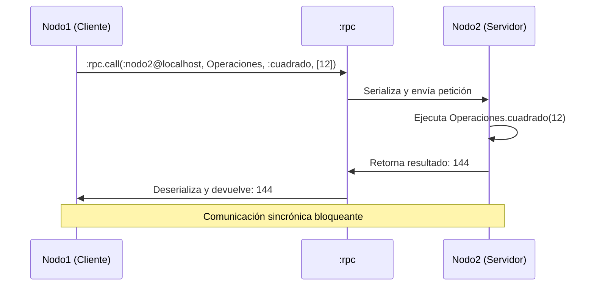
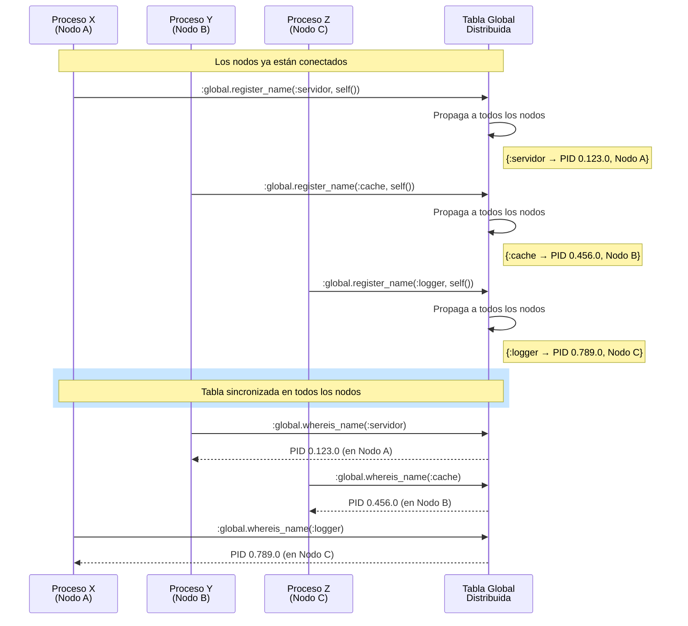

```
Universidad del Quindío
Programa de Ingeniería de Sistemas y Computación
Programación III - Aplicaciones Distribuidas y Concurrentes
Docente: Carlos Andrés Florez V.
```

# Aplicaciones distribuidas (Parte 2)

En la clase anterior establecimos la conectividad básica y aprendimos a enviar mensajes manuales entre nodos. Ahora, nos centraremos en patrones de comunicación más estructurados que son esenciales para construir aplicaciones distribuidas reales y mantenibles.

Veremos cómo ejecutar código en otros nodos sin gestionar manualmente el paso de mensajes y cómo hacer que nuestros servicios sean descubribles automáticamente en una red dinámica.

## Comunicación remota con :rpc

El módulo `:rpc` (Remote Procedure Call) permite ejecutar funciones de forma remota en otros nodos distribuidos. Esto es útil cuando se desea invocar una función en un nodo diferente sin necesidad de gestionar manualmente la comunicación entre procesos.

`:rpc` es parte de la biblioteca estándar de Erlang y proporciona una interfaz sencilla para realizar llamadas a funciones en nodos remotos, manejando automáticamente la serialización de argumentos y resultados, así como la gestión de errores.

### Funciones principales de `:rpc`

Las funciones más comunes del módulo `:rpc` son:

- `:rpc.call/4`: Llama a una función en un nodo remoto y espera el resultado.
- `:rpc.cast/4`: Envía una petición a un nodo remoto sin esperar respuesta (asíncrono).
- `:rpc.multicall/4`: Llama a una función en múltiples nodos y recopila las respuestas.
- `:rpc.ping/1`: Verifica si un nodo remoto está disponible.

Para más información, consulte la [documentación oficial de Erlang sobre :rpc](https://www.erlang.org/doc/apps/kernel/rpc.html)

**Sintaxis de `:rpc.call/4`**:

Tomemos como ejemplo la función más utilizada, `:rpc.call/4`, cuya sintaxis es la siguiente:

```elixir
:rpc.call(nodo, modulo, funcion, argumentos)
```

- `nodo`: El nombre del nodo remoto donde se ejecutará la función (por ejemplo, `:nodo2@localhost`).
- `modulo`: El módulo que contiene la función a llamar (por ejemplo, `Math`).
- `funcion`: El nombre de la función a ejecutar (por ejemplo, `:sumar`).
- `argumentos`: Una lista de argumentos que se pasarán a la función (por ejemplo, `[1, 2]`).

### Ejemplo básico

Supongamos dos nodos conectados: `:nodo1@localhost` y `:nodo2@localhost`. Uno de ellos (nodo2) tiene un módulo llamado Operaciones con una función `cuadrado/1` que calcula el cuadrado de un número. El otro nodo (nodo1) quiere llamar a esta función de forma remota.

#### Diagrama de secuencia para el ejemplo

A continuación, se muestra un diagrama de secuencia que ilustra cómo funciona la llamada remota utilizando `:rpc.call/4`:



Ahora veamos cómo implementar este ejemplo en Elixir.

#### Versión 1 (Creando los nodos en iex)

**En una terminal, inicie nodo2 con iex:**

```bash
iex --sname nodo2 --cookie mi_cookie
```

Luego, defina el módulo `Operaciones`:

```elixir
defmodule Operaciones do
  def cuadrado(x), do: x * x
end
```

**En otra terminal, inicie nodo1 con iex:**

```bash
iex --sname nodo1 --cookie mi_cookie
```

Luego, llame a la función `cuadrado/1` en `nodo2` usando `:rpc.call/4`:

```elixir
resultado = :rpc.call(:nodo2@localhost, Operaciones, :cuadrado, [12])
IO.puts("Resultado remoto: #{resultado}")
```

Observará que el resultado impreso es `144`, que es el cuadrado de `12`. Se ha ejecutado la función `cuadrado/1` en el nodo remoto `nodo2` y se ha recibido el resultado en `nodo1`.

#### Versión 2 (Creando scripts para cada nodo)

Se crean dos archivos `.exs`, uno para cada nodo con el siguiente contenido:

**Nodo 1 - cliente (`cliente_rpc.exs`):**

```elixir
defmodule ClienteRPC do
  def main do
    # Inicia el nodo en modo distribuido con un nombre corto
    {:ok, _} = Node.start(:nodo1@localhost, :shortnames)

    # Establece la cookie para la autenticación entre nodos
    Node.set_cookie(:mi_cookie)

    IO.puts("Nodo1 iniciado correctamente: #{Node.self()}")

    # Esperar un momento para asegurar que el servidor esté listo
    :timer.sleep(1000)

    # Llamar a la función 'cuadrado/1' del módulo 'Operaciones' en el nodo2
    resultado = :rpc.call(:nodo2@localhost, Operaciones, :cuadrado, [12])
    IO.puts("Resultado remoto: #{resultado}")
  end
end

ClienteRPC.main()
```

En este ejemplo, el nodo 1 llama a la función `cuadrado/1` del módulo `Operaciones` en el nodo 2, pasando el argumento `12`. El resultado se recibe y se imprime en la consola.

**Nodo 2 - servidor (`servidor_rpc.exs`):**

```elixir
defmodule Operaciones do
  @moduledoc """
  Módulo que contiene operaciones matemáticas para ser llamadas remotamente
  """

  def cuadrado(numero) do
    IO.puts("Calculando el cuadrado de #{numero}...")
    numero * numero
  end
end

defmodule ServidorRPC do
  def main do
    # Inicia el nodo en modo distribuido con un nombre corto
    {:ok, _} = Node.start(:nodo2@localhost, :shortnames)
    
    # Establece la misma cookie que el cliente para la autenticación
    Node.set_cookie(:mi_cookie)
    
    IO.puts("Nodo2 iniciado correctamente: #{Node.self()}")
    IO.puts("Esperando llamadas RPC...")
    IO.puts("Presiona Ctrl+C dos veces para salir")
    
    # Mantener el proceso vivo indefinidamente
    :timer.sleep(:infinity)
  end
end

ServidorRPC.main()
```

El nodo 2 define el módulo `Operaciones` con la función `cuadrado/1`, que simplemente devuelve el cuadrado del número recibido.

**Ejecutar los nodos:**

```bash
# Terminal 1
elixir servidor_rpc.exs

# Terminal 2
elixir cliente_rpc.exs
```

En este caso, el nodo 1 puede ejecutar la función en el nodo 2 sin necesidad de gestionar manualmente los procesos o mensajes. El módulo `:rpc` se encarga de la comunicación y la ejecución remota, simplificando el desarrollo de aplicaciones distribuidas en Elixir.

---

## Registro global de procesos con `:global`

El módulo `:global` permite **registrar procesos con un nombre único en todo un clúster de nodos**, no solo dentro de un nodo individual. Mientras que `Process.register/2` asigna un nombre local visible únicamente dentro del nodo donde se ejecuta el proceso, `:global` mantiene una **tabla de nombres distribuida** y sincronizada entre todos los nodos conectados.

### ¿Cómo funciona la tabla de nombres global?

Erlang/Elixir incluyen un **sistema de nombres global integrado** cuya función es coordinar y sincronizar la información sobre procesos registrados en un entorno distribuido. Cuando un proceso se registra usando `:global.register_name/2`:

* El nombre se añade a la **tabla de nombres global**, una estructura lógica compartida entre nodos.
* Los nodos del clúster **intercambian mensajes de sincronización** para asegurar que todos mantengan la misma información.
* Si un nodo se conecta a otros posteriormente, la tabla se **reconcilia automáticamente**, añadiendo o eliminando nombres según corresponda.
* Si un nodo se desconecta, los demás ajustan la tabla para mantener una vista **consistente y coherente** de los procesos disponibles.

La tabla de nombres global garantiza que **cualquier proceso registrado mediante `:global` pueda ser buscado y referenciado por nombre desde cualquier nodo**, sin necesidad de conocer en cuál está ejecutándose.

Este mecanismo simplifica la comunicación en sistemas distribuidos porque permite escribir código como si todos los procesos estuvieran en un único nodo, dejando al sistema operativo distribuido de Erlang la responsabilidad de mantener la coherencia.

### Funciones principales de `:global`

Las funciones más comunes del módulo `:global` son:

- `:global.register_name/2`: Registra un proceso con un nombre global. Devuelve `:yes` si tiene éxito, `:no` si el nombre ya está registrado.
- `:global.whereis_name/1`: Busca el PID asociado al nombre global. Devuelve el PID o `:undefined` si no existe.
- `:global.unregister_name/1`: Elimina el registro de un nombre global.
- `:global.registered_names/0`: Devuelve la lista de todos los nombres registrados globalmente.

Para más información, consulte la [documentación oficial de Erlang sobre :global](https://www.erlang.org/doc/apps/kernel/global.html)

### Diagrama de secuencia de `:global`

En el siguiente diagrama de secuencia, se ilustra cómo varios procesos en diferentes nodos registran sus nombres globalmente y luego buscan los PIDs asociados a esos nombres en la tabla global distribuida:



Cada nodo crea un proceso con el nombre global `:servidor`, `:cache` o `:logger`. La tabla global se sincroniza automáticamente entre los nodos conectados. Luego, cada proceso puede buscar los PIDs de los otros procesos registrados globalmente sin necesidad de conocer en qué nodo están ejecutándose.

> **⚠️ Importante:** La sincronización de la tabla global puede introducir cierta latencia, especialmente en clústeres grandes o con nodos que se conectan y desconectan frecuentemente. Sin embargo, esta latencia es generalmente aceptable dado el beneficio de tener un sistema de nombres coherente y distribuido.

### Ejemplo básico

A continuación, se muestra un ejemplo simple de cómo usar `:global` para registrar y buscar un proceso en nodos diferentes.

**Nodo servidor (`servidor_global.exs`):**

```elixir
defmodule ServidorGlobal do
  def main do
    {:ok, _} = Node.start(:servidor@localhost, :shortnames)
    Node.set_cookie(:mi_cookie)

    # Registrar el proceso principal con un nombre global
    case :global.register_name(:servidor_global, self()) do
      :yes ->
        IO.puts("Servidor global registrado exitosamente")
        IO.puts("PID: #{inspect(self())}")
        IO.puts("Esperando mensajes...")
        loop() # Iniciar el bucle de recepción de mensajes
      
      :no ->
        IO.puts("Error: El nombre :servidor_global ya está registrado")
    end
  end

  defp loop do
    receive do
      {:saludo, msg, from} ->
        IO.puts("Mensaje recibido: #{msg}")
        send(from, {:respuesta, "Hola, #{msg}, desde el servidor global!"}) # Responder al remitente
        loop()
      
      :shutdown ->
        IO.puts("Cerrando servidor...")
        :global.unregister_name(:servidor_global) # Se elimina el registro global
    end
  end
end

ServidorGlobal.main()
```

Si se ejecuta este código en un nodo, el proceso principal se registra globalmente con el nombre `:servidor_global`. Si este nombre ya está registrado en otro nodo, la llamada a `:global.register_name/2` devolverá `:no`.

**Nodo cliente (`cliente_global.exs`):**

```elixir
defmodule ClienteGlobal do
  def main do
    {:ok, _} = Node.start(:cliente@localhost, :shortnames)
    Node.set_cookie(:mi_cookie)

    IO.puts("Cliente iniciado")
    IO.puts("Buscando servidor global...")

    # Esperar un momento para que los nodos se sincronicen (opcional)
    :timer.sleep(1000)

    # Buscar el PID del servicio registrado globalmente (no es necesario conocer el nodo)
    case :global.whereis_name(:servidor_global) do
      :undefined ->
        IO.puts("Servidor global no encontrado")

      pid ->
        IO.puts("Servidor encontrado: #{inspect(pid)}")
        send(pid, {:saludo, "cliente", self()})

        receive do
          {:respuesta, msg} -> IO.puts("Respuesta: #{msg}")
        after
          5000 -> IO.puts("Timeout: no se recibió respuesta")
        end
    end
  end
end

ClienteGlobal.main()
```

**Ejecutar:**

```bash
# Terminal 1
elixir servidor_global.exs

# Terminal 2
elixir cliente_global.exs
```

Con `:global`, no es necesario conocer el nodo donde se encuentra el proceso registrado. El cliente puede buscar el proceso por su nombre global y enviarle mensajes directamente.

---

## Comparativa entre métodos de comunicación

Ya sea que se utilice `send/2` + `receive`, `:global` o `:rpc`, cada método tiene sus propias características y casos de uso ideales. A continuación, se presenta una tabla comparativa para ayudar a entender las diferencias clave entre estos métodos de comunicación en aplicaciones distribuidas:

| Característica               | `send/2` + `receive`                | `:global`                           | `:rpc`                              |
|------------------------------|-------------------------------------|------------------------------------|------------------------------------|
| **Nivel de abstracción**     | Bajo                                | Medio                              | Alto                               |
| **Facilidad de uso**         | Requiere manejo manual de mensajes  | Más sencillo que `send/2`          | Muy sencillo, similar a llamadas locales |
| **Registro de procesos**     | Local (por nodo)                    | Global (en todo el clúster)        | No aplica                          |
| **Comunicación entre nodos** | Directa mediante PIDs               | A través de nombres globales       | Llamadas a funciones remotas       |
| **Manejo de errores**        | Manual                              | Automático en la tabla global      | Automático, con manejo de errores integrado |
| **Rendimiento**              | Alto, pero con mayor complejidad    | Moderado, debido a la sincronización | Puede ser más lento debido a la serialización |
| **Casos de uso ideales**     | Chat, eventos en tiempo real, control fino sobre mensajes | Descubrimiento de servicios, failover, coordinación de procesos | Cálculos remotos, microservicios, operaciones síncronas |

**Recomendaciones:**

- Use `send/2` + `receive` cuando necesite control total sobre la comunicación y el formato de los mensajes.
- Use `:global` cuando necesite un registro distribuido de procesos que puedan ser descubiertos por cualquier nodo.
- Use `:rpc` cuando quiera ejecutar funciones remotas de manera simple, sin preocuparse por la gestión de mensajes.

---

## Ejercicio

Cree dos nuevas versiones de los ejercicios hechos en la clase anterior usando `:rpc` y `:global`. Qué diferencias observa en la implementación y en la experiencia del usuario al utilizar estos módulos en lugar de la comunicación manual con send y receive?

--- 

## Para la próxima clase

- Leer sobre OTP y GenServer en la documentación oficial de Elixir: [https://hexdocs.pm/elixir/GenServer.html](https://hexdocs.pm/elixir/GenServer.html)
- Investigar qué es un Agente en Elixir y cómo se utiliza: [https://hexdocs.pm/elixir/Agent.html](https://hexdocs.pm/elixir/Agent.html)
- Qué es un Supervisor y cómo ayuda a manejar fallos en procesos: [https://hexdocs.pm/elixir/Supervisor.html](https://hexdocs.pm/elixir/Supervisor.html)