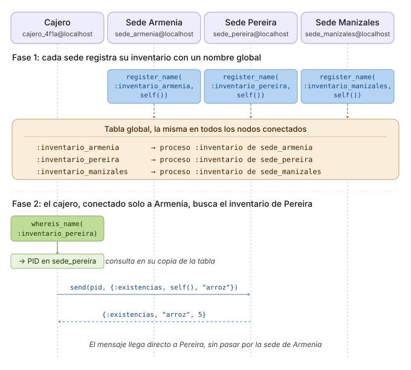

```
Universidad del Quindío
Programa de Ingeniería de Sistemas y Computación
Programación III - Aplicaciones Distribuidas y Concurrentes
Docente: Carlos Andrés Florez V.
```

# Aplicaciones distribuidas (Parte 2)

En la primera parte se construyó el sistema de inventario de la sede de Armenia, con `send` y `receive` entre nodos. Ahora la cadena abre sedes en **Pereira** y **Manizales**, y aparecen necesidades nuevas. Un cajero quiere consultar el inventario de otra ciudad, y la gerencia quiere saber cuántas unidades de un producto hay entre todas las sedes.

Con `send` y `receive` todo eso se puede hacer, pero cuesta cada vez más código. En esta guía se verán dos módulos de Erlang que simplifican esas tareas, `:global` y `:rpc`.

## Tres sedes

Cada sede ejecuta el mismo archivo `sede.exs`. Parte del código de la versión final de la Parte 1, con tres cambios:

- El módulo tiene la lista `@sedes`, con la ciudad y el nombre del nodo de cada sede. `main` se la pasa a `iniciar_sede/1`, que intenta iniciar esos nodos en orden. Si el nombre ya está en uso, porque esa sede ya corre en otra terminal, pasa a la siguiente. Así, la primera terminal queda como la sede de Armenia, la segunda como la de Pereira y la tercera como la de Manizales. Si ninguna se puede iniciar, la cláusula de la lista vacía lo informa.
- Cada sede tiene su propio inventario inicial, definido con una cláusula por ciudad.
- Al iniciar, cada sede se conecta con las otras que ya estén encendidas.

```elixir
defmodule Sede do
  @sedes [
    {"armenia", :sede_armenia@localhost},
    {"pereira", :sede_pereira@localhost},
    {"manizales", :sede_manizales@localhost}
  ]

  def main do
    iniciar_sede(@sedes)
  end

  # Intenta iniciar el nodo de cada sede, en orden. Si el nombre ya está en uso,
  # porque esa sede ya corre en otra terminal, pasa a la siguiente
  defp iniciar_sede([{ciudad, nodo} | resto]) do
    case Node.start(nodo, :shortnames) do
      {:ok, _} ->
        Process.register(self(), :inventario)
        conectar_con_otras_sedes()

        Util.imprimir_mensaje("Sede iniciada en #{node()}")
        Util.imprimir_mensaje("Esperando consultas...\n")
        loop(inventario_inicial(ciudad))

      {:error, _} ->
        iniciar_sede(resto)
    end
  end

  defp iniciar_sede([]) do
    Util.imprimir_error("No se pudo iniciar ninguna sede. Verifique que epmd esté corriendo y que no estén activas las tres")
  end

  # Se conecta con las sedes que ya estén encendidas. Las que no, se ignoran
  defp conectar_con_otras_sedes do
    Enum.each(@sedes, fn {_ciudad, nodo} -> Node.connect(nodo) end)
  end

  defp inventario_inicial("armenia"), do: %{"arroz" => 12, "panela" => 30, "frijol" => 8}
  defp inventario_inicial("pereira"), do: %{"arroz" => 5, "panela" => 14, "frijol" => 20}
  defp inventario_inicial("manizales"), do: %{"arroz" => 9, "panela" => 0, "frijol" => 15}

  defp loop(inventario) do
    receive do
      {:existencias, pid, producto} ->
        Util.imprimir_mensaje("[#{hora_actual()}] Consulta de #{producto}")
        send(pid, consultar_inventario(inventario, producto))
        loop(inventario)

      {:vender, pid, producto, cantidad} ->
        Util.imprimir_mensaje("[#{hora_actual()}] Venta de #{cantidad} #{producto}")
        {respuesta, nuevo_inventario} = vender(inventario, producto, cantidad)
        send(pid, respuesta)
        loop(nuevo_inventario)

      {:reporte, pid} ->
        Util.imprimir_mensaje("[#{hora_actual()}] Reporte solicitado")
        spawn(fn -> send(pid, {:reporte, generar_reporte(inventario)}) end)
        loop(inventario)
    end
  end

  defp consultar_inventario(inventario, producto) do
    case Map.get(inventario, producto) do
      nil -> {:error, :producto_no_existe}
      cantidad -> {:existencias, producto, cantidad}
    end
  end

  defp vender(inventario, producto, cantidad) do
    case Map.get(inventario, producto) do
      nil ->
        {{:error, :producto_no_existe}, inventario}

      disponibles when disponibles >= cantidad ->
        restantes = disponibles - cantidad
        {{:venta_ok, producto, restantes}, Map.put(inventario, producto, restantes)}

      _ ->
        {{:error, :sin_existencias}, inventario}
    end
  end

  defp generar_reporte(inventario) do
    :timer.sleep(5000)

    inventario
    |> Enum.map(fn {producto, cantidad} -> "#{producto}: #{cantidad}" end)
    |> Enum.join("\n")
  end

  defp hora_actual do
    NaiveDateTime.local_now() |> NaiveDateTime.to_time() |> Time.to_string()
  end
end

Sede.main()
```

Como en la Parte 1, los scripts usan el módulo `Util`, así que deben estar en la misma carpeta que `util.exs` compilado. Abra tres terminales y ejecute el mismo comando en cada una, una después de otra (recuerde tener EPMD activo con `epmd -daemon`):

```bash
elixir sede.exs
```

La primera queda como la sede de Armenia. En la segunda, el nombre de Armenia ya está en uso, así que queda como la de Pereira:

```
[notice] Protocol 'inet_tcp': the name sede_armenia@localhost seems to be in use by another Erlang node
Sede iniciada en sede_pereira@localhost
Esperando consultas...
```

La línea `[notice]` es normal. Es el aviso de que `Node.start/2` no pudo usar ese nombre, justo antes de que `iniciar_sede/1` pase a la siguiente sede. La tercera terminal queda como la sede de Manizales.

---

## Versión 1: Consultar otra sede sin saber en qué nodo está (`:global`)

Un cliente en Armenia pregunta por arroz, pero en la sede no queda suficiente. El cajero quiere saber si hay en Pereira, para enviar al cliente allá.

Con lo visto en la Parte 1, el cajero tendría que conocer el nombre del nodo de cada sede (`:sede_pereira@localhost`, `:sede_manizales@localhost`) y tenerlo escrito en su código. Si una sede cambia de computador, habría que modificar todos los cajeros.

El módulo `:global` resuelve eso. Permite **registrar un proceso con un nombre que se conoce en todos los nodos conectados**, no solo en el propio. `Process.register/2` le da un nombre al proceso dentro de su nodo. `:global.register_name/2`, en cambio, lo anota en una **tabla de nombres global**, y cada nodo conectado tiene una copia de esa tabla, que se mantiene sincronizada.

En `sede.exs`, agregue esta línea justo después de `Process.register(self(), :inventario)`:

```elixir
:global.register_name(String.to_atom("inventario_#{ciudad}"), self())
```

Así, la sede de Pereira queda registrada globalmente como `:inventario_pereira`, la de Manizales como `:inventario_manizales`, y así con cada ciudad.

Ahora, el cajero de Armenia solo necesita conocer su propia sede. Cree `cajero.exs` con este contenido:

```elixir
defmodule Cajero do
  # El cajero solo conoce la sede de su ciudad
  @sede_local :sede_armenia@localhost
  @timeout 10000

  def main do
    case Node.start(crear_nombre_nodo(), :shortnames) do
      {:ok, _} ->
        Util.imprimir_mensaje("Cajero iniciado en #{node()}")
        conectar(Node.connect(@sede_local))

      {:error, _} ->
        Util.imprimir_error("No se pudo iniciar el nodo. Verifique que epmd esté corriendo y que el nombre no esté en uso")
    end
  end

  defp crear_nombre_nodo do
    sufijo = :crypto.strong_rand_bytes(4) |> Base.encode16(case: :lower)
    String.to_atom("cajero_#{sufijo}@localhost")
  end

  defp conectar(true) do
    # Espera a que la tabla de nombres globales termine de sincronizarse con el clúster
    :global.sync()

    ciudad = Util.leer("Ciudad de la sede: ", :string) |> String.downcase()
    producto = Util.leer("Producto: ", :string) |> String.downcase()
    consultar(ciudad, producto)
  end

  defp conectar(false), do: Util.imprimir_error("No se pudo conectar con la sede #{@sede_local}")

  # Busca el inventario de la ciudad por su nombre global, sin saber en qué nodo está
  defp consultar(ciudad, producto) do
    case :global.whereis_name(String.to_atom("inventario_#{ciudad}")) do
      :undefined ->
        Util.imprimir_mensaje("No hay una sede activa en #{ciudad}")

      pid ->
        send(pid, {:existencias, self(), producto})
        esperar_respuesta(ciudad)
    end
  end

  defp esperar_respuesta(ciudad) do
    receive do
      {:existencias, producto, cantidad} ->
        Util.imprimir_mensaje("En #{ciudad} hay #{cantidad} unidades de #{producto}")

      {:error, :producto_no_existe} ->
        Util.imprimir_mensaje("Ese producto no existe en la sede de #{ciudad}")
    after
      @timeout ->
        Util.imprimir_error("La sede no respondió en #{@timeout} ms")
    end
  end
end

Cajero.main()
```

Hay dos funciones nuevas:

- `:global.sync/0` espera a que la tabla de nombres globales termine de sincronizarse con los nodos a los que se acaba de conectar. Sin ella, la búsqueda puede hacerse antes de que la tabla esté lista y no encontrar nada.
- `:global.whereis_name/1` busca un nombre en la tabla y devuelve el PID del proceso, o `:undefined` si no existe.

Reinicie las tres sedes para que se registren y ejecute el cajero:

```
Cajero iniciado en cajero_cec29174@localhost
Ciudad de la sede: pereira
Producto: arroz
En pereira hay 5 unidades de arroz
```



El cajero se conectó solo con Armenia, pero pudo hablar con Pereira. Al conectarse, recibió una copia de la tabla global, que ya incluía `:inventario_pereira`. La búsqueda se hace en esa copia local, sin preguntar a la red. Y como `send/2` a un PID de otro nodo abre la conexión si hace falta, el mensaje llega directo a Pereira.

Si la ciudad no tiene una sede activa, `whereis_name/1` devuelve `:undefined`:

```
Ciudad de la sede: bogota
Producto: arroz
No hay una sede activa en bogota
```

Las funciones más usadas del módulo son:

| Función | Qué hace |
| --- | --- |
| `:global.register_name/2` | Registra un proceso con un nombre global. Devuelve `:yes`, o `:no` si el nombre ya está en uso |
| `:global.whereis_name/1` | Devuelve el PID registrado con ese nombre, o `:undefined` |
| `:global.registered_names/0` | Devuelve la lista de nombres registrados en todo el clúster |
| `:global.unregister_name/1` | Elimina un nombre de la tabla |
| `:global.sync/0` | Espera a que la tabla termine de sincronizarse |

Para más información, consulte la [documentación oficial de Erlang sobre :global](https://www.erlang.org/doc/apps/kernel/global.html).

---

## Versión 2: El total de todas las sedes (`:rpc`)

**Nuevo requerimiento:** la gerencia necesita saber cuántas unidades de un producto hay entre todas las sedes.

Con mensajes, el gerente tendría que buscar cada sede, enviarle `{:existencias, self(), producto}`, esperar cada respuesta con su `receive` y su `after`, y al final sumar. Es mucho código para algo que, en un solo nodo, sería llamar una función y recibir su resultado.

El módulo `:rpc` (*Remote Procedure Call*) permite **ejecutar una función en otro nodo y recibir lo que retorna**:

```elixir
:rpc.call(nodo, Modulo, :funcion, [argumentos])
```

La sede necesita una función que se pueda llamar de esa forma. En `sede.exs`, agregue esta función pública al módulo `Sede`:

```elixir
# Función pública para consultar la sede con :rpc.
# Se ejecuta en el nodo de la sede, así que :inventario y node() se refieren a esa sede
def consultar(producto) do
  send(:inventario, {:existencias, self(), producto})

  receive do
    {:existencias, _producto, cantidad} -> {node(), cantidad}
    {:error, :producto_no_existe} -> {node(), 0}
  after
    5000 -> {node(), :sin_respuesta}
  end
end
```

`consultar/1` hace lo mismo que el cajero, pero **se ejecuta en el nodo de la sede**. Por eso `:inventario` se refiere al proceso de esa sede, sin necesidad de indicar el nodo, y `node()` devuelve el nombre de la sede. La función retorna una tupla con el nombre de la sede y la cantidad, para saber de dónde vino cada resultado.



Reinicie las sedes y cree `gerente.exs`:

```elixir
defmodule Gerente do
  @sedes [:sede_armenia@localhost, :sede_pereira@localhost, :sede_manizales@localhost]

  def main do
    case Node.start(:gerente@localhost, :shortnames) do
      {:ok, _} ->
        Util.leer("Producto: ", :string)
        |> String.downcase()
        |> consultar_sedes()

      {:error, _} ->
        Util.imprimir_error("No se pudo iniciar el nodo. Verifique que epmd esté corriendo y que el nombre no esté en uso")
    end
  end

  # Llama a Sede.consultar/1 en cada sede, una tras otra
  defp consultar_sedes(producto) do
    Enum.each(@sedes, fn sede ->
      resultado = :rpc.call(sede, Sede, :consultar, [producto])
      IO.inspect(resultado, label: "#{sede}")
    end)
  end
end

Gerente.main()
```

Al ejecutarlo:

```
Producto: arroz
sede_armenia@localhost: {:sede_armenia@localhost, 12}
sede_pereira@localhost: {:sede_pereira@localhost, 5}
sede_manizales@localhost: {:sede_manizales@localhost, 9}
```

Tres detalles de este ejemplo:

- **El gerente no llama a `Node.connect/1`.** `:rpc` se conecta solo con el nodo al que llama.
- **El código no viaja con la llamada.** El gerente no define el módulo `Sede`. Solo envía el nombre del módulo, de la función y los argumentos, y es el nodo de la sede el que ejecuta su propio `Sede.consultar/1`. Si la sede no tuviera ese módulo, la llamada fallaría.
- **Lo que imprime la función remota aparece en la consola de quien llama.** Si `consultar/1` tuviera un `IO.puts`, el texto saldría en la terminal del gerente y no en la de la sede.

### Todas las sedes de una sola vez

`:rpc.call/4` consulta las sedes una tras otra. Si una tardara 3 segundos en responder, el gerente esperaría esos 3 segundos antes de pasar a la siguiente. `:rpc.multicall/4` hace la misma llamada en **varios nodos a la vez** y devuelve una tupla con dos listas, los resultados y los nodos que no respondieron.

Reemplace `consultar_sedes/1` en `gerente.exs` por estas dos funciones:

```elixir
# Llama a Sede.consultar/1 en todas las sedes a la vez
defp consultar_sedes(producto) do
  {resultados, _sedes_caidas} = :rpc.multicall(@sedes, Sede, :consultar, [producto])

  Util.imprimir_mensaje("\nExistencias de #{producto}:")
  Enum.each(resultados, fn {sede, cantidad} -> Util.imprimir_mensaje("  #{sede}: #{cantidad}") end)
  Util.imprimir_mensaje("Total: #{total(resultados)} unidades")
end

defp total(resultados) do
  resultados
  |> Enum.map(fn {_sede, cantidad} -> cantidad end)
  |> Enum.sum()
end
```

Al ejecutarlo:

```
Producto: arroz

Existencias de arroz:
  sede_armenia@localhost: 12
  sede_pereira@localhost: 5
  sede_manizales@localhost: 9
Total: 26 unidades
```

---

## Versión 3: Una sede apagada

En un sistema distribuido, siempre hay que contar con que algún nodo esté apagado o sin red. Detenga la sede de Manizales (presionando `Ctrl+C` dos veces en su terminal) y vuelva a ejecutar el gerente:

```
Existencias de arroz:
  sede_armenia@localhost: 12
  sede_pereira@localhost: 5
Total: 17 unidades
```

Manizales simplemente desapareció del reporte, y el total bajó a 17 sin ningún aviso. La gerencia podría creer que en Manizales no hay arroz, cuando en realidad no se sabe.

Manizales está en la segunda lista que devuelve `:rpc.multicall/4`, la que el código ignora con `_sedes_caidas`. Con `:rpc.call/4` pasa algo parecido: en lugar de lanzar un error, devuelve `{:badrpc, :nodedown}`, un valor que hay que revisar.

Reemplace `consultar_sedes/1` y `total/1` en `gerente.exs` por estas versiones, que informan las sedes que no respondieron:

```elixir
# Llama a Sede.consultar/1 en todas las sedes a la vez
defp consultar_sedes(producto) do
  {resultados, sedes_caidas} = :rpc.multicall(@sedes, Sede, :consultar, [producto])

  Util.imprimir_mensaje("\nExistencias de #{producto}:")
  Enum.each(resultados, fn {sede, cantidad} -> Util.imprimir_mensaje("  #{sede}: #{cantidad}") end)
  Enum.each(sedes_caidas, fn sede -> Util.imprimir_mensaje("  #{sede}: sin respuesta") end)

  Util.imprimir_mensaje("Total: #{total(resultados)} unidades")
end

# Solo suman los resultados que trajeron un número
defp total(resultados) do
  resultados
  |> Enum.map(fn {_sede, cantidad} -> cantidad end)
  |> Enum.filter(&is_integer/1)
  |> Enum.sum()
end
```

```
Existencias de arroz:
  sede_armenia@localhost: 12
  sede_pereira@localhost: 5
  sede_manizales@localhost: sin respuesta
Total: 17 unidades
```

`total/1` filtra con `is_integer/1` porque `consultar/1` devuelve `:sin_respuesta` si la sede no alcanza a responder, y ese valor no se puede sumar.

La tabla de `:global` también se entera. Cuando un nodo se desconecta, sus nombres se eliminan de la tabla, así que el cajero ahora recibe `No hay una sede activa en manizales`.

Las funciones de `:rpc` usadas en esta guía, y una más que se usa en los ejercicios, son:

| Función | Qué hace |
| --- | --- |
| `:rpc.call/4` | Ejecuta una función en un nodo y espera el resultado. Si falla, devuelve `{:badrpc, motivo}` |
| `:rpc.multicall/4` | Ejecuta una función en varios nodos a la vez. Devuelve `{resultados, nodos_sin_respuesta}` |
| `:rpc.cast/4` | Ejecuta una función en un nodo sin esperar respuesta |

Para más información, consulte la [documentación oficial de Erlang sobre :rpc](https://www.erlang.org/doc/apps/kernel/rpc.html).

---

## ¿Qué resolvió cada herramienta?

| Necesidad | Herramienta |
| --- | --- |
| Enviar un mensaje a un proceso de otro nodo, conociendo su nombre y su nodo | `send({nombre, nodo}, mensaje)` |
| Encontrar un proceso sin saber en qué nodo está | `:global.register_name/2` y `:global.whereis_name/1` |
| Ejecutar una función en otro nodo y recibir lo que retorna | `:rpc.call/4` |
| Hacer la misma consulta en varios nodos a la vez | `:rpc.multicall/4` |

`:global` y `:rpc` no reemplazan a `send` y `receive`, sino que se apoyan en ellos. `:global` solo dice dónde está un proceso, y después se le habla con `send`. `:rpc` envía y recibe mensajes por dentro, igual que `Sede.consultar/1`.

---

## Ejercicios propuestos

### Ejercicio 1: Traslado de mercancía

Cuando una sede se queda sin un producto, puede pedírselo a otra. Use en la sede el mensaje `{:agregar, pid, producto, cantidad}` del Ejercicio 2 de la guía anterior, que suma unidades al inventario (si no lo hizo, agréguelo ahora), y escriba un script `traslado.exs` que:

1. Pida la ciudad de origen, la ciudad de destino, el producto y la cantidad.
2. Encuentre las dos sedes con `:global`.
3. Registre una venta de esa cantidad en la sede de origen y, si se pudo, agregue las unidades en la de destino.

Responda: ¿qué pasa si la sede de destino se apaga justo después de descontar las unidades en la de origen? ¿En qué orden conviene hacer las dos operaciones, y qué debería hacer el programa si la segunda falla?

### Ejercicio 2: Panel de monitoreo del clúster

Una empresa tiene el mismo servicio corriendo en varios nodos y el equipo de operaciones necesita ver el estado de todos desde una sola terminal. Construya un **panel** que los consulte a la vez. Necesitará al menos tres terminales, dos con nodos de servicio y una con el panel.

Escriba un módulo `Monitor`, cárguelo en **todos** los nodos y resuelva lo siguiente:

- `estado_local/0`: devuelve un mapa con el nombre del nodo, la cantidad de procesos vivos y la memoria usada. *Pistas:* `:erlang.system_info(:process_count)` y `:erlang.memory(:total)`.
- `estado_cluster/0`: consulta `estado_local/0` en todos los nodos **de una sola vez** con `:rpc.multicall/4`, sobre la lista `[Node.self() | Node.list()]`, e imprime el resumen. Tenga en cuenta que no devuelve una lista, sino una tupla `{resultados, nodos_caidos}`.
- Incluya a propósito en la consulta un nodo **apagado** y compruebe que aparece en el segundo elemento sin que el panel se caiga. Repórtelo como `sin respuesta`.
- Levante ahora un nodo que **no cargue** el módulo `Monitor`. Ese no aparece entre los caídos, sino entre los resultados, como `{:badrpc, {:EXIT, {:undef, ...}}}`. Haga que el panel distinga los dos casos.
- `servicios/0`: lista los procesos registrados en todo el clúster con `:global.registered_names/0`. Para probarlo, haga que cada nodo registre uno con `:global.register_name/2`.
- `avisar_mantenimiento/1`: avisa a todos los nodos con `:rpc.cast/4`, sin esperar respuesta. El aviso saldrá en la consola del panel y no en la de los nodos remotos, lo cual es normal en `:rpc`.

Responda: a partir del nodo sin el módulo, ¿qué implica que el código **no viaje** con la llamada cuando hay que desplegar una versión nueva del servicio?

---

## Para la próxima clase

- Leer sobre OTP y GenServer en la documentación oficial de Elixir: [https://hexdocs.pm/elixir/GenServer.html](https://hexdocs.pm/elixir/GenServer.html)
- Investigar qué es un Agente en Elixir y cómo se utiliza: [https://hexdocs.pm/elixir/Agent.html](https://hexdocs.pm/elixir/Agent.html)
- Qué es un Supervisor y cómo ayuda a manejar fallos en procesos: [https://hexdocs.pm/elixir/Supervisor.html](https://hexdocs.pm/elixir/Supervisor.html)
