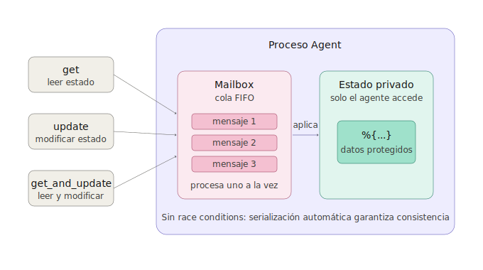
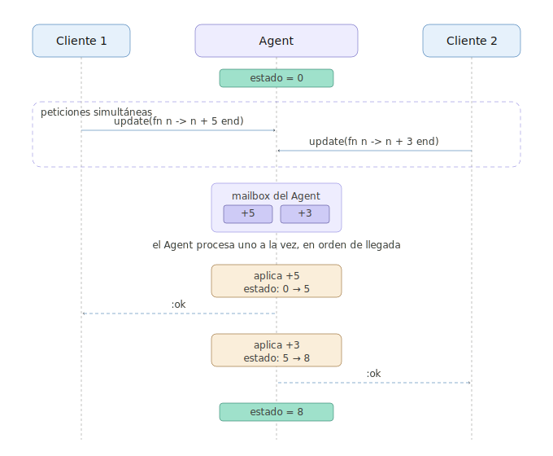
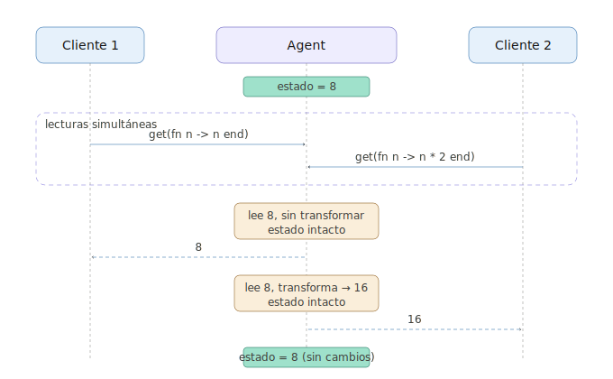
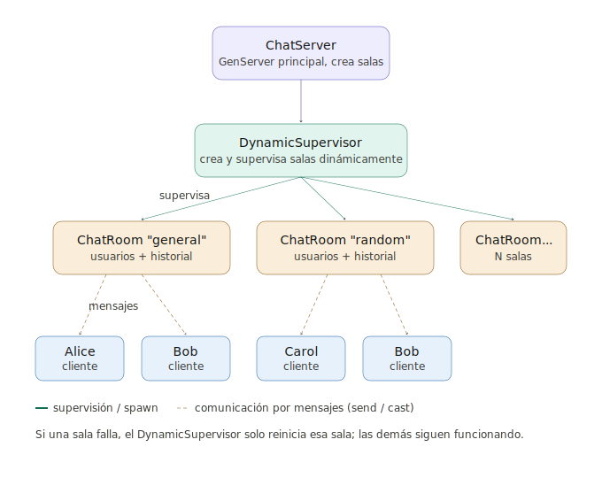
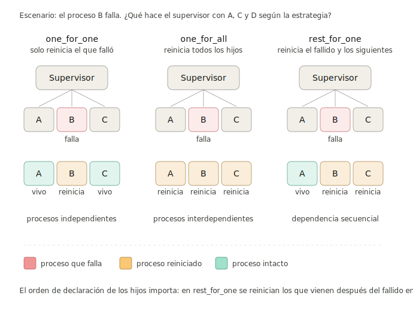

```
Universidad del Quindío
Programa de Ingeniería de Sistemas y Computación
Programación III - OTP (Open Telecom Platform)
Docente: Carlos Andrés Florez V.
```

# Introducción a OTP

**OTP (Open Telecom Platform)** es mucho más que un conjunto de bibliotecas: es una **plataforma completa** para construir sistemas concurrentes, distribuidos y tolerantes a fallos. Aunque su nombre sugiere orientación a telecomunicaciones, OTP se utiliza en una amplia variedad de aplicaciones, desde servidores web hasta sistemas de mensajería y bases de datos distribuidas.

## ¿Por qué necesitamos OTP?

En el capítulo 11 y 12 aprendimos a crear procesos manualmente usando `spawn`, `send` y `receive`. Si bien estos son los bloques fundamentales, construir aplicaciones robustas solo con ellos presenta varios desafíos:

1. **Manejo manual del estado**: Debemos implementar bucles recursivos para mantener el estado del proceso.
2. **Gestión de errores compleja**: ¿Qué pasa si un proceso falla? ¿Cómo lo reiniciamos?
3. **Código repetitivo**: Patrones como "servidor con estado" se repiten constantemente.
4. **Supervisión manual**: Debemos escribir código para monitorear y reiniciar procesos.
5. **Sin estándares**: Cada desarrollador implementa estos patrones de manera diferente.

**OTP resuelve estos problemas** proporcionando abstracciones probadas y estandarizadas que encapsulan patrones comunes de concurrencia.

## La filosofía "Let it crash"

Uno de los principios fundamentales de OTP es **"déjalo fallar"** (let it crash). En lugar de programar defensivamente para prevenir todos los errores posibles, OTP promueve:

1. **Aislamiento**: Los procesos están aislados, un fallo no afecta a otros.
2. **Supervisión**: Los supervisores detectan y reinician procesos fallidos.
3. **Recuperación rápida**: El sistema se recupera automáticamente a un estado conocido.

Este enfoque simplifica el código al eliminar la necesidad de manejar todos los casos de error, permitiendo que los supervisores se encarguen de la recuperación.

## Arquitectura de OTP

OTP proporciona tres componentes principales para construir aplicaciones robustas:

### 1. **Behaviours (Comportamientos)**

Son plantillas que definen interfaces estándar para crear procesos con funcionalidades específicas. Los más comunes son:

- **GenServer**: Servidor genérico (mantiene estado, responde peticiones), permite crear procesos con lógica compleja de manera sencilla.
- **Supervisor**: Supervisa y reinicia procesos hijos, ideal para implementar la filosofía "let it crash".
- **Agent**: Estado compartido simple, útil para casos donde solo se necesita almacenar y recuperar datos.

### 2. **Supervisores**

Procesos especiales que vigilan procesos hijos, los reinician automáticamente si fallan, implementan estrategias de recuperación y forman árboles jerárquicos.

### 3. **Aplicaciones**

Componentes empaquetados que agrupan módulos relacionados, definen dependencias, configuran el árbol de supervisión inicial y pueden iniciarse o detenerse como una unidad. Es la unidad de despliegue en sistemas OTP. La estudiaremos en detalle más adelante cuando hablemos de **Mix**.

---

# Agent

Antes de profundizar en `GenServer`, es importante entender **`Agent`**, que es la abstracción más simple de OTP para manejar estado.

## ¿Qué es un Agent?

El módulo `Agent` en Elixir proporciona una forma sencilla de crear y manejar procesos que mantienen un estado compartido. Los agentes son útiles cuando se necesita un proceso que almacene y gestione un estado mutable de manera concurrente. El módulo `Agent` ofrece una interfaz simple para crear, actualizar y leer el estado del agente. 

Es ideal para casos donde solo se necesita almacenar y recuperar datos sin la complejidad de manejar múltiples tipos de mensajes o lógica de negocio compleja.

## Anatomía de un Agent

Un `Agent` se puede visualizar de la siguiente manera:



## Funciones principales

Entre las funciones más utilizadas del módulo `Agent` se encuentran:

- `Agent.start_link/2`: Inicia un agente con estado inicial
- `Agent.get/2`: Lee el estado (puede transformarlo)
- `Agent.update/2`: Modifica el estado
- `Agent.get_and_update/2`: Lee y modifica en una operación atómica
- `Agent.stop/1`: Detiene el agente

Para más información sobre el módulo `Agent`, se recomienda consultar la [documentación oficial](https://hexdocs.pm/elixir/1.12/Agent.html).

## Ejemplo básico

A continuación, un ejemplo simple de uso de `Agent` para mantener el estado de un contador:

```elixir
# Iniciar un agente con un contador en 0
{:ok, contador} = Agent.start_link(fn -> 0 end)

# Incrementar el contador
Agent.update(contador, fn n -> n + 1 end)

# Obtener el valor actual
valor = Agent.get(contador, fn n -> n end)
IO.puts("Contador: #{valor}")  # Contador: 1

# Obtener y actualizar en una operación
{valor_anterior, nuevo_valor} = Agent.get_and_update(contador, fn n -> {n, n + 5} end)
IO.puts("Antes: #{valor_anterior}, Ahora: #{nuevo_valor}")  # Antes: 1, Ahora: 6
```

El estado del agente es seguro para el acceso concurrente, lo que significa que múltiples procesos pueden leer y escribir al mismo tiempo sin riesgo de corrupción de datos. 

### Diagrama de secuencia de acceso concurrente

En el siguiente diagrama de secuencia, se ilustra cómo dos clientes acceden concurrentemente a un `Agent` que mantiene un contador. Observe cómo las operaciones se serializan internamente para evitar condiciones de carrera:



Al mismo tiempo, si dos clientes solo leen el estado sin modificarlo, pueden hacerlo de manera concurrente sin bloqueos:



El agente oculta el estado interno y serializa todas las operaciones, garantizando que el estado permanezca consistente incluso con accesos concurrentes.

## Ejemplo con el gimnasio

En el proyecto del gimnasio que hicimos previamente, podemos usar un `Agent` para mantener el estado. A continuación, un ejemplo simplificado:

```elixir
defmodule Gimnasio do
  use Agent

  # Estructura de un socio
  defmodule Socio do
    defstruct [:nombre, :edad, :clases]
  end

  def start_link do
    Agent.start_link(fn -> %{} end, name: __MODULE__)
  end

  def agregar_socio(cedula, nombre, edad) do
    socio = %Socio{nombre: nombre, edad: edad, clases: []}
    Agent.update(__MODULE__, fn socios -> 
      Map.put(socios, cedula, socio) 
    end)
  end

  def obtener_socio(cedula) do
    Agent.get(__MODULE__, fn socios -> Map.get(socios, cedula) end)
  end

  def eliminar_socio(cedula) do
    Agent.update(__MODULE__, fn socios -> Map.delete(socios, cedula) end)
  end

  def listar_socios do
    Agent.get(__MODULE__, fn socios -> socios end)
  end

  def inscribir_clase(cedula, clase) do
    Agent.update(__MODULE__, fn socios ->
      case Map.get(socios, cedula) do
        nil -> 
          IO.puts("Socio no encontrado")
          socios
        socio ->
          actualizado = %{socio | clases: [clase | socio.clases]}
          Map.put(socios, cedula, actualizado)
      end
    end)
  end

  def main do
    start_link()

    agregar_socio("123", "Juan", 30)
    agregar_socio("456", "Ana", 25)

    IO.inspect(obtener_socio("123"), label: "Socio 123")
    IO.inspect(listar_socios(), label: "Todos los socios")

    inscribir_clase("123", "Yoga")
    IO.inspect(obtener_socio("123"), label: "Socio 123 después de inscribir")

    eliminar_socio("456")
    IO.inspect(listar_socios(), label: "Socios después de eliminar")
  end
end

Gimnasio.main()
```

**Ventajas del Agent aquí:**
- No necesitamos pasar el mapa de socios entre funciones
- El estado está protegido contra condiciones de carrera
- Múltiples procesos pueden acceder concurrentemente de forma segura

---

# GenServer

**GenServer** (Generic Server) es el behaviour más utilizado en OTP. Define una plantilla para crear procesos que mantienen estado y responden a peticiones. Un módulo que implementa un `GenServer` define una serie de funciones de callback que controlan su ciclo de vida y su comportamiento.

## Características principales de GenServer

Entre las características clave de GenServer se incluyen:

- Mantienen **estado interno**
- Responden a **peticiones síncronas** (call)
- Manejan **mensajes asíncronos** (cast)
- Ejecutan **código de inicialización y terminación**

## ¿Cuándo usar GenServer?

Se recomienda usar `GenServer` cuando se necesita:

- **Lógica de negocio compleja**: Más que solo almacenar/leer estado
- **Múltiples tipos de mensajes**: Con diferentes comportamientos
- **Callbacks personalizados**: Para inicialización, limpieza, etc.
- **Integración con supervisores**: Para tolerancia a fallos

## Anatomía de un GenServer

Un `GenServer` típico consta de dos partes principales, cada una con su propio conjunto de funciones:

### 1. API del Cliente (funciones públicas)

Estas funciones son llamadas por otros procesos y ocultan los detalles de comunicación:

```elixir
def valor(), do: GenServer.call(__MODULE__, :valor)
def incrementar(), do: GenServer.cast(__MODULE__, :incrementar)
```

### 2. Callbacks del Servidor (funciones privadas)

Estas funciones son ejecutadas por el proceso del `GenServer`:

```elixir
def handle_call(:valor, _from, estado) do
  {:reply, estado, estado} # Responde con el estado actual (síncrono)
end

def handle_cast(:incrementar, estado) do
  {:noreply, estado + 1} # Actualiza el estado pero no responde (asíncrono)
end
```

Estas funciones manejan la lógica interna y el estado del servidor. Son invocadas automáticamente por el `GenServer` cuando recibe mensajes.

## Callbacks principales

### `init/1` - Inicialización

Se ejecuta cuando el `GenServer` arranca. Define el estado inicial:

```elixir
@impl true
def init(valor_inicial) do
  # Puede realizar configuración aquí
  {:ok, valor_inicial}
end
```

**Valores de retorno:**
- `{:ok, estado}`: Inicialización exitosa
- `{:ok, estado, timeout}`: Con timeout de inactividad
- `:ignore`: No iniciar el servidor
- `{:stop, razón}`: Fallo en la inicialización

### `handle_call/3` - Peticiones síncronas

Maneja peticiones que **esperan respuesta**:

```elixir
@impl true
def handle_call(:obtener_datos, _from, estado) do
  {:reply, estado.datos, estado}
end
```

**Parámetros:**
- `mensaje`: El mensaje enviado
- `from`: Tupla `{pid, ref}` del proceso cliente
- `estado`: Estado actual del servidor

**Valores de retorno:**
- `{:reply, respuesta, nuevo_estado}`: Responde inmediatamente
- `{:noreply, nuevo_estado}`: Respuesta diferida (usar `GenServer.reply/2`)
- `{:stop, razón, respuesta, nuevo_estado}`: Responde y detiene el servidor

### `handle_cast/2` - Mensajes asíncronos

Maneja mensajes que **no esperan respuesta**:

```elixir
@impl true
def handle_cast({:actualizar, valor}, estado) do
  {:noreply, %{estado | valor: valor}}
end
```

**Valores de retorno:**
- `{:noreply, nuevo_estado}`: Continúa con nuevo estado
- `{:stop, razón, nuevo_estado}`: Detiene el servidor

### `handle_info/2` - Mensajes no esperados

Maneja mensajes enviados directamente con `send/2` (no a través de call/cast):

```elixir
@impl true
def handle_info(:tick, estado) do
  # Ejecutar tarea periódica
  {:noreply, estado}
end

def handle_info({:DOWN, _ref, :process, pid, _reason}, estado) do
  # Manejar muerte de proceso monitoreado
  {:noreply, actualizar_estado_sin_proceso(estado, pid)}
end
```

### `terminate/2` - Limpieza

Se ejecuta antes de que el proceso termine:

```elixir
@impl true
def terminate(razon, estado) do
  # Limpiar recursos, cerrar conexiones, etc.
  IO.puts("Servidor detenido: #{inspect(razon)}")
  :ok
end
```

Para más información sobre `GenServer`, se recomienda consultar la [documentación oficial](https://hexdocs.pm/elixir/1.12/GenServer.html).

---

## Diferencias entre Agent y GenServer

Tanto `Agent` como `GenServer` son herramientas poderosas para manejar estado en Elixir, pero tienen diferencias clave en términos de complejidad y casos de uso.

| Característica      | **Agent**                             | **GenServer**                                                       |
| ------------------- | ------------------------------------- | ------------------------------------------------------------------- |
| **Complejidad**     | Simple                                | Complejo                                                            |
| **Propósito**       | Almacenar y actualizar estado         | Controlar lógica de negocio y comunicación                          |
| **Manejo de mensajes** | Automático (transparente)          | Manual (`handle_call`, `handle_cast`, `handle_info`)                |
| **Callbacks**       | No disponibles                        | `init`, `terminate`, `code_change`, etc.                            |
| **Ideal para**      | Contadores, cachés, configuraciones   | Servicios, coordinadores, procesos con lógica compleja              |
| **Flexibilidad**    | Limitada                              | Muy alta                                                            |
| **Bajo el capó**    | Es un GenServer simplificado          | Implementación completa de behaviour                                |

Para más información sobre GenServer y aplicaciones distribuidas en Elixir, se recomienda consultar [Concurrencia con OTP](https://elixirschool.com/en/lessons/advanced/otp_concurrency) y [Distribución con OTP](https://elixirschool.com/en/lessons/advanced/otp_distribution).

> **⚠️ Importante:** Como regla general, se recomienda usar `Agent` para casos simples. Si necesita más control o lógica compleja, migre a `GenServer`.

---

## Ejemplo 1. Contador

Ahora, un ejemplo completo de un `GenServer` que implementa un contador simple. Compare este ejemplo con el que hicimos usando `Agent` anteriormente.

### Diagrama de secuencia para el ejemplo del contador

A continuación, un diagrama de secuencia que ilustra la interacción entre el cliente y el `GenServer`, el API pública y los callbacks del servidor:



Se ilustran dos flujos: uno para una llamada síncrona (`call`) y otro para un mensaje asíncrono (`cast`). En el caso del `call`, el cliente espera una respuesta del servidor, mientras que en el `cast`, el cliente continúa inmediatamente después de enviar el mensaje.

### Implementación completa

```elixir
defmodule Contador do
  use GenServer

  # ========== API del Cliente ==========

  # El estado inicial es el valor del contador (número entero)
  def start_link(valor_inicial) do
    GenServer.start_link(__MODULE__, valor_inicial, name: __MODULE__)
  end

  def valor(), do: GenServer.call(__MODULE__, :valor)
  def incrementar(), do: GenServer.cast(__MODULE__, :incrementar)
  def decrementar(), do: GenServer.cast(__MODULE__, :decrementar)
  def sumar(n), do: GenServer.cast(__MODULE__, {:sumar, n})
  def reiniciar(), do: GenServer.cast(__MODULE__, :reiniciar)
  def detener(), do: GenServer.stop(__MODULE__)

  # ========== Callbacks del Servidor ==========

  @impl true
  def init(valor_inicial) do
    # Estado inicial del proceso, esta función se llama cuando se inicia el GenServer con start_link
    IO.puts("Contador iniciado con valor: #{valor_inicial}")
    {:ok, valor_inicial} 
  end

  @impl true
  def handle_call(:valor, _from, estado) do
    {:reply, estado, estado} # Responde con el estado actual pero no lo modifica
  end

  @impl true
  def handle_cast(:incrementar, estado) do
    {:noreply, estado + 1} # Modifica el estado incrementándolo en 1
  end

  @impl true
  def handle_cast(:decrementar, estado) do
    {:noreply, estado - 1} # Modifica el estado decrementándolo en 1
  end

  @impl true
  def handle_cast({:sumar, n}, estado) do
    {:noreply, estado + n} # Suma n al estado actual
  end

  @impl true
  def handle_cast(:reiniciar, _estado) do
    {:noreply, 0} # Modifica el estado reiniciándolo a 0
  end

  @impl true
  def terminate(razon, estado) do
    IO.puts("Contador detenido. Razón: #{inspect(razon)}, Valor final: #{estado}")
    :ok
  end
end

# Uso
{:ok, _pid} = Contador.start_link(0) # Inicia el estado en 0
Contador.incrementar()
Contador.incrementar()
Contador.sumar(5)
IO.puts("Valor: #{Contador.valor()}")  # Valor: 7
Contador.detener()
```

## `call` vs `cast`: ¿Cuándo usar cada uno?

En `GenServer`, `call` y `cast` son dos formas diferentes de comunicarse con el servidor, cada una con sus propias características y casos de uso.

| Característica | `call` (síncrono) | `cast` (asíncrono) |
|----------------|-------------------|-------------------|
| **Espera respuesta** | Sí, bloquea hasta recibir | No, retorna inmediatamente |
| **Garantías** | El mensaje se procesó | El mensaje se envió |
| **Rendimiento** | Más lento (espera) | Más rápido (fire and forget) |
| **Cuándo usar** | Se espera el resultado | Actualizar estado sin respuesta |
| **Ejemplo** | Leer datos, validaciones | Logs, actualizaciones, notificaciones |

---

## Ejemplo 2

Se requiere crear un sistema de gestión de tareas donde los usuarios pueden agregar, eliminar y listar tareas. Cada tarea tiene un título y una descripción. El sistema debe manejar múltiples usuarios y sus respectivas listas de tareas. Debe usar `GenServer` como servidor para manejar las tareas de cada usuario.

En este caso, se quiere tener un servidor central y múltiples clientes que se conecten a este servidor para gestionar sus tareas. Algo similar a esto:



A continuación, se muestra cómo se puede implementar esto utilizando `GenServer` y la funcionalidad de distribución de Elixir.

### 1. Crear la estructura de la tarea

Cree un archivo llamado `tarea.exs`:

```elixir
defmodule Tarea do
  defstruct [:titulo, :descripcion, :completada]
  
  def nueva(titulo, descripcion) do
    %__MODULE__{titulo: titulo, descripcion: descripcion, completada: false}
  end
end
```

Puede compilar el código anterior usando `elixirc tareas.exs` en la terminal para que esté disponible en el entorno de Elixir y pueda ser utilizado en todos los archivos que lo requieran.

### 2. Crear el servidor

Cree un nuevo archivo llamado `servidor.exs` y defina el servidor de tareas utilizando `GenServer`:

```elixir
defmodule TareasServidor do
  use GenServer

  # Estado: %{usuario => [%Tarea{}]}

  def start_link do
    GenServer.start_link(__MODULE__, %{}, name: __MODULE__)
  end

  # ========== API pública ==========

  def agregar_tarea(usuario, tarea) do
    GenServer.cast(__MODULE__, {:agregar, usuario, tarea})
  end

  def eliminar_tarea(usuario, titulo) do
    GenServer.cast(__MODULE__, {:eliminar, usuario, titulo})
  end

  def completar_tarea(usuario, titulo) do
    GenServer.cast(__MODULE__, {:completar, usuario, titulo})
  end

  def listar_tareas(usuario) do
    GenServer.call(__MODULE__, {:listar, usuario})
  end

  def estadisticas(usuario) do
    GenServer.call(__MODULE__, {:stats, usuario})
  end

  # ========== Callbacks ==========

  @impl true
  def init(state) do
    IO.puts("[Servidor] Iniciado")
    {:ok, state}
  end

  @impl true
  def handle_cast({:agregar, usuario, tarea}, state) do
    tareas = Map.get(state, usuario, [])
    nuevo_estado = Map.put(state, usuario, [tarea | tareas])
    IO.puts("[Servidor] Tarea agregada para #{usuario}")
    {:noreply, nuevo_estado}
  end

  @impl true
  def handle_cast({:eliminar, usuario, titulo}, state) do
    tareas = Map.get(state, usuario, [])
    # Se elimina la tarea si existe una con ese título
    nuevas_tareas = Enum.reject(tareas, fn t -> t.titulo == titulo end)
    {:noreply, Map.put(state, usuario, nuevas_tareas)}
  end

  @impl true
  def handle_cast({:completar, usuario, titulo}, state) do
    tareas = Map.get(state, usuario, [])
    # Se marca la tarea como completada si existe una con ese título
    nuevas_tareas = Enum.map(tareas, fn t ->
      if t.titulo == titulo, do: %{t | completada: true}, else: t
    end)
    {:noreply, Map.put(state, usuario, nuevas_tareas)}
  end

  @impl true
  def handle_call({:listar, usuario}, _from, state) do
    tareas = Map.get(state, usuario, [])
    {:reply, tareas, state}
  end

  @impl true
  def handle_call({:stats, usuario}, _from, state) do
    tareas = Map.get(state, usuario, [])
    total = length(tareas)
    completadas = Enum.count(tareas, & &1.completada)
    pendientes = total - completadas
    
    {:reply, %{total: total, completadas: completadas, pendientes: pendientes}, state}
  end

  @impl true
  def terminate(razon, _state) do
    IO.puts("[Servidor] Detenido: #{inspect(razon)}")
    :ok
  end

end

TareasServidor.main()
```

El servidor `TareasServidor` mantiene un estado que es un mapa donde las claves son los nombres de usuario y los valores son listas de tareas. Proporciona funciones para agregar, eliminar y listar tareas. 

Dado que el servidor maneja su propio proceso, no es necesario preocuparse por la concurrencia al acceder o modificar el estado interno.

Además, el servidor puede ser iniciado en un nodo de Elixir, lo que permite que otros nodos (clientes) se conecten a él para gestionar sus tareas.

### 3. Crear el cliente

Cree un nuevo archivo llamado `cliente.exs` y defina el cliente de tareas utilizando `GenServer`:

```elixir
# Módulo del cliente
defmodule TareasCliente do

  @server_name TareasServidor # Nombre del módulo del servidor
  @server_node :servidor_tareas@localhost # Nombre del nodo donde se encuentra el servidor

  # ----------  Funciones públicas para interactuar con el servidor ----------

  def agregar_tarea(usuario, titulo, descripcion) do
    tarea = Tarea.nueva(titulo, descripcion)
    GenServer.cast({@server_name, @server_node}, {:agregar, usuario, tarea})
  end

  def eliminar_tarea(usuario, titulo) do
    GenServer.cast({@server_name, @server_node}, {:eliminar, usuario, titulo})
  end

  def completar_tarea(usuario, titulo) do
    GenServer.cast({@server_name, @server_node}, {:completar, usuario, titulo})
  end

  def listar_tareas(usuario) do
    GenServer.call({@server_name, @server_node}, {:listar, usuario})
  end

  def estadisticas(usuario) do
    GenServer.call({@server_name, @server_node}, {:stats, usuario})
  end

end
```

El cliente `TareasCliente` se conecta al servidor de tareas en un nodo específico. Proporciona funciones para agregar, eliminar y listar tareas, que internamente envían mensajes al servidor. Este cliente también maneja su propio proceso, lo que permite que múltiples clientes se conecten al mismo servidor de manera concurrente.

### 4. Configuración de nodos

Para probar la funcionalidad distribuida, es necesario iniciar dos nodos de Elixir. En uno de los nodos, se ejecuta el servidor de tareas, y en el otro nodo, se ejecuta el cliente que se conecta al servidor. Asegúrese de que ambos nodos puedan comunicarse entre sí.

**Nodo del servidor:**

En el módulo `TareasServidor`, puede agregar una función `main` para configurar el nodo del servidor:

```elixir
def main do
  # Se inicia el nodo del servidor
  {:ok, _} = Node.start(:servidor_tareas@localhost, :shortnames)
  # Establece la cookie
  Node.set_cookie(:mi_cookie)
  # Iniciar el servidor de tareas
  {:ok, _} = start_link()

  IO.puts("Servidor de tareas iniciado en #{Node.self()}")
  IO.puts("Esperando conexiones...")

  # Mantener vivo el proceso principal
  :timer.sleep(:infinity)
end
```

No olvide llamar a `TareasServidor.main()` al final del archivo `servidor.exs` para iniciar el servidor cuando se ejecute el archivo.

**Nodo del cliente:**

En el módulo `TareasCliente`, puede agregar una función `main` para iniciar el nodo del cliente y conectarse al servidor:

```elixir
def main do
  # Se inicia el nodo del cliente
  {:ok, _} = Node.start(:cliente_tareas@localhost, :shortnames)

  # Establece la cookie
  Node.set_cookie(:mi_cookie)

  # Intenta conectarse al nodo del servidor
  case Node.connect(@server_node) do
    true ->
      IO.puts("Conectado al servidor de tareas")

      # Ejecutar algunas operaciones de ejemplo
      agregar_tarea("usuario1", "Comprar leche", "Ir al supermercado")
      agregar_tarea("usuario1", "Estudiar Elixir", "Leer la guía oficial")
      IO.inspect(listar_tareas("usuario1"))

    false ->
      IO.puts("No se pudo conectar al servidor de tareas")
  end
end
```

No olvide llamar a `TareasCliente.main()` al final del archivo `cliente.exs` para iniciar el cliente cuando se ejecute el archivo.

### 5. Ejecutar los nodos

Para ejecutar los nodos, abra dos terminales. En la primera terminal, inicie el nodo del servidor:

```bash
elixir servidor.exs
```

En la segunda terminal, inicie el nodo del cliente:

```bash
elixir cliente.exs
```

Al ejecutar ambos nodos, el cliente se conectará al servidor y podrá agregar, eliminar y listar tareas de manera distribuida.

### 6. Interactuar con el cliente

Modifique la función `main` del cliente para permitir la interacción del usuario a través de la terminal. Puede utilizar `IO.gets/1` para leer entradas del usuario y realizar acciones en consecuencia. Piense en un menú simple que permita al usuario elegir entre agregar, eliminar o listar tareas hasta que decida salir.

### 7. Probar con varios clientes

Puede abrir más terminales y ejecutar más instancias del cliente para simular múltiples usuarios conectándose al mismo servidor. Cada cliente podrá gestionar sus propias tareas de manera independiente.

Incluso, si un cliente falla o se desconecta, el servidor seguirá funcionando y manteniendo el estado de las tareas de los demás clientes ya que cada nodo maneja su propio proceso.

### 8. Usar varias máquinas (opcional)

Si desea probar la funcionalidad distribuida en varias máquinas, asegúrese de que ambas máquinas estén en la misma red y puedan comunicarse entre sí. Inicie el servidor en una máquina y el cliente en otra, utilizando las direcciones IP correspondientes en lugar de `localhost`. Además, al cambiar `localhost` por la IP de la máquina del servidor, debe usar `:longnames` en lugar de `:shortnames` al iniciar los nodos.

Recuerde que en la guía de **Aplicaciones Distribuidas** (clase anterior) se explica cómo configurar nodos en diferentes máquinas.

---

## Ejemplo 2

Cree un sistema de chat simple donde los usuarios pueden enviar y recibir mensajes. Cada usuario debe tener su propio proceso que maneje la recepción de mensajes. Utilice `GenServer` para implementar tanto el servidor de chat como los clientes y supervise los procesos para manejar desconexiones.

La idea es crear un sistema de chat que represente un árbol de procesos donde el servidor principal actúa como orquestador, y cada sala de chat es un proceso independiente que maneja a sus usuarios y mensajes, así:



Para lograr esto, se pueden seguir los siguientes pasos:

### 1. Estructura de archivos

La aplicación se puede organizar en tres archivos principales:

```
ChatApp/
├── chat_server.exs   # El orquestador: salas, usuarios y mensajes
├── chat_room.exs     # Cada sala es un GenServer independiente
└── chat_client.exs   # Lógica de usuario (interfaz del cliente)
```

### 2. Implementación de la sala de chat

Cree un archivo llamado `chat_room.exs` y defina el módulo `ChatRoom` utilizando `GenServer`:

```elixir
defmodule ChatRoom do
  use GenServer

  # Estado: %{name: String, users: %{pid => username}, messages: [String]}

  ## --- API pública ---

  def start_link(name) do
    GenServer.start_link(__MODULE__, %{name: name, users: %{}, messages: []})
  end

  def join(pid, user_pid, username), do: GenServer.cast(pid, {:join, user_pid, username})
  def leave(pid, user_pid), do: GenServer.cast(pid, {:leave, user_pid})
  def send_message(pid, user_pid, msg), do: GenServer.cast(pid, {:message, user_pid, msg})

  ## Callbacks

  @impl true
  def init(state), do: {:ok, state}

  @impl true
  def handle_cast({:join, pid, username}, state) do
    Process.monitor(pid) # Monitorear el proceso del usuario para detectar desconexiones
    IO.puts("#{username} se unió a #{state.name}")
    {:noreply, %{state | users: Map.put(state.users, pid, username)}}
  end

  def handle_cast({:leave, pid}, state) do
    {username, users} = Map.pop(state.users, pid) # Eliminar al usuario
    IO.puts("#{username} salió de #{state.name}")
    {:noreply, %{state | users: users}}
  end

  def handle_cast({:message, from_pid, msg}, state) do
    username = Map.get(state.users, from_pid, "Desconocido")
    full = "#{username}: #{msg}"
    Enum.each(state.users, fn {pid, _} -> send(pid, {:chat, state.name, full}) end)
    {:noreply, %{state | messages: [full | state.messages]}}
  end

  @impl true
  def handle_info({:DOWN, _ref, :process, pid, _}, state) do
    {username, users} = Map.pop(state.users, pid) # Eliminar al usuario desconectado cuando su proceso muere
    IO.puts("#{username} desconectado de #{state.name}")
    {:noreply, %{state | users: users}}
  end
end
```

Cada sala de chat es un `GenServer` independiente que mantiene su propio estado, incluyendo los usuarios conectados y los mensajes enviados. Los usuarios pueden unirse, salir y enviar mensajes a la sala. 

El pid del usuario se monitorea para detectar desconexiones y eliminar automáticamente al usuario de la sala.

### 3. Implementación del servidor de chat

Cree un archivo llamado `chat_server.exs` y defina el módulo `ChatServer` utilizando `GenServer`:

```elixir
defmodule ChatServer do
  use GenServer

  ## --- API pública ---

  def start_link(_opts \\ []) do
    GenServer.start_link(__MODULE__, %{}, name: __MODULE__)
  end

  def create_room(name), do: GenServer.call(__MODULE__, {:create_room, name})
  def list_rooms(), do: GenServer.call(__MODULE__, :list_rooms)
  def get_room_pid(name), do: GenServer.call(__MODULE__, {:get_room, name})

  ## --- Callbacks ---

  @impl true
  def init(_) do
    {:ok, sup} = DynamicSupervisor.start_link(strategy: :one_for_one) # Supervisor dinámico para las salas de chat
    {:ok, %{rooms: %{}, sup: sup}}
  end

  @impl true
  def handle_call({:create_room, name}, _from, state) do
    if Map.has_key?(state.rooms, name) do
      {:reply, {:error, :exists}, state}
    else
      {:ok, pid} = DynamicSupervisor.start_child(state.sup, {ChatRoom, name}) # Iniciar una nueva sala
      {:reply, {:ok, pid}, %{state | rooms: Map.put(state.rooms, name, pid)}}
    end
  end

  def handle_call(:list_rooms, _from, state) do
    {:reply, Map.keys(state.rooms), state}
  end

  def handle_call({:get_room, name}, _from, state) do
    {:reply, Map.get(state.rooms, name), state}
  end
end
```

`DynamicSupervisor` se utiliza para gestionar las salas de chat, permitiendo crear y eliminar salas de manera dinámica. Esto facilita la escalabilidad y la gestión de múltiples salas de chat.

La diferencia entre `start_link` y `start_child` es que `start_link` se utiliza para iniciar un proceso supervisado (como el servidor principal), mientras que `start_child` se utiliza para iniciar procesos hijos bajo un supervisor dinámico (como las salas de chat).

### 4. Implementación del cliente de chat

Cree un archivo llamado `chat_client.exs` y defina el módulo `ChatClient` así:

```elixir
defmodule ChatClient do
  def start(username) do
    spawn(fn -> loop(username, %{}) end)
  end

  defp loop(username, joined_rooms) do
    receive do
      {:chat, room, msg} ->
        IO.puts("[#{room}] #{msg}")
        loop(username, joined_rooms)

      {:join, server_pid, room_name} ->
        case ChatServer.get_room_pid(room_name) do
          nil ->
            IO.puts("La sala #{room_name} no existe")
            loop(username, joined_rooms)

          room_pid ->
            ChatRoom.join(room_pid, self(), username)
            loop(username, Map.put(joined_rooms, room_name, room_pid))
        end

      {:send, room_name, msg} ->
        case Map.get(joined_rooms, room_name) do
          nil -> IO.puts("No estás en la sala #{room_name}")
          room_pid -> ChatRoom.send_message(room_pid, self(), msg)
        end
        loop(username, joined_rooms)

      {:leave, room_name} ->
        case Map.pop(joined_rooms, room_name) do
          {nil, _} -> IO.puts("No estás en #{room_name}")
          {pid, rest} -> ChatRoom.leave(pid, self()); loop(username, rest)
        end
    end
  end
end
```

El cliente cuenta con un bucle de recepción que maneja mensajes entrantes del servidor y permite al usuario unirse a salas, enviar mensajes y salir de salas.

### 5. Ejecutar la aplicación de chat

Una vez que tenga los tres archivos (`chat_server.exs`, `chat_room.exs`, `chat_client.exs`), puede probar la funcionalidad en `iex` de la siguiente manera:

```elixir
iex> ChatServer.start_link()
{:ok, pid}

iex> ChatServer.create_room("general")
{:ok, #PID<0.130.0>}

iex> ChatServer.create_room("random")
{:ok, #PID<0.132.0>}

iex> alice = ChatClient.start("Alice")
iex> bob = ChatClient.start("Bob")

# Unirse
iex> send(alice, {:join, ChatServer, "general"})
iex> send(bob, {:join, ChatServer, "general"})

# Enviar mensajes
iex> send(alice, {:send, "general", "Hola Bob!"})
iex> send(bob, {:send, "general", "Hola Alice!"})

# Salir de una sala
iex> send(bob, {:leave, "general"})
```

Tenga que para que esto funcione, debe tener los tres archivos cargados en el entorno de `iex` o compilados previamente.

El siguiente diagrama de secuencia muestra cómo interactúan los diferentes procesos en esta aplicación de chat cuando un usuario se une a una sala y envía un mensaje a todos:



### 6. Mejoras y consideraciones

Con base en el ejemplo anterior, puede mejorar la aplicación de chat separando el servidor y los clientes en **nodos diferentes** para aprovechar la capacidad de distribución de Elixir. Haga que el cliente también sea un `GenServer` para manejar mejor la comunicación y el estado del cliente.

Además, haga que los clientes puedan interactuar a través de la terminal, permitiendo a los usuarios ingresar comandos para unirse a salas, enviar mensajes y salir.

---

## Supervisores (Introducción básica)

Los **Supervisores** son procesos especiales que vigilan a otros procesos (sus "hijos") y los reinician automáticamente si fallan. Son fundamentales para la tolerancia a fallos en OTP.

### Estrategias de supervisión

Cuando un proceso hijo falla, el supervisor puede usar diferentes estrategias:



Explicación de cada estrategia:

1. **`:one_for_one`**: Solo reinicia el proceso que falló. Es la estrategia más común. Es adecuada cuando los procesos son independientes entre sí.
2. **`:one_for_all`**: Reinicia todos los procesos hijos. Útil cuando los procesos están estrechamente relacionados y dependen unos de otros.
3. **`:rest_for_one`**: Reinicia el proceso fallido y todos los que se iniciaron después de él. Útil cuando los procesos tienen una dependencia secuencial.

### Ejemplo básico de Supervisor

Vamos a crear un supervisor que gestione dos procesos hijos: un contador y un servidor de tareas.

```elixir
defmodule MiApp.Supervisor do
  use Supervisor

  def start_link(opts) do
    Supervisor.start_link(__MODULE__, :ok, opts)
  end

  @impl true
  def init(:ok) do
    children = [
      {Contador, 0},           # Worker 1
      {TareasServidor, []}     # Worker 2
    ]

    # Si un hijo falla, solo ese se reinicia
    Supervisor.init(children, strategy: :one_for_one)
  end
end

# Iniciar el supervisor
{:ok, _pid} = MiApp.Supervisor.start_link([])
```

En caso de que uno de los procesos falle, el supervisor lo reiniciará automáticamente según la estrategia definida.

### Estructura típica de un Supervisor

Un Supervisor en Elixir **suele verse casi siempre igual** porque no está pensado para contener lógica de negocio, sino para especificar qué procesos debe vigilar y cómo debe reiniciarlos si fallan. Su función es puramente estructural dentro de la jerarquía de OTP: declara hijos, define una estrategia de reinicio y poco más. Por eso la mayor parte de los supervisores **comparten el mismo patrón** y cualquier lógica adicional suele indicar que el código adecuado debería estar en otro proceso, como un `GenServer`.

---

## Ejercicio: Carrito de compras

Cree un sistema de carrito de compras donde los usuarios pueden agregar, eliminar, calcular total y listar productos en su carrito. Cada producto tiene un nombre, precio y cantidad. El sistema debe manejar múltiples usuarios y sus respectivos carritos de compras. Utilice `GenServer` para implementar el servidor que maneje los carritos de cada usuario.

---

## Para la próxima clase

- Profundice en el concepto y funcionamiento de los Supervisores en OTP y cómo se utilizan para gestionar y recuperar procesos ante fallos
- Qué es Mix y cómo se utiliza para gestionar proyectos en Elixir.
- Qué es ExUnit y cómo se utiliza para escribir y ejecutar pruebas en Elixir.


