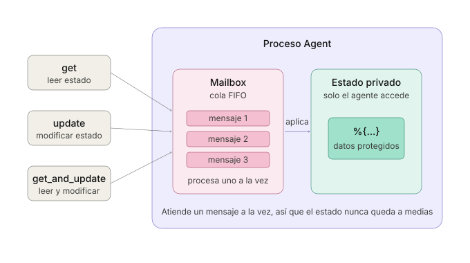
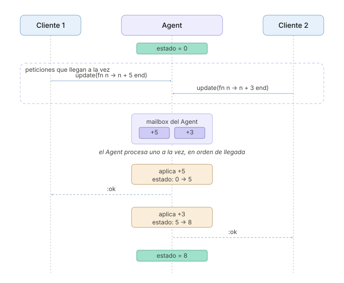
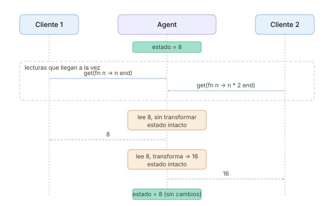

```
Universidad del Quindío
Programa de Ingeniería de Sistemas y Computación
Programación III - OTP (Open Telecom Platform)
Docente: Carlos Andrés Florez V.
```

# Introducción a OTP

En las guías anteriores se construyeron varios procesos a mano, como la caja registradora de la guía de procesos y la sede del inventario de las aplicaciones distribuidas. Todos siguen el mismo patrón. Un proceso guarda un estado en un bucle recursivo, atiende los mensajes uno a la vez y, cuando alguien le pregunta algo, le responde al PID que venía en el mensaje.

**OTP (Open Telecom Platform)** es el conjunto de bibliotecas y principios de diseño con el que se construyen, sobre la BEAM, sistemas concurrentes, distribuidos y tolerantes a fallos. Aunque su nombre sugiere orientación a telecomunicaciones, se usa en todo tipo de aplicaciones, desde servidores web hasta sistemas de mensajería y bases de datos distribuidas.

Una de sus ideas centrales es que ese patrón, que todos terminan escribiendo, ya está resuelto y probado. En lugar de escribir otra vez el bucle, el `receive` y la respuesta, se usa una pieza estándar y solo se escribe lo que cambia de un programa a otro. En esta guía se verán dos de esas piezas:

- **`GenServer`**, un proceso servidor que guarda un estado y atiende peticiones.
- **`Agent`**, una versión simplificada para cuando solo hace falta guardar y leer un valor.

En la próxima guía se verán los **supervisores**, que vigilan a otros procesos y los reinician cuando fallan. Con ellos se aplica una de las ideas más conocidas de OTP, **"let it crash"** (déjalo fallar). En lugar de programar a la defensiva para anticipar todos los errores posibles, se deja que el proceso falle y un supervisor lo reinicia en un estado conocido.

---

# GenServer

**GenServer** (*Generic Server*) es la pieza de OTP más utilizada. Define una plantilla para crear procesos que **mantienen un estado interno** y responden a peticiones, tanto **síncronas** (`call`, que esperan una respuesta) como **asíncronas** (`cast`, que no la esperan).

Para entender qué resuelve, lo mejor es partir de algo que ya se escribió a mano.

## De la caja registradora al `GenServer`

### Versión 1: La caja escrita a mano

Esta es la caja de la guía de procesos, con un cambio de organización. Sus operaciones quedaron en funciones públicas (`abrir/0`, `sumar/1` y `total/0`), para que quien la use no tenga que conocer el formato de los mensajes:

```elixir
defmodule Caja do
  def main do
    abrir()
    sumar(5000)
    sumar(3000)
    IO.puts("Total vendido: $#{total()}")
  end

  # ---------- API pública: oculta el formato de los mensajes ----------

  def abrir do
    pid = spawn(fn -> loop(0) end)
    Process.register(pid, :caja)
  end

  def sumar(valor), do: send(:caja, {:sumar, valor})

  def total do
    send(:caja, {:total, self()})

    receive do
      {:total, total} -> total
    after
      5000 -> {:error, :sin_respuesta} # Para no quedar bloqueado si la caja no responde
    end
  end

  # ---------- Bucle interno del proceso ----------

  defp loop(total) do
    receive do
      {:sumar, valor} ->
        loop(total + valor)

      {:total, remitente} ->
        send(remitente, {:total, total})
        loop(total)
    end
  end
end

Caja.main()
```

Al ejecutarlo:

```
Total vendido: $8000
```

Funciona, y cumple con el Modelo de Actores. Pero buena parte del código no tiene nada que ver con una caja:

- El bucle recursivo que vuelve a esperar después de cada mensaje.
- Enviar `self()` dentro del mensaje y escribir un `receive` con su `after` en cada función que pregunta algo.
- Etiquetar la respuesta (`{:total, total}`) para no confundirla con otros mensajes que lleguen a la cola de quien preguntó.
- Registrar el nombre del proceso a mano con `Process.register/2`.

Es el mismo código que hizo falta en la sede del inventario, y el que haría falta en un carrito de compras o en una sala de chat. Y si además se quisiera que el proceso se reiniciara al fallar, o saber por qué murió, habría que inventar todavía más código, que cada quien escribiría a su manera.

Ese es el problema que resuelve `GenServer`. **El patrón ya está escrito**, y solo hay que aportar las partes que cambian de un servidor a otro.

### Versión 2: La caja con `GenServer`

```elixir
defmodule Caja do
  use GenServer

  def main do
    start_link()
    sumar(5000)
    sumar(3000)
    IO.puts("Total vendido: $#{total()}")
  end

  # ========== API del cliente ==========

  def start_link(total_inicial \\ 0) do
    GenServer.start_link(__MODULE__, total_inicial, name: __MODULE__)
  end

  def sumar(valor), do: GenServer.cast(__MODULE__, {:sumar, valor})
  def total, do: GenServer.call(__MODULE__, :total)

  # ========== Callbacks del servidor ==========

  @impl true
  def init(total_inicial), do: {:ok, total_inicial}

  @impl true
  def handle_cast({:sumar, valor}, total), do: {:noreply, total + valor}

  @impl true
  def handle_call(:total, _from, total), do: {:reply, total, total}
end

Caja.main()
```

La salida es la misma, `Total vendido: $8000`, pero desaparecieron el `receive`, el `after`, el `self()`, el `Process.register` y la llamada recursiva.

`use GenServer` indica que el módulo sigue el **behaviour** (comportamiento) `GenServer`. Un behaviour es un acuerdo. OTP se encarga del proceso, de su cola de mensajes y del bucle, y el módulo se compromete a definir ciertas funciones, llamadas **callbacks**, que OTP invoca en el momento adecuado. `init/1` se invoca al arrancar, `handle_cast/2` cuando llega un `cast` y `handle_call/3` cuando llega un `call`.

La siguiente tabla muestra en qué se convirtió cada pieza de la Versión 1:

| Versión 1 (escrita a mano)                            | Versión 2 (con `GenServer`)                                     |
| ----------------------------------------------------- | --------------------------------------------------------------- |
| `spawn(fn -> loop(0) end)`                            | `GenServer.start_link(__MODULE__, 0, ...)`, que invoca `init/1` |
| `Process.register(pid, :caja)`                        | La opción `name: __MODULE__` de `start_link`                    |
| El argumento `total` de `loop/1`                      | El **estado**, que es el último argumento de cada callback      |
| Cada cláusula del `receive`                           | Una cláusula de `handle_cast/2` o de `handle_call/3`            |
| `loop(total + valor)` para continuar con otro estado  | `{:noreply, total + valor}`                                     |
| `send(remitente, {:total, total})` + `receive` + `after` | `{:reply, total, total}`                                     |
| Enviar `self()` dentro del mensaje                    | Lo hace `GenServer.call/2`, y llega en el parámetro `from`      |

La función que arranca el proceso también cambió de nombre, y no por capricho. Pasó de `abrir` a **`start_link`**, que es la convención de OTP. Conviene respetarla desde ya, porque es el nombre que un supervisor busca para levantar a sus hijos, como se verá en la próxima guía.

El proceso queda registrado con el propio nombre del módulo (`__MODULE__`, es decir, `Caja`), que es la convención habitual cuando solo existe una instancia del servidor. Por eso las funciones de la API usan `__MODULE__` en lugar de un PID.

La distinción entre `cast` y `call` es la que ya se conocía. `sumar/1` no necesita respuesta, así que es un `cast` y retorna de inmediato. `total/0` sí la necesita, así que es un `call` y bloquea hasta recibirla, con un tiempo de espera de 5 segundos que ya no hay que programar.

**El bucle recursivo no desapareció, cambió de dueño.** `GenServer` sigue haciendo lo mismo que hacía `loop/1`, esto es, esperar un mensaje, atenderlo y volver a esperar con el estado actualizado, solo que ese código ahora vive dentro de OTP. Por eso los callbacks nunca se llaman a sí mismos. Basta con devolver el nuevo estado, y `GenServer` se encarga de la siguiente vuelta.

Las anotaciones `@impl true` le indican al compilador que la función que sigue implementa un callback del behaviour. Sirven para detectar errores de escritura. Si se escribiera `handle_calls/3` por equivocación, Elixir avisaría en lugar de dejar ahí una función que nadie invoca.

### Versión 3: Más operaciones, mensajes directos y cierre

A la caja todavía le faltan varias cosas para parecerse a una caja de verdad:

- **Devolver dinero** con `devolver/1`, que resta un valor del total. Es un `cast`, porque no necesita respuesta.
- **Cerrar el turno** con `cerrar_turno/0`, que responde el total del turno y deja la caja en cero. Es un `call` que, además de responder, **cambia el estado**.
- **Atender los mensajes que no llegan por `call` ni por `cast`**, es decir, los que alguien envíe con `send/2` directamente. Esos llegan a `handle_info/2`.
- **Detenerse de forma ordenada** con `detener/0`, que llama a `GenServer.stop/1` y hace que OTP ejecute `terminate/2` antes de cerrar el proceso.

Este diagrama de secuencia muestra cómo viajan un `call` y un `cast`, desde el código que usa la caja, pasando por su API, hasta los callbacks del proceso:



En el `call`, quien llama queda esperando hasta que `handle_call/3` responde. En el `cast`, sigue de inmediato, y `handle_cast/2` actualiza el estado sin responderle a nadie.

El módulo completo queda así:

```elixir
defmodule Caja do
  use GenServer

  def main do
    start_link()

    sumar(5000)
    sumar(3000)
    devolver(2000)
    IO.puts("Total vendido: $#{total()}")

    IO.puts("Turno cerrado con $#{cerrar_turno()}")
    sumar(1000)

    # Un mensaje enviado por fuera de la API, para probar handle_info/2
    send(Caja, "Hola, soy un mensaje directo")

    detener()
  end

  # ========== API del cliente ==========

  def start_link(total_inicial \\ 0) do
    GenServer.start_link(__MODULE__, total_inicial, name: __MODULE__)
  end

  def sumar(valor), do: GenServer.cast(__MODULE__, {:sumar, valor})
  def devolver(valor), do: GenServer.cast(__MODULE__, {:devolver, valor})
  def total, do: GenServer.call(__MODULE__, :total)
  def cerrar_turno, do: GenServer.call(__MODULE__, :cerrar_turno)
  def detener, do: GenServer.stop(__MODULE__)

  # ========== Callbacks del servidor ==========

  @impl true
  def init(total_inicial) do
    # Se ejecuta en el proceso de la caja cuando arranca con start_link
    IO.puts("Caja abierta con $#{total_inicial}")
    {:ok, total_inicial}
  end

  @impl true
  def handle_cast({:sumar, valor}, total), do: {:noreply, total + valor}

  @impl true
  def handle_cast({:devolver, valor}, total), do: {:noreply, total - valor}

  @impl true
  def handle_call(:total, _from, total), do: {:reply, total, total}

  # Responde el total del turno y deja la caja en cero
  @impl true
  def handle_call(:cerrar_turno, _from, total), do: {:reply, total, 0}

  @impl true
  def handle_info(mensaje, total) do
    IO.inspect(mensaje, label: "Mensaje desconocido")
    {:noreply, total}
  end

  @impl true
  def terminate(razon, total) do
    IO.puts("Caja cerrada. Razón: #{inspect(razon)}, total final: $#{total}")
    :ok
  end
end

Caja.main()
```

Al ejecutarlo se obtiene:

```
Caja abierta con $0
Total vendido: $6000
Turno cerrado con $6000
Mensaje desconocido: "Hola, soy un mensaje directo"
Caja cerrada. Razón: :normal, total final: $1000
```

`handle_call(:cerrar_turno, ...)` devuelve `{:reply, total, 0}`. El segundo elemento es la respuesta y el tercero el nuevo estado, así que el cajero recibe el total del turno y la caja queda en cero para el siguiente.

La línea `send(Caja, "Hola, soy un mensaje directo")` envía un mensaje **por fuera** de la API, sin `call` ni `cast`, usando el nombre registrado. Ese mensaje no corresponde a ningún `handle_call/3` ni `handle_cast/2`, así que `GenServer` lo entrega a `handle_info/2`, que aquí solo lo reporta. Sin esa función, `GenServer` registraría un error por un mensaje inesperado.

---

## Los callbacks en detalle

Los callbacks aparecieron trabajando juntos en la caja. Aunque se declaran con `def`, **nunca se llaman directamente**, sino que los ejecuta el proceso del `GenServer` cuando le llega un mensaje. Lo que falta por conocer de cada uno son los valores que pueden devolver, porque la caja solo usó los más comunes.

### `init/1`

- `{:ok, estado}`: Inicialización exitosa
- `{:ok, estado, timeout}`: Con timeout de inactividad
- `:ignore`: No iniciar el servidor
- `{:stop, razón}`: Fallo en la inicialización

### `handle_call/3`

Su segundo parámetro, que en la caja se ignoró como `_from`, identifica al proceso que hizo el `call`. Sirve para responder más tarde, fuera del callback, como se hará con el pago del carrito de compras al final de la guía.

- `{:reply, respuesta, nuevo_estado}`: Responde inmediatamente
- `{:noreply, nuevo_estado}`: Respuesta diferida (usar `GenServer.reply/2` con el `from` guardado)
- `{:stop, razón, respuesta, nuevo_estado}`: Responde y detiene el servidor

### `handle_cast/2`

- `{:noreply, nuevo_estado}`: Continúa con nuevo estado
- `{:stop, razón, nuevo_estado}`: Detiene el servidor

### `handle_info/2`

En la caja tenía una sola cláusula genérica, pero lo habitual es atender mensajes concretos, como el aviso de que un proceso monitoreado murió. **La cláusula genérica debe ir de última** para no tapar las específicas:

```elixir
@impl true
def handle_info({:DOWN, _ref, :process, pid, _reason}, estado) do
  {:noreply, actualizar_estado_sin_proceso(estado, pid)}
end

# Catch-all: siempre al final
def handle_info(mensaje, estado) do
  IO.puts("Mensaje desconocido")
  {:noreply, estado}
end
```

También es la vía para crear temporizadores o tareas periódicas:

```elixir
@impl true
def init(_args) do
  schedule_tick() # Programar el primer tick, no bloquea el servidor
  {:ok, %{}}
end

# Enviar :tick cada 10 segundos, retorna un ref para cancelar si es necesario
defp schedule_tick(), do: Process.send_after(self(), :tick, 10000)

@impl true
def handle_info(:tick, estado) do
  IO.puts("Tick recibido!")
  # Realizar tarea periódica
  schedule_tick() # Reprogramar el siguiente tick, no bloquea el servidor
  {:noreply, estado}
end
```

> **⚠️ Importante:** Para cancelar un temporizador programado con `Process.send_after/3`, es necesario almacenar el valor de retorno (un `ref`) y usar `Process.cancel_timer/1` cuando ya no se necesite.

### `terminate/2`

Debe devolver `:ok`. En la caja solo imprimía un mensaje, pero su verdadero propósito es **liberar recursos** antes de que el proceso muera, como cerrar archivos o conexiones, guardar el estado en disco o avisarles a otros procesos.

> **⚠️ Importante:** `terminate/2` no siempre se ejecuta. Si el proceso muere de forma abrupta (por ejemplo, con `Process.exit(pid, :kill)`), OTP no alcanza a invocarlo, así que no conviene depender de él para nada crítico.

Para más información sobre `GenServer`, se recomienda consultar la [documentación oficial](https://hexdocs.pm/elixir/GenServer.html).

## `call` vs `cast`: ¿Cuándo usar cada uno?

| Característica       | `call` (síncrono)                    | `cast` (asíncrono)                    |
| -------------------- | ------------------------------------ | ------------------------------------- |
| **Espera respuesta** | Sí, bloquea hasta recibir            | No, retorna inmediatamente            |
| **Garantías**        | El mensaje se procesó                | El mensaje se envió                   |
| **Rendimiento**      | Más lento (espera)                   | Más rápido (no espera)                |
| **Cuándo usar**      | Se necesita el resultado             | Actualizar el estado sin respuesta    |
| **Ejemplo en la caja** | `total/0`, `cerrar_turno/0`        | `sumar/1`, `devolver/1`               |

---

# Agent

Si lo único que hace un proceso es guardar un valor, leerlo y cambiarlo, incluso un `GenServer` resulta más de lo necesario. Para esos casos, Elixir trae **`Agent`**, construido sobre `GenServer`, en el que no hay callbacks. La función que lee o cambia el estado se pasa en cada llamada.

## La caja con `Agent`

La caja, que solo suma ventas, consulta el total y cierra el turno, se puede escribir así:

```elixir
defmodule Caja do
  def main do
    start_link()
    sumar(5000)
    sumar(3000)
    IO.puts("Total vendido: $#{total()}")
    IO.puts("Turno cerrado con $#{cerrar_turno()}")
    IO.puts("Total después del cierre: $#{total()}")
  end

  def start_link(total_inicial \\ 0) do
    Agent.start_link(fn -> total_inicial end, name: __MODULE__)
  end

  def sumar(valor), do: Agent.update(__MODULE__, fn total -> total + valor end)
  def total, do: Agent.get(__MODULE__, fn total -> total end)

  # Devuelve el total del turno y deja la caja en cero, en una sola operación
  def cerrar_turno, do: Agent.get_and_update(__MODULE__, fn total -> {total, 0} end)
end

Caja.main()
```

Al ejecutarlo:

```
Total vendido: $8000
Turno cerrado con $8000
Total después del cierre: $0
```

- `Agent.start_link/2` recibe una función que produce el estado inicial, y con `name:` se registra igual que el `GenServer`.
- `Agent.update/2` recibe una función que toma el estado actual y devuelve el nuevo.
- `Agent.get/2` devuelve lo que retorne la función, sin cambiar el estado.
- `Agent.get_and_update/2` devuelve una tupla `{lo_que_se_responde, nuevo_estado}`, así que lee y cambia el estado en una sola operación. Es lo que hace `cerrar_turno/0`.

Las funciones que se le pasan al agente **se ejecutan dentro de su proceso**, una a la vez, como los callbacks de un `GenServer`. Además, a diferencia de un `cast`, `Agent.update/2` espera a que el agente confirme el cambio. Para no esperar existe `Agent.cast/2`.

Un `Agent` se puede visualizar de la siguiente manera:



Aunque dos procesos le envíen peticiones al mismo tiempo, el agente las atiende una a una, en el orden en que llegan. Por eso el estado nunca queda inconsistente:



Con las lecturas pasa lo mismo, también se atienden una a una. La función que se le pasa a `Agent.get/2` puede transformar lo que se devuelve, por ejemplo duplicarlo, sin cambiar el estado del agente:



Para conocer las demás funciones, puede consultar la [documentación oficial de Agent](https://hexdocs.pm/elixir/Agent.html).

## ¿Agent o GenServer?

Ambos mantienen estado dentro de un proceso, así que la pregunta habitual es cuál de los dos usar.

Como regla general, **`Agent` basta cuando lo único que se hace es guardar y recuperar un valor**, como en la caja, un contador, una caché o una configuración. Conviene pasar a `GenServer` en cuanto aparece alguna de estas necesidades:

- **Lógica de negocio** que decida qué hacer con cada petición, más allá de leer y escribir el estado, como validar que un producto esté en el catálogo antes de agregarlo al carrito.
- **Varios tipos de mensajes** que se atienden de forma distinta, como se vio con `handle_call/3` y `handle_cast/2`.
- **Callbacks propios** de arranque o de cierre, como `init/1` y `terminate/2`.
- **Mensajes que llegan por fuera de la API**, atendidos con `handle_info/2`, por ejemplo tareas periódicas con temporizador.
- **Responder más tarde**, como el pago del carrito de compras que se verá a continuación.

Hay algo que no depende de esa elección. **Los dos se integran igual de bien con supervisores**, porque un `Agent` es, por debajo, un `GenServer` con una interfaz reducida. Elegir uno u otro no compromete la tolerancia a fallos, que es el tema de la próxima guía.

---

# Una tienda en línea con `GenServer`

Para ver un `GenServer` en un sistema más completo, se construirá el carrito de compras de una tienda en línea. La tienda corre en un nodo y guarda el carrito de cada usuario. Los clientes se conectan desde otros nodos, agregan y eliminan productos, ven su carrito y pagan.

El carrito necesita lo que `Agent` no ofrece:

- **Lógica de negocio.** Solo se pueden agregar productos del catálogo de la tienda.
- **Varios tipos de mensajes**, unos con respuesta (`call`) y otros sin ella (`cast`).
- **Responder más tarde.** El pago lo aprueba un banco, que tarda unos segundos, y mientras tanto la tienda debe seguir atendiendo a los demás clientes.

Los scripts usan el módulo `Util` para leer datos e imprimir mensajes, así que deben estar en la misma carpeta que `util.exs` compilado.

## La tienda

Cree el archivo `tienda.exs`:

```elixir
defmodule Carritos do
  use GenServer

  @nombre_nodo :tienda@localhost
  @catalogo %{"teclado" => 180_000, "mouse" => 75_000, "monitor" => 620_000, "audifonos" => 150_000}

  def main do
    case Node.start(@nombre_nodo, :shortnames) do
      {:ok, _} ->
        {:ok, _} = start_link()
        Util.imprimir_mensaje("Tienda iniciada en #{node()}")
        Util.imprimir_mensaje("Esperando clientes...\n")

        # El GenServer atiende en su propio proceso, así que el principal solo debe seguir vivo
        :timer.sleep(:infinity)

      {:error, _} ->
        Util.imprimir_error("No se pudo iniciar el nodo. Verifique que epmd esté corriendo y que el nombre no esté en uso")
    end
  end

  # El estado guarda el carrito de cada usuario, %{usuario => %{producto => cantidad}}
  def start_link(carritos \\ %{}) do
    GenServer.start_link(__MODULE__, carritos, name: __MODULE__)
  end

  # ========== Callbacks del servidor ==========

  @impl true
  def init(carritos), do: {:ok, carritos}

  # Solo se agregan productos del catálogo, por eso es un call: el cliente necesita saber si se pudo
  @impl true
  def handle_call({:agregar, usuario, producto, cantidad}, _from, carritos) do
    if Map.has_key?(@catalogo, producto) do
      Util.imprimir_mensaje("[#{usuario}] Agregó #{cantidad} #{producto}")

      carrito =
        carritos
        |> Map.get(usuario, %{})
        |> Map.update(producto, cantidad, fn actual -> actual + cantidad end)

      {:reply, {:agregado, producto}, Map.put(carritos, usuario, carrito)}
    else
      {:reply, {:error, :producto_no_existe}, carritos}
    end
  end

  @impl true
  def handle_call({:ver, usuario}, _from, carritos) do
    carrito = Map.get(carritos, usuario, %{})
    {:reply, {:carrito, carrito, total(carrito)}, carritos}
  end

  @impl true
  def handle_call({:pagar, usuario}, from, carritos) do
    carrito = Map.get(carritos, usuario, %{})

    if map_size(carrito) == 0 do
      {:reply, {:error, :carrito_vacio}, carritos}
    else
      monto = total(carrito)
      Util.imprimir_mensaje("[#{usuario}] Pago por $#{monto} en proceso")

      # El banco tarda, así que el pago se procesa en otro proceso, que le responde al cliente
      spawn(fn -> GenServer.reply(from, procesar_pago(monto)) end)

      # El carrito se vacía de inmediato, y el servidor queda libre para atender a los demás
      {:noreply, Map.delete(carritos, usuario)}
    end
  end

  # Eliminar no necesita respuesta, por eso es un cast
  @impl true
  def handle_cast({:eliminar, usuario, producto}, carritos) do
    carrito = carritos |> Map.get(usuario, %{}) |> Map.delete(producto)
    {:noreply, Map.put(carritos, usuario, carrito)}
  end

  # ========== Funciones auxiliares ==========

  defp total(carrito) do
    carrito
    |> Enum.map(fn {producto, cantidad} -> @catalogo[producto] * cantidad end)
    |> Enum.sum()
  end

  # Simula el banco, que tarda 3 segundos en aprobar el pago
  defp procesar_pago(monto) do
    :timer.sleep(3000)
    {:pago_aprobado, monto}
  end
end

Carritos.main()
```

El estado es un mapa con el carrito de cada usuario, y cada carrito es a su vez un mapa de producto a cantidad, por ejemplo `%{"ana" => %{"mouse" => 2, "teclado" => 1}}`. Los precios están en el atributo `@catalogo`, y `total/1` los usa para calcular cuánto vale un carrito.

La elección entre `call` y `cast` depende de si el cliente necesita una respuesta:

- **Agregar es un `call`**, aunque cambie el estado, porque puede fallar. Si el producto no está en el catálogo, el cliente debe enterarse.
- **Ver el carrito y pagar son `call`**, porque el cliente espera el contenido del carrito o la confirmación del pago.
- **Eliminar es un `cast`.** Si el producto no está en el carrito, no pasa nada, así que no hace falta esperar una respuesta.

Hay un detalle en `main`. El `GenServer` atiende los mensajes en su **propio proceso**, no en el principal. Si `main` terminara después de `start_link`, el script terminaría y con él la máquina virtual, así que `:timer.sleep(:infinity)` mantiene vivo el proceso principal.

### Pagar sin bloquear la tienda

Lo más natural sería procesar el pago dentro del callback:

```elixir
@impl true
def handle_call({:pagar, usuario}, _from, carritos) do
  monto = total(Map.get(carritos, usuario, %{}))
  {:reply, procesar_pago(monto), Map.delete(carritos, usuario)}
end
```

Pero `procesar_pago/1` tarda 3 segundos, y mientras tanto el `GenServer` no vuelve a su cola. Cualquier otro cliente que quiera agregar un producto o ver su carrito tendría que esperar a que termine el pago ajeno.

La solución es procesar el pago en otro proceso. Pero ese proceso no puede responder con `send(pid, ...)`, porque el mensaje no trae el PID del cliente, ya que `GenServer.call` lo envía por su cuenta. Lo que sí llega es el parámetro `from`, que identifica a quien hizo el `call`. Por eso la versión de `tienda.exs` hace tres cosas:

1. Crea un proceso con `spawn` que procesa el pago.
2. Ese proceso le responde al cliente con `GenServer.reply(from, respuesta)`.
3. El callback devuelve `{:noreply, Map.delete(carritos, usuario)}`. Eso significa "la respuesta llegará después", pero el estado sí cambia de inmediato, porque el carrito ya se vació. El `GenServer` queda libre para atender el siguiente mensaje, y el cliente sigue esperando su respuesta.

Es el uso de la **respuesta diferida** que aparece en la lista de valores de `handle_call/3`.

## El cliente

Cree el archivo `cliente.exs`:

```elixir
defmodule Cliente do
  @nodo_tienda :tienda@localhost
  @timeout 10000

  def main do
    case Node.start(crear_nombre_nodo(), :shortnames) do
      {:ok, _} ->
        conectar(Node.connect(@nodo_tienda))

      {:error, _} ->
        Util.imprimir_error("No se pudo iniciar el nodo. Verifique que epmd esté corriendo y que el nombre no esté en uso")
    end
  end

  # Cada cliente necesita un nombre de nodo distinto, porque puede haber varios a la vez
  defp crear_nombre_nodo do
    sufijo = :crypto.strong_rand_bytes(4) |> Base.encode16(case: :lower)
    String.to_atom("cliente_#{sufijo}@localhost")
  end

  defp conectar(true) do
    Util.leer("Su nombre: ", :string)
    |> String.downcase()
    |> menu()
  end

  defp conectar(false), do: Util.imprimir_error("No se pudo conectar con la tienda #{@nodo_tienda}")

  # Muestra el menú y atiende opciones hasta que el usuario decida salir
  defp menu(usuario) do
    mostrar_opciones()

    case Util.leer("Seleccione una opción (1-5): ", :string) do
      "5" ->
        Util.imprimir_mensaje("Hasta pronto, #{usuario}")

      opcion ->
        atender_opcion(opcion, usuario)
        menu(usuario)
    end
  end

  defp mostrar_opciones do
    Util.imprimir_mensaje("\n1 - Agregar un producto")
    Util.imprimir_mensaje("2 - Eliminar un producto")
    Util.imprimir_mensaje("3 - Ver el carrito")
    Util.imprimir_mensaje("4 - Pagar")
    Util.imprimir_mensaje("5 - Salir\n")
  end

  defp atender_opcion("1", usuario) do
    producto = leer_producto()
    cantidad = leer_cantidad()
    pedir({:agregar, usuario, producto, cantidad})
  end

  defp atender_opcion("2", usuario) do
    GenServer.cast({Carritos, @nodo_tienda}, {:eliminar, usuario, leer_producto()})
    Util.imprimir_mensaje("Producto eliminado del carrito")
  end

  defp atender_opcion("3", usuario), do: pedir({:ver, usuario})

  defp atender_opcion("4", usuario) do
    Util.imprimir_mensaje("Procesando el pago...")
    pedir({:pagar, usuario})
  end

  defp atender_opcion(opcion, _usuario), do: Util.imprimir_error("Opción inválida: #{opcion}")

  defp leer_producto do
    Util.leer("Producto: ", :string) |> String.downcase()
  end

  defp leer_cantidad do
    cantidad = Util.leer("Cantidad: ", :integer)

    if cantidad > 0 do
      cantidad
    else
      Util.imprimir_error("La cantidad debe ser mayor que cero")
      leer_cantidad()
    end
  end

  # Le hace la petición al GenServer Carritos del nodo de la tienda y muestra la respuesta
  defp pedir(mensaje) do
    {Carritos, @nodo_tienda}
    |> GenServer.call(mensaje, @timeout)
    |> mostrar_respuesta()
  end

  defp mostrar_respuesta({:agregado, producto}),
    do: Util.imprimir_mensaje("Se agregó #{producto} al carrito")

  defp mostrar_respuesta({:carrito, carrito, total}) do
    Enum.each(carrito, fn {producto, cantidad} -> Util.imprimir_mensaje("  #{producto} x #{cantidad}") end)
    Util.imprimir_mensaje("Total: $#{total}")
  end

  defp mostrar_respuesta({:pago_aprobado, monto}),
    do: Util.imprimir_mensaje("Pago aprobado por $#{monto}. ¡Gracias por su compra!")

  defp mostrar_respuesta({:error, :producto_no_existe}),
    do: Util.imprimir_mensaje("Ese producto no está en el catálogo")

  defp mostrar_respuesta({:error, :carrito_vacio}),
    do: Util.imprimir_mensaje("El carrito está vacío")
end

Cliente.main()
```

`pedir/1` le hace la petición a la tienda con `GenServer.call/3`. El destino es la tupla `{Carritos, @nodo_tienda}`, es decir, el proceso registrado como `Carritos` en el nodo de la tienda. `GenServer.call/3` espera la respuesta y la retorna, así que `mostrar_respuesta/1` tiene una cláusula por cada respuesta posible. Eliminar, en cambio, usa `GenServer.cast/2` con el mismo destino y no espera nada.

El tercer argumento de `GenServer.call/3` es el tiempo máximo de espera. Por defecto son 5 segundos, y como el pago tarda 3, se usa `@timeout 10000` para tener margen. Si la tienda no responde a tiempo, `GenServer.call/3` no devuelve un valor sino que detiene al cliente con un error. Cómo reaccionar ante esos fallos es el tema de la próxima guía.

`menu/1` es recursiva. Después de atender una opción, vuelve a mostrar el menú, hasta que el usuario elige salir.

## Ejecutar la tienda y los clientes

Verifique que EPMD esté activo (`epmd -names`, o inícielo con `epmd -daemon`). Luego ejecute la tienda en una terminal y uno o varios clientes en otras:

```bash
# Terminal 1
elixir tienda.exs
```

```bash
# Terminal 2, 3, ...
elixir cliente.exs
```

Una sesión de un cliente se ve así:

```
Su nombre: Ana

1 - Agregar un producto
2 - Eliminar un producto
3 - Ver el carrito
4 - Pagar
5 - Salir

Seleccione una opción (1-5): 1
Producto: teclado
Cantidad: 1
Se agregó teclado al carrito
...
Seleccione una opción (1-5): 3
  mouse x 2
  teclado x 1
Total: $330000
...
Seleccione una opción (1-5): 4
Procesando el pago...
Pago aprobado por $330000. ¡Gracias por su compra!
```

Cada cliente tiene un nombre de nodo distinto, así que puede abrir tantos como quiera:



Pruebe a pagar en un cliente y, enseguida, agregar un producto o ver el carrito en otro. El segundo cliente recibe su respuesta de inmediato, mientras el pago del primero se sigue procesando.

Para ejecutar la tienda y los clientes en máquinas diferentes, los cambios son los mismos de la Versión 5 de la guía de aplicaciones distribuidas, es decir, nombres completos con la IP de cada máquina (`:longnames`) y la misma cookie en todos los nodos.

---

## Ejercicios propuestos

Realice los siguientes ejercicios para practicar el uso de `GenServer` y `Agent`. Al terminar cada uno, explique por qué la abstracción que se pide es la adecuada para ese problema.

### Ejercicio 1: Turnos de un banco

Un banco entrega turnos a sus clientes y varios asesores los van llamando. Implemente un `GenServer` `Turnos` que guarde los turnos en espera, en orden de llegada, y ofrezca estas operaciones:

- `pedir_turno(nombre)`: registra al cliente y le devuelve su número de turno. Los números empiezan en 1 y nunca se repiten en el día.
- `llamar_siguiente(asesor)`: le entrega al asesor el siguiente turno en espera, o `{:error, :sin_turnos}` si no hay nadie.
- `en_espera()`: devuelve cuántos turnos hay en espera.
- `atendidos()`: devuelve la lista de turnos atendidos, con el asesor que atendió cada uno.

Decida cuáles operaciones deben ser `call` y cuáles `cast`, y justifíquelo. Pruébelo en un solo nodo, con una función `main` que simule a varios clientes pidiendo turno y a dos asesores llamándolos.

Responda: si el proceso de los turnos falla y se vuelve a iniciar, ¿qué pasa con los turnos en espera y con la numeración? ¿Qué haría falta para no perderlos?

### Ejercicio 2: Tabla de posiciones de fútbol con Agent

Implemente una **tabla de posiciones** de un torneo de fútbol usando `Agent`, que mantenga los puntos de cada equipo en un mapa (clave: nombre del equipo, valor: puntos).

Recuerde que en el fútbol una **victoria** otorga 3 puntos, un **empate** 1 punto y una **derrota** 0 puntos.

La tabla debe ofrecer las siguientes operaciones:

- `registrar(equipo)`: agrega un equipo nuevo con 0 puntos. Si ya existe, no debe modificar sus puntos.
- `victoria(equipo)`: suma 3 puntos al equipo indicado.
- `empate(equipo)`: suma 1 punto al equipo indicado.
- `puntos(equipo)`: devuelve los puntos actuales de un equipo.
- `tabla()`: devuelve el mapa completo con todos los equipos y sus puntos.
- `lider()`: devuelve el nombre del equipo con mayor puntaje (el puntero del torneo).

Utilice las funciones del módulo `Agent` vistas en esta guía. Compare esta solución con el Ejercicio 1 y con el carrito de compras: ¿en qué casos resulta más conveniente usar `Agent` y en cuáles `GenServer`?

### Ejercicio 3: Gestión de tareas distribuida

Se requiere un sistema de gestión de tareas en el que varios usuarios agregan, completan, eliminan y listan sus tareas. Cada tarea tiene un título, una descripción y un estado (completada o no), y se representa con un struct `Tarea`.

1. Escriba un `GenServer` `TareasServidor` que corra en su propio nodo y guarde las tareas de todos los usuarios en un mapa (`%{usuario => [%Tarea{}, ...]}`). Agregar, completar y eliminar deben ser `cast`, y listar y consultar las estadísticas de un usuario (total, completadas y pendientes) deben ser `call`.
2. Escriba un cliente que corra en otro nodo, con un menú para el usuario. Use el módulo `Util` para leer los datos y dele a cada cliente un nombre de nodo distinto, para que puedan trabajar varios a la vez.
3. Pruebe con al menos dos clientes al mismo tiempo, si puede en máquinas diferentes.

Responda: ¿por qué agregar una tarea puede ser un `cast`, pero listar las tareas debe ser un `call`?

---

## Para la próxima clase

- Investigar qué es un **Supervisor** en OTP y cómo implementa la filosofía "let it crash".
- Qué es un **árbol de supervisión** y para qué sirve.
- Investigar qué es un **`DynamicSupervisor`** y en qué se diferencia de un Supervisor normal.
