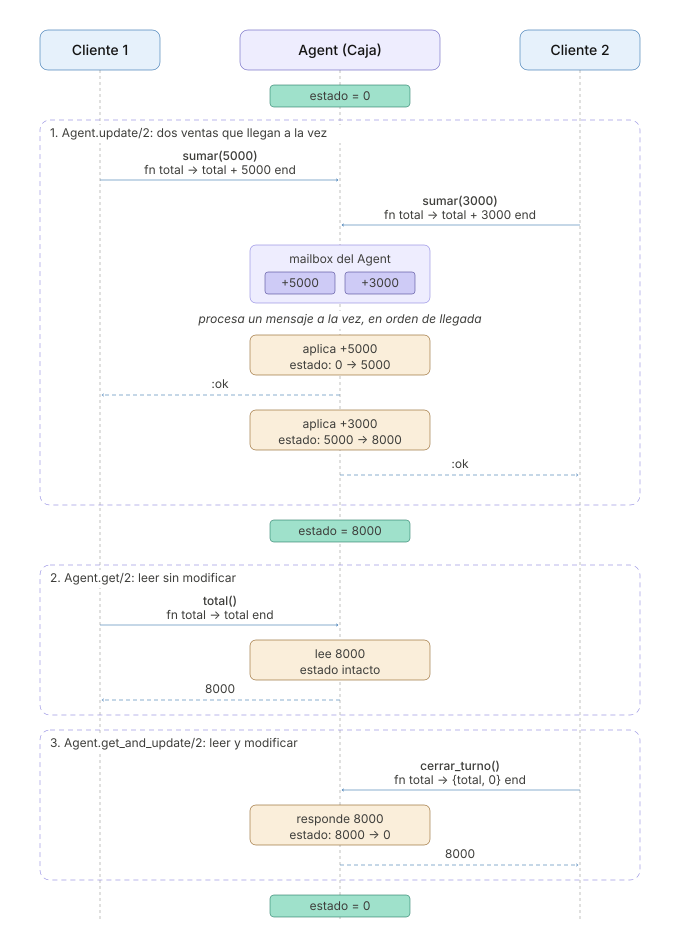

```
Universidad del Quindío
Programa de Ingeniería de Sistemas y Computación
Programación III - OTP (Open Telecom Platform)
Docente: Carlos Andrés Florez V.
```

# Introducción a OTP

En las guías anteriores se construyeron varios procesos de forma manual. Todos siguen un patrón similar. Un proceso mantiene un estado en un bucle recursivo, atiende los mensajes uno a uno y, cuando recibe una solicitud de información, responde al PID incluido en el mensaje. **Este patrón puede simplificarse mediante las herramientas que proporciona OTP.**

**OTP (Open Telecom Platform)** proporciona bibliotecas y principios de diseño para construir, sobre la BEAM, sistemas concurrentes, distribuidos y tolerantes a fallos. Aunque su nombre está relacionado con las telecomunicaciones, sus herramientas se utilizan en diferentes tipos de aplicaciones, como servidores web, sistemas de mensajería y bases de datos distribuidas.

En esta guía se estudiarán dos módulos que reemplazan el bucle, el `send` y el `receive` escritos a mano:

* `GenServer` permite construir procesos servidores que mantienen un estado y atienden diferentes tipos de peticiones.

* `Agent` proporciona una forma más sencilla de mantener y actualizar un estado cuando no se necesita manejar diferentes tipos de mensajes.

---

# GenServer

**GenServer** (*Generic Server*) es la pieza de OTP más utilizada. Define una plantilla para crear procesos que **mantienen un estado interno** y responden a peticiones, tanto **síncronas** (`call`, que esperan una respuesta) como **asíncronas** (`cast`, que no la esperan).

Para entender qué resuelve, lo mejor es partir de algo que ya se escribió a mano.

## De la caja registradora al `GenServer`

En la guía de procesos se construyó una caja registradora, un proceso que recibe las ventas, las va sumando y, cuando alguien lo pide, informa el total vendido. Aquí se retoma ese ejemplo. Primero se revisa la caja tal como se escribió a mano y luego se reescribe con `GenServer`, para ver qué partes del código desaparecen.

### Versión 1: La caja escrita a mano

Esta es la caja de la guía de procesos, con sus operaciones en funciones públicas (`abrir/0`, `sumar/1` y `total/0`):

```elixir
defmodule Caja do
  def main do
    abrir()
    sumar(5000)
    sumar(3000)
    IO.puts("Total vendido: $#{total()}")
  end

  # ---------- API pública: oculta el formato de los mensajes ----------

  def abrir do
    pid = spawn(fn -> loop(0) end)
    Process.register(pid, :caja)
  end

  def sumar(valor), do: send(:caja, {:sumar, valor})

  def total do
    send(:caja, {:total, self()})

    receive do
      {:total, total} -> total
    after
      5000 -> {:error, :sin_respuesta} # Para no quedar bloqueado si la caja no responde
    end
  end

  # ---------- Bucle interno del proceso ----------

  defp loop(total) do
    receive do
      {:sumar, valor} ->
        loop(total + valor)

      {:total, remitente} ->
        send(remitente, {:total, total})
        loop(total)
    end
  end
end

Caja.main()
```

Al ejecutarlo:

```
Total vendido: $8000
```

Funciona y cumple con el Modelo de Actores. Sin embargo, buena parte del código no tiene relación con la lógica de una caja:

* El bucle recursivo que vuelve a esperar después de procesar cada mensaje.
* Enviar `self()` dentro del mensaje y escribir un `receive` con su `after` en cada función que realiza una consulta.
* Etiquetar la respuesta, por ejemplo `{:total, total}`, para no confundirla con otros mensajes que puedan llegar a la cola del proceso que realizó la consulta.
* Registrar manualmente el nombre del proceso mediante `Process.register/2`.

Este código tendría que repetirse al implementar otros procesos, como un carrito de compras, una sala de chat, un sistema de reservas o un servicio de notificaciones. Además, si se quisiera reiniciar automáticamente el proceso después de un fallo o conocer el motivo por el que terminó, habría que agregar más código, que cada desarrollador podría resolver de una forma diferente.

### Versión 2: La caja con `GenServer`

En esta versión se utiliza `GenServer` para resolver el problema anterior. **El patrón ya está escrito**, por lo que solo es necesario aportar las partes que cambian de un servidor a otro.


```elixir
defmodule Caja do
  use GenServer

  def main do
    start_link()
    sumar(5000)
    sumar(3000)
    IO.puts("Total vendido: $#{total()}")
  end

  # ========== API del cliente ==========

  def start_link(total_inicial \\ 0) do
    GenServer.start_link(__MODULE__, total_inicial, name: __MODULE__)
  end

  def sumar(valor), do: GenServer.cast(__MODULE__, {:sumar, valor})
  def total, do: GenServer.call(__MODULE__, :total)

  # ========== Callbacks del servidor ==========

  @impl true
  def init(total_inicial), do: {:ok, total_inicial}

  @impl true
  def handle_cast({:sumar, valor}, total), do: {:noreply, total + valor}

  @impl true
  def handle_call(:total, _from, total), do: {:reply, total, total}
end

Caja.main()
```

La salida es la misma, `Total vendido: $8000`.

`use GenServer` indica que el módulo sigue el **behaviour** (comportamiento) `GenServer`. Un *behaviour* define un acuerdo que el módulo debe cumplir. En este caso, OTP se encarga de gestionar el proceso, su cola de mensajes y el bucle de ejecución, mientras que el módulo debe definir determinadas funciones, llamadas **callbacks**, que OTP invoca en el momento adecuado.

**El bucle recursivo no desapareció, cambió de dueño.** `GenServer` sigue haciendo lo mismo que hacía `loop/1`: esperar un mensaje, atenderlo y volver a esperar con el estado actualizado. La diferencia es que ahora ese código forma parte de OTP. Por eso, los *callbacks* no necesitan llamarse a sí mismos. Basta con devolver el nuevo estado y `GenServer` se encarga de continuar con la siguiente iteración.

El módulo se divide en dos partes, separadas en el código por comentarios.

#### La API del cliente

Son las funciones públicas que usa el resto del programa. Se ejecutan en el proceso que las invoca y se comunican con la caja mediante mensajes.

- `start_link/1` inicia el proceso de la caja. Antes se llamaba `abrir`, y cambió de nombre para seguir la convención de OTP. Es importante adoptarla desde el principio, ya que `start_link` es el nombre que los supervisores utilizan para iniciar sus procesos hijos.
- La opción `name: __MODULE__` registra el proceso con el nombre del módulo, es decir, `Caja`. Es la convención habitual cuando solo existe una instancia del servidor, y por eso las demás funciones de la API usan `__MODULE__` en lugar de un PID.
- `sumar/1` usa `GenServer.cast/2`, y `total/0` usa `GenServer.call/2`.

`cast` y `call` corresponden a las dos formas de comunicación que ya tenía la Versión 1. Allí, `sumar/1` solo enviaba un mensaje con `send` y continuaba sin esperar respuesta, mientras que `total/0` enviaba el mensaje y se quedaba esperando en un `receive` hasta recibir el total.

- `GenServer.cast/2` reemplaza la primera forma. Deja el mensaje en la cola de la caja y retorna `:ok` de inmediato, sin esperar a que se procese. Por eso `handle_cast/2` no envía ninguna respuesta. Se usa cuando quien llama no necesita un resultado, como al sumar una venta.
- `GenServer.call/2` reemplaza la segunda. El proceso que la invoca queda en espera hasta que `handle_call/3` devuelve la respuesta, o hasta que pasan 5 segundos. Se usa cuando quien llama necesita un resultado, como al consultar el total.

#### Diagrama de secuencia

El siguiente diagrama de secuencia muestra las dos llamadas de `main`, desde el código que usa la caja, pasando por su API, hasta los callbacks del proceso. Con `call`, el cliente queda bloqueado hasta recibir el total. Con `cast`, recibe `:ok` y continúa mientras la caja procesa el mensaje:


#### Los callbacks del servidor

Son las funciones que OTP invoca dentro del proceso de la caja. El último argumento de cada una es el **estado**, en este caso el total vendido.

- `init/1` se invoca al iniciar el proceso y devuelve `{:ok, estado_inicial}`.
- `handle_cast/2` se invoca cuando llega un `cast` y devuelve `{:noreply, nuevo_estado}`.
- `handle_call/3` se invoca cuando llega un `call` y devuelve `{:reply, respuesta, nuevo_estado}`. La respuesta es lo que recibe quien hizo el `call`.

Las anotaciones `@impl true` le indican al compilador que la función que sigue implementa un callback del behaviour. Sirven para detectar errores de escritura. Si se escribiera `handle_calls/3` por equivocación, Elixir avisaría en lugar de dejar ahí una función que nadie invoca.

#### De la Versión 1 a la Versión 2

La siguiente tabla resume en qué se convirtió cada pieza de la caja escrita a mano:

| Versión 1 (escrita a mano)                               | Versión 2 (con `GenServer`)                                     |
| -------------------------------------------------------- | --------------------------------------------------------------- |
| `spawn(fn -> loop(0) end)`                               | `GenServer.start_link(__MODULE__, 0, ...)`, que invoca `init/1` |
| `Process.register(pid, :caja)`                           | La opción `name: __MODULE__` de `start_link`                    |
| El argumento `total` de `loop/1`                         | El **estado**, que es el último argumento de cada callback      |
| Cada cláusula del `receive`                              | Una cláusula de `handle_cast/2` o de `handle_call/3`            |
| `loop(total + valor)` para continuar con otro estado     | `{:noreply, total + valor}`                                     |
| `send(remitente, {:total, total})` + `receive` + `after` | `{:reply, total, total}`                                        |
| Enviar `self()` dentro del mensaje                       | Lo hace `GenServer.call/2`, y llega en el parámetro `from`      |

### Versión 3: Más operaciones, mensajes directos y cierre

A la caja todavía le faltan varias cosas para parecerse a una caja de verdad:

- **Devolver dinero** con `devolver/1`, que resta un valor del total. Es un `cast`, porque no necesita respuesta.
- **Cerrar el turno** con `cerrar_turno/0`, que responde el total del turno y deja la caja en cero. Es un `call` que, además de responder, **cambia el estado**.
- **Atender los mensajes que no llegan por `call` ni por `cast`**, es decir, los que alguien envíe con `send/2` directamente. Esos llegan a `handle_info/2`.
- **Detenerse de forma ordenada** con `detener/0`, que llama a `GenServer.stop/1` y hace que OTP ejecute `terminate/2` antes de cerrar el proceso.

El módulo completo queda así:

```elixir
defmodule Caja do
  use GenServer

  def main do
    start_link()

    sumar(5000)
    sumar(3000)
    devolver(2000)
    IO.puts("Total vendido: $#{total()}")

    IO.puts("Turno cerrado con $#{cerrar_turno()}")
    sumar(1000)

    # Un mensaje enviado por fuera de la API, para probar handle_info/2
    send(Caja, "Hola, soy un mensaje directo")

    detener()
  end

  # ========== API del cliente ==========

  def start_link(total_inicial \\ 0) do
    GenServer.start_link(__MODULE__, total_inicial, name: __MODULE__)
  end

  def sumar(valor), do: GenServer.cast(__MODULE__, {:sumar, valor})
  def devolver(valor), do: GenServer.cast(__MODULE__, {:devolver, valor})
  def total, do: GenServer.call(__MODULE__, :total)
  def cerrar_turno, do: GenServer.call(__MODULE__, :cerrar_turno)
  def detener, do: GenServer.stop(__MODULE__)

  # ========== Callbacks del servidor ==========

  @impl true
  def init(total_inicial) do
    # Se ejecuta en el proceso de la caja cuando arranca con start_link
    IO.puts("Caja abierta con $#{total_inicial}")
    {:ok, total_inicial}
  end

  @impl true
  def handle_cast({:sumar, valor}, total), do: {:noreply, total + valor}

  @impl true
  def handle_cast({:devolver, valor}, total), do: {:noreply, total - valor}

  @impl true
  def handle_call(:total, _from, total), do: {:reply, total, total}

  # Responde el total del turno y deja la caja en cero
  @impl true
  def handle_call(:cerrar_turno, _from, total), do: {:reply, total, 0}

  @impl true
  def handle_info(mensaje, total) do
    IO.inspect(mensaje, label: "Mensaje desconocido")
    {:noreply, total}
  end

  @impl true
  def terminate(razon, total) do
    IO.puts("Caja cerrada. Razón: #{inspect(razon)}, total final: $#{total}")
    :ok
  end
end

Caja.main()
```

Al ejecutarlo se obtiene:

```
Caja abierta con $0
Total vendido: $6000
Turno cerrado con $6000
Mensaje desconocido: "Hola, soy un mensaje directo"
Caja cerrada. Razón: :normal, total final: $1000
```

En `cerrar_turno/0`, `{:reply, total, 0}` responde con el total del turno y deja la caja en cero.

El mensaje enviado con `send/2` no corresponde a ningún `handle_call/3` ni `handle_cast/2`, así que `GenServer` lo entrega a `handle_info/2`, que aquí solo lo reporta. Sin esa función, `GenServer` registraría un error por un mensaje inesperado.

`terminate/2` se ejecutó porque la caja se detuvo con `GenServer.stop/1`. En la caja solo imprime un mensaje, pero su propósito habitual es **liberar recursos** antes de que el proceso termine, como cerrar archivos o conexiones, o guardar el estado en disco. Debe devolver `:ok`.

> **⚠️ Importante:** `terminate/2` no siempre se ejecuta. Si el proceso termina de forma abrupta, por ejemplo con `Process.exit(pid, :kill)`, OTP no alcanza a invocarlo, así que no conviene depender de él para operaciones críticas.

Para más información sobre `GenServer`, se recomienda consultar la [documentación oficial](https://hexdocs.pm/elixir/GenServer.html).

---

# Agent

Si lo único que hace un proceso es guardar un valor, leerlo y cambiarlo, incluso un `GenServer` resulta más de lo necesario. Para esos casos, Elixir trae **`Agent`**, construido sobre `GenServer`, en el que no hay callbacks. La función que lee o cambia el estado se pasa en cada llamada.

## La caja con `Agent`

La caja, que solo suma ventas, consulta el total y cierra el turno, se puede escribir así:

```elixir
defmodule Caja do
  def main do
    start_link()
    sumar(5000)
    sumar(3000)
    IO.puts("Total vendido: $#{total()}")
    IO.puts("Turno cerrado con $#{cerrar_turno()}")
    IO.puts("Total después del cierre: $#{total()}")
  end

  def start_link(total_inicial \\ 0) do
    Agent.start_link(fn -> total_inicial end, name: __MODULE__)
  end

  def sumar(valor), do: Agent.update(__MODULE__, fn total -> total + valor end)
  def total, do: Agent.get(__MODULE__, fn total -> total end)

  # Devuelve el total del turno y deja la caja en cero, en una sola operación
  def cerrar_turno, do: Agent.get_and_update(__MODULE__, fn total -> {total, 0} end)
end

Caja.main()
```

Al ejecutarlo:

```
Total vendido: $8000
Turno cerrado con $8000
Total después del cierre: $0
```

- `Agent.start_link/2` recibe una función que produce el estado inicial, y con `name:` se registra igual que el `GenServer`.
- `Agent.update/2` recibe una función que toma el estado actual y devuelve el nuevo. A diferencia de un `cast`, espera a que el agente confirme el cambio con `:ok`. Para no esperar existe `Agent.cast/2`.
- `Agent.get/2` devuelve lo que retorne la función, sin cambiar el estado.
- `Agent.get_and_update/2` recibe una función que devuelve una tupla `{lo_que_se_responde, nuevo_estado}`.

Por dentro, cada una de estas llamadas llega como un mensaje a la cola del agente, y las funciones que se le pasan **se ejecutan dentro de su proceso**, una a la vez y en el orden en que llegan, como los callbacks de un `GenServer`. Por eso, aunque dos procesos cambien el estado al mismo tiempo, nunca queda inconsistente. El siguiente diagrama muestra las operaciones de la caja con dos clientes:



Para conocer las demás funciones, puede consultar la [documentación oficial de Agent](https://hexdocs.pm/elixir/Agent.html).

## ¿Agent o GenServer?

Ambos permiten mantener un estado dentro de un proceso, por lo que la elección depende de las operaciones que deba realizar ese proceso.

En general, `Agent` es suficiente cuando el proceso solo necesita **guardar y actualizar un estado** mediante operaciones sencillas, como ocurre con un contador, una caché o una configuración. Conviene utilizar `GenServer` cuando el proceso necesita comportamientos más específicos, como los siguientes:

* **Reglas de negocio** que determinen qué hacer con cada petición, más allá de actualizar el estado. Por ejemplo, validar que un producto esté en el catálogo antes de agregarlo al carrito.

* **Varios tipos de mensajes** que deban atenderse de manera diferente, mediante callbacks como `handle_call/3` y `handle_cast/2`.

* **Callbacks propios** para controlar situaciones como el arranque o la terminación del proceso, mediante `init/1` y `terminate/2`.

* **Mensajes que llegan por fuera de la API**, que pueden atenderse mediante `handle_info/2`.

* **Operaciones que deban responder más adelante**, como ocurre con el pago de un carrito de compras que se verá a continuación.

Hay algo que no depende de esta elección: tanto `Agent` como `GenServer` pueden integrarse con supervisores. Un `Agent` utiliza `GenServer` internamente y proporciona una interfaz más sencilla para los casos en los que no se necesitan todas sus funcionalidades. Por lo tanto, elegir `Agent` no impide utilizar los mecanismos de supervisión y tolerancia a fallos de OTP.

---

# Una tienda en línea con `GenServer`

Para ver un `GenServer` en un sistema más completo, se construirá el carrito de compras de una tienda en línea. La tienda corre en un nodo y guarda el carrito de cada usuario. Los clientes se conectan desde otros nodos, agregan y eliminan productos, ven su carrito y pagan.

El carrito reúne tres de las razones anteriores para usar `GenServer`. Aplica reglas de negocio, porque solo se pueden agregar productos del catálogo, atiende mensajes con respuesta y sin ella, y debe responder más tarde, porque el pago lo aprueba un banco que tarda unos segundos y, mientras tanto, la tienda debe seguir atendiendo a los demás clientes.

Los scripts usan el módulo `Util` para leer datos e imprimir mensajes, así que deben estar en la misma carpeta que `util.exs` compilado.

## La tienda

Cree el archivo `tienda.exs`:

```elixir
defmodule Carritos do
  use GenServer

  @nombre_nodo :tienda@localhost
  @catalogo %{"teclado" => 180_000, "mouse" => 75_000, "monitor" => 620_000, "audifonos" => 150_000}

  def main do
    case Node.start(@nombre_nodo, :shortnames) do
      {:ok, _} ->
        {:ok, _} = start_link()
        Util.imprimir_mensaje("Tienda iniciada en #{node()}")
        Util.imprimir_mensaje("Esperando clientes...\n")

        # El GenServer atiende en su propio proceso, así que el principal solo debe seguir vivo
        :timer.sleep(:infinity)

      {:error, _} ->
        Util.imprimir_error("No se pudo iniciar el nodo. Verifique que epmd esté corriendo y que el nombre no esté en uso")
    end
  end

  # El estado guarda el carrito de cada usuario, %{usuario => %{producto => cantidad}}
  def start_link(carritos \\ %{}) do
    GenServer.start_link(__MODULE__, carritos, name: __MODULE__)
  end

  # ========== Callbacks del servidor ==========

  @impl true
  def init(carritos), do: {:ok, carritos}

  # Solo se agregan productos del catálogo, por eso es un call: el cliente necesita saber si se pudo
  @impl true
  def handle_call({:agregar, usuario, producto, cantidad}, _from, carritos) do
    if Map.has_key?(@catalogo, producto) do
      Util.imprimir_mensaje("[#{usuario}] Agregó #{cantidad} #{producto}")

      carrito =
        carritos
        |> Map.get(usuario, %{})
        |> Map.update(producto, cantidad, fn actual -> actual + cantidad end)

      {:reply, {:agregado, producto}, Map.put(carritos, usuario, carrito)}
    else
      {:reply, {:error, :producto_no_existe}, carritos}
    end
  end

  @impl true
  def handle_call({:ver, usuario}, _from, carritos) do
    carrito = Map.get(carritos, usuario, %{})
    {:reply, {:carrito, carrito, total(carrito)}, carritos}
  end

  @impl true
  def handle_call({:pagar, usuario}, from, carritos) do
    carrito = Map.get(carritos, usuario, %{})

    if map_size(carrito) == 0 do
      {:reply, {:error, :carrito_vacio}, carritos}
    else
      monto = total(carrito)
      Util.imprimir_mensaje("[#{usuario}] Pago por $#{monto} en proceso")

      # El banco tarda, así que el pago se procesa en otro proceso, que le responde al cliente
      spawn(fn -> GenServer.reply(from, procesar_pago(monto)) end)

      # El carrito se vacía de inmediato, y el servidor queda libre para atender a los demás
      {:noreply, Map.delete(carritos, usuario)}
    end
  end

  # Eliminar no necesita respuesta, por eso es un cast
  @impl true
  def handle_cast({:eliminar, usuario, producto}, carritos) do
    carrito = carritos |> Map.get(usuario, %{}) |> Map.delete(producto)
    {:noreply, Map.put(carritos, usuario, carrito)}
  end

  # ========== Funciones auxiliares ==========

  defp total(carrito) do
    carrito
    |> Enum.map(fn {producto, cantidad} -> @catalogo[producto] * cantidad end)
    |> Enum.sum()
  end

  # Simula el banco, que tarda 3 segundos en aprobar el pago
  defp procesar_pago(monto) do
    :timer.sleep(3000)
    {:pago_aprobado, monto}
  end
end

Carritos.main()
```

El estado es un mapa con el carrito de cada usuario, y cada carrito es a su vez un mapa de producto a cantidad, por ejemplo `%{"ana" => %{"mouse" => 2, "teclado" => 1}}`. Los precios están en el atributo `@catalogo`, y `total/1` los usa para calcular cuánto vale un carrito.


### Pagar sin bloquear la tienda

Lo más natural sería procesar el pago dentro del callback:

```elixir
@impl true
def handle_call({:pagar, usuario}, _from, carritos) do
  monto = total(Map.get(carritos, usuario, %{}))
  {:reply, procesar_pago(monto), Map.delete(carritos, usuario)}
end
```

Pero `procesar_pago/1` tarda 3 segundos, y mientras tanto el `GenServer` no vuelve a su cola. Cualquier otro cliente que quiera agregar un producto o ver su carrito tendría que esperar a que termine el pago ajeno.

Por eso `tienda.exs` procesa el pago en otro proceso. Ese proceso no puede responder con `send(pid, ...)`, porque el mensaje no trae el PID del cliente, ya que `GenServer.call` lo envía por su cuenta. Lo que sí llega es el parámetro `from`, que identifica a quien hizo el `call`, y con él se responde usando `GenServer.reply/2`. Mientras tanto el callback devuelve `{:noreply, ...}`, que significa "la respuesta llegará después". El cliente sigue esperando, pero el `GenServer` queda libre para atender el siguiente mensaje.

## El cliente

Cree el archivo `cliente.exs`:

```elixir
defmodule Cliente do
  @nodo_tienda :tienda@localhost
  @timeout 10000

  def main do
    case Node.start(crear_nombre_nodo(), :shortnames) do
      {:ok, _} ->
        conectar(Node.connect(@nodo_tienda))

      {:error, _} ->
        Util.imprimir_error("No se pudo iniciar el nodo. Verifique que epmd esté corriendo y que el nombre no esté en uso")
    end
  end

  # Cada cliente necesita un nombre de nodo distinto, porque puede haber varios a la vez
  defp crear_nombre_nodo do
    sufijo = :crypto.strong_rand_bytes(4) |> Base.encode16(case: :lower)
    String.to_atom("cliente_#{sufijo}@localhost")
  end

  defp conectar(true) do
    Util.leer("Su nombre: ", :string)
    |> String.downcase()
    |> menu()
  end

  defp conectar(false), do: Util.imprimir_error("No se pudo conectar con la tienda #{@nodo_tienda}")

  # Muestra el menú y atiende opciones hasta que el usuario decida salir
  defp menu(usuario) do
    mostrar_opciones()

    case Util.leer("Seleccione una opción (1-5): ", :string) do
      "5" ->
        Util.imprimir_mensaje("Hasta pronto, #{usuario}")

      opcion ->
        atender_opcion(opcion, usuario)
        menu(usuario)
    end
  end

  defp mostrar_opciones do
    Util.imprimir_mensaje("\n1 - Agregar un producto")
    Util.imprimir_mensaje("2 - Eliminar un producto")
    Util.imprimir_mensaje("3 - Ver el carrito")
    Util.imprimir_mensaje("4 - Pagar")
    Util.imprimir_mensaje("5 - Salir\n")
  end

  defp atender_opcion("1", usuario) do
    producto = leer_producto()
    cantidad = leer_cantidad()
    pedir({:agregar, usuario, producto, cantidad})
  end

  defp atender_opcion("2", usuario) do
    GenServer.cast({Carritos, @nodo_tienda}, {:eliminar, usuario, leer_producto()})
    Util.imprimir_mensaje("Producto eliminado del carrito")
  end

  defp atender_opcion("3", usuario), do: pedir({:ver, usuario})

  defp atender_opcion("4", usuario) do
    Util.imprimir_mensaje("Procesando el pago...")
    pedir({:pagar, usuario})
  end

  defp atender_opcion(opcion, _usuario), do: Util.imprimir_error("Opción inválida: #{opcion}")

  defp leer_producto do
    Util.leer("Producto: ", :string) |> String.downcase()
  end

  defp leer_cantidad do
    cantidad = Util.leer("Cantidad: ", :integer)

    if cantidad > 0 do
      cantidad
    else
      Util.imprimir_error("La cantidad debe ser mayor que cero")
      leer_cantidad()
    end
  end

  # Le hace la petición al GenServer Carritos del nodo de la tienda y muestra la respuesta
  defp pedir(mensaje) do
    {Carritos, @nodo_tienda}
    |> GenServer.call(mensaje, @timeout)
    |> mostrar_respuesta()
  end

  defp mostrar_respuesta({:agregado, producto}),
    do: Util.imprimir_mensaje("Se agregó #{producto} al carrito")

  defp mostrar_respuesta({:carrito, carrito, total}) do
    Enum.each(carrito, fn {producto, cantidad} -> Util.imprimir_mensaje("  #{producto} x #{cantidad}") end)
    Util.imprimir_mensaje("Total: $#{total}")
  end

  defp mostrar_respuesta({:pago_aprobado, monto}),
    do: Util.imprimir_mensaje("Pago aprobado por $#{monto}. ¡Gracias por su compra!")

  defp mostrar_respuesta({:error, :producto_no_existe}),
    do: Util.imprimir_mensaje("Ese producto no está en el catálogo")

  defp mostrar_respuesta({:error, :carrito_vacio}),
    do: Util.imprimir_mensaje("El carrito está vacío")
end

Cliente.main()
```

El destino de `GenServer.call/3` y `GenServer.cast/2` es la tupla `{Carritos, @nodo_tienda}`, que identifica el proceso registrado como `Carritos` en el nodo de la tienda. La función `mostrar_respuesta/1` tiene una cláusula para cada tipo de respuesta que puede recibir.

El tercer argumento de `GenServer.call/3` indica el tiempo máximo que el cliente esperará por una respuesta. Por defecto, este tiempo es de 5 segundos. Como el procesamiento del pago tarda 3 segundos, se establece `@timeout 10000` para disponer de un margen adicional. Si la tienda no responde dentro del tiempo establecido, `GenServer.call/3` termina con un error en el **cliente**.

## Ejecutar la tienda y los clientes

Verifique que EPMD esté activo (`epmd -names`, o inícielo con `epmd -daemon`). Luego ejecute la tienda en una terminal y uno o varios clientes en otras:

```bash
# Terminal 1
elixir tienda.exs
```

```bash
# Terminal 2, 3, ...
elixir cliente.exs
```

Una sesión de un cliente se ve así:

```
Su nombre: Ana

1 - Agregar un producto
2 - Eliminar un producto
3 - Ver el carrito
4 - Pagar
5 - Salir

Seleccione una opción (1-5): 1
Producto: teclado
Cantidad: 1
Se agregó teclado al carrito
...
Seleccione una opción (1-5): 3
  mouse x 2
  teclado x 1
Total: $330000
...
Seleccione una opción (1-5): 4
Procesando el pago...
Pago aprobado por $330000. ¡Gracias por su compra!
```

Cada cliente tiene un nombre de nodo distinto, así que puede abrir tantos como quiera:


Pruebe a pagar en un cliente y, enseguida, agregar un producto o ver el carrito en otro. El segundo cliente recibe su respuesta de inmediato, mientras el pago del primero se sigue procesando.

Para ejecutar la tienda y los clientes en máquinas diferentes, los cambios son los mismos de la Versión 5 de la guía de aplicaciones distribuidas, es decir, nombres completos con la IP de cada máquina (`:longnames`) y la misma cookie en todos los nodos.

---

## Ejercicios propuestos

Realice los siguientes ejercicios para practicar el uso de `GenServer` y `Agent`. Al terminar cada uno, explique por qué la abstracción que se pide es la adecuada para ese problema.

### Ejercicio 1: Turnos de un banco

Un banco entrega turnos a sus clientes y varios asesores los van llamando. Implemente un `GenServer` `Turnos` que guarde los turnos en espera, en orden de llegada, y ofrezca estas operaciones:

- `pedir_turno(nombre)`: registra al cliente y le devuelve su número de turno. Los números empiezan en 1 y nunca se repiten en el día.
- `llamar_siguiente(asesor)`: le entrega al asesor el siguiente turno en espera, o `{:error, :sin_turnos}` si no hay nadie.
- `en_espera()`: devuelve cuántos turnos hay en espera.
- `atendidos()`: devuelve la lista de turnos atendidos, con el asesor que atendió cada uno.

Decida cuáles operaciones deben ser `call` y cuáles `cast`, y justifíquelo. Pruébelo en un solo nodo, con una función `main` que simule a varios clientes pidiendo turno y a dos asesores llamándolos.

Responda: si el proceso de los turnos falla y se vuelve a iniciar, ¿qué pasa con los turnos en espera y con la numeración? ¿Qué haría falta para no perderlos?

### Ejercicio 2: Tabla de posiciones de fútbol con Agent

Implemente una **tabla de posiciones** de un torneo de fútbol usando `Agent`, que mantenga los puntos de cada equipo en un mapa (clave: nombre del equipo, valor: puntos).

Recuerde que en el fútbol una **victoria** otorga 3 puntos, un **empate** 1 punto y una **derrota** 0 puntos.

La tabla debe ofrecer las siguientes operaciones:

- `registrar(equipo)`: agrega un equipo nuevo con 0 puntos. Si ya existe, no debe modificar sus puntos.
- `victoria(equipo)`: suma 3 puntos al equipo indicado.
- `empate(equipo)`: suma 1 punto al equipo indicado.
- `puntos(equipo)`: devuelve los puntos actuales de un equipo.
- `tabla()`: devuelve el mapa completo con todos los equipos y sus puntos.
- `lider()`: devuelve el nombre del equipo con mayor puntaje (el puntero del torneo).

Utilice las funciones del módulo `Agent` vistas en esta guía. Compare esta solución con el Ejercicio 1 y con el carrito de compras: ¿en qué casos resulta más conveniente usar `Agent` y en cuáles `GenServer`?

### Ejercicio 3: Gestión de tareas distribuida

Se requiere un sistema de gestión de tareas en el que varios usuarios agregan, completan, eliminan y listan sus tareas. Cada tarea tiene un título, una descripción y un estado (completada o no), y se representa con un struct `Tarea`.

1. Escriba un `GenServer` `TareasServidor` que corra en su propio nodo y guarde las tareas de todos los usuarios en un mapa (`%{usuario => [%Tarea{}, ...]}`). Agregar, completar y eliminar deben ser `cast`, y listar y consultar las estadísticas de un usuario (total, completadas y pendientes) deben ser `call`.
2. Escriba un cliente que corra en otro nodo, con un menú para el usuario. Use el módulo `Util` para leer los datos y dele a cada cliente un nombre de nodo distinto, para que puedan trabajar varios a la vez.
3. Pruebe con al menos dos clientes al mismo tiempo, si puede en máquinas diferentes.

Responda: ¿por qué agregar una tarea puede ser un `cast`, pero listar las tareas debe ser un `call`?

---

## Para la próxima clase

- Investigar qué es un **Supervisor** en OTP y cómo implementa la filosofía "let it crash".
- Qué es un **árbol de supervisión** y para qué sirve.
- Investigar qué es un **`DynamicSupervisor`** y en qué se diferencia de un Supervisor normal.
