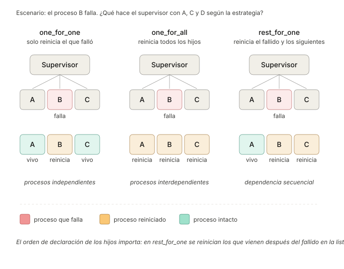
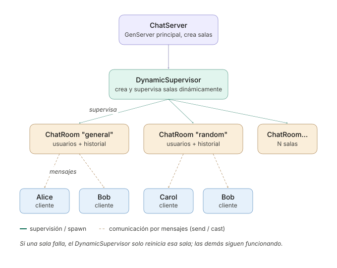

```
Universidad del Quindío
Programa de Ingeniería de Sistemas y Computación
Programación III - Supervisores
Docente: Carlos Andrés Florez V.
```

# Supervisores y tolerancia a fallos

En la guía anterior vimos cómo crear procesos con estado usando `Agent` y `GenServer`. Sin embargo, a un sistema no le basta con tener procesos. También necesita una forma de **recuperarse cuando esos procesos fallan**.

En esta guía se estudian los **supervisores**, procesos cuya función es vigilar a otros procesos, denominados **hijos**, y reiniciarlos cuando fallan.

---

## Ejemplo 1: Supervisión de la caja registradora

### Versión 1: La caja sin supervisor

Cree un archivo `turno.exs` y copie al inicio el módulo `Caja` de la guía anterior, en su versión completa, **sin la función `main` ni la llamada `Caja.main()`**. Debajo, agregue este módulo:

```elixir
defmodule Turno do
  def main do
    Caja.start_link()

    Caja.sumar(5000)
    Caja.sumar("mil") # Un valor que no es un número
    Caja.sumar(3000)

    IO.puts("Total vendido: $#{Caja.total()}")
  end
end

Turno.main()
```

Al ejecutarlo, la caja intenta calcular `5000 + "mil"` y falla con un `ArithmeticError`. El error es largo, pero lo importante está al principio y al final:

```
Caja abierta con $0
Caja cerrada. Razón: {:badarith, ...}, total final: $5000

[error] GenServer Caja terminating
** (ArithmeticError) bad argument in arithmetic expression
    :erlang.+(5000, "mil")
...
** (EXIT from #PID<0.94.0>) an exception was raised:
    ** (ArithmeticError) bad argument in arithmetic expression
```

El mensaje `Total vendido` nunca se imprime. Aunque el error ocurrió en la caja, el programa completo se detuvo. La línea que comienza con `** (EXIT from #PID<...>)` indica que el error también terminó el proceso principal.

Esto ocurre porque `start_link` crea un **vínculo** entre la caja y el proceso que la inició, como sucedía con `Task.async`. Cuando uno de dos procesos vinculados termina por un error, el otro también termina, por lo que la falla de la caja detiene el proceso principal.

### Versión 2: Un supervisor para la caja

Reemplace `main` por esta versión:

```elixir
def main do
  Supervisor.start_link([{Caja, 0}], strategy: :one_for_one)
  IO.puts("PID de la caja: #{inspect(Process.whereis(Caja))}")

  Caja.sumar(5000)
  Caja.sumar("mil") # Un valor que no es un número
  :timer.sleep(100) # Le da tiempo al supervisor para reiniciar la caja

  IO.puts("PID de la caja: #{inspect(Process.whereis(Caja))}")
  Caja.sumar(3000)
  IO.puts("Total vendido: $#{Caja.total()}")
end
```

`Supervisor.start_link/2` crea un supervisor y recibe la lista de sus hijos. `{Caja, 0}` le indica que debe iniciar la caja llamando a `Caja.start_link(0)`. Ahora la caja queda vinculada al supervisor, y no al proceso principal.

Al ejecutarlo, sin las líneas del error:

```
Caja abierta con $0
PID de la caja: #PID<0.105.0>
Caja cerrada. Razón: {:badarith, ...}, total final: $5000
[error] GenServer Caja terminating
...
Caja abierta con $0
PID de la caja: #PID<0.106.0>
Total vendido: $3000
```

La caja falla con el mismo error, pero esta vez el programa se ejecuta hasta el final. Cuando la caja terminó, el supervisor recibió la notificación y la reinició. Por eso aparece nuevamente `Caja abierta con $0`, y el PID es distinto, ya que se trata de un proceso nuevo. Como el nuevo proceso se registró con el mismo nombre, `Caja.sumar(3000)` y `Caja.total()` funcionan sin ningún cambio.

El total final es `$3000` y no `$8000`, porque la caja reiniciada comienza con el estado inicial, `0`, y las ventas registradas en el proceso anterior se pierden. Reiniciar un proceso implica perder su estado, pero también retomar la ejecución desde un estado inicial conocido. Si la información no puede perderse, debe almacenarse fuera del proceso, por ejemplo en un archivo.

La pausa de 100 milisegundos es necesaria porque `sumar` es un `cast` y no espera respuesta. Sin ella, `main` continuaría de inmediato y enviaría mensajes a la caja antes de que el supervisor la reinicie.

Este es el principio de **"dejarlo fallar"** (*let it crash*). En lugar de anticipar en la caja cada dato inválido que pudiera recibir, se permite que el proceso falle y se delega su recuperación al supervisor.

### Versión 3: Un módulo supervisor

En una aplicación, un supervisor normalmente vigila varios procesos, y su configuración se define en un módulo propio, de forma similar a un `GenServer`. El siguiente supervisor vigila la caja y los carritos de la tienda en línea de la guía anterior. Copie en el archivo el módulo `Carritos`, también sin `main` y sin el atributo `@nombre_nodo`, y debajo de él escriba el supervisor. Tenga `util.exs` compilado en la misma carpeta, porque `Carritos` lo utiliza.

```elixir
defmodule Tienda.Supervisor do
  use Supervisor

  def start_link(_opts) do
    Supervisor.start_link(__MODULE__, :ok, name: __MODULE__)
  end

  @impl true
  def init(:ok) do
    hijos = [
      {Caja, 0},        # La caja empieza en 0
      {Carritos, %{}}   # La tienda empieza sin carritos
    ]

    # Si un hijo falla, solo ese se reinicia
    Supervisor.init(hijos, strategy: :one_for_one)
  end
end
```

`use Supervisor` funciona como `use GenServer`. El módulo define `init/1`, que devuelve la lista de hijos y la estrategia, y OTP se encarga del resto.

Reemplace `main` en `Turno` para que inicie este supervisor y muestre los dos PID antes y después del fallo:

```elixir
def main do
  Tienda.Supervisor.start_link([])
  mostrar_pids()

  Caja.sumar("mil") # Un valor que no es un número
  :timer.sleep(100) # Le da tiempo al supervisor para reiniciar la caja

  mostrar_pids()
end

defp mostrar_pids do
  IO.puts("Caja: #{inspect(Process.whereis(Caja))}, Carritos: #{inspect(Process.whereis(Carritos))}")
end
```

La salida, sin las líneas del error, es:

```
Caja abierta con $0
Caja: #PID<0.112.0>, Carritos: #PID<0.113.0>
Caja abierta con $0
Caja: #PID<0.114.0>, Carritos: #PID<0.113.0>
```

La caja tiene un PID nuevo, mientras que los carritos conservan el suyo. La falla de la caja no afectó a la tienda.

## Estrategias de supervisión

El hecho de que solo se reinicie el hijo que falló se debe a la estrategia `:one_for_one`. Un supervisor puede usar tres estrategias:



1. **`:one_for_one`**: solo reinicia el proceso que falló. Es la más común, y sirve cuando los hijos no dependen unos de otros, como la caja y los carritos.
2. **`:one_for_all`**: si un hijo falla, reinicia todos los hijos. Sirve cuando los hijos no pueden funcionar unos sin otros. Por ejemplo, en un juego en línea, el proceso que guarda el tablero y el que controla los turnos deben empezar de nuevo juntos, porque un turno en curso no tiene sentido sobre un tablero que volvió al inicio.
3. **`:rest_for_one`**: reinicia el proceso que falló y todos los que se iniciaron **después** de él en la lista de hijos. Sirve cuando cada hijo depende de los anteriores. Por ejemplo, si el primer hijo mantiene la conexión con una base de datos y los siguientes la usan, al reiniciarse la conexión también deben reiniciarse los que la usaban, pero no los que se iniciaron antes que ella.

Si en `Tienda.Supervisor` se cambia la estrategia por `:one_for_all` y se vuelve a ejecutar, los dos PID cambian después del fallo de la caja.

## Tipos de reinicio de los hijos

Además de la **estrategia** del supervisor, cada proceso hijo puede declarar **cuándo debe reiniciarse** mediante la opción `restart`:

- **`:permanent`** (por defecto): el hijo siempre se reinicia si termina, sin importar la razón. Es lo adecuado para procesos que deben estar activos mientras corra la aplicación, como la caja.
- **`:temporary`**: el hijo nunca se reinicia, aunque falle. Sirve para procesos que hacen una tarea y terminan, cuando repetirla podría causar problemas, como el envío de un correo. Si el proceso falla a mitad del envío, repetirlo podría hacer que el destinatario lo reciba dos veces.
- **`:transient`**: el hijo se reinicia solo si termina por un error. Si termina normalmente, con la razón `:normal`, no se reinicia. Sirve para procesos que algún día deben terminar, como una partida que se cierra cuando acaba el juego, pero que no deben perderse si fallan antes.

La opción se indica al declarar el hijo, con `Supervisor.child_spec/2`:

```elixir
hijos = [
  Supervisor.child_spec({Caja, 0}, restart: :transient),
  {Carritos, %{}} # Sin la opción, queda como :permanent
]
```

Con `:transient`, si la caja se detiene con `Caja.detener()`, que la termina con la razón `:normal`, el supervisor no la vuelve a iniciar. Si falla por un error, sí.

## Límites de reinicio

Si un proceso falla inmediatamente después de iniciarse, por ejemplo porque requiere un archivo que no existe, reiniciarlo no resuelve el problema, ya que volverá a fallar. Para evitar reinicios indefinidos, un supervisor tiene un límite que se configura con dos opciones:

- `max_restarts` (por defecto 3), la cantidad máxima de reinicios permitidos.
- `max_seconds` (por defecto 5), el período de tiempo en el que se cuentan esos reinicios.

Con los valores por defecto, si los hijos fallan más de 3 veces en 5 segundos, el supervisor deja de reiniciarlos y **él mismo termina**. Si ese supervisor tiene a su vez un supervisor, este lo reiniciará, de modo que el problema se escala en el árbol hasta un nivel que pueda manejarlo. Para cambiar el límite:

```elixir
Supervisor.init(hijos, strategy: :one_for_one, max_restarts: 5, max_seconds: 10)
```

## DynamicSupervisor

`Tienda.Supervisor` declara sus hijos de antemano, en `init/1`. Sin embargo, en algunos casos no se conoce cuántos procesos existirán, como las salas de un chat, que se crean a solicitud de los usuarios. Para estos casos se usa `DynamicSupervisor`, que inicia sin hijos y los agrega en tiempo de ejecución con `DynamicSupervisor.start_child/2`. Cada hijo agregado queda supervisado de la misma forma que en un supervisor normal.

```elixir
# Iniciar el supervisor dinámico
{:ok, sup} = DynamicSupervisor.start_link(strategy: :one_for_one)

# Agregar hijos en tiempo de ejecución
{:ok, pid1} = DynamicSupervisor.start_child(sup, {MiServidor, arg1})
{:ok, pid2} = DynamicSupervisor.start_child(sup, {MiServidor, arg2})
```

---

## Ejemplo 2: Sistema de chat con árbol de procesos

Este ejemplo combina `GenServer`, monitoreo de procesos y `DynamicSupervisor` en un chat simple. Cada usuario tiene su propio proceso para recibir mensajes, un servidor principal administra las salas, y cada sala es un `GenServer` independiente que maneja a sus usuarios y mensajes:



### 1. Estructura de archivos

La aplicación se puede organizar en tres archivos principales:

```
ChatApp/
├── chat_server.exs   # El orquestador: salas, usuarios y mensajes
├── chat_room.exs     # Cada sala es un GenServer independiente
└── chat_client.exs   # Lógica de usuario (interfaz del cliente)
```

### 2. Implementación de la sala de chat

Cree un archivo llamado `chat_room.exs` y defina el módulo `ChatRoom` utilizando `GenServer`:

```elixir
defmodule ChatRoom do
  use GenServer

  # Estado: %{name: String, users: %{pid => username}, messages: [String]}

  ## --- API pública ---

  def start_link(name) do
    GenServer.start_link(__MODULE__, %{name: name, users: %{}, messages: []})
  end

  def join(pid, user_pid, username), do: GenServer.cast(pid, {:join, user_pid, username})
  def leave(pid, user_pid), do: GenServer.cast(pid, {:leave, user_pid})
  def send_message(pid, user_pid, msg), do: GenServer.cast(pid, {:message, user_pid, msg})

  ## Callbacks

  @impl true
  def init(state), do: {:ok, state}

  @impl true
  def handle_cast({:join, pid, username}, state) do
    # Monitorear el proceso del usuario para detectar desconexiones
    Process.monitor(pid)
    IO.puts("#{username} se unió a #{state.name}")
    # Se agrega el usuario al estado de la sala, su pid es la clave y su nombre es el valor
    {:noreply, %{state | users: Map.put(state.users, pid, username)}}
  end

  @impl true
  def handle_cast({:leave, pid}, state) do
    # Eliminar al usuario dado su pid
    {username, users} = Map.pop(state.users, pid) 
    IO.puts("#{username} salió de #{state.name}")
    {:noreply, %{state | users: users}}
  end

  @impl true
  def handle_cast({:message, from_pid, msg}, state) do
    # Obtener el nombre del usuario que envió el mensaje usando su pid
    username = Map.get(state.users, from_pid, "Desconocido")
    full = "#{username}: #{msg}"
    # Enviar el mensaje a todos los usuarios conectados a la sala
    Enum.each(state.users, fn {pid, _} -> send(pid, {:chat, state.name, full}) end)
    {:noreply, %{state | messages: [full | state.messages]}}
  end

  @impl true
  def handle_info({:DOWN, _ref, :process, pid, _}, state) do
    # Eliminar al usuario desconectado cuando su proceso muere
    {username, users} = Map.pop(state.users, pid) 
    IO.puts("#{username} desconectado de #{state.name}")
    {:noreply, %{state | users: users}}
  end
end
```

Cada sala almacena en su estado los usuarios conectados, con su PID como clave, y los mensajes enviados.

Cuando un usuario se une, la sala llama a `Process.monitor(pid)` para **monitorear** su proceso. A partir de ese momento, si el proceso del usuario termina, por ejemplo porque se cerró sin invocar `leave`, la sala recibe automáticamente el mensaje `{:DOWN, ref, :process, pid, motivo}`. Como este mensaje no llega por `call` ni por `cast`, lo atiende `handle_info/2`, que elimina al usuario de la lista.

A diferencia del vínculo que crea `start_link`, el monitoreo funciona en una sola dirección y no detiene a nadie. La sala solo recibe un aviso cuando el usuario termina, y si la sala falla, el proceso del usuario no se ve afectado.

### 3. Implementación del servidor de chat

Cree un archivo llamado `chat_server.exs` y defina el módulo `ChatServer` utilizando `GenServer`:

```elixir
defmodule ChatServer do
  use GenServer

  ## --- API pública ---

  def start_link(_opts \\ []) do
    GenServer.start_link(__MODULE__, %{}, name: __MODULE__)
  end

  def create_room(name), do: GenServer.call(__MODULE__, {:create_room, name})
  def list_rooms(), do: GenServer.call(__MODULE__, :list_rooms)
  def get_room_pid(name), do: GenServer.call(__MODULE__, {:get_room, name})

  ## --- Callbacks ---

  @impl true
  def init(_) do
    # Supervisor dinámico para las salas de chat
    {:ok, sup} = DynamicSupervisor.start_link(strategy: :one_for_one) 
    # El estado del servidor incluye un mapa de salas (nombre => pid) y el pid del supervisor
    {:ok, %{rooms: %{}, sup: sup}}
  end

  @impl true
  def handle_call({:create_room, name}, _from, state) do
    if Map.has_key?(state.rooms, name) do
      # La sala ya existe, no se puede crear otra con el mismo nombre
      {:reply, {:error, :exists}, state}
    else
      # Iniciar una nueva sala de chat como un proceso hijo del supervisor dinámico
      {:ok, pid} = DynamicSupervisor.start_child(state.sup, {ChatRoom, name})
      {:reply, {:ok, pid}, %{state | rooms: Map.put(state.rooms, name, pid)}}
    end
  end

  @impl true
  def handle_call(:list_rooms, _from, state) do
    # Devuelve la lista de nombres de las salas de chat disponibles
    {:reply, Map.keys(state.rooms), state}
  end

  @impl true
  def handle_call({:get_room, name}, _from, state) do
    # Devuelve el pid de la sala si existe, o nil si no existe
    {:reply, Map.get(state.rooms, name), state}
  end
end
```

En `init/1`, el servidor crea su propio `DynamicSupervisor` con `DynamicSupervisor.start_link/1`, que queda vinculado al servidor. Posteriormente, cada vez que se crea una sala, no se invoca `ChatRoom.start_link/1` directamente, sino `DynamicSupervisor.start_child/2`, que solicita al supervisor iniciar la sala. Así, la sala queda como hija del supervisor, que la reiniciará si falla, en lugar de quedar vinculada al servidor, que terminaría junto con ella.

### 4. Implementación del cliente de chat

Cree un archivo llamado `chat_client.exs` y defina el módulo `ChatClient` así:

```elixir
defmodule ChatClient do
  def start(username) do
    # Iniciar un proceso para el cliente que maneje la recepción de mensajes y la interacción con el servidor
    spawn(fn -> loop(username, %{}) end)
  end

  defp loop(username, joined_rooms) do
    receive do
      {:chat, room, msg} ->
        # Recibir un mensaje de una sala de chat y mostrarlo en la consola
        IO.puts("[#{room}] #{msg}")
        loop(username, joined_rooms)

      {:join, _server_pid, room_name} ->
        # Unirse a una sala de chat específica solicitando el pid de la sala al servidor
        case ChatServer.get_room_pid(room_name) do
          nil ->
            IO.puts("La sala #{room_name} no existe")
            loop(username, joined_rooms)

          room_pid ->
            # Unirse a la sala de chat enviando un mensaje al proceso de la sala, indicando el pid del cliente y su nombre de usuario
            ChatRoom.join(room_pid, self(), username)
            loop(username, Map.put(joined_rooms, room_name, room_pid))
        end

      {:send, room_name, msg} ->
        # Enviar un mensaje a una sala de chat específica
        case Map.get(joined_rooms, room_name) do
          nil -> IO.puts("No estás en la sala #{room_name}")
          room_pid -> ChatRoom.send_message(room_pid, self(), msg)
        end
        loop(username, joined_rooms)

      {:leave, room_name} ->
        # Salir de una sala de chat
        case Map.pop(joined_rooms, room_name) do
          {nil, _} ->
            IO.puts("No estás en #{room_name}")
            loop(username, joined_rooms)   # Sin esta llamada el cliente terminaría

          {pid, rest} ->
            ChatRoom.leave(pid, self())
            loop(username, rest)
        end
    end
  end
end
```

### 5. Ejecutar la aplicación de chat

Una vez que tenga los tres archivos (`chat_server.exs`, `chat_room.exs`, `chat_client.exs`), puede probar el chat en `iex` de la siguiente manera:

```elixir
iex> ChatServer.start_link()
{:ok, pid}

iex> ChatServer.create_room("general")
{:ok, #PID<0.130.0>}

iex> ChatServer.create_room("random")
{:ok, #PID<0.132.0>}

iex> alice = ChatClient.start("Alice")
iex> bob = ChatClient.start("Bob")

# Unirse
iex> send(alice, {:join, ChatServer, "general"})
iex> send(bob, {:join, ChatServer, "general"})

# Enviar mensajes
iex> send(alice, {:send, "general", "Hola Bob!"})
iex> send(bob, {:send, "general", "Hola Alice!"})

# Salir de una sala
iex> send(bob, {:leave, "general"})
```

Para que `iex` conozca los tres módulos, ábralo desde la carpeta de los archivos indicando cada uno con la opción `-r`:

```
iex -r chat_room.exs -r chat_server.exs -r chat_client.exs
```

El siguiente diagrama de secuencia muestra cómo interactúan los diferentes procesos en esta aplicación de chat cuando un usuario se une a una sala y envía un mensaje a todos:



### 6. Mejoras propuestas

El chat implementado es funcional, pero tiene limitaciones. Estas son algunas mejoras que puede realizar:

- **Actualización de salas reiniciadas.** Si una sala falla, el `DynamicSupervisor` la reinicia con un PID nuevo, pero `ChatServer` conserva el PID anterior en su mapa `rooms`, por lo que los mensajes dirigidos a esa sala se pierden. Una solución es que `ChatServer` monitoree cada sala, como lo hace la sala con sus usuarios, y actualice su mapa al recibir el mensaje `:DOWN`.
- **Clientes en otros nodos.** Ejecute el servidor en un nodo y cada cliente en otro, utilizando `{ChatServer, nodo}` como destino de las llamadas.
- **Interacción desde la terminal.** Actualmente los mensajes se envían con `send` desde `iex`. Modifique el cliente para que lea comandos con `IO.gets/1`, por ejemplo `/unirse general` o `/salir general`, y envíe cualquier otro texto a la sala actual.

---

## Ejercicios propuestos

### Ejercicio 1: Supervisión de la caja registradora

Tome el archivo de la Versión 3 del Ejemplo 1 y agregue a `Tienda.Supervisor` un tercer hijo, un `GenServer` `Contador` que cuente las ventas del día. Póngalo **entre** la caja y los carritos en la lista de hijos.

Ejecute el programa tres veces, una con cada estrategia (`:one_for_one`, `:one_for_all` y `:rest_for_one`), provocando el mismo fallo en la caja, y anote qué PID cambian en cada caso. Luego repita la prueba con `:rest_for_one`, pero provocando el fallo en el contador.

Responda: ¿por qué con `:rest_for_one` importa el orden de la lista de hijos? ¿Qué estrategia elegiría para estos tres procesos, y por qué?

### Ejercicio 2: Salas dinámicas con `DynamicSupervisor`

Cree un `DynamicSupervisor` que permita iniciar en tiempo de ejecución múltiples `GenServer` "Sala" (similares a las salas del chat). Implemente funciones para crear una sala nueva y para listar las salas activas. Verifique que, si una sala falla, las demás siguen funcionando sin verse afectadas (gracias a la estrategia `:one_for_one`).

---

## Para la próxima clase

- Qué es Mix y cómo se utiliza para gestionar proyectos en Elixir.
- Qué es ExUnit y cómo se utiliza para escribir y ejecutar pruebas en Elixir.
- Cómo una `Application` de OTP inicia un árbol de supervisión al arrancar.
