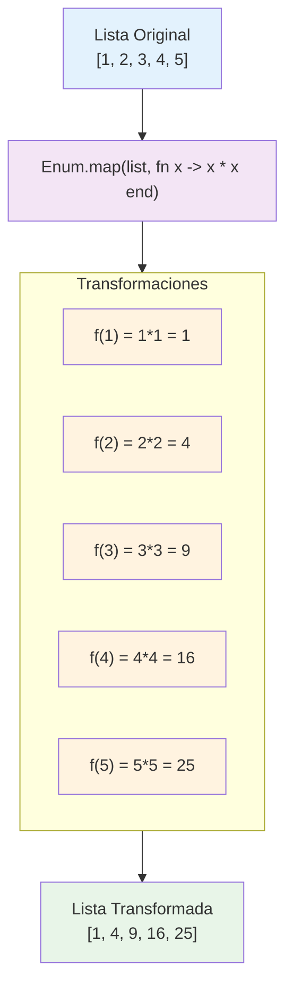
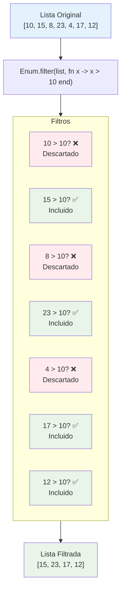
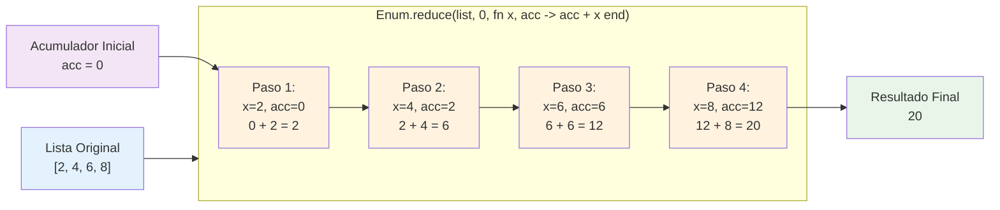

```
Universidad del Quindío
Programa de Ingeniería de Sistemas y Computación
Programación III - Colecciones en Elixir
Docente: Carlos Andrés Florez V.
```

# Colecciones en Elixir

Una colección es un conjunto de elementos que se agrupan bajo una misma estructura. En Elixir, las colecciones son fundamentales para manejar y organizar datos de manera eficiente. Existen varios tipos de colecciones en Elixir, cada una con sus propias características y usos específicos. A continuación, se presentan algunos de los conceptos fundamentales que se abordarán en esta guía:

- Listas.
- Tuplas.
- Mapas.
- Módulos List, Map y Enum.
- Ejemplos prácticos.

## Listas

Una **lista** es una colección ordenada de elementos, que puede contener cualquier tipo de dato, incluyendo otras listas. Las listas se definen utilizando corchetes `[]` y los elementos se separan por comas. Por ejemplo:

```elixir
mi_lista = [1, 2, 3, 4, 5]
```

Las listas son estructuras de datos muy versátiles y se utilizan comúnmente en Elixir. Hay varias operaciones que se pueden realizar con las listas, algunas de las funciones más comunes son:

- `hd/1`: Devuelve el primer elemento de la lista.
- `tl/1`: Devuelve la lista sin su primer elemento.
- `length/1`: Devuelve la longitud de la lista.

Las listas son inmutables, lo que significa que no se pueden modificar una vez creadas. Sin embargo, se pueden crear nuevas listas a partir de listas existentes. Ejemplos: 

```elixir
# Lista original
lista = [1, 2, 3]

# Tamaño de la lista
length(lista)  # => 3

# Obtener el primer elemento (head)
hd(lista)  # => 1

# Obtener la lista sin el primer elemento (tail)
tl(lista)  # => [2, 3]

# Agregar un elemento al inicio (no modifica la original, crea una nueva)
nueva = [0 | lista]  
# => [0, 1, 2, 3]

# Concatenar dos listas
otra = lista ++ [4, 5]  
# => [1, 2, 3, 4, 5]

# Quitar elementos (también crea una nueva lista)
menos = lista -- [2]   
# => [1, 3]

# La lista original sigue igual
lista
# => [1, 2, 3]

```

## Tuplas

Una **tupla** es similar a una lista, pero a diferencia de las listas, las tuplas son de tamaño fijo y se definen utilizando llaves `{}`. Las tuplas son útiles para agrupar datos relacionados. Por ejemplo:

```elixir
mi_tupla = {1, "hola", :atom}
```

Las tuplas se usan comúnmente para **devolver múltiples valores** de una función o para agrupar datos relacionados de manera estructurada. Previamente ya hemos visto que funciones como `Integer.parse/1` o `Float.parse/1` devuelven una tupla con el resultado y el resto de la cadena o `:error` si no se pudo convertir. 

Al igual que las listas, las tuplas también son inmutables. Ejemplo de uso de algunas funciones:

```elixir
# Tupla original
persona = {"Ana", 25, "México"}

# Tamaño de la tupla
tuple_size(persona)  # => 3

# Acceder por índice
elem(persona, 0)   # => "Ana"
elem(persona, 1)   # => 25

# Desempaquetar en variables (pattern matching o desempaquetado)
{nombre, edad, pais} = persona

nombre  # => "Ana"
edad    # => 25
pais    # => "México"
```

## Mapas

Un **mapa** es una colección de **pares clave-valor**, donde cada clave es única. Los mapas se definen utilizando `%{}` y los pares se separan por comas. Por ejemplo:

```elixir
mi_mapa = %{"nombre" => "Juan", "edad" => 30, "ciudad" => "Armenia"}
```

Una forma más concisa de definir un mapa es utilizando la sintaxis de clave: valor, donde las claves son átomos. Por ejemplo:

```elixir
mi_mapa = %{nombre: "Juan", edad: 30, ciudad: "Armenia"}
```

La utilidad de los mapas radica en su capacidad para asociar valores a claves, lo que permite un acceso rápido y eficiente a los datos. Básicamente, los mapas son ideales para representar "objetos" o "registros" con atributos y valores. Cada valor puede ser de cualquier tipo de dato, incluyendo listas, tuplas y otros mapas.

Los mapas también son inmutables. A continuación se muestra un ejemplo de uso de mapas:

```elixir
# Mapa original
usuario = %{nombre: "Carlos", edad: 30}

# Acceso por clave
usuario.nombre  # => "Carlos"
usuario[:nombre]  # => "Carlos"

# Acceder a los valores usando pattern matching (desestructuración)
%{nombre: nombre, edad: edad} = usuario

nombre  # => "Carlos"
edad    # => 30

# Actualizar un valor en el mapa (también crea un nuevo mapa)
mayor = %{usuario | edad: 31}
# => %{nombre: "Carlos", edad: 31}

# El mapa original sigue igual
usuario
# => %{nombre: "Carlos", edad: 30}
```

Para más información sobre las estructuras de datos en Elixir se puede consultar en:

- [Documentación listas y tuplas](https://hexdocs.pm/elixir/lists-and-tuples.html)
- [Documentación mapas](https://hexdocs.pm/elixir/Map.html)

## Módulo List, Map y Enum

Elixir proporciona varios módulos principales para trabajar con colecciones: `List`, `Map` y `Enum`. Estos módulos ofrecen funciones para manipular listas y otras estructuras de datos de manera eficiente.

Dado que Elixir es un lenguaje funcional, **todas las operaciones se realizan a través de funciones puras y respetando la inmutabilidad de los datos**. Esto significa que las colecciones nunca se modifican directamente; en su lugar, cada transformación devuelve una **nueva colección** con los cambios aplicados.

### Módulo List

El módulo `List` se centra en operaciones específicas para **listas**. Algunas funciones útiles incluyen:

- `List.first/1`: Devuelve el primer elemento de una lista.
- `List.last/1`: Devuelve el último elemento de una lista.
- `List.delete/2`: Elimina la primera ocurrencia de un elemento en una lista.
- `List.delete_at/2`: Elimina un elemento en una posición específica de la lista.
- `List.insert_at/3`: Inserta un elemento en una posición específica de la lista.
- `List.replace_at/3`: Reemplaza un elemento en una posición específica de la lista.

Para más información sobre el módulo `List`, se puede consultar la [documentación oficial](https://hexdocs.pm/elixir/List.html).

### Módulo Map

El módulo `Map` se utiliza para trabajar con **mapas**. Algunas funciones útiles incluyen:

- `Map.get/2`: Obtiene el valor asociado a una clave en un mapa.
- `Map.put/3`: Agrega o actualiza una clave en un mapa.
- `Map.delete/2`: Elimina una clave de un mapa.
- `Map.keys/1`: Devuelve una lista con todas las claves de un mapa.
- `Map.values/1`: Devuelve una lista con todos los valores de un mapa.
- `Map.merge/2`: Combina dos mapas.

Para más información sobre el módulo `Map`, se puede consultar la [documentación oficial](https://hexdocs.pm/elixir/Map.html).

### Módulo Enum

El módulo `Enum` es más general y se puede utilizar con **cualquier colección enumerable**, no solo listas. Este módulo es el que más se utiliza para trabajar con colecciones. Algunas funciones útiles incluyen:

- `Enum.map/2`: Aplica una función a cada elemento de la colección y devuelve una nueva colección con los resultados.
- `Enum.filter/2`: Filtra los elementos de la colección según una función de predicado.
- `Enum.reduce/3`: Reduce la colección a un solo valor utilizando una función acumuladora.
- `Enum.each/2`: Aplica una función a cada elemento de la colección sin devolver un resultado. Itera sobre cada elemento.
- `Enum.reverse/1`: Invierte el orden de los elementos en la colección.
- `Enum.count/1`: Devuelve el número de elementos en la colección.
- `Enum.count/2`: Cuenta el número de elementos que cumplen con una condición.
- `Enum.member?/2`: Verifica si un elemento está presente en la colección.
- `Enum.sort/1`: Ordena los elementos de la colección.
- `Enum.uniq/1`: Elimina los elementos duplicados de la colección.
- `Enum.min/1` y `Enum.max/1`: Devuelve el valor mínimo o máximo de la colección.
- `Enum.group_by/2`: Agrupa los elementos de la colección según una función.

Para más información sobre el módulo `Enum`, se puede consultar la [documentación oficial](https://hexdocs.pm/elixir/Enum.html).

#### Map, Filter, Reduce 

Tres de las funciones más comunes y poderosas del módulo `Enum` son `map/2`, `filter/2` y `reduce/3`. Estas funciones permiten transformar, filtrar y acumular datos en colecciones de manera eficiente.

**Map**

La función `Enum.map/2` la podemos explicar con el siguiente diagrama:



Al aplicar la función `f(x) = x * x` a cada elemento de la lista original, obtenemos una nueva lista con los resultados de la función aplicada a cada elemento.

**Filter**

La función `Enum.filter/2` la podemos explicar con el siguiente diagrama:



Al aplicar el filtro `x > 10`, obtenemos una nueva lista que solo contiene los elementos que cumplen con esta condición.

**Reduce**

La función `Enum.reduce/3` la podemos explicar con el siguiente diagrama:



En este ejemplo, comenzamos con un acumulador inicial de `0` y vamos sumando cada elemento de la lista al acumulador. Al final, obtenemos el resultado total de la suma de todos los elementos. A diferencia de `map` y `filter`, que devuelven una nueva colección, `reduce` devuelve un solo valor acumulado.

---

## Ejercicio 1

Un profesor tiene una lista con las notas finales de sus estudiantes. Cada nota está entre 0 y 5. El profesor necesita un programa que le permita calcular ciertas cosas:

- La nota promedio de la clase.
- Contar cuántos estudiantes están por encima y por debajo de la nota promedio. Retorne una tupla con ambos valores.
- Encontrar la nota más alta y la nota más baja.
- Contar cuántos estudiantes aprobaron (`nota >= 3`) y cuántos reprobaron.

### Versión 1

```elixir
defmodule Estudiantes do
  def main do
    lista = [3, 4, 4.6, 1.6, 2.3, 4.5, 1]

    promedio = calcular_promedio(lista)
    Util.imprimir_mensaje("El promedio es #{promedio}")

    {menores, mayores} = total_segun_promedio(lista, promedio)
    Util.imprimir_mensaje("Hay #{menores} por debajo del promedio y #{mayores} por encima")

    {menor, mayor} = min_max_nota(lista)
    Util.imprimir_mensaje("La nota más baja es #{menor} y la más alta #{mayor}")

    {aprobados, reprobados} = aprobados_reprobados(lista)
    Util.imprimir_mensaje("Aprobaron #{aprobados} estudiantes y reprobaron #{reprobados}")
  end

  defp calcular_promedio(lista), do: Enum.sum(lista) / length(lista)

  defp min_max_nota(lista), do: Enum.min_max(lista)

  defp total_segun_promedio(lista, promedio) do
    menores = Enum.count(lista, &(&1 < promedio))
    mayores = Enum.count(lista, &(&1 > promedio))
    {menores, mayores}
  end

  defp aprobados_reprobados(lista) do
    total = length(lista)
    aprobados = Enum.count(lista, &(&1 >= 3))
    reprobados = total - aprobados
    {aprobados, reprobados}
  end
end

Estudiantes.main()
```

Se define una lista con notas de prueba y sobre ella se realizan diferentes cálculos cuyos resultados se imprimen en pantalla. Nótese el uso de `Enum` para procesar la colección de notas y de tuplas para devolver múltiples valores desde una función.

Cabe destacar que las funciones lambda también se pueden escribir usando `fn` y `->`, como se ha mencionado previamente. Por ejemplo, en el caso de la función `aprobados_reprobados/1` podemos hacer lo siguiente:

```elixir
aprobados = Enum.count(lista, fn nota -> nota >= 3 end)
```

> **⚠️ Investigar** cómo mejorar la función `total_segun_promedio/2` para que no tenga que recorer la lista dos veces. Que halle la cantidad de estudiantes por encima y por debajo del promedio en una sola pasada.

### Versión 2

Modifique la lista para que no solo contenga las notas, sino también el nombre del estudiante correspondiente, debe usar **mapas**. Luego, en el caso de la nota más baja y la más alta, debe mostrar también el nombre del estudiante.

```elixir
defmodule Estudiantes do
  def main do
    # Ahora tenemos una lista de mapas
    lista = [
      %{nombre: "pepe", nota: 3},
      %{nombre: "maria", nota: 4},
      %{nombre: "juan", nota: 4.6},
      %{nombre: "luisa", nota: 1.6},
      %{nombre: "carlos", nota: 2.3},
      %{nombre: "ana", nota: 4.5},
      %{nombre: "marcos", nota: 1},
    ]

    promedio = calcular_promedio(lista)
    Util.imprimir_mensaje("El promedio es #{promedio}")

    {menores, mayores} = total_segun_promedio(lista, promedio)
    Util.imprimir_mensaje("Hay #{menores} por debajo del promedio y #{mayores} por encima")

    {menor, mayor} = min_max_nota(lista)
    Util.imprimir_mensaje("La nota más baja es de #{menor.nombre} (#{menor.nota}) y la más alta es de #{mayor.nombre} (#{mayor.nota})")

    {aprobados, reprobados} = aprobados_reprobados(lista)
    Util.imprimir_mensaje("Aprobaron #{aprobados} estudiantes y reprobaron #{reprobados}")

  end

  defp calcular_promedio(lista) do
    Enum.map(lista, &(&1.nota)) # Es necesario extraer la nota de cada estudiante
    |> Enum.sum()
    |> then( &(&1/length(lista)) ) # then() permite encadenar operaciones
  end

  defp min_max_nota(lista) do
    peor = Enum.min_by(lista, &(&1.nota)) # Enum.min_by permite asociar una función para acceder a la nota
    mejor = Enum.max_by(lista, &(&1.nota))
    {peor, mejor}
  end

  defp total_segun_promedio(lista, promedio) do
    menores = Enum.count(lista, &(&1.nota < promedio))
    mayores = Enum.count(lista, &(&1.nota > promedio))
    {menores, mayores}
  end

  defp aprobados_reprobados(lista) do
    total = length(lista)
    aprobados = Enum.count(lista, &(&1.nota >= 3))
    {aprobados, total - aprobados}
  end
end

Estudiantes.main()
```

### Versión 3

Se requiere una nueva función que devuelva la lista de estudiantes como una tupla que contenga el nombre del estudiante y su estado (`:aprobado` o `:reprobado`).

```elixir
defp agregar_estado(lista) do
  Enum.map(lista, fn estudiante ->

    estado = cond do
      estudiante.nota >= 3 -> :aprobado
      true -> :reprobado # Cuando no se cumple la condición anterior
    end

    {estudiante.nombre, estado }
  end)
end
```

También podemos usar **pattern matching** para desestructurar el mapa del estudiante, así:

```elixir
defp agregar_estado(lista) do
  Enum.map(lista, fn %{nombre: nombre, nota: nota} ->

    estado = cond do
      nota >= 3 -> :aprobado
      true -> :reprobado
    end

    {nombre, estado}
  end)
end
```
O también así (usando `&`):

```elixir
defp agregar_estado(lista) do
  Enum.map(lista, &( {&1.nombre, if(&1.nota >= 3, do: :aprobado, else: :reprobado)} ))
end
```

Las tres versiones hacen lo mismo, se recomienda usar la que le resulte más legible.

> **⚠️ Importante:** Para imprimir la lista no podemos usar `IO.puts/1`, ya que esto intentaría convertir la lista de tuplas en una cadena, lo cual no es posible directamente. En su lugar, podemos usar `IO.inspect/1` para imprimir la lista de manera más legible.

### Versión 4

Se requiere ordenar la lista de estudiantes por su nota de manera descendente, de modo que el estudiante con la nota más alta aparezca primero. En la salida, se debe mostrar el nombre del estudiante junto con su nota.

```elixir
defp ordenar_lista(lista) do
  Enum.sort_by(lista, fn estudiante -> estudiante.nota end, :desc)
end
```

O también así (usando `&`):

```elixir
defp ordenar_lista(lista) do
  Enum.sort_by(lista, &(&1.nota), :desc)
end
```

La función `Enum.sort_by/3` permite especificar una función para acceder al valor por el cual se desea ordenar (en este caso, la nota) y el orden (`:asc` para ascendente o `:desc` para descendente).

---

## Ejercicio 2

Una tienda en línea guarda la información de sus productos en una lista de mapas. Cada mapa representa un producto. Cada producto tiene el siguiente formato:

```elixir
%{id: entero, nombre: cadena, precio: número, stock: entero, categoria: cadena}
```

Se necesita un programa que haga lo siguiente:

- Calcular el valor total del inventario de la tienda (precio * stock de cada producto).
- Generar una lista solo con los nombres de los productos sin stock (stock == 0).
- Filtrar los productos de la categoría "Accesorios" y mostrarlos ordenados por precio ascendente.
- Encontrar el producto más caro y el más barato, devolviendo ambos como tuplas del tipo: `{:mas_caro, nombre, precio}` y `{:mas_barato, nombre, precio}`.
- Agrupar los productos por categoría (usar `Enum.group_by`).
- Contar cuántos productos hay en cada categoría.
- Calcular el promedio de precios por categoría.

---

## Ejercicio 3

Una biblioteca digital guarda su catálogo en una lista de mapas como la siguiente:

```elixir
libros = [
  %{titulo: "El Quijote", autor: "Cervantes", categoria: "novela", disponible: true},
  %{titulo: "Cien años de soledad", autor: "García Márquez", categoria: "novela", disponible: false},
  %{titulo: "El Principito", autor: "Saint-Exupéry", categoria: "infantil", disponible: true},
  %{titulo: "Clean Code", autor: "Robert C. Martin", categoria: "tecnología", disponible: true},
  %{titulo: "El alquimista", autor: "Paulo Coelho", categoria: "novela", disponible: false},
  %{titulo: "El coronel no tiene quien le escriba", autor: "García Márquez", categoria: "novela", disponible: false},
]
```

Se necesita un programa que permita:
- Filtrar los libros que están disponibles para préstamo.
- Generar una lista de títulos de todos los libros en una categoría dada (por ejemplo "novela").
- Listar los autores únicos que hay en el catálogo.
- Ordenar la lista de libros alfabéticamente por título.
- Crear un mapa de disponibilidad donde la clave sea el título y el valor un booleano (true/false).
- Contar cuantos libros hay por categoría.

---

## Ejercicio 4

Supongamos que trabajamos con esta lista de productos:

```elixir
productos = [
  %{nombre: "Manzana", categoria: "Fruta", precio: 3000},
  %{nombre: "Pera", categoria: "Fruta", precio: 2500},
  %{nombre: "Zanahoria", categoria: "Verdura", precio: 1800},
  %{nombre: "Lechuga", categoria: "Verdura", precio: 2000},
  %{nombre: "Pollo", categoria: "Carne", precio: 8000},
  %{nombre: "Res", categoria: "Carne", precio: 10000}
]
```

Se requieren las siguientes operaciones:

- **Lista de categorías únicas:** Obtener todas las categorías sin repetir.
- **Agrupar nombres por categoría:** Crear un mapa donde cada clave sea una categoría y el valor sea la lista de nombres de productos de esa categoría.
- **Producto más caro:** Encontrar el producto con mayor precio.
- **Suma total de precios:** Calcular cuánto cuestan todos los productos juntos.
- **Promedio de precios por categoría:** Obtener el precio promedio de los productos en cada categoría.
- **Filtrar productos económicos:** Crear una lista con los productos cuyo precio sea menor a 3000.
- **Convertir nombres a mayúsculas y ordenarlos:** Generar una lista de nombres en mayúscula, ordenada alfabéticamente.
- **Separar frutas y no frutas:** Dividir la lista en dos: frutas y los demás productos.
- **Verificar si todos los productos tienen precio mayor que 1000:** Devolver `true` o `false`.
- **Mapear categorías con la cantidad de letras en sus productos:** Crear un mapa donde la clave sea la categoría y el valor sea la suma de la longitud de los nombres de los productos de esa categoría.

---

## Para la próxima clase

- Investigar sobre recursividad, qué es y cómo se utiliza en Elixir.
- Por qué la recursividad es importante en la programación funcional.
- Ejemplos de problemas que se pueden resolver de manera más eficiente utilizando recursividad.