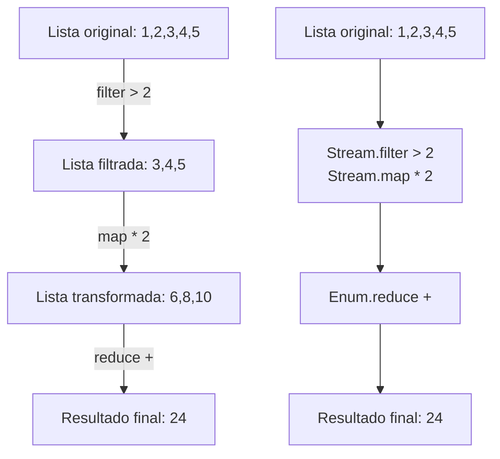

```
Universidad del Quindío
Programa de Ingeniería de Sistemas y Computación
Programación III - Streams
Docente: Carlos Andrés Florez V.
```

# Evaluación perezosa

La evaluación perezosa es una característica de algunos lenguajes de programación, como Elixir, que permite diferir la evaluación de una expresión hasta que su valor sea realmente necesario. Esto puede mejorar la eficiencia y permitir la creación de estructuras de datos infinitas, como las listas infinitas.

En Elixir, las listas son evaluadas de manera estricta, lo que significa que todos sus elementos son evaluados inmediatamente. Sin embargo, Elixir proporciona el módulo `Stream`, que permite trabajar con secuencias de datos de manera perezosa.

## Streams en Elixir

Un `Stream` es una secuencia de datos que se genera de manera perezosa. Los elementos de un `Stream` no se calculan hasta que se necesitan, lo que permite trabajar con grandes conjuntos de datos o incluso con secuencias infinitas sin consumir mucha memoria. Son útiles para procesar datos en flujos, como leer archivos línea por línea o generar secuencias matemáticas.

## Streams vs Enumerables

Los `Enumerables` en Elixir son colecciones de datos que se pueden recorrer, como listas, mapas y conjuntos. Cuando se trabaja con `Enumerables`, todas las operaciones se realizan de manera estricta, lo que significa que todos los elementos se procesan inmediatamente. Por ejemplo:

```elixir
list = [1, 2, 3, 4, 5]

list
|> Enum.filter(&(&1 > 2)) # [3, 4, 5]
|> Enum.map(&(&1 * 2)) # [6, 8, 10]
```

En este ejemplo, todos los elementos de la lista se procesan inmediatamente en cada paso, generando listas intermedias y consumiendo memoria. No es eficiente para listas grandes.

En contraste, los `Streams` permiten realizar operaciones de manera perezosa, generando los elementos solo cuando se necesitan. Por ejemplo:

```elixir
list
|> Stream.filter(&(&1 > 2)) # No se evalúa aún
|> Stream.map(&(&1 * 2))  # No se evalúa aún
|> Enum.to_list() # Comienza la evaluación
```

En este caso, los elementos se procesan solo cuando se llama a `Enum.to_list()`, lo que significa que no se crean listas intermedias y se ahorra memoria. Su eficiencia es mayor para listas grandes o infinitas, por ejemplo:

```elixir
1..1_000_000
|> Stream.map(&(&1 * 2))
|> Stream.filter(&(&1 > 1_000))
|> Enum.take(5)
```

En este ejemplo, solo se generan los primeros 5 elementos que cumplen la condición, sin procesar toda la secuencia de un millón de números.

## Diagrama comparativo

En el siguiente diagrama se compara el flujo de operaciones entre `Enum` y `Stream`:



## Usos comunes de Streams

Algunos casos comunes donde los `Streams` son especialmente útiles incluyen:

- **Archivos grandes**, línea a línea, sin cargar todo en memoria.
- **Secuencias infinitas**, números que se generan bajo demanda y se procesan parcialmente.
- **Pipelines complejos**, donde cada elemento pasa una sola vez, sin listas intermedias.
- **Integración con APIs o DB**, paginación lazy, solo se traen los datos necesarios.

---

## Para la próxima clase

- Investigar más sobre el módulo `Stream` y sus funciones.
- Practicar con ejemplos de `Streams` en Elixir.
- Preparar un pequeño proyecto que utilice `Streams` para procesar datos.
